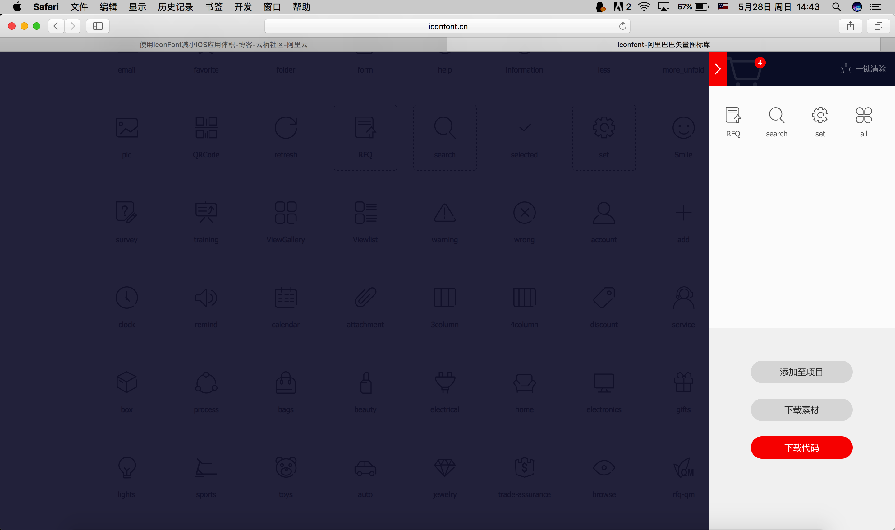

# 工程大小优化之图片资源

> 一点点iOS项目本身功能较多，导致应用体积也比较大。一个Xcode工程下图片资源占用了很大的空间，且如果有些App需要一键换肤功能，呵呵，不知道得做多少图片。每套图片还需要设置1x@,2x@,3x@等

## 简介

IconFont技术起源于Web领域的Web Font技术。随着时间的推移，网页设计越来越漂亮。但是电脑预装的字体远远无法满足设计者的要求，于是Web Font技术诞生了。一个英文字库并不大，通过网络下载字体，完成网页的显示。有了Web Font技术，大大提升了设计师的发挥空间。

网页设计中图标需要适配多个分辨率，每个图标需要占用一次网络请求。于是有人想到了用Web Font的方法来解决这两个问题，就是IconFont技术。将矢量的图标做成字体，一次网络请求就够了，可以保真缩放。解决这个问题的另一个方式是图片拼合的Sprite图。

Web领域使用IconFont类似的技术已经多年，当我在15年接触BootStrap的时候Font Awesome技术大行其道。最近IconFont技术在iOS图片资源方面得以应用，最近有点时间自己研究整理了一番，在此记录学习点滴。

## 优点

* 减小体积，字体文件比图片要小
* 图标保真缩放，解决2x/3x乃至将来的nx图问题
* 方便更改颜色大小，图片复用

## 缺点

* 只适用于
  `纯色icon`
* 使用unicode字符难以理解
* 需要维护字体库

网上说了一大堆如何制作IconFont的方法，在此不做讨论。

## 我们说说怎么用

1. 首先选取一些有丰富资源的网站，我使用阿里的IconFont多年，其他的没去研究，所以此处直接使用阿里的产品。地址：[http://www.iconfont.cn/plus](http://www.iconfont.cn/plus)

2. 打开网站在线挑选好合适的图标加入购物车，如图


1. 选择好之后在购物车查看，然后点击下载代码

2. 打开下载好的文件，其机构如下，我们在iOS项目开发过程中使用unicode的形式使用IconFont,所以打开demo\_unicode.html


**注意：** 创建 UIFont 使用的是字体名，而不是文件名；文本值为 8 位的 Unicode 字符，我们可以打开 demo.html 查找每个图标所对应的 HTML 实体 Unicode 码，比如： "店" 对应的 HTML 实体 Unicode 码为：0x3439 转换后为：\U00003439 就是将 0x 替换为 \U 中间用 0 填补满长度为 8 个字符

# Xcode中使用IconFont

初步尝试使用

1. 首先看看如何简单实用IconFont
2. 首先将下载好的文件夹中的 **iconfont.ttf** 加入到Xcode工程中，确保加入成功在Build检查


1. 怎么用？

```Objective-c

NSMutableAttributedString *attributedStr = [[NSMutableAttributedString alloc] initWithString:@"\U0000e696  \U0000e6ab  \U0000e6ac  \U0000e6ae"];
[attributedStr addAttribute:NSForegroundColorAttributeName value:[UIColor redColor] range:NSMakeRange(0, 1)];
[attributedStr addAttribute:NSForegroundColorAttributeName value:[UIColor orangeColor] range:NSMakeRange(3, 1)];
[attributedStr addAttribute:NSForegroundColorAttributeName value:[UIColor blackColor] range:NSMakeRange(9, 1)];
self.label.attributedText = attributedStr;
[self.view addSubview:self.label];

pragma mark - getter and setter
-(UILabel *)label{
       if (!_label) {
           _label = [[UILabel alloc] initWithFrame:CGRectMake(100, 100, BoundWidth-200, 40)];
           _label.font = [UIFont fontWithName:@"iconfont" size:24];
           _label.textColor = [UIColor purpleColor];
       }
       return _label;
   }
```

#### 做进一步封装，实用更加方便

利用IconFont生成1个UIImage只需要 LBPIconFontmake(par1, par2, par3)，par1:iconfont的unicode值；par2:图片大小；par3:图片的颜色值。其中，LBPIconFontmake是一个宏，#define LBPIconFontmake(text,size,color) [[LBPFontInfo alloc] initWithText:text withSize:size andColor:color]。

```Objective-c
self.latestImageView.image = [UIImage iconWithInfo:LBPIconFontmake(@"\U0000e6ac", 60, @"000066") ];
```


1. LBPFontInfo来封装字体信息
2. UIColor+picker根据十六进制字符串来设置颜色
3. LBPIconFont向系统中注册IconFont字体库，并使用
4. UIImage+LBPIconFont封装一个使用IconFont的Image分类


# [Demo地址](https://github.com/FantasticLBP/IconFont_Demo)


