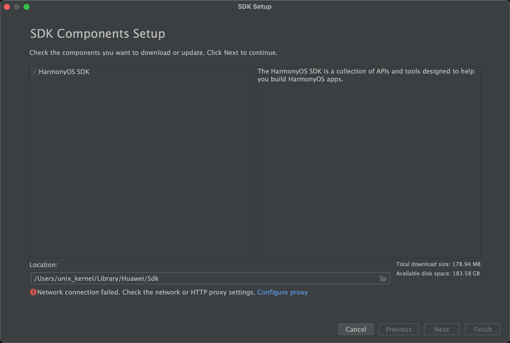

## 写给 iOSer 的鸿蒙开发 tips

## 下载问题

The other possible cause is that the system language of the PC is English and the region code is US. You could try to perform the following operations to change the region code to CN. Before changing the region code, close DevEco Studio.


For Mac OS: ~/Library/Application Support/Huawei/DevEcoStudio3.0/options/country.region.xml

修改为 CN

```xml
<application>
    <component name="CountryRegionSetting">
        <countryregion name="CN"/>
    </component>
</application>
```