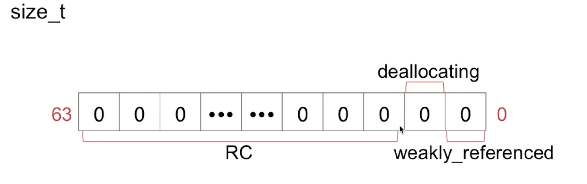
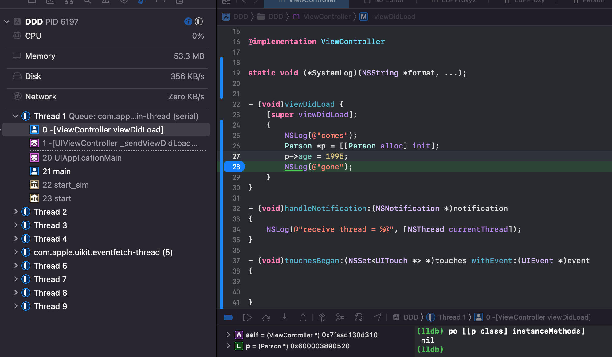
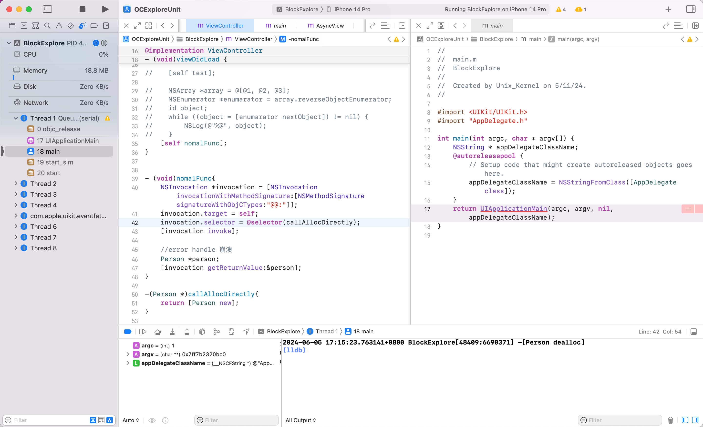

# iOS 内存原理探究

> 端上内存寸土寸金，对于内存知识你掌握了吗？掌握内存分配、释放的细节有助于我们写出内存使用有好的代码？同时为做 APM 内存监控打下坚实基础。接下来通过下面几个问题，研究下 iOS 侧内存分配、释放的相关知识：
>
> - NSTimer 存在什么问题、CADisplayLink 存在什么问题？
> - weak 指针的实现原理是什么？
> - ARC 帮我们做了什么处理？
> - 方法里有局部对象，出了方法会立马结束吗？
> - autorelease 修饰的对象，其内存在什么时机释放？
> - 类中的实例变量在哪释放？
> - 当对象 dealloc 方法中没有显示调用 `[super dealloc]` ，父类的析构如何触发？

 

## 定时器内存泄漏

NSTimer、CADisplayLink 的 基础 API `[NSTimer scheduledTimersWithTimeInterval:1 repeat:YES block:nil]` 对其 target 会产生强引用，如果 target 再对其产生强引用，则互相持有，会造成环，产生内存泄漏

定时器内存泄漏原因，解决方案以及高精度定时器，具体可以看这篇 [NSTimer 中的内存泄露](./1.45.md) 。


## iOS 内存布局

栈、堆、BSS、数据段、代码段


栈（stack）：又称作堆栈，用来存储程序的局部变量（但不包括static声明的变量，static 修饰的数据存放于数据段中）。除此之外，在函数被调用时，栈用来传递参数和返回值。栈内存地址越来越少(函数内第一行变量、对象的地址最大、后续越来越小，最后一行代码的变量、对象越来越小)

```
func a {
    变量 1 地址最大
    变量 2 地址第二大
    // ...
    变量n  地址最小
}
```

堆（heap）：用于存储程序运行中被动态分配的内存段，它的大小并不固定，可动态的扩张和缩减。操作函数(malloc／free)。分配的内存空间地址越来越大。

BSS段（bss segment）：通常用来存储程序中未被初始化的全局变量和静态变量的一块内存区域。BSS是英文Block Started by Symbol的简称。BSS段输入静态内存分配

数据段（data segment）：通常用来存储程序中已被初始化的全局变量和静态变量和字符串的一块内存区域。数据段包含3部分：

- 字符串常量。比如 `NSString *str = @"杭城小刘";`

- 已初始化数据：已经初始化的全局变量、静态变量等（内存挨在一起的）

- 未初始化数据：未初始化的全局变量、静态变量等

代码段（code segment）：编译之后的代码。通常是指用来存储程序可执行代码的一块内存区域。这部分区域的大小在程序运行前就已经确定，并且内存区域通常属于只读，某些架构也允许代码段为可写，即允许修改程序。


上 Demo 验证

```objectivec
int a = 10;
static int b;
int main () {
    NSString *name = @"杭城小刘";
    int age = 27;
    int height = 177;
    NSObject *obj = [[NSObject alloc] init];
    NSLog(@"\na: %p\nb: %p\n name: %p\nage: %p\n height: %p\nobj:%p", &a, &b, &name, &age, &height, obj);
}
a: 0x107b09b80
b: 0x107b09c48
name: 0x7ff7b83fdbc0
age: 0x7ff7b83fdbbc
height: 0x7ff7b83fdbb8
obj:0x6000012780e0
```

我们按照内存地址由低到高排个序(如下)，发现和我们总结的规律一致。

```shell
// 字符串常量
name:   0x7ff7b83fdbc0
// 已初始化的全局变量、静态变量
a:      0x107b09b80
// 未初始化的全局变量、静态变量
b:      0x107b09c48
// 堆
obj:    0x6000012780e0
// 栈
height: 0x7ff7b83fdbb8
age:    0x7ff7b83fdbbc
```

```
NSObject *obj = [[NSObject alloc] init];
NSLog(@"%p %p %@", obj, &obj, obj);
```

分别打印 obj指针指向的堆上的内存地址、obj 指针在栈上的地址、obj 内容


## Tagged Pointer

### 为什么有 Tagged Pointer

现状：一般，存放 NSNumber、NSDate 这类变量的时候，本身占用的内存大小常常不需要8个字节。4字节带符号的证书可以达到2^31= 2147483648，99% 的情况都能满足了。因此为了更高效、更节省空间，用一个看似是指针的计数，来存储数据，且在 Runtime 侧判断了，节省了消息机制那一套冗长的流程，Tagged Pointer cover 一些小数据的场景，cover 不了则申请堆内存。


创建对象需要动态分配内存、维护引用计数等，对象指针存储的是堆中对象的地址值。

创建一个对象的流程：先在堆上申请一块内存，然后再在栈上增加一个指针类型，指针指向堆上这块内存。举个例子，假设用 NSNumber 指针，存储一个数值， `NSNumber *value = [NSNumber numberWithInt:2]` ，分析下，需要耗费多少内存？

栈：在栈上，value 是一个指针类型，占用8字节

堆：在堆上，1个 isa 指针占8字节，1个 int 类型，占4字节，但由于存在内存对齐机制，所以堆上共需要16字节大小。

加起来 24 字节，耗费24字节就为了存储一个值为2的 int 数据。

效率上：此外还需要维护引用计数，沿用 OC 中指针，isa、类对象、元类对象的结构和消息发送流程，是不是太大材小用了？？


### 什么是 Tagged Pointer

iOS 从 64bit 开始引入了Tagged Pointer 技术，用于优化 NSNumber、NSDate、NSString 等小对象的存储。

Tagged Pointer 格式下，指针值不再是有效抵制，而是表示值。对象指针里面存储的数据变成了：`Tag + Data`，将数据直接存储在了指针中。当指针不够存储数据时，才会使用动态分配内存的方式来存储数据。

当对 TaggedPointer 数据调用方法的时候，objc_msgSend 能识别出如果是 Tagged Pointer，比如 NSNumber 的 intValue 方法，直接从指针提取数据，节省了调用开销。所以使用了 TaggedPointer 技术不仅节约内存空间，又能提高方法查找速度。


Tagged Pointer 也就是一个伪指针，对象的指针中存储的数据变成了：Tag + Data 的形式。

- Tag 为特殊标记，用于区分是否是 Tagged Pointer 指针以及具体是 NSNumber、NSDate、NSString 等对象类型
- Data：为对象对应存储的值。


根据官方的说明，使用tagged pointer进行小数据存储的优势非常明显：

- 可以见上一半的内存占用；
- 可以将访问速度提升3倍以上；
- 提升100倍的创建销毁速度

从 objc 源码，objc-runtime-new.mm 中可以看到：

> /***********************************************************************
>
> \* Tagged pointer objects.
>
> *
>
> \* Tagged pointer objects store the class and the object value in the
>
> \* object pointer; the "pointer" does not actually point to anything.
>
> *
>
> \* Tagged pointer objects currently use this representation:
>
> \* (LSB)
>
> \* 1 bit  set if tagged, clear if ordinary object pointer
>
> \* 3 bits tag index
>
> \* 60 bits payload
>
> \* (MSB)
>
> \* The tag index defines the object's class.
>
> \* The payload format is defined by the object's class.
>
> *
>
> \* If the tag index is 0b111, the tagged pointer object uses an
>
> \* "extended" representation, allowing more classes but with smaller payloads:
>
> \* (LSB)
>
> \* 1 bit  set if tagged, clear if ordinary object pointer
>
> \* 3 bits 0b111
>
> \* 8 bits extended tag index
>
> \* 52 bits payload
>
> \* (MSB)
>
> *
>
> \* Some architectures reverse the MSB and LSB in these representations.
>
> *
>
> \* This representation is subject to change. Representation-agnostic SPI is:
>
> \* objc-internal.h for class implementers.
>
> \* objc-gdb.h for debuggers.
>
> ***\**\**\**\**\**\**\**\**\**\**\**\**\**\**\**\**\**\**\**\**\**\**\**\**\**\**\**\**\**\**\**\**\**\*******/**

从 apple 给出的声明中，可以得到：

- 标签指针对象存储了类信息和对象实际的值，此时的指针不指向任何东西；

- 使用最低位作为标记位，如果是标签指针对象就标记为1，如果是普通对象类型就标记为0；

- 紧接着三位是标签索引位；

- 剩余的60位位有效的负载位，标签索引位定义了标签对象代表的对象的真实类型，负载的格式由实际的类定义；

- 如果标签位是0b111,表示该对象使用了是被扩展的标签对象，这种扩展的方式可以运训更多的类使用标签对象来表示，同时负载的有效位数变小。这时：
  - 最低位是标记位
  - 紧接着三位位0b111
  - 紧接着八位位扩展的标记位
  - 剩余的52位才是真正的有效的负载位

- 并不是所有的架构中都使用低位做标记位.在指令集框架中，除了64-bit的Mac操作系统之外,其余全是使用 MSB。比如 iOS 就是使用高位作为标志位。


Demo


在 64 位的 cpu 下，如果使用 Tagged Pointer 技术的话，则 NSNumber 对象的值直接存储在了指针中，系统不会为其在堆上分配内存，可以节省很多内存开销。此时，NSNumber 对象的指针中存储的数据变成了 Tag + Data 的形式（Tag 为特殊标记，用于区分NSNumber、NSDate、NSString 等小内存对象的类型；Data 为具体的值）。这样使用一个 NSNumber 对象只需要在栈中开辟 8 个字节的指针内存。当栈中 8 个字节的指针内存不够存储数据时，才会再将 NSNumber 对象存储到堆中

系统会自动判断是分配 TaggedPointer 还是普通指针（也就是真正在堆上开辟内存）


### 实践探索 Tagged Pointer

为了保证数据安全，对 Tagged Pointer 类型的指针做了数据混淆，无法通过打印指针的内容来判断一个指针是否为 Tagged Pointer 类型，更无法读取存储在 Tagged Pointer 类型的指针中的数据

为了方便我们在分析 Tagged Pointer 的原理时调试程序，需要先解除系统对 Tagged Pointer 的数据混淆，2个办法：

第一种：Xcode 环境变量。

环境变量 `OBJC_DISABLE_TAG_OBFUSCATION` 来控制 Tagged Pointer 数据混淆的禁用和启用。默认情况下，Tagged Pointer 的数据混淆处于启用状态。

路径：Xcode - Edit Scheme - Run - Arguments - Environment Variables - 添加环境变量 `OBJC_DISABLE_TAG_OBFUSCATION` 设置为 YES 即可。


第二种：还原 Runtime 对 tagged Pointer 的混淆函数。objc 源码中 objc-runtime-new.mm 文件

```c++
/***********************************************************************
* initializeTaggedPointerObfuscator
* Initialize objc_debug_taggedpointer_obfuscator with randomness.
*
* The tagged pointer obfuscator is intended to make it more difficult
* for an attacker to construct a particular object as a tagged pointer,
* in the presence of a buffer overflow or other write control over some
* memory. The obfuscator is XORed with the tagged pointers when setting
* or retrieving payload values. They are filled with randomness on first
* use.
**********************************************************************/
static void
initializeTaggedPointerObfuscator(void)
{
    if (!DisableTaggedPointerObfuscation
#if !TARGET_OS_EXCLAVEKIT
        && dyld_program_sdk_at_least(dyld_fall_2018_os_versions)
#endif
        ) {
        // Pull random data into the variable, then shift away all non-payload bits.
        arc4random_buf(&objc_debug_taggedpointer_obfuscator,
                       sizeof(objc_debug_taggedpointer_obfuscator));
        objc_debug_taggedpointer_obfuscator &= ~_OBJC_TAG_MASK;

#if OBJC_SPLIT_TAGGED_POINTERS
        // The obfuscator doesn't apply to any of the extended tag mask or the no-obfuscation bit.
        objc_debug_taggedpointer_obfuscator &= ~(_OBJC_TAG_EXT_MASK | _OBJC_TAG_NO_OBFUSCATION_MASK);

        // Shuffle the first seven entries of the tag permutator.
        int max = 7;
        for (int i = max - 1; i >= 0; i--) {
            int target = uniformRandom(i + 1);
            swap(objc_debug_tag60_permutations[i],
                 objc_debug_tag60_permutations[target]);
        }
#endif
    } else {
        // Set the obfuscator to zero for apps linked against older SDKs,
        // in case they're relying on the tagged pointer representation.
        objc_debug_taggedpointer_obfuscator = 0;
    }
}
```

`initializeTaggedPointerObfuscator` 函数用一个随机数，来初始化 Tagged Pointer 的混淆因子 `objc_debug_taggedpointer_obfuscator`。

主要作用是使攻击者在发现(缓冲区溢出漏洞)或者(内存写入控制漏洞)时，更难将特定对象构造成 Tagged Pointer 类型的指针，为的是更安全。

同时，也提供了 Tagged Pointer 的编码、解码方法

```c++
// objc-internal.h
static inline void * _Nonnull
_objc_encodeTaggedPointer(uintptr_t ptr)
{
    return _objc_encodeTaggedPointer_withObfuscator(ptr, objc_debug_taggedpointer_obfuscator);
}

static inline void * _Nonnull
_objc_encodeTaggedPointer_withObfuscator(uintptr_t ptr, uintptr_t obfuscator)
{
    uintptr_t value = (obfuscator ^ ptr);
#if OBJC_SPLIT_TAGGED_POINTERS
    if ((value & _OBJC_TAG_NO_OBFUSCATION_MASK) == _OBJC_TAG_NO_OBFUSCATION_MASK)
        return (void *)ptr;
    uintptr_t basicTag = (value >> _OBJC_TAG_INDEX_SHIFT) & _OBJC_TAG_INDEX_MASK;
    uintptr_t permutedTag = _objc_basicTagToObfuscatedTag(basicTag);
    value &= ~(_OBJC_TAG_INDEX_MASK << _OBJC_TAG_INDEX_SHIFT);
    value |= permutedTag << _OBJC_TAG_INDEX_SHIFT;
#endif
    return (void *)value;
}

static inline uintptr_t
_objc_decodeTaggedPointer(const void * _Nullable ptr)
{
    return _objc_decodeTaggedPointer_withObfuscator(ptr, objc_debug_taggedpointer_obfuscator);
}

static inline uintptr_t
_objc_decodeTaggedPointer_withObfuscator(const void * _Nullable ptr,
                                         uintptr_t obfuscator)
{
    uintptr_t value
      = _objc_decodeTaggedPointer_noPermute_withObfuscator(ptr, obfuscator);
#if OBJC_SPLIT_TAGGED_POINTERS
    uintptr_t basicTag = (value >> _OBJC_TAG_INDEX_SHIFT) & _OBJC_TAG_INDEX_MASK;

    value &= ~(_OBJC_TAG_INDEX_MASK << _OBJC_TAG_INDEX_SHIFT);
    value |= _objc_obfuscatedTagToBasicTag(basicTag) << _OBJC_TAG_INDEX_SHIFT;
#endif
    return value;
}

static inline uintptr_t
_objc_decodeTaggedPointer_noPermute_withObfuscator(const void * _Nullable ptr,
                                                   uintptr_t obfuscator)
{
    uintptr_t value = (uintptr_t)ptr;
#if OBJC_SPLIT_TAGGED_POINTERS
    if ((value & _OBJC_TAG_NO_OBFUSCATION_MASK) == _OBJC_TAG_NO_OBFUSCATION_MASK)
        return value;
#endif
    return value ^ obfuscator;
}
```

虽然无法使用 objc 里的函数，但是 `objc_debug_taggedpointer_obfuscator` 是一个导出的全局变量。

```c++
OBJC_EXPORT uintptr_t objc_debug_taggedpointer_obfuscator
    OBJC_AVAILABLE(10.14, 12.0, 12.0, 5.0, 3.0);
```

所以可以参考源码，对其进行改造，打造自己的 Tagged Pointer 编码、解码方法
```objective-c
OBJC_EXPORT uintptr_t objc_debug_taggedpointer_obfuscator;

static inline void * _Nonnull lbp_objc_encodeTaggedPointer(uintptr_t ptr) {
    return lbp_objc_encodeTaggedPointer_withObfuscator(ptr, objc_debug_taggedpointer_obfuscator);
}

static inline void * _Nonnull lbp_objc_encodeTaggedPointer_withObfuscator(uintptr_t ptr, uintptr_t obfuscator) {
    uintptr_t value = (obfuscator ^ ptr);
#if OBJC_SPLIT_TAGGED_POINTERS
    if ((value & _OBJC_TAG_NO_OBFUSCATION_MASK) == _OBJC_TAG_NO_OBFUSCATION_MASK)
        return (void *)ptr;
    uintptr_t basicTag = (value >> _OBJC_TAG_INDEX_SHIFT) & _OBJC_TAG_INDEX_MASK;
    uintptr_t permutedTag = _objc_basicTagToObfuscatedTag(basicTag);
    value &= ~(_OBJC_TAG_INDEX_MASK << _OBJC_TAG_INDEX_SHIFT);
    value |= permutedTag << _OBJC_TAG_INDEX_SHIFT;
#endif
    return (void *)value;
}

static inline uintptr_t lbp_objc_decodeTaggedPointer(const void * _Nullable ptr) {
    return lbp_objc_decodeTaggedPointer_withObfuscator(ptr, objc_debug_taggedpointer_obfuscator);
}

static inline uintptr_t lbp_objc_decodeTaggedPointer_withObfuscator(const void * _Nullable ptr, uintptr_t obfuscator) {
    uintptr_t value
      = _objc_decodeTaggedPointer_noPermute_withObfuscator(ptr, obfuscator);
#if OBJC_SPLIT_TAGGED_POINTERS
    uintptr_t basicTag = (value >> _OBJC_TAG_INDEX_SHIFT) & _OBJC_TAG_INDEX_MASK;

    value &= ~(_OBJC_TAG_INDEX_MASK << _OBJC_TAG_INDEX_SHIFT);
    value |= _objc_obfuscatedTagToBasicTag(basicTag) << _OBJC_TAG_INDEX_SHIFT;
#endif
    return value;
}

static inline uintptr_t
_objc_decodeTaggedPointer_noPermute_withObfuscator(const void * _Nullable ptr, uintptr_t obfuscator) {
    uintptr_t value = (uintptr_t)ptr;
#if OBJC_SPLIT_TAGGED_POINTERS
    if ((value & _OBJC_TAG_NO_OBFUSCATION_MASK) == _OBJC_TAG_NO_OBFUSCATION_MASK)
        return value;
#endif
    return value ^ obfuscator;
}
```


### Tagged Pointer 结构

#### Tagged Pointer 与 isa


通过参考 objc 源码，针对对象指针进行解密后发现：

| 原始指针地址       | decode 后指针地址  | 数值              | isa          |
| ------------------ | ------------------ | ----------------- | ------------ |
| 0xa6560a805d53eb09 | 0xb000000000000013 | 1                 | 0x0          |
| 0xa6560a805d53eb39 | 0xb000000000000023 | 2                 | 0x0          |
| 0xa6560a805d53eb29 | 0xb000000000000033 | 3                 | 0x0          |
| 0x600000ca8020     | 0x16566a805d996b3a | 0xFFFFFFFFFFFFFFF | __NSCFNumber |

num1、num2、num3 对象的值1、2、3分别存储在指针 `0xb000000000000013` 、`0xb000000000000023`、`0xb000000000000033` 的倒数第二位中。而 `0xFFFFFFFFFFFFFFF` 数据太大，无法存储在1个指针长度可以表示的数据范围内，所以申请了堆内存。

num1、num2、num3 都是 Tagged Pointer，是伪指针，所以 isa 都是 nil。num4 1个指针长度存储不下数据，所以分配了堆内存，是真正的对象，有 isa。


#### Tagged Pointer 数据类型

0xb000000000000013 种的 b 和 3是什么？

b 也就是11，二进制为 `1011`，Tagged Pointer 中，iOS 侧第一位是 Tagged Pointer 标识位，1代表是 Tagged Pointer；

`011` 是类标识位，对应10进制的3，表示 NSNumber 类（ 源码中 `OBJC_TAG_NSNumber = 3` ）。


指针中的 3 代表什么？

3 区分数据类型。具体是什么数据类型，继续做个实验看看


分析：

- 针对 NSNumber：按照指针顺序依次打印发现，不同的基本数据类型，但都用 NSNumber 类包装，内存地址中，倒数第二位都是字面量的值，指针地址除了最后一位不同之外，都相同。

    | 数据类型 | 内存地址二进制最后1位 |
    | -------- | --------------------- |
    | char     | 0                     |
    | short    | 1                     |
    | int      | 2                     |
    | long     | 3                     |
    | float    | 4                     |
    | double   | 5                     |

    所以这个3代表是数据类型（NSNumber 中 char、short、int、long、float、double，NSString 为 string 长度）

    Objc 源码中，NSInteger、NSUInteger 都是别名。初始化 NSNumber 的时候用的是 `NSNumber numberWithInteger:<#(NSInteger)#>`

    


- 通过对 str1、str2、str3 的分析可以看出，指针最后1位代表字符串的长度，长度分别为1、2、3。后面分别是字符串的 ASCII 值

  | 原始指针地址       | decode 后指针地址  | 数值 | ASCII 值 |
  | ------------------ | ------------------ | ---- | -------- |
  | 0x82afd51af4bd2853 | 0xa000000000000611 | a    | 61       |
  | 0x82afd51af4bb0850 | 0xa000000000062612 | ab   | 61 62    |
  | 0x82afd51af28b0851 | 0xa000000006362613 | abc  | 61 62 63 |

结论：对于 NSNumber 来说，最后一位代表包装前原始数据的类型；对于 NSString 来说，最后一位代表字符串的长度。


#### 类标识

Tagged Pointer 如何区分是较小的对象，比如 NSString、NSDate、NSNumber？

源码 `objc_internal.h` 如下

```c++
{
    // 60-bit payloads
    OBJC_TAG_NSAtom            = 0, 
    OBJC_TAG_1                 = 1, 
    OBJC_TAG_NSString          = 2, 
    OBJC_TAG_NSNumber          = 3, 
    OBJC_TAG_NSIndexPath       = 4, 
    OBJC_TAG_NSManagedObjectID = 5, 
    OBJC_TAG_NSDate            = 6,

    // 60-bit reserved
    OBJC_TAG_RESERVED_7        = 7, 

    // 52-bit payloads
    OBJC_TAG_Photos_1          = 8,
    OBJC_TAG_Photos_2          = 9,
    OBJC_TAG_Photos_3          = 10,
    OBJC_TAG_Photos_4          = 11,
    OBJC_TAG_XPC_1             = 12,
    OBJC_TAG_XPC_2             = 13,
    OBJC_TAG_XPC_3             = 14,
    OBJC_TAG_XPC_4             = 15,
    OBJC_TAG_NSColor           = 16,
    OBJC_TAG_UIColor           = 17,
    OBJC_TAG_CGColor           = 18,
    OBJC_TAG_NSIndexSet        = 19,
    OBJC_TAG_NSMethodSignature = 20,
    OBJC_TAG_UTTypeRecord      = 21,
    OBJC_TAG_Foundation_1      = 22,
    OBJC_TAG_Foundation_2      = 23,
    OBJC_TAG_Foundation_3      = 24,
    OBJC_TAG_Foundation_4      = 25,
    OBJC_TAG_CGRegion          = 26,

    // When using the split tagged pointer representation
    // (OBJC_SPLIT_TAGGED_POINTERS), this is the first tag where
    // the tag and payload are unobfuscated. All tags from here to
    // OBJC_TAG_Last52BitPayload are unobfuscated. The shared cache
    // builder is able to construct these as long as the low bit is
    // not set (i.e. even-numbered tags).
    OBJC_TAG_FirstUnobfuscatedSplitTag = 136, // 128 + 8, first ext tag with high bit set

    OBJC_TAG_Constant_CFString = 136,

    OBJC_TAG_First60BitPayload = 0, 
    OBJC_TAG_Last60BitPayload  = 6, 
    OBJC_TAG_First52BitPayload = 8, 
    OBJC_TAG_Last52BitPayload  = 263,

    OBJC_TAG_RESERVED_264      = 264
};
```

验证下


可以看到：

-  num1 地址 `0xb000000000000013`，其中 b 为11，二进制为 `1011`，其中 iOS 侧采用 LSB，则第一位标记判断是不是 Tagged Pointer，当前为1，则说明是 Tagged Pointer。剩下的 `011` 是类标识位，对应十进制为3，表示 NSNumber 类型。
- str1 地址 `0xa000000000062612`,其中 a 为10，二进制为 `1010`,第一位是 1，表示是 Tagged Pointer。其余 `010`，也就是2，表示 NSString 类


#### 结构

下面是针对 double 包装成 NSNumber 的 Tagged Pointer 指针结构拆分：


### 如何判断一个指针是否为Tagged Pointer

查看 objc4 源码（目前新版的 objc4-objc4-912.3）

```c++
// objc-internal.h
#if __arm64__
// ARM64 uses a new tagged pointer scheme where normal tags are in
// the low bits, extended tags are in the high bits, and half of the
// extended tag space is reserved for unobfuscated payloads.
#   define OBJC_SPLIT_TAGGED_POINTERS 1
#else
#   define OBJC_SPLIT_TAGGED_POINTERS 0
#endif

#if OBJC_SPLIT_TAGGED_POINTERS
#   define _OBJC_TAG_MASK (1UL<<63)
#   define _OBJC_TAG_INDEX_SHIFT 0
#   define _OBJC_TAG_SLOT_SHIFT 0
#   define _OBJC_TAG_PAYLOAD_LSHIFT 1
#   define _OBJC_TAG_PAYLOAD_RSHIFT 4
#   define _OBJC_TAG_EXT_MASK (_OBJC_TAG_MASK | 0x7UL)
#   define _OBJC_TAG_NO_OBFUSCATION_MASK ((1UL<<62) | _OBJC_TAG_EXT_MASK)
#   define _OBJC_TAG_CONSTANT_POINTER_MASK \
        ~(_OBJC_TAG_EXT_MASK | ((uintptr_t)_OBJC_TAG_EXT_SLOT_MASK << _OBJC_TAG_EXT_SLOT_SHIFT))
#   define _OBJC_TAG_EXT_INDEX_SHIFT 55
#   define _OBJC_TAG_EXT_SLOT_SHIFT 55
#   define _OBJC_TAG_EXT_PAYLOAD_LSHIFT 9
#   define _OBJC_TAG_EXT_PAYLOAD_RSHIFT 12
#elif OBJC_MSB_TAGGED_POINTERS
#   define _OBJC_TAG_MASK (1UL<<63)
#   define _OBJC_TAG_INDEX_SHIFT 60
#   define _OBJC_TAG_SLOT_SHIFT 60
#   define _OBJC_TAG_PAYLOAD_LSHIFT 4
#   define _OBJC_TAG_PAYLOAD_RSHIFT 4
#   define _OBJC_TAG_EXT_MASK (0xfUL<<60)
#   define _OBJC_TAG_EXT_INDEX_SHIFT 52
#   define _OBJC_TAG_EXT_SLOT_SHIFT 52
#   define _OBJC_TAG_EXT_PAYLOAD_LSHIFT 12
#   define _OBJC_TAG_EXT_PAYLOAD_RSHIFT 12
#else
#   define _OBJC_TAG_MASK 1UL
#   define _OBJC_TAG_INDEX_SHIFT 1
#   define _OBJC_TAG_SLOT_SHIFT 0
#   define _OBJC_TAG_PAYLOAD_LSHIFT 0
#   define _OBJC_TAG_PAYLOAD_RSHIFT 4
#   define _OBJC_TAG_EXT_MASK 0xfUL
#   define _OBJC_TAG_EXT_INDEX_SHIFT 4
#   define _OBJC_TAG_EXT_SLOT_SHIFT 4
#   define _OBJC_TAG_EXT_PAYLOAD_LSHIFT 0
#   define _OBJC_TAG_EXT_PAYLOAD_RSHIFT 12
#endif

static inline bool
_objc_isTaggedPointer(const void * _Nullable ptr)
{
    return ((uintptr_t)ptr & _OBJC_TAG_MASK) == _OBJC_TAG_MASK;
}
```

分析：

- MacOS 采用 **LSB**（Least Significant Bit，即最低有效位）为 Tagged Pointer 标识位；
- iOS 采用 **MSB**（Most Significant Bit，即最高有效位）为 Tagged Pointer 标识位
- 宏定义  `OBJC_SPLIT_TAGGED_POINTERS` 在 arm64 架构下为真，其他情况为假。

可以看到源码通过 `_objc_isTaggedPointer` 方法判断是否是 Tagged Pointer 类型。传入对象地址，内部通过 `_OBJC_TAG_MASK` 按位与运算。

其中 `_OBJC_TAG_MASK`  是一个宏，宏定义外部有个 if 判读，判断是 `OBJC_SPLIT_TAGGED_POINTERS` 或 `OBJC_MSB_TAGGED_POINTERS`，都为 `(1UL<<63)`，其余则为 `1UL`

综合来看，iOS 侧不管是不是 arm64，对于 `_OBJC_TAG_MASK` 的值都是 ` (1UL<<63)` ，其他 MacOS 下则为 `1UL`

- iOSOS： 最高有效位是1（第64bit）`1UL<<63`，也就是 `10000000...0`，第一位是1，后面63个0。

- 非 iOS： 最低有效位是1`1UL`。也就是 `0000...1`，共63个0，最后一位是1。


所以，判断是不是 TaggedPointer 可以用下面代码判断

```c++
#if OBJC_SPLIT_TAGGED_POINTERS
#   define _OBJC_TAG_MASK (1UL<<63)
#elif OBJC_MSB_TAGGED_POINTERS
#   define _OBJC_TAG_MASK (1UL<<63)
#else
#   define _OBJC_TAG_MASK 1UL
#endif

static inline bool _objc_isTaggedPointer(const void * _Nullable ptr) {
    return ((uintptr_t)ptr & _OBJC_TAG_MASK) == _OBJC_TAG_MASK;
}
```


### NONPOINTER_ISA

在64位架构下，ISA 占64位空间，但实际上用不了那么多，实际上有32位或者40位就够用了，剩余的比较浪费。iOS 为了提高利用率，在剩余的位上存储了一些内存管理相关的信息。所以是不纯粹的指针。叫 NONPOINTER_ISA。

isa 中64位的首位为1，即 NONPOINTER_ISA。


### Tagged Pointer 与内存管理

因为 Tagged Pointer 是伪指针，如果设计 objc 指针的一些逻辑，比如对象 retain、release，都是优先判断是不是 Tagged Pointer 的。没必要执行一个真正对象指针的后续流程。

```c++
// objc-object.h
ALWAYS_INLINE id
objc_object::rootRetain(bool tryRetain, objc_object::RRVariant variant)
{
    if (slowpath(isTaggedPointer())) return (id)this;
		// ...
}

ALWAYS_INLINE bool
objc_object::rootRelease(bool performDealloc, objc_object::RRVariant variant)
{
    if (slowpath(isTaggedPointer())) return false;
 		// ... 
}

inline bool 
objc_object::isTaggedPointer() const
{
    return _objc_isTaggedPointer(this);
}
```


### Tagged Pointer 与消息发送

消息机制 objc_msgSend 也会优先判断 Tagged Pointer 相关逻辑

```assembly
	MSG_ENTRY _objc_msgSend // 入口
	UNWIND _objc_msgSend, NoFrame

	cmp	p0, #0			// nil check and tagged pointer check 判断 nil 和 Tagged Pointer 逻辑
#if SUPPORT_TAGGED_POINTERS // 如果支持 Tagged Pointer，则执行下面逻辑
	b.le	LNilOrTagged		//  (MSB tagged pointer looks negative) // 跳转到  LNilOrTagged 部分
#else
	b.eq	LReturnZero
#endif
	ldr	p14, [x0]		// p14 = raw isa
	GetClassFromIsa_p16 p14, 1, x0	// p16 = class
LGetIsaDone:
	// calls imp or objc_msgSend_uncached
	CacheLookup NORMAL, _objc_msgSend, __objc_msgSend_uncached

#if SUPPORT_TAGGED_POINTERS
LNilOrTagged:
	b.eq	LReturnZero		// nil check 先做 nil 检查
	GetTaggedClass			// 获取 Tagged Pointer 真实的 class
	b	LGetIsaDone				// 跳转到  LGetIsaDone
// SUPPORT_TAGGED_POINTERS
#endif

LReturnZero:
	// x0 is already zero
	mov	x1, #0
	movi	d0, #0
	movi	d1, #0
	movi	d2, #0
	movi	d3, #0
	ret

	END_ENTRY _objc_msgSend
```

可以看到 objc_msgSend 的汇编实现里，也优先判断了 Tagged Pointer。


### Tagged Pointer 经典问题

Demo1

运行该代码会 Crash，报错信息如下


说明：一开始的报错信息只说坏内存访问，但是并没有显示具体的方法调用堆。想知道具体 Crash 原因还是需要看看堆栈比较方便。输入 bt 查看最后是由于 `objc_release` 方法造成 crash。

小窍门：利用 LLDB 模式下输入 `bt`，可以查看堆栈。也就是 backtrace 的缩写。

不仔细想可能发现不了问题，看到 `objc_release` 就会想到是在多线程情况下 NSString 的 setter 方法内，ARC 代码经过编译器最后会按照 MRC 去运行。所以 Setter 类似下面代码。

```objectivec
-(void)setName:(NSString *)name 
{
    if (_name!=name) {
        [name retain];
        [_name release];
        _name = name;
    }
}
```

怎么改？

改法1：将 property 改为 **atomic** 修饰的。


改法2：对 name 加锁


Demo2


同样的代码字符串变短居然不 crash 了？因为命中 Tagged Pointer 逻辑了，查看类型是 `NSTaggedPointerString`

本问题本质是 

- ARC 代码在编译后真正运行阶段是走 MRC 的，strong、copy 内部都会 release 旧的，copy/retain 新的

- 多线程情况下访问 setter 需要加锁

- 字符串在 NSTaggedPointerString  情况下，不存在像 OC 对象的 setter 方法内的 release、copy 操作。所以多线程下不会 crash


### TaggedPointer 与类簇
Cocoa 里有很多类簇。比如 NSArray、NSString。
- 类簇模式可以把实现细节隐藏在一套简单的公共接口后面
- 系统框架中经常使用类簇
- 从类簇的公共抽象基类中继承子类时要小心，应该覆写基类中需要覆写的方法。
- 工厂方法是实现类簇的常见方案

NSString 是一个抽象工厂模式设计的类簇。NSString、NSMutableString 在外部提供了接口，这些方法的实现由具体的内部类完成。当使用 NSString、NSMutableString 的外部接口生成一个实例对象的时候，初始化方法会判断哪个内部类最适合完成，最后根据此内部类生成具体实例返回给调用者。不同的创建方式、不同的字符串长度，决定生成不同的内部类类型。

NSString、NSMutableString 的内部类如下：

- NSTaggedPointerString：数据存储在指针中，不需要维护引用计数和方法调用的开销
- NSCFConstantString：用于表示字符串常量，存储在字符串常量区，不需要维护引用计数。相同内容的 NSCFConstantString 对象的地址相同，也就是说字符串常量是一种单例对象，NSCFConstantString 对象一般通过字面量 `@"**"` 创建
- NSCFString 存储在堆区，需要维护引用计数。通过 `stringWithFormat:` 等方法创建的 NSString 对象（且字符串长度过长，无法使用  Tagged Pointer 存储）一般都是这种类型

NSString、NSMutableString 继承关系如下：

- NSTaggedPointerString 继承自 NSString
- NSCFConstantString 继承自 NSSimpleCString，NSSimpleCString 继承 NSString
- NSMutableString 继承自 NSString

通过 `@"**"` 创建的 NSString：

- 无论字面量长度多长或多短，都是 `__NSCFConstantString` 类型
  - 无论字面量是中文还是英文，都是 `__NSCFConstantString` 类型
  - 在创建相同内容的字符串时，得到的内存地址相同
  - `__NSCFConstantString` 类型的字符串引用计数为-1，对其进行 retain、release 等操作，不会改变其引用计数
  - `[[NSString alloc] initWithString:@""]` 、`[NSString stringWithString:@"xx"]` 与直接用字面量赋值的结果是一样的，创建的都是 `__NSCFConstantString` 类型的字符串。


通过 `[[NSString alloc] initWithString:@"**"]` 方式创建的 NSString 字符串

- 当 `@"**"`  长度为0，是 `__NSCFConstantString` 类型
- 当 `@"**"`  长度在1～10之间，是 `NSTaggedPointerString` 类型
- 当 `@"**"`  长度为大于10，是 `__NSCFString` 类型
- 当字符串长度超过7 Byte 时，NSTaggedPointerString 并没有立即转换为 `__NSCFString`，而是采用了一种压缩算法进行编码，把字符串的长度进行压缩
- 当压缩算法产生的字符串长度还是大于7 Byte 时，才会将 `NSTaggedPointerString` 转换为 `__NSCFString`
- 字符的编码格式有很多，其他语言字符不能用标准的 ASCII 码来表示，所以对于中文、日文等非 ASCII 字符，即使只有1个字符，也用 `__NSCFString` 来存储

通过 `[[NSMutableString alloc] initWithFormat:@"xx"]` 格式创建的 NSMutableString

- 无论 `@"**"` 为什么值，都是 `__NSCFString` 类型


## OC 对象内存管理

### 内存管理方法


#### alloc 实现

经过一系列调用，最终调用了 c 函数的 calloc。此时并没有设置引用计数为1。

#### retain 实现

```c++
SideTable& table = SideTables()[this];
size_t& refcntStorage = table.refcnts[this];
refcntStorage += SIDE_TABLE_RC_ONE;
```

SIDE_TABLE_RC_ONE 不是1，为什么？ 

size_t 是64位，其中前2位不是存储引用计数信息的，所以+1，其实就是加偏移量

#### release 实现

```c++
SideTable& table = SideTables()[this];
RefcountMap::iterator it = table.refcnts.find[this];
it->second -= SIDE_TABLE_RC_ONE;
```


#### retainCount 实现

```c++
SideTable& table = SideTables()[this];
size_t refcnt_result = 1;
RefcountMap::iterator it = table.refcnts.find(this);
refcnt_result += it->second >> SIDE_TABLE_RC_SHIFT;
```

alloc 后的对象，在引用计数表中是没有对应的 key、value 信息的。由于局部变量 refcnt_result 是1，所以计算完结果就是1。这也是调用 retainCount 返回为1的原因。


### 引用计数和 getter、setter

iOS 中使用引用计数来管理 OC 对象的内存。一个新创建的 OC 对象引用计数默认是1，当引用计数减为 0，OC 对象就会销毁，释放其占用的内存空间

调用 retain/copy 会让 OC 对象的引用计数 +1，调用 release 会让 OC 对象的引用计数 -1。


可以看到，如果我们提前将 cat 释放了，那后续赋值给 person 的 _cat 成员变量就没法使用了，因为已经释放了，否则就会造成 `EXC_BAD_ACCESS`。这样子太不灵活了。需要改进下：

调用 setCat 的时候，对传入的 cat 进行 retain，引用计数 +1，谁用谁管理，同样的最后在 Person 对象释放的时候对 cat 进行 release，引用计数 -1.


但上面的代码不完美，还是存在问题。假设 cat1、cat2 2个对象，当作参数调用2次 setCat 方法，如果 setCat 方法内部不做处理，会导致第2次调用 setCat 后，之前调用时传入的 cat1 会无法释放。


修改下。调用 setCat 方法时，对之前的 _cat 调用 release，对旧的引用计数-1，再对新传入的对象调用 retain，让引用计数+1，然后赋值


上面的代码还是存在问题，会造成僵尸对象问题


分析下 cat 的引用计数情况：

- 创建后引用计数为1
- 第一次调用 setCat，由于 _cat 为nil，对 cat 进行 retain 后，引用计数为2
- 然后调用1次 relase，引用计数为1
- 再调用 setCat 时，由于 _cat 就是外部的 cat，所以对其调用 `[_cat relase]` 会让引用计数-1，变为0
- 当引用计数为0的时候，调用 `_cat = [cat retain]` ，Xcode 开启僵尸对象检测，则会 crash

改进


内存管理的经验总结

- 当调用 alloc、new、copy、mutableCopy 方法返回了一个对象，在不需要这个对象时，要调用 release 或者 autorelease 来释放它

- 想拥有某个对象，就让它的引用计数 +1；不想再拥有某个对象，就让它的引用计数 -1（谁用谁就 +1，最后要在合适的时机 -1）

- 可以通过以下私有函数来查看自动释放池的情况 `extern void _objc_autoreleasePoolPrint(void);`

僵尸对象：重复释放内存造成的。一个典型场景是多次 setter。setter 内部实现不合理，比如下面 setter。

```objectivec
//Person.h
@interface Person: NSObject {
  Cat *_cat;
}
- (void)setCat:(Cat *)cat;
@end
  
// Person.m
@implementation Person
- (void)setCat:(Cat *)cat
{
    [_cat release];
    _cat = [cat retain];	// 谁用谁+1，随后在合适的时间 -1
}

- (void)dealloc {
  [_cat release];	// -1
  _cat = nil;
  [super dealloc];
}  
@end

Person *p = [[Person aloc] init]; // 1
Cat *cat = [[Cat alloc] init]; // 1  
[p setCat:cat];  // 2
[cat release]; // 1
[p setCat:cat]; // 0
[p setCat:cat]; // badAccess
```

改进

```objectivec
- (void)setCat:(Cat *)cat
{    
    if (_cat != cat) {
        [_cat release];
        _cat = [cat retain];
    }
} 
```

早期在 MRC 时代，在 .h 文件中 `@property` 只会属性的 getter、setter 声明，`@synthesize` 会自动生成成员变量和属性的 setter、getter 的实现。随着编译器进步，现在 `@property` 会做完全部的事情。

早期 VC 中使用属性

```objectivec
@property (nonatomic, strong) NSMutableDictionary *dict;

NSMutableDictionary *dict = [[NSMutableDictionary alloc] init];
self.dict = dict;
[dict release];
```

通过 Foundation 框架中类方法创建出来的对象，会自动调用 autorelease 方法。

简写为 `self.dict = [NSMutableDictionary dictionary];`

上述可以查看 GUNStep 源码  `NSDictionary.m`

```objectivec
#define    AUTORELEASE(object)    [(id)(object) autorelease]
+ (id) dictionary {
  return AUTORELEASE([[self allocWithZone: NSDefaultMallocZone()] init]);
}
```


QA：ARC 做了什么

ARC 其实是 LLVM + Runtime 共同作用的结果。LLVM 编译器自动插入 retain、release 内存管理代码。Runtime 运行时帮我们处理类似 `__weak` 程序运行过程中弱引用清除掉。


## copy/mutableCopy

OC 有2个拷贝方法

- copy 不可变拷贝，产生新不可变对象
  - 针对不可变类型，调用 copy 方法，效果是产生一个新的引用。因为本身不可变，所以一个引用就好，可以实现“产生不可变对象”的目的。

  - 针对可变类型，调用 copy 方法，效果是产生一个新的对象，并且将内容拷贝到新对象里面。产生1个新的不可变对象

- mutableCopy 可变拷贝，产生新可变对象
  - 针对不可变类型，调用 mutablecopy 方法，需要产生一个可变对象，但是需要互不影响的新的可变对象
  - 针对可变类型，调用 mutablecopy 方法，需要产生一个新的可变对象。


上个 Demo1

```objectivec
NSArray *array1 = [[NSArray alloc] initWithObjects:@"1", @"2", nil];
NSLog(@"array1 --- %zd", array1.retainCount);
NSArray *array2 = [array1 copy];
NSLog(@"array1 --- %zd", array1.retainCount);
NSLog(@"array2 --- %zd", array2.retainCount);
NSMutableArray *array3 = [array1 mutableCopy];
NSLog(@"array1 --- %zd", array1.retainCount);
NSLog(@"array2 --- %zd", array2.retainCount);
NSLog(@"array3 --- %zd" array3.retainCount);

[array3 release];
NSLog(@"array3 --- %zd", array3.retainCount);
[array2 release];
NSLog(@"array2 --- %zd", array2.retainCount);
NSLog(@"array1 --- %zd", array1.retainCount);
[array1 release];
NSLog(@"array1 --- %zd", array1.retainCount);
2022-04-12 20:50:43.639296+0800 Main[4408:60897] array1 --- 1
2022-04-12 20:50:43.639715+0800 Main[4408:60897] array1 --- 2
2022-04-12 20:50:43.639772+0800 Main[4408:60897] array2 --- 2
2022-04-12 20:50:43.639846+0800 Main[4408:60897] array1 --- 2
2022-04-12 20:50:43.639899+0800 Main[4408:60897] array2 --- 2
2022-04-12 20:50:43.639957+0800 Main[4408:60897] array3 --- 1
2022-04-12 20:50:43.640013+0800 Main[4408:60897] array3 --- 0
2022-04-12 20:50:43.640059+0800 Main[4408:60897] array2 --- 1
2022-04-12 20:50:43.640105+0800 Main[4408:60897] array1 --- 1
2022-04-12 20:50:43.640159+0800 Main[4408:60897] array1 --- 0
```

疑问1: 为什么在 array2 创建之后 array2、array1 的引用技术都是2.

因为 array1 指针指向堆上一块内存（NSArray 类型），创建好后 array1 引用计数为1。在创建 array2 的时候发现是对 array1 的浅拷贝，系统为了内存的节省优化，array2 的指针也指向堆上的这一块内存，copy 本身会对 array1 引用技术 +1，变为2。所以这时候 array2 指针指向的内存，引用计数也是2.

基于此，我们稍微修改下，看看 Demo2

```objectivec
NSArray *array1 = [[NSArray alloc] initWithObjects:@"1", @"2", nil];
NSLog(@"array1 --- %zd", array1.retainCount);
NSArray *array2 = [array1 mutableCopy];
NSLog(@"array1 --- %zd", array1.retainCount);
NSLog(@"array2 --- %zd", array2.retainCount);

2022-04-12 20:55:36.539060+0800 Main[4576:65031] array1 --- 1
2022-04-12 20:55:36.539514+0800 Main[4576:65031] array1 --- 1
2022-04-12 20:55:36.539631+0800 Main[4576:65031] array2 --- 1
```

因为 array1 指针指向堆上一块内存（NSArray 类型），创建好后 array1 引用计数为1。在创建 array2 的时候发现是对 array1 的深拷贝，要产生不可变对象，所以堆上申请内存空间，array2 指针指向这块内存，引用技术为1。

此外 mutableCopy 是 Foundation 针对集合类提供的。如果自定义对象需要支持 copy 方法，需遵循对应的`NSCopyint` 协议，实现协议方法 `-(id)copyWithZone:(NSZone *)zone` 

总结：

|             | NSString            | NSMutableString     | NSArray            | NSMutableArray     | NSDictionary            | NSMutableDictionary     |
| ----------- | ------------------- | ------------------- | ------------------ | ------------------ | ----------------------- | ----------------------- |
| copy        | NSString 浅拷贝        | NSString 深拷贝        | NSArray 浅拷贝        | NSArray 深拷贝        | NSDictionary 浅拷贝        | NSDictionary 深拷贝        |
| mutableCopy | NSMutableString 深拷贝 | NSMutableString 深拷贝 | NSMutableArray 深拷贝 | NSMutableArray 深拷贝 | NSMutableDictionary 深拷贝 | NSMutableDictionary 深拷贝 |

深拷贝和浅拷贝的区别？
- 深拷贝不会影响对的引用计数
- 深拷贝开辟了新的内存空间


## 引用计数及weak指针

```objectivec
union isa_t {
    Class cls;
    uintptr_t bits;
    struct {
        uintptr_t nonpointer        : 1;
        uintptr_t has_assoc         : 1;
        uintptr_t has_cxx_dtor      : 1;
        uintptr_t shiftcls          : 33; // MACH_VM_MAX_ADDRESS 0x1000000000
        uintptr_t magic             : 6;
        uintptr_t weakly_referenced : 1;
        uintptr_t deallocating      : 1;
        uintptr_t has_sidetable_rc  : 1;
        uintptr_t extra_rc          : 19;
    };
}
```

iOS 从 64 位开始开始，对 isa 进行了优化，信息存放于 union 结构中 

- `extra_rc` 存储着引用计数值 -1 后的值。可以看到是 19位

- `has_sidetable_rc`  引用计数是否过大无法存储在 isa。当过大无法存储与 isa 中时，`has_sidetable_rc` 这位会变为1，引用计数存储在 SideTable 的类的属性中

也就是说，iOS 从64位开始，引用计数存放于 isa 结构体的一个 union 中，字段为 `extra_rc`，值为对象引用计数值 。当引用计数过大无法存放的时候， union 中 `has_sidetable_rc  `为 1，则引用计数存放于 SideTable 结构体中。


### 散列表

SideTable 结构如下

```c
struct SideTable {
    spinlock_t slock;
    RefcountMap refcnts;
    weak_table_t weak_table;
};
```

其中 refcnts 是一个存放着对象引用计数的散列表。


查看 objc4 源码，看看如何获取引用计数

```c++
uintptr_t
_objc_rootRetainCount(id obj)
{
    assert(obj);

    return obj->rootRetainCount();
}

inline uintptr_t 
objc_object::rootRetainCount()
{
    if (isTaggedPointer()) return (uintptr_t)this;//如果是采用isTaggedPointer直接返回this本身

    sidetable_lock();
    isa_t bits = LoadExclusive(&isa.bits);//取出isa_t
    ClearExclusive(&isa.bits); 
    if (bits.nonpointer) { //如果是优化的指针
        uintptr_t rc = 1 + bits.extra_rc; // 引用计数值
        if (bits.has_sidetable_rc) {// 如果 has_sidetable_rc 为1，则说明引用计数过大无法存贮在 isa 中，需要去 SideTable 中获取
            rc += sidetable_getExtraRC_nolock();//去sidetable中去拿取计数
        }
        sidetable_unlock();
        return rc;
    }
    sidetable_unlock();
    return sidetable_retainCount();
}

size_t 
objc_object::sidetable_getExtraRC_nolock()
{
    assert(isa.nonpointer);
    SideTable& table = SideTables()[this];	// SideTables 重载 [] 运算符，本质上就是调用 indexForPointer 方法
    RefcountMap::iterator it = table.refcnts.find(this);
    if (it == table.refcnts.end()) return 0;
    else return it->second >> SIDE_TABLE_RC_SHIFT;
}

//没有优化过的isa去sidetable中拿计数
uintptr_t
objc_object::sidetable_retainCount()
{
    SideTable& table = SideTables()[this];//根据地址拿到SideTable

    size_t refcnt_result = 1;
    
    table.lock();
    RefcountMap::iterator it = table.refcnts.find(this);//从SideTable中根据地址拿取RefcountMap
    if (it != table.refcnts.end()) {
        // this is valid for SIDE_TABLE_RC_PINNED too
        refcnt_result += it->second >> SIDE_TABLE_RC_SHIFT;
    }
    table.unlock();
    return refcnt_result;//返回RefcountMap中的计数
}
```


`__unsafe_unretained` 不安全

如何体现？上 Demo

```objectivec
__weak Person *p2;
__unsafe_unretained Person *p3;
{
    Person *p = [[Person alloc] init];
    p2 = p;
}
NSLog(@"%@", p2);
2022-04-12 21:39:30.308917+0800 Main[5307:98296] -[Person dealloc]
2022-04-12 21:39:30.309413+0800 Main[5307:98296] (null)
```

可以看到出了代码块，之后 p2 虽然指向 p，但是 p 没有强指针指向，所以回收了，此时打印 p2，是 null。

```objectivec
__unsafe_unretained Person *p3;
{
    Person *p = [[Person alloc] init];
    p3 = p;
}
NSLog(@"%@", p3);
2022-04-12 21:40:47.558581+0800 Main[5342:99598] -[Person dealloc]
2022-04-12 21:40:47.559330+0800 Main[5342:99598] <Person: 0x101206130>
```

当对象用 `__unsafe_unretained` 修饰后，对象虽然被释放了，但是内存还没回收，这时候去使用，很容易出错，报 `EXC_BAD_ACCESS` 。


### 分离锁

为什么不是一个 SideTable？而是 SideTables

| Ptr(1) | 1    |
| ------ | ---- |
| Ptr(2) | 3    |
| ...    | ...  |
| Ptr(N) | 2    |

假设所有的对象和其引用计数信息存在一个 SideTable 中，不同的对象可能在不同的线程中操作，那不同的线程操作一张表需要进行加锁处理，才可以保证数据访问安全。App 运行过程中可能有成千上万的对象，都去访问这个表，下一个对象则需要前一个对象把锁使用完释放后才可以使用，则会存在效率问题。

为了解决这个问题，系统引入了“分离锁”方案。

系统将内存对象对应的引用计数表分拆成多个，在 iOS 真机模式下，SideTable的最大数量是8张（StripeCount=8）。

- 需要对多个这样的表分别加锁。例如，当对象 A 在表 1 中，对象 B 在表 2 中时，A 和 B 的引用计数操作可以并发进行。
- 这种方式避免了单一锁模型下的顺序操作，提高了多线程环境下的访问效率。

 

### 如何实现快速分流？

SideTables 的本质是一张 **Hash 表**。

也就是根据对象地址，如何快速知道，属于哪一张 SideTable？哈希函数。

输入：ptr -> 经过：f(ptr) -> 计算出 index。`f(ptr) = (uintptr_t)ptr % array.count`

使用哈希查找就是为了提高查找效率。

```c++
template<typename T>
class StripedMap {
 		// ...
#if TARGET_OS_EMBEDDED
		enum { StripeCount = 8 };
#else
		enum { StripeCount = 64 };
#endif
    static unsigned int indexForPointer(const void *p) {
          uintptr_t addr = reinterpret_cast<uintptr_t>(p);
          return ((addr >> 4) ^ (addr >> 9)) % StripeCount;
    }
}
```


SideTable 源码

```c++
template<typename T>
class StripedMap {

    enum { CacheLineSize = 64 };

#if TARGET_OS_EMBEDDED
    enum { StripeCount = 8 };	// iOS 侧 SideTables 包含8个 SideTable
#else
    enum { StripeCount = 64 };
#endif

    struct PaddedT {
        T value alignas(CacheLineSize);
    };

    PaddedT array[StripeCount];

    static unsigned int indexForPointer(const void *p) {
        uintptr_t addr = reinterpret_cast<uintptr_t>(p);
        return ((addr >> 4) ^ (addr >> 9)) % StripeCount;
    }

 public:
    T& operator[] (const void *p) { 	// 重写运算符 [],调用起来更像一个数组。底层调用 indexForPointer 方法。
        return array[indexForPointer(p)].value; 
    }
    const T& operator[] (const void *p) const { 
        return const_cast<StripedMap<T>>(this)[p]; 
    }

    // Shortcuts for StripedMaps of locks.
    void lockAll() {
        for (unsigned int i = 0; i < StripeCount; i++) {
            array[i].value.lock();
        }
    }

    void unlockAll() {
        for (unsigned int i = 0; i < StripeCount; i++) {
            array[i].value.unlock();
        }
    }

    void forceResetAll() {
        for (unsigned int i = 0; i < StripeCount; i++) {
            array[i].value.forceReset();
        }
    }

    void defineLockOrder() {
        for (unsigned int i = 1; i < StripeCount; i++) {
            lockdebug_lock_precedes_lock(&array[i-1].value, &array[i].value);
        }
    }

    void precedeLock(const void *newlock) {
        // assumes defineLockOrder is also called
        lockdebug_lock_precedes_lock(&array[StripeCount-1].value, newlock);
    }

    void succeedLock(const void *oldlock) {
        // assumes defineLockOrder is also called
        lockdebug_lock_precedes_lock(oldlock, &array[0].value);
    }

    const void *getLock(int i) {
        if (i < StripeCount) return &array[i].value;
        else return nil;
    }
    
#if DEBUG
    StripedMap() {
        // Verify alignment expectations.
        uintptr_t base = (uintptr_t)&array[0].value;
        uintptr_t delta = (uintptr_t)&array[1].value - base;
        assert(delta % CacheLineSize == 0);
        assert(base % CacheLineSize == 0);
    }
#endif
};
```

- iOS 侧 StripeCount 为8
- `indexForPointer` 方法根据传入的指针，将指针地址转换为 uintptr_t 类型，然后将地址右移4位和右移9位的结果进行抑或运算，然后将结果取模 StripeCount（iOS 侧为8），用于确定索引的范围（范围在：[0, stripeCount -1] ）
- Operator 重写了运算符 []，底层调用 `indexForPointer` 方法，使之使用起来更像一个数组。


### 引用计数表




### 弱引用表 weak 指针原理

weak_table_t 结构如下：


```c++
#define WEAK_INLINE_COUNT 4
#define REFERRERS_OUT_OF_LINE 2

struct weak_entry_t {
    DisguisedPtr<objc_object> referent; // 被弱引用的对象
    
    // 引用该对象的对象列表，联合。 引用个数小于4，用 inline_referrers 数组。 用个数大于4，用动态数组 weak_referrer_t *referrers
    union {
        struct {
            weak_referrer_t *referrers;                      // 弱引用该对象的对象指针地址的hash数组
            uintptr_t        out_of_line_ness : 2;           // 是否使用动态hash数组标记位
            uintptr_t        num_refs : PTR_MINUS_2;         // hash数组中的元素个数
            uintptr_t        mask;                           // hash数组长度-1，会参与hash计算。（注意，这里是hash数组的长度，而不是元素个数。比如，数组长度可能是64，而元素个数仅存了2个）素个数）。
            uintptr_t        max_hash_displacement;          // 可能会发生的hash冲突的最大次数，用于判断是否出现了逻辑错误（hash表中的冲突次数绝不会超过改值）
        };
        struct {
            // out_of_line_ness field is low bits of inline_referrers[1]
            weak_referrer_t  inline_referrers[WEAK_INLINE_COUNT];
        };
    };

    bool out_of_line() {
        return (out_of_line_ness == REFERRERS_OUT_OF_LINE);
    }

    weak_entry_t& operator=(const weak_entry_t& other) {
        memcpy(this, &other, sizeof(other));
        return *this;
    }

    weak_entry_t(objc_object *newReferent, objc_object **newReferrer)
        : referent(newReferent) // 构造方法，里面初始化了静态数组
    {
        inline_referrers[0] = newReferrer;
        for (int i = 1; i < WEAK_INLINE_COUNT; i++) {
            inline_referrers[i] = nil;
        }
    }
};
```

可以看到

- 在 `weak_entry_t ` 的结构中有联合体，在联合体的内部有定长数组 `inline_referrers[WEAK_INLINE_COUNT]` 和动态数组`weak_referrer_t *referrers `两种方式来存储弱引用对象的指针地址。
- 通过 `out_of_line()` 这样一个函数方法来判断采用哪种存储方式
  - 当弱引用该对象的指针数目小于等于  `WEAK_INLINE_COUNT`时，使用定长数组
  - 当超过`WEAK_INLINE_COUNT`时，会将定长数组中的元素转移到动态数组中，并之后都是用动态数组存储


#### 存 weak 对象


可以看到当一个 weak 指针被赋值的时候，底层调用了 `objc_initWeak`，跟踪查看 objc 源码

```c++
id objc_initWeak(id *location, id newObj)	// location: __weak 指针的地址。 newObj：指向对象的地址，即 person 
{
    if (!newObj) {
        *location = nil;
        return nil;
    }

    return storeWeak<DontHaveOld, DoHaveNew, DoCrashIfDeallocating>
        (location, (objc_object*)newObj);
}
```

继续跟进

```c++
static id storeWeak(id *location, objc_object *newObj)
{
    assert(haveOld  ||  haveNew);
    if (!haveNew) assert(newObj == nil);

    Class previouslyInitializedClass = nil;
    id oldObj;
    SideTable *oldTable;
    SideTable *newTable;

    // Acquire locks for old and new values.
    // Order by lock address to prevent lock ordering problems. 
    // Retry if the old value changes underneath us.
 retry:
    if (haveOld) { // 如果 weak 指针之前弱引用过一个对象，则将这个对象对应的 SideTable 取出，赋值给 oldTable
        oldObj = *location;
        oldTable = &SideTables()[oldObj];
    } else {
        oldTable = nil;	
    }
    if (haveNew) {	// 如果 weak 指针，要修饰一个新的对象，则将该对象对应的 SideTable 取出（SideTables 中根据对象地址，进行哈希算法，取出对应的 SideTable），赋值给 newTable
        newTable = &SideTables()[newObj];
    } else {
        newTable = nil;
    }
		// 加锁，多线程保护
    SideTable::lockTwo<haveOld, haveNew>(oldTable, newTable);

    if (haveOld  &&  *location != oldObj) {
        SideTable::unlockTwo<haveOld, haveNew>(oldTable, newTable);
        goto retry;
    }

    // Prevent a deadlock between the weak reference machinery
    // and the +initialize machinery by ensuring that no 
    // weakly-referenced object has an un-+initialized isa.
    if (haveNew  &&  newObj) {
        Class cls = newObj->getIsa();
        if (cls != previouslyInitializedClass  &&  
            !((objc_class *)cls)->isInitialized()) // 如果 cla 还没有初始化，则先初始化，再尝试设置 weak
        {
            SideTable::unlockTwo<haveOld, haveNew>(oldTable, newTable);
            _class_initialize(_class_getNonMetaClass(cls, (id)newObj));

            // If this class is finished with +initialize then we're good.
            // If this class is still running +initialize on this thread 
            // (i.e. +initialize called storeWeak on an instance of itself)
            // then we may proceed but it will appear initializing and 
            // not yet initialized to the check above.
            // Instead set previouslyInitializedClass to recognize it on retry.
            previouslyInitializedClass = cls;	// 记录 previouslyInitializedClass，防止再次进入

            goto retry;	// 重新获取一遍 newObj，因为此时已经确保 newObj 初始化过了
        }
    }

    // Clean up old value, if any. 如果当前的 weak 指针，修饰过旧的对象，则调用 weak_unregister_no_lock 方法
    if (haveOld) {
        weak_unregister_no_lock(&oldTable->weak_table, oldObj, location);
    }

    // Assign new value, if any.
    if (haveNew) { // 如果 weak 指针，修饰新的对象
      	// 调用 weak_register_no_lock 方法，将 weak 指针地址（location），记录到 newObj 对应的 weak_entry_t 中（weak_referrer_t的结构）
        newObj = (objc_object *)
            weak_register_no_lock(&newTable->weak_table, (id)newObj, location, 
                                  crashIfDeallocating);     
        // weak_register_no_lock returns nil if weak store should be rejected
				
      	// 更新 newObj 的 isa 中的 weakly_referenced bit 标记位	
        // Set is-weakly-referenced bit in refcount table.
        if (newObj  &&  !newObj->isTaggedPointer()) {
            newObj->setWeaklyReferenced_nolock();
        }

        // Do not set *location anywhere else. That would introduce a race.
        *location = (id)newObj;
    }
    else {
        // No new value. The storage is not changed.
    }
    // 多线程解锁
    SideTable::unlockTwo<haveOld, haveNew>(oldTable, newTable);

    return (id)newObj;	// 返回 newObj，此时 newObj 的 isa union 中，weakly_referenced bit 为1
}
```

说明：

- storeWeak 方法实际上接受5个参数，分别是：haveOld、haveNew、crashIfDeallocating、location,、newObj，前3个是以模版的方式传入，是 BOOL 类型。分别表示 weak 指针之前是否修饰过一个弱引用，weak 指针是否需要指向一个新的引用，如果被弱引用的对象正在析构，此时再弱引用是否需要 crash
- 如果 weak 指针，之前指向过一个弱引用，则调用 `weak_unregister_no_lock` 逻辑，会将旧的 weak 指针地址移除
- 如果 weak 指针，指向一个新的引用，则调用 `weak_register_no_lock`  将新的 weak 指针地址添加到 weak_table_t 中
- 最后调用 `setWeaklyReferenced_nolock` 方法，修改对象的 isa union 中的 weak 标记位

其中，看看 `weak_register_no_lock` 

```c++
id 
weak_register_no_lock(weak_table_t *weak_table, id referent_id, 
                      id *referrer_id, bool crashIfDeallocating)
{
    objc_object *referent = (objc_object *)referent_id; 
    objc_object **referrer = (objc_object **)referrer_id;
		// 前置判断，如果是 nil 或者是 TaggedPointer 则直接返回（TaggedPointer 仅仅是一个虚假指针，没有在堆上面分配对象，所以也不存在 weak 修饰的问题）
    if (!referent  ||  referent->isTaggedPointer()) return referent_id;
		// 确保对象可用（没有在析构，且支持 weak）
    // ensure that the referenced object is viable
    bool deallocating;
    if (!referent->ISA()->hasCustomRR()) {
        deallocating = referent->rootIsDeallocating();
    }
    else {
        BOOL (*allowsWeakReference)(objc_object *, SEL) = 
            (BOOL(*)(objc_object *, SEL))
            object_getMethodImplementation((id)referent, 
                                           SEL_allowsWeakReference);
        if ((IMP)allowsWeakReference == _objc_msgForward) {
            return nil;
        }
        deallocating =
            ! (*allowsWeakReference)(referent, SEL_allowsWeakReference);
    }
		// 如果在析构函，则报错
    if (deallocating) {
        if (crashIfDeallocating) {
            _objc_fatal("Cannot form weak reference to instance (%p) of "
                        "class %s. It is possible that this object was "
                        "over-released, or is in the process of deallocation.",
                        (void*)referent, object_getClassName((id)referent));
        } else {
            return nil;
        }
    }

    // now remember it and where it is being stored
    weak_entry_t *entry;
    // 根据对象，从 weak_table_t 中找到 weak_entry_t
    if ((entry = weak_entry_for_referent(weak_table, referent))) {
        append_referrer(entry, referrer);	// 将 referrer 插入到 weak_entry_t 的引用数组中
    } 
    else {
      	// 如果找不到，则对当前的对象，创建一个 weak_entry_t
        weak_entry_t new_entry(referent, referrer);
	      // 创建后，判断要不要增长空间
        weak_grow_maybe(weak_table);
      	// 插入 weak_table_t 中
        weak_entry_insert(weak_table, &new_entry);
    }

    // Do not set *referrer. objc_storeWeak() requires that the 
    // value not change.

    return referent_id;
}
```

`referent_id ` 是 weak 指针，`*referrer_id` 是 weak 指针地址。

```c++
static weak_entry_t *
weak_entry_for_referent(weak_table_t *weak_table, objc_object *referent)
{
    assert(referent);

    weak_entry_t *weak_entries = weak_table->weak_entries;

    if (!weak_entries) return nil;

    size_t begin = hash_pointer(referent) & weak_table->mask;  // 这里通过和 mask 按位与的位操作，来确保 index 不会越界
    size_t index = begin;
    size_t hash_displacement = 0;
    while (weak_table->weak_entries[index].referent != referent) {
        index = (index+1) & weak_table->mask;
        if (index == begin) bad_weak_table(weak_table->weak_entries); // 触发 bad weak table crash
        hash_displacement++;
        if (hash_displacement > weak_table->max_hash_displacement) { // 当 hash 冲突超过了 max hash 冲突时，说明元素不在 hash 表中，返回 nil 
            return nil;
        }
    }
    
    return &weak_table->weak_entries[index];
}
```

继续看看 `append_referrer` 方法

```objective-c
static void append_referrer(weak_entry_t *entry, objc_object **new_referrer)
{
    if (! entry->out_of_line()) {	// weak_entry_t 没有走动态数组，走静态数组
        // Try to insert inline.
        for (size_t i = 0; i < WEAK_INLINE_COUNT; i++) {
            if (entry->inline_referrers[i] == nil) {
                entry->inline_referrers[i] = new_referrer;
                return;
            }
        }
				// 走到这里，说明 inline_referrers 满了，此时创建动态数组 referrers
        // Couldn't insert inline. Allocate out of line.
        weak_referrer_t *new_referrers = (weak_referrer_t *)
            calloc(WEAK_INLINE_COUNT, sizeof(weak_referrer_t));
        // This constructed table is invalid, but grow_refs_and_insert
        // will fix it and rehash it.
      	// for 循环，填充创建的动态数组
        for (size_t i = 0; i < WEAK_INLINE_COUNT; i++) {
            new_referrers[i] = entry->inline_referrers[i];
        }
        entry->referrers = new_referrers;
        entry->num_refs = WEAK_INLINE_COUNT;
        entry->out_of_line_ness = REFERRERS_OUT_OF_LINE;
        entry->mask = WEAK_INLINE_COUNT-1;
        entry->max_hash_displacement = 0;
    }
		// 断言，保护逻辑，走到这里一定是使用了动态数组
    assert(entry->out_of_line());

    if (entry->num_refs >= TABLE_SIZE(entry) * 3/4) {// 拓容。如果数组元素个数大于或等于数组位置空间的3/4，则拓展为当前长度的一倍
        return grow_refs_and_insert(entry, new_referrer);	// 填充，并插入
    }
  	// 如果没有执行拓容逻辑，则说明空间足够，直接插入到 weak_entry_t 中。weak_entry是一个哈希表，key：w_hash_pointer(new_referrer) value: new_referrer

    size_t begin = w_hash_pointer(new_referrer) & (entry->mask);	// 哈希算法，确保 begin 只能小于等于数组的长度
    size_t index = begin;
    size_t hash_displacement = 0; // 用于记录 hash 冲突的次数，也就是 hash 再位移的次数
    while (entry->referrers[index] != nil) {
        hash_displacement++;
        index = (index+1) & entry->mask;	// // index + 1, 移到下一个位置，再试一次能否插入。（这里要考虑到entry->mask取值，一定是：0x111, 0x1111, 0x11111, ... ，因为数组每次都是*2增长，即8， 16， 32，对应动态数组空间长度-1的mask，也就是前面的取值。
        if (index == begin) bad_weak_table(entry);	// // index == begin 意味着数组绕了一圈都没有找到合适位置，这时候一定是出了什么问题。
    }
  	// 记录最大的hash冲突次数, max_hash_displacement意味着: 我们尝试至多max_hash_displacement次，肯定能够找到object对应的hash位置
    if (hash_displacement > entry->max_hash_displacement) {
        entry->max_hash_displacement = hash_displacement;
    }
  	// 找到要插入的位置 index，设置引用，然后引用 = 新要加入的 new_referrer ，完成插入
    weak_referrer_t &ref = entry->referrers[index];
    ref = new_referrer;
  	// 更新元素个数
    entry->num_refs++;
}
```

逻辑内先判断能否使用定长数组，然后将 weak 指针地址添加到合适的位置。不能则创建动态数组，然后找到要插入的位置进行插入


如果 weak 指针之前就指向一个弱引用，则会调用 weak_unregister_no_lock 方法，将旧的 weak 指针地址移除。

```c++
void
weak_unregister_no_lock(weak_table_t *weak_table, id referent_id, 
                        id *referrer_id)
{
    // referent_id 对象
    // referrer_id weak 指针
    objc_object *referent = (objc_object *)referent_id; // 对象
    objc_object **referrer = (objc_object **)referrer_id;   // weak 指针

    weak_entry_t *entry;

    if (!referent) return;

    // 从 weak_table_t 中找到对象对应的 weak_entry_t
    if ((entry = weak_entry_for_referent(weak_table, referent))) {
        // 从 weak_entry_t 中移除 weak 指针
        remove_referrer(entry, referrer);
        bool empty = true;
        if (entry->out_of_line()  &&  entry->num_refs != 0) {
            empty = false;
        }
        else {
            for (size_t i = 0; i < WEAK_INLINE_COUNT; i++) {
                if (entry->inline_referrers[i]) {
                    empty = false; 
                    break;
                }
            }
        }
        // 如果 entry 已经空了，则从 weak_table_t中 移除 weak_entry_t
        if (empty) {
            weak_entry_remove(weak_table, entry);
        }
    }

    // Do not set *referrer = nil. objc_storeWeak() requires that the 
    // value not change.
}
```

总结:

weak 指针修饰步骤：

1. 通过 SideTable 找到 weak_table_t
2. weak_table_t 根据 referent 找到或创建  weak_entry_t
3. 然后 append_referrer(entry, referrer)  将新的弱引用的对象加入到 entry 中
4. 最后调用 weak_entry_insert 把 entry 加入到 weak_table_t 中


#### 释放 weak 对象

释放就是 dealloc 环节做的事情。

```
- (void)dealloc {
    _objc_rootDealloc(self);
}

void
_objc_rootDealloc(id obj)
{
    assert(obj);

    obj->rootDealloc();
}


inline void
objc_object::rootDealloc()
{
    if (isTaggedPointer()) return;  // fixme necessary?

    if (fastpath(isa.nonpointer  &&  
                 !isa.weakly_referenced  &&  
                 !isa.has_assoc  &&  
                 !isa.has_cxx_dtor  &&  
                 !isa.has_sidetable_rc))
    {
        assert(!sidetable_present());
        free(this);
    } 
    else {
        object_dispose((id)this);
    }
}

void *objc_destructInstance(id obj) 
{
    if (obj) {
        // Read all of the flags at once for performance.
        bool cxx = obj->hasCxxDtor();
        bool assoc = obj->hasAssociatedObjects();

        // This order is important.
        if (cxx) object_cxxDestruct(obj);
        if (assoc) _object_remove_assocations(obj);
        obj->clearDeallocating();
    }

    return obj;
}
```

着重看看 `objc_object::clearDeallocating`

```c++
inline void 
objc_object::clearDeallocating()
{
    if (slowpath(!isa.nonpointer)) {
        // Slow path for raw pointer isa.
        // 针对 isa 是 union 结构的转型下面逻辑
        sidetable_clearDeallocating();
    }
    else if (slowpath(isa.weakly_referenced  ||  isa.has_sidetable_rc)) {
        // Slow path for non-pointer isa with weak refs and/or side table data.
        clearDeallocating_slow();
    }

    assert(!sidetable_present());
}

void 
objc_object::sidetable_clearDeallocating()
{
		// StripeMap 重写 [] 运算符，传入对象地址，哈希计算，找到对应的 SideTable
    SideTable& table = SideTables()[this];

    // clear any weak table items
    // clear extra retain count and deallocating bit
    // (fixme warn or abort if extra retain count == 0 ?)
    table.lock();
    // 从 SideTable 中找到 refcnts 引用计数信息
    RefcountMap::iterator it = table.refcnts.find(this);
    if (it != table.refcnts.end()) {
    		// 找到对象的引用计数信息后，同时清理 weak_table_t
        if (it->second & SIDE_TABLE_WEAKLY_REFERENCED) {
            weak_clear_no_lock(&table.weak_table, (id)this);
        }
        table.refcnts.erase(it);
    }
    table.unlock();
}

void 
weak_clear_no_lock(weak_table_t *weak_table, id referent_id) 
{
    objc_object *referent = (objc_object *)referent_id;
		// 通过对象找到 weak_table_t 中的 weak_entry_t
    weak_entry_t *entry = weak_entry_for_referent(weak_table, referent);
    if (entry == nil) {
        /// XXX shouldn't happen, but does with mismatched CF/objc
        //printf("XXX no entry for clear deallocating %p\n", referent);
        return;
    }

    // zero out references
    weak_referrer_t *referrers;
    size_t count;
    // 判断使用动态数组还是定长数组，来找出 referrers 的数组长度和数组地址
    if (entry->out_of_line()) {
        referrers = entry->referrers;
        count = TABLE_SIZE(entry);
    } 
    else {
        referrers = entry->inline_referrers;
        count = WEAK_INLINE_COUNT;
    }
    
    for (size_t i = 0; i < count; ++i) {
        objc_object **referrer = referrers[i];	// 取出每个 weak 指针地址
        if (referrer) {
            if (*referrer == referent) {	// 如果 weak 指针，确实引用了 referent 对象，则将 weak 指针设置为 nil
                *referrer = nil;
            }
            else if (*referrer) { // 如果所存储的weak ptr没有weak 引用referent，这可能是由于runtime代码的逻辑错误引起的，报错
                _objc_inform("__weak variable at %p holds %p instead of %p. "
                             "This is probably incorrect use of "
                             "objc_storeWeak() and objc_loadWeak(). "
                             "Break on objc_weak_error to debug.\n", 
                             referrer, (void*)*referrer, (void*)referent);
                objc_weak_error();
            }
        }
    }
    // 由于指向该对象的 weak 指针都释放了，所以 weak_table_t 也要移除 weak_entry_t
    weak_entry_remove(weak_table, entry);
}
```

总结：对象释放的时候，调用 `clearDeallocating` 根据对象地址，获取 weak 指针地址的数组，然后遍历，依次设置为 nil，最后从 weak_table_t 中移除 weak_entry_t，完成了对象释放后，所有指向该对象的 weak 指针都被设置为 nil 这个效果


### 总结

在 OC 中，每个对象对应一个 SideTable，而一个 SideTable 对应多个对象。StrippedMap 是一种数据结构，用于实现高效的并发访问和锁分离。在 StrippedMap 中，有多个 SideTable 实例（iOS 真机，是8个），每个 SideTable 包含一个 `weak_table_t` 和一个 `spinlock_t` ，以实现对弱引用表和引用计数的线程安全访问。这种设计通过锁分离和分区的方式，提高了系统的并发性能，避免了全局锁带来的性能瓶颈，从而实现了高效的对象管理和引用计数处理。（但也有缺点，哈希表越满，哈希冲突会多，性能越差.）


## dealloc 是如何工作的？

在 MRC 时代，写完代码都需要显示在 dealloc 方法中做一些内存回收之类的工作。对象析构时将内部对象先 release 掉，非 OC 对象(比如定时器、c 对象、CF 对象等) 也需要回收内存，最后调用 `[super dealloc]`  继续将父类对象做析构。

```objectivec
- (void)dealloc {
    CFRelease(XX);
    self.timer = nil;
    [super dealloc];
}
```

但在 ARC 时代，dealloc 中一般只需要写一些非 OC 对象的内存释放工作，比如 `CFRelease()`

带来2个问题：

- 类中的实例变量在哪释放？

- 当前类中没有显示调用 `[super dealloc]` ，父类的析构如何触发？


### LLVM 文档对 dealloc 的描述

[LLVM ARC 文档对 dealloc 描述](https://clang.llvm.org/docs/AutomaticReferenceCounting.html#dealloc) 如下

> A class may provide a method definition for an instance method named `dealloc`. This method will be called after the final `release` of the object but before it is deallocated or any of its instance variables are destroyed. The superclass’s implementation of `dealloc` will be called automatically when the method returns.
> 
> The instance variables for an ARC-compiled class will be destroyed at some point after control enters the `dealloc` method for the root class of the class. The ordering of the destruction of instance variables is unspecified, both within a single class and between subclasses and superclasses.

根据描述可以看到 dealloc 方法在最后一次 release 方法调用后触发，但实例变量（ivars） 还未释放，父类的 dealloc 方法将会在子类 dealloc 方法返回后自动调用。

ARC 模式下，对象的实例变量会在基类 `[NSObject dealloc]` 中释放，但是释放的顺序是不一定的。

也就是说会自动调用 `[super dealloc]`，那到底如何实现的，探究下。


### 查看 objc4 源码

```c
- (void)dealloc {
    _objc_rootDealloc(self);
}

void
_objc_rootDealloc(id obj)
{
    ASSERT(obj);

    obj->rootDealloc();
}

inline void
objc_object::rootDealloc()
{
  	// 如果是 Tagged Pointer 指针，也就是一个伪对象，不需要执行堆上内存回收流程，直接 return
    if (isTaggedPointer()) return;  // fixme necessary?

#if !ISA_HAS_INLINE_RC
    object_dispose((id)this);
#else
		// fastpath 判断当前对象是否满足条件。
    if (fastpath(isa().nonpointer                     &&	// nonpointer：0，普通的 isa 指针，1，代表优化过的 isa 指针，是一个联合体结构
                 !isa().weakly_referenced             &&	// 是否有弱引用
                 !isa().has_assoc                     &&	// 是否有关联对象
#if ISA_HAS_CXX_DTOR_BIT
                 !isa().has_cxx_dtor                  &&	// 是否有 c++ 析构函数
#else
                 !isa().getClass(false)->hasCxxDtor() &&	// 析构函数
#endif
                 !isa().has_sidetable_rc))					// 引用计数信息是否存的下，存不下则用 sideTable 存储
    {
        assert(!sidetable_present());
        free(this);			// 一个普通的对象，会执行快速释放逻辑 free
    } 
    else {
        object_dispose((id)this);	// 执行完整的对象释放流程
    }
#endif // ISA_HAS_INLINE_RC
}

id
object_dispose(id obj)
{
    if (!obj) return nil;

    objc_destructInstance(obj);
    free(obj);

    return nil;
}

void *objc_destructInstance(id obj)
{
    if (obj) {
        // Read all of the flags at once for performance.
        bool cxx = obj->hasCxxDtor();	// 判断有c++析构函数
        bool assoc = obj->hasAssociatedObjects();	// 判断有关联对象

        // This order is important.
        if (cxx) object_cxxDestruct(obj);	// 清除成员变量
        if (assoc) _object_remove_associations(obj, /*deallocating*/true);	// 移除关联对象
        obj->clearDeallocating();	// 将指向当前对象的弱指针置为 nil
    }

    return obj;
}

inline void 
objc_object::clearDeallocating()
{
    if (slowpath(!isa().nonpointer)) { // nonpointer 为0，则代表是普通的 isa 指针
        // Slow path for raw pointer isa.
        sidetable_clearDeallocating();	// 普通的 isa 指针执行 sidetable_clearDeallocating 方法
#if ISA_HAS_INLINE_RC	// 编译器定义了 ISA_HAS_INLINE_RC，则会执行慢路径操作，调用 clearDeallocating_slow 方法
    } else if (slowpath(isa().weakly_referenced || isa().has_sidetable_rc)) {
#else
    } else {	// 对象具有弱引用或引用计数表数据，也会执行 clearDeallocating_slow 方法
#endif
        // Slow path for non-pointer isa with weak refs and/or side table data.
        clearDeallocating_slow();
    }

  	/*
等价于
    
    if (slowpath(!isa().nonpointer)) {
        // Slow path for raw pointer isa.
        sidetable_clearDeallocating();
    } else if (slowpath(isa().weakly_referenced || isa().has_sidetable_rc)) {
        // Slow path for non-pointer isa with weak refs and/or side table data.
        clearDeallocating_slow();
    }
    
    if (slowpath(!isa().nonpointer)) {
        // Slow path for raw pointer isa.
        sidetable_clearDeallocating();
    } else {
        // Slow path for non-pointer isa with weak refs and/or side table data.
        clearDeallocating_slow();
    }
*/
  
    assert(!sidetable_present());	// 因为走完了指向对象的弱指针置为 nil 的逻辑，所以断言判断不存在引用计数表
}
  

void 
objc_object::sidetable_clearDeallocating()
{
    SideTable& table = SideTables()[this]; // 根据对象的地址获取 SideTab（refcnts、weak_table）。用于管理对象的引用计数和若引用信息

    // clear any weak table items
    // clear extra retain count and deallocating bit
    // (fixme warn or abort if extra retain count == 0 ?)
    table.lock();	// 多线程环境下加锁
    RefcountMap::iterator it = table.refcnts.find(this);	// 根据对象的地址，查找对象的引用计数信息
    if (it != table.refcnts.end()) {	// 如果找到了对象的引用计数信息
        if (it->second & SIDE_TABLE_WEAKLY_REFERENCED) {	// 如果对象被弱引用指向
            weak_clear_no_lock(&table.weak_table, (id)this);	// 则执行 weak_clear_no_lock 方法清除与该对象相关的弱引用
        }
        table.refcnts.erase(it);	// 然后从 refcnts 中移除当前对象的引用计数信息，表示该对象即将被释放
    }
    table.unlock();	// 解锁
}

NEVER_INLINE void
objc_object::clearDeallocating_slow()
{
  	// 断言，判断进该方法的，符合前面的 if 条件。nonpointer 普通 isa 指针，且存在弱引用计数信息，才执行下面流程
    ASSERT(isa().nonpointer  &&  (isa().weakly_referenced
#if ISA_HAS_INLINE_RC
                                  || isa().has_sidetable_rc
#endif
                                  ));
		// 根据对象地址获取 SideTable
    SideTable& table = SideTables()[this];
  	// 加锁
    table.lock();
	  //	isa 中  weakly_referenced 为真，则执行 weak_clear_no_lock 清除与当前对象有关的引用计数信息。
    if (isa().weakly_referenced) {
        weak_clear_no_lock(&table.weak_table, (id)this);
    }
#if ISA_HAS_INLINE_RC	
    if (isa().has_sidetable_rc) {
#endif
        table.refcnts.erase(this);	// 如果对象有引用计数表数据，则从 refcnts 中移除当前对象的引用计数信息
#if ISA_HAS_INLINE_RC
    }
#endif
    table.unlock();	// 解锁
}


void 
weak_clear_no_lock(weak_table_t *weak_table, id referent_id) 
{
  	// 根据传入对象的指针 referent_id 转换为 objc_object 类型的指针 referent
    objc_object *referent = (objc_object *)referent_id;
		// 调用 weak_entry_for_referent 方法查找指向该对象的弱引用条目
    weak_entry_t *entry = weak_entry_for_referent(weak_table, referent);
	  // 如果未找到对应的条目，则可能出现异常，则打印一条警告信息后 return
    if (entry == nil) {
        /// XXX shouldn't happen, but does with mismatched CF/objc
        //printf("XXX no entry for clear deallocating %p\n", referent);
        return;
    }
	
    // zero out references
    weak_referrer_t *referrers;
    size_t count;
    // 根据弱引用条目的类型（是否超出内联存储）判断需要处理的弱引用数组和数量
    if (entry->out_of_line()) {
        referrers = entry->referrers;
        count = TABLE_SIZE(entry);
    } 
    else {
        referrers = entry->inline_referrers;
        count = WEAK_INLINE_COUNT;
    }
    // 遍历数组
    for (size_t i = 0; i < count; ++i) {
        objc_object **referrer = referrers[i];
        if (referrer) {
          	// 如果弱引用指针指向的对象和当前对象 referent 相同，则将该弱引用指针设为 nil，表示对象已经释放
            if (*referrer == referent) {
                *referrer = nil;
            }
          	// 如果不同则可能存在错误，报告错误信息
            else if (*referrer) {
                REPORT_WEAK_ERROR("__weak variable at %p holds %p instead of %p. "
                                  "This is probably incorrect use of "
                                  "objc_storeWeak() and objc_loadWeak().",
                                  referrer, (void*)*referrer, (void*)referent);
            }
        }
    }
    // 调用该方法从弱引用表中移除该弱引用，完成对象的弱引用清除
    weak_entry_remove(weak_table, entry);
}
```

可以清楚看到在  `objc_destructInstance` 方法中调用了3个核心方法

- object_cxxDestruct(obj)： 清除成员变量

- object_remove_assocations(obj)：去除该对象相关的关联属性(Category 添加的)

- obj->clearDeallocating()：清空引用技术表和弱引用表，将 weak 引用设置为 nil

继续看看 object_cxxDestruct 方法内部细节。


### 神秘的 cxx_destruct

`object_cxxDestruct` 方法最终会调用到 `object_cxxDestructFromClass`

```c++
void object_cxxDestruct(id obj) {
    if (_objc_isTaggedPointerOrNil(obj)) return;
    object_cxxDestructFromClass(obj, obj->ISA());
}

static void object_cxxDestructFromClass(id obj, Class cls) {
    void (*dtor)(id);
    // Call cls's dtor first, then superclasses's dtors.
    for ( ; cls; cls = cls->getSuperclass()) {
        if (!cls->hasCxxDtor()) return; 
        dtor = (void(*)(id))
            lookupMethodInClassAndLoadCache(cls, SEL_cxx_destruct);
        // 调用
        if (dtor != (void(*)(id))_objc_msgForward_impcache) {
            if (PrintCxxCtors) {
                _objc_inform("CXX: calling C++ destructors for class %s", 
                             cls->nameForLogging());
            }
            (*dtor)(obj);
        }
    }
}
```

做的事情就是遍历，不断寻找父类中 `SEL_cxx_destruct`这个 selector，找到函数实现并调用。

```c
void sel_init(size_t selrefCount){
#if SUPPORT_PREOPT
    if (PrintPreopt) {
        _objc_inform("PREOPTIMIZATION: using dyld selector opt");
    }
#endif
  namedSelectors.init((unsigned)selrefCount);
    // Register selectors used by libobjc
    mutex_locker_t lock(selLock)
    SEL_cxx_construct = sel_registerNameNoLock(".cxx_construct", NO);
    SEL_cxx_destruct = sel_registerNameNoLock(".cxx_destruct", NO);
}
```

继续翻阅源码发现 `SEL_cxx_destruct` 其实就是 `.cxx_destruct`。在 《Effective Objective-C 2.0》中说明：

> When the compiler saw that an object contained C++ objects, it would generate a method called .cxx_destruct. ARC piggybacks on this method and emits the required cleanup code within it.

也就是说，当编译器看到 C++ 对象的时候，它将会生成 `.cxx_destruct` 析构方法，但是 ARC 借用这个方法，并在其中插入了代码以实现自动内存释放的功能。


### 探究啥时候生成 .cxx_destruct 方法

```objectivec
@interface Person : NSObject
@property (nonatomic, strong) NSString *name;
@end
// 
- (void)viewDidLoad {
    [super viewDidLoad];
    {
        NSLog(@"comes");
        Person *p = [[Person alloc] init];
        p.name = @"杭城小刘";
        NSLog(@"gone");
    }
}
```

在 gone 处加断点，利用 runtime 查看类中的方法信息


发现存在 `.cxx_destruct` 方法。

我们一开始要研究的是 ivars 啥时候释放，所以控制变量，将属性改为成员对象

```objectivec
@interface Person : NSObject
{
    @public
    NSString *name;
}
@end

{
    NSLog(@"comes");
    Person *p = [[Person alloc] init];
    p->name = @"杭城小刘";
    NSLog(@"gone");
}
```

也有 `.cxx_destruct` 方法

将成员变量换为基本数据类型

```objectivec
@interface Person : NSObject
{
    @public
    int age;
}
@end
```



Tips：@property 会自动生成成员变量，另外类后面加 `{}` 在内部也可以加成员变量，假如成员变量是对象类型，比如 NSString，则叫实例变量。

得出结论：

- 只有 ARC 模式下才有 `.cxx_destruct` 方法

- 类拥有实例变量的时候(`{}` 或者 `@property`) 才有 `.cxx_destruct`，父类成员对象的实例变量不会让子类拥有该方法

使用 watchpoint 观察内存释放时机

在 gone 的地方加断点，输入 `watchpoint set variable p->_name`，则会将 `_name` 实例变量加入 watchpoint，当变量被修改时会触发断点，可以看出从某个值变为 0x0，也就是 nil。此时边上调用堆栈显示在 `objc_storestrong` 方法中，被设置为 nil.


### 深入 .cxx_destruct

简单梳理下，在 ARC 模式下，类拥有实例变量的时候会在 `.cxx_destruct` 方法内调用 `objc_storeStrong` 去释放的内存。

我们也知道 `.cxx_destruct` 是编译器生成的代码。去查询资料 `.cxx_destruct site:clang.llvm.org`

在 clang 的 doxygen 文档中 [CodeGenModule 模块源码](https://clang.llvm.org/doxygen/CodeGenModule_8cpp_source.html)发现了相关逻辑。在 5907 行代码

```c
void CodeGenModule::EmitObjCIvarInitializations(ObjCImplementationDecl *D) {
  // We might need a .cxx_destruct even if we don't have any ivar initializers.
  if (needsDestructMethod(D)) {
    IdentifierInfo *II = &getContext().Idents.get(".cxx_destruct");
    Selector cxxSelector = getContext().Selectors.getSelector(0, &II);
    ObjCMethodDecl *DTORMethod = ObjCMethodDecl::Create(
        getContext(), D->getLocation(), D->getLocation(), cxxSelector,
        getContext().VoidTy, nullptr, D,
        /*isInstance=*/true, /*isVariadic=*/false,
        /*isPropertyAccessor=*/true, /*isSynthesizedAccessorStub=*/false,
        /*isImplicitlyDeclared=*/true,
        /*isDefined=*/false, ObjCMethodDecl::Required);
    D->addInstanceMethod(DTORMethod);
    CodeGenFunction(*this).GenerateObjCCtorDtorMethod(D, DTORMethod, false);
    D->setHasDestructors(true);
  }

  // If the implementation doesn't have any ivar initializers, we don't need
  // a .cxx_construct.
  if (D->getNumIvarInitializers() == 0 ||
      AllTrivialInitializers(*this, D))
    return;

  IdentifierInfo *II = &getContext().Idents.get(".cxx_construct");
  Selector cxxSelector = getContext().Selectors.getSelector(0, &II);
  // The constructor returns 'self'.
  ObjCMethodDecl *CTORMethod = ObjCMethodDecl::Create(
      getContext(), D->getLocation(), D->getLocation(), cxxSelector,
      getContext().getObjCIdType(), nullptr, D, /*isInstance=*/true,
      /*isVariadic=*/false,
      /*isPropertyAccessor=*/true, /*isSynthesizedAccessorStub=*/false,
      /*isImplicitlyDeclared=*/true,
      /*isDefined=*/false, ObjCMethodDecl::Required);
  D->addInstanceMethod(CTORMethod);
  CodeGenFunction(*this).GenerateObjCCtorDtorMethod(D, CTORMethod, true);
  D->setHasNonZeroConstructors(true);
}
```

源码大概做的事情就是：获取 `.cxx_destructor` 的 selector，创建 Method，然后将新创建的 Method 插入到 class 方法列表中。调用 `GenerateObjCCtorDtorMethod` 方法，才创建这个方法的实现。查看 GenerateObjCCtorDtorMethod 的实现。在 https://clang.llvm.org/doxygen/CGObjC_8cpp_source.html 的1626行处。

```c
static void emitCXXDestructMethod(CodeGenFunction &CGF,
                                   ObjCImplementationDecl *impl) {
   CodeGenFunction::RunCleanupsScope scope(CGF);

   llvm::Value *self = CGF.LoadObjCSelf();

   const ObjCInterfaceDecl *iface = impl->getClassInterface();
   for (const ObjCIvarDecl *ivar = iface->all_declared_ivar_begin();
        ivar; ivar = ivar->getNextIvar()) {
     QualType type = ivar->getType();

     // Check whether the ivar is a destructible type.
     QualType::DestructionKind dtorKind = type.isDestructedType();
     if (!dtorKind) continue;

     CodeGenFunction::Destroyer *destroyer = nullptr;

     // Use a call to objc_storeStrong to destroy strong ivars, for the
     // general benefit of the tools.
     if (dtorKind == QualType::DK_objc_strong_lifetime) {
       destroyer = destroyARCStrongWithStore;

     // Otherwise use the default for the destruction kind.
     } else {
       destroyer = CGF.getDestroyer(dtorKind);
     }

     CleanupKind cleanupKind = CGF.getCleanupKind(dtorKind);

     CGF.EHStack.pushCleanup<DestroyIvar>(cleanupKind, self, ivar, destroyer,
                                          cleanupKind & EHCleanup);
   }

   assert(scope.requiresCleanups() && "nothing to do in .cxx_destruct?");
 }
```

可以看到：遍历了当前对象的所有实例变量，调用 `objc_storeStrong`，从 clang 文档上可以看出 

```c
id objc_storeStrong(id *object, id value) {
  value = [value retain];
  id oldValue = *object;
  *object = value;
  [oldValue release];
  return value;
}
```

在 `.cxx_destruct` 方法内部会对所有的实例变量调用 `objc_storeStrong(&ivar, null)` ，实例变量就会 release 。


### 自动调用 [super dealloc] 的原理

同理，CodeGen 也会做自动调用 `[super dealloc]` 的事情。https://clang.llvm.org/doxygen/CGObjC_8cpp_source.html，第751行 `StartObjCMethod` 方法。

```c
  751 void CodeGenFunction::StartObjCMethod(const ObjCMethodDecl *OMD,
  752                                       const ObjCContainerDecl *CD) {
  // ...  
  789   // In ARC, certain methods get an extra cleanup.
  790   if (CGM.getLangOpts().ObjCAutoRefCount &&
  791       OMD->isInstanceMethod() &&
  792       OMD->getSelector().isUnarySelector()) {
  793     const IdentifierInfo *ident =
  794       OMD->getSelector().getIdentifierInfoForSlot(0);
  795     if (ident->isStr("dealloc"))
  796       EHStack.pushCleanup<FinishARCDealloc>(getARCCleanupKind());
  797   }
  798 }
```

可以看到在调用到 dealloc 方法时，插入了代码，实现如下

```c
struct FinishARCDealloc : EHScopeStack::Cleanup {
   void Emit(CodeGenFunction &CGF, Flags flags) override {
     const ObjCMethodDecl *method = cast<ObjCMethodDecl>(CGF.CurCodeDecl);

     const ObjCImplDecl *impl = cast<ObjCImplDecl>(method->getDeclContext());
     const ObjCInterfaceDecl *iface = impl->getClassInterface();
     if (!iface->getSuperClass()) return;

     bool isCategory = isa<ObjCCategoryImplDecl>(impl);

     // Call [super dealloc] if we have a superclass.
     llvm::Value *self = CGF.LoadObjCSelf();

     CallArgList args;
     CGF.CGM.getObjCRuntime().GenerateMessageSendSuper(CGF, ReturnValueSlot(),
                                                       CGF.getContext().VoidTy,
                                                       method->getSelector(),
                                                       iface,
                                                       isCategory,
                                                       self,
                                                       /*is class msg*/ false,
                                                       args,
                                                       method);
   }
};
```

代码大概就是向父类转发 dealloc 的调用实现，内部自动调用 [super dealloc] 方法。

总结下：

- ARC 模式下，实例变量由编译器插入 `.cxx_destruct` 方法自动释放

- ARC 模式下 `[super dealloc]` 由 llvm 编译器自动插入(CodeGen)


### ARC 帮我们做了什么？

#### LLVM + Runtime 共同协作的结果

LLVM 编译器前端 clang 在编译阶段，自动帮我们给对象加了 release、retain、autorelease 的代码（比如在一个大括号内的代码，生命的对象，在大括号将要结束的时候会自动加 `[person release] 之类的代码`）。

ARC 中禁止手动调用 retain/release/retainCount/dealloc 方法。

ARC 中新增 weak、strong 属性关键字。

弱引用这样的情况，需要借助于 Runtime 实现。在对象将要销毁的时候，执行 dealloc 方法，判断对象存在 c++ 析构函数、关联对象，则执行进一步的处理，清除成员变量、关联对象。内部借助于 Runtime  能力，根据 isa 找到对象的 SideTable（weak_table、refcnts），清除所有指向对象的弱应引用指针。


#### 编译器对 Method Family 的处理

一个方法生成的对象，没有任何附加标识，ARC 如何知道生成的对象是不是 `autorelease` ？

```objective-c
@interface Person: NSObject
- (instancetype)initWithName:(NSString *)name;
+ (instancetype)personWithName:(NSString *)name;
@end
  
Person *person1 = [[Person alloc] initWithName:@"FantasticLBP"];
Person *person2 = [Person personWithName:@"FantasticLBP"];
```

使用约定。NS 定义了下面3个编译属性：

```objective-c
#define NS_RETURNS_RETAINED __attribute__((ns_returns_retained))
#define NS_RETURNS_NOT_RETAINED __attribute__((ns_returns_not_retained))
#define NS_RETURNS_INNER_POINTER __attribute__((objc_returns_inner_pointer))
```

这3个属性是 Clang 自己使用的标识，除非特殊情况，不要自己使用。

- `NS_RETURNS_RETAINED`：init 和 initWithName 都属于 init 家族方法。对于以 alloc、init、copy、mutableCopy、new 开头的家族方法，后面默认加 `NS_RETURNS_RETAINED`，ARC 会在调用方法外围加上内存管理代码，retain + release
- `NS_RETURNS_NOT_RETAINED`： `personWithName` 方法，则是不带 alloc、init、copy、mutableCopy、new 开头的方法，默认添加 `NS_RETURNS_NOT_RETAINED` 标识，表明返回的对象已经在方法内加过 autorelease 了 
- `NS_RETURNS_INNER_POINTER`：这个只用做返回 c 语言指针变量，ARC 外围不做内存管理的操作。如 `- (__strong const char *)UTF8String NS_RETURNS_INNER_POINTER;` 


上面提到了[Method families](https://clang.llvm.org/docs/AutomaticReferenceCounting.html#id37)

> An Objective-C method may fall into a **method family**, which is a conventional set of behaviors ascribed to it by the Cocoa conventions.

在 OC 中，方法可以被归类到方法族（method family）中，这是由 Cocoa 约定赋予方法的一组传统行为。方法族是一种命名约定，用于指示方法的特定行为和语义。举例来说，alloc、init、copy、mutableCopy、new 等方法族在 OC 中具有特殊的内存管理行为和语义，这些方法族在 Cocoa 框架中有着重要的作用，帮助开发者遵循内存管理规则和约定，确保代码的可靠性和性能。

这些方法族的存在使得 OC 代码更易于理解和遵循，同时也有助于保持代码的一致性和可维护性。通过遵循 Cocoa 的方法族约定，开发者可以更好地利用 OC 的动态、面向对象的特性，编写出清晰、高效的代码。


上面针对 Person 的代码，编译器看起来是这样的

```objective-c
@interface Person: NSObject
- (instancetype)initWithName:(NSString *)name NS_RETURNS_RETAINED;
+ (instancetype)personWithName:(NSString *)name NS_RETURNS_NOT_RETAINED;
@end
```

这也是为什么不能在 ARC 下，将属性命名以 new 开头的原因，`@property (nonatomic, copy) NSString *newString;`  编译器会报错。`newString` 的 getter 方法会被编译器看成是 new 家族方法，会在外围加入内存管理代码 retain + release，从而导致内存管理错误。


### ARC 中显式或隐式调用对于引用计数的影响

约定 `[target selector]` 的方式为显示，其他都是隐式。


隐式调用工厂方法




隐式调用的时候没有对 person 进行显式的赋值，而是传入 `getReturnValue: `方法中去获取返回值，这样的赋值后 ARC 没有自动给这个变量插入 retain 语句，但退出作用域时还是自动插入了release 语句，导致这个变量多释放了一次，导致 crash


如何修改？加一个 bridge 即可。


由于 ARC 没有加 retain。所以 `person = (__bridge id)result;` 这里完成了对象的 retain。ARC 在退出方法的作用域时给对象加上release。前后对应，内存正确。


## AutoreleasePool 底层原理探索

### AutoreleasePool 结构探究

```objectivec
int main(int argc, const char * argv[]) {
    @autoreleasepool {
        Person *p = [[[Person alloc] init] autorelease];
    }
    return 0;
}
```

clang 转为 c++ `xcrun -sdk iphonesimulator clang -rewrite-objc main.m`

```c++
int main(int argc, const char * argv[]) {
    /* @autoreleasepool */ {  __AtAutoreleasePool __autoreleasepool; 
        Person *p = ((Person *(*)(id, SEL))(void *)objc_msgSend)((id)((Person *(*)(id, SEL))(void *)objc_msgSend)((id)((Person *(*)(id, SEL))(void *)objc_msgSend)((id)objc_getClass("Person"), sel_registerName("alloc")), sel_registerName("init")), sel_registerName("autorelease"));
    }
    return 0;
}
```

下面的代码其实就是 objc_msgSend，有效代码是 `__AtAutoreleasePool __autoreleasepool;`

继续查找

```c++
struct __AtAutoreleasePool {
    __AtAutoreleasePool() {
        atautoreleasepoolobj = objc_autoreleasePoolPush();
    }
    ~__AtAutoreleasePool() {
        objc_autoreleasePoolPop(atautoreleasepoolobj);
    }
    void * atautoreleasepoolobj;
};
```

OC 对象本质就是结构体

- `__AtAutoreleasePool` 结构体中 `__AtAutoreleasePool` 是构造方法，在创建结构体的时候调用

- `~__AtAutoreleasePool` 是析构函数，在结构体销毁的时候调用

main 内的代码作用域，离开代表销毁。所以上面代码等价于

```objective-c
atautoreleasepoolobj = objc_autoreleasePoolPush();
Person *p = [[[Person alloc] init] autorelease];
objc_autoreleasePoolPop(atautoreleasepoolobj);
```

利用关键函数继续查看 objc4 源码

```c++
void *_objc_autoreleasePoolPush(void)
{
    return objc_autoreleasePoolPush();
}

void _objc_autoreleasePoolPop(void *ctxt)
{
    objc_autoreleasePoolPop(ctxt);
}

void *objc_autoreleasePoolPush(void)
{
    return AutoreleasePoolPage::push();
}

NEVER_INLINEvoid objc_autoreleasePoolPop(void *ctxt)
{
    AutoreleasePoolPage::pop(ctxt);
}
```

**自动释放池的主要实现依靠2个对象：`__AtAutoreleasePool`、`AutoreleasePoolPage`**

**objc_autoreleasePoolPush、objc_autoreleasePoolPop 底层都是调用了 AutoreleasePoolPage 对象来管理的。**

查看源码 `NSObject-internal.h` 后对 `AutoreleasePoolPageData`  剔出无用成员后，关键信息如下

```c++
class AutoreleasePoolPage {
    magic_t const magic;
    id *next;
    pthread_t const thread;
    AutoreleasePoolPage * const parent;
    AutoreleasePoolPage *child;
    uint32_t const depth;
    uint32_t hiwat;
}
```

- 每个 AutoreleasePoolPage 对象占用 4096 （16的3次方，0x2000）字节内存，除了用来存放它内部的成员变量（内部成员固定有7个，56个字节，即 `0x18`, `0x1000 + 0x38 = 0x1038` ），剩下的空间用来存放 autorelease 对象的地址
- 所有的 AutoreleasePoolPage 对象通过**双向链表**的形式连接在一起。child 指向下一个 AutoreleasePoolPage  对象，parent 指向上一个 AutoreleasePoolPage 对象


```objectivec
id * begin() {
    return (id *) ((uint8_t *)this+sizeof(*this));
}

id * end() {
    return (id *) ((uint8_t *)this+SIZE);
}

	static size_t const SIZE =
#if PROTECT_AUTORELEASEPOOL
		PAGE_MAX_SIZE;  // must be multiple of vm page size
#else
		PAGE_MIN_SIZE;  // size and alignment, power of 2
#endif
```

分析：

- begin 方法返回 autoreleasePoolPage 对象中开始存储 autorelease 对象的开始地址，也就是4049个字节中，扣除最开始存放 AutoreleasePoolPage 对象固定空间外，可以存 autorelease 对象的位置。该怎么算？`可以存放 autorelease 对象的开始地址 = 自己对象的地址 + 偏移量 = 自己对象的地址 + 自己对象的所占空间 = (uint8_t *)this + sizeof(*this)`

- end 方法返回 autoreleasePoolPage 对象中结束存储 autorelease 对象的开始地址。该怎么算？`end 地址 = 自己对象的开始地址 + 4096字节`。其中 `SIZE` 是一个宏计算结果，也就是 4096。


#### 源码分析

1.源码分析 push 方法

```c++
static inline void *push() {
    id *dest;
    if (DebugPoolAllocation) {
        // Each autorelease pool starts on a new pool page.
        dest = autoreleaseNewPage(POOL_BOUNDARY);	// 没有 autoreleasepool 则执行 autoreleaseNewPage 方法，并且传入一个 POOL_BOUNDARY
    } else {
        dest = autoreleaseFast(POOL_BOUNDARY); // 如果有 autoreleasepool，执行 push 也会放入一个 POOL_BOUNDARY
    }
    assert(dest == EMPTY_POOL_PLACEHOLDER || *dest == POOL_BOUNDARY);
    return dest;
}

static __attribute__((noinline))
id *autoreleaseNewPage(id obj)
{
    AutoreleasePoolPage *page = hotPage();		// 通过 hotPage 方法创建一个 AutoreleasePoolPage 对象
    if (page) return autoreleaseFullPage(obj, page);	// 调用 autoreleaseFullPage 方法，传入新创建的 page 和外部传入的 POOL_BOUNDARY
    else return autoreleaseNoPage(obj);
}

static __attribute__((noinline))
id *autoreleaseFullPage(id obj, AutoreleasePoolPage *page)
{
    // The hot page is full. 
    // Step to the next non-full page, adding a new page if necessary.
    // Then add the object to that page.
    ASSERT(page == hotPage());
    ASSERT(page->full()  ||  DebugPoolAllocation);

    do {
        if (page->child) page = page->child;
        else page = new AutoreleasePoolPage(page);
    } while (page->full());

    setHotPage(page);

    // dtrace probe
    OBJC_RUNTIME_AUTORELEASE_POOL_GROW(page->depth);

    return page->add(obj);	// 将首次创建的 AutoreleasePoolPage 对象中，添加一个外部传入的 POOL_BOUNDARY
}

```

结论：**调用 `AutoreleasePoolPage::push` 方法会将一个 `POOL_BOUNDARY `入栈，并且返回其存放的内存地址**


2.源码分析 pop 方法

```c++
class AutoreleasePoolPage: private AutoreleasePoolPageData {
	// ...
	static inline void
    pop(void *token)
    {
        // dtrace probe
        OBJC_RUNTIME_AUTORELEASE_POOL_POP(token);

        // We may have an object in the ReturnAutorelease TLS when the pool is
        // otherwise empty. Release that first before checking for an empty pool
        // so we don't return prematurely. Loop in case the release placed a new
        // object in the TLS.
        while (releaseReturnAutoreleaseTLS())
            ;

        AutoreleasePoolPage *page;
        id *stop;
        if (token == (void*)EMPTY_POOL_PLACEHOLDER) {
            // Popping the top-level placeholder pool.
            page = hotPage();
            if (!page) {
                // Pool was never used. Clear the placeholder.
                return setHotPage(nil);
            }
            // Pool was used. Pop its contents normally.
            // Pool pages remain allocated for re-use as usual.
            page = coldPage();
            token = page->begin();
        } else {
            page = pageForPointer(token);
        }

        stop = (id *)token;
        if (*stop != POOL_BOUNDARY) {
            if (stop == page->begin()  &&  !page->parent) {
                // Start of coldest page may correctly not be POOL_BOUNDARY:
                // 1. top-level pool is popped, leaving the cold page in place
                // 2. an object is autoreleased with no pool
            } else {
                // Error. For bincompat purposes this is not 
                // fatal in executables built with old SDKs.
                return badPop(token);
            }
        }

        if (slowpath(PrintPoolHiwat || DebugPoolAllocation || DebugMissingPools)) {
            return popPageDebug(token, page, stop);
        }

        return popPage<false>(token, page, stop);
    }
}

template<bool allowDebug>
static void
popPage(void *token, AutoreleasePoolPage *page, id *stop)
{
    if (allowDebug && PrintPoolHiwat) printHiwat();

    page->releaseUntil(stop);

    // memory: delete empty children
    if (allowDebug && DebugPoolAllocation  &&  page->empty()) {
        // special case: delete everything during page-per-pool debugging
        AutoreleasePoolPage *parent = page->parent;
        page->kill();
        setHotPage(parent);
    } else if (allowDebug && DebugMissingPools  &&  page->empty()  &&  !page->parent) {
        // special case: delete everything for pop(top)
        // when debugging missing autorelease pools
        page->kill();
        setHotPage(nil);
    } else if (page->child) {
        // hysteresis: keep one empty child if page is more than half full
        if (page->lessThanHalfFull()) {
            page->child->kill();
        }
        else if (page->child->child) {
            page->child->child->kill();
        }
    }
}

void releaseUntil(id *stop) 
    {
        // Not recursive: we don't want to blow out the stack 
        // if a thread accumulates a stupendous amount of garbage

        do {
            while (this->next != stop) {
                // Restart from hotPage() every time, in case -release
                // autoreleased more objects
                AutoreleasePoolPage *page = hotPage();

                // fixme I think this `while` can be `if`, but I can't prove it
                while (page->empty()) {
                    page = page->parent;
                    setHotPage(page);
                }

                page->unprotect();
#if SUPPORT_AUTORELEASEPOOL_DEDUP_PTRS
                AutoreleasePoolEntry* entry = (AutoreleasePoolEntry*) --page->next;

                // create an obj with the zeroed out top byte and release that
                id obj = (id)entry->getPointer();
                int count = (int)entry->getCount();  // grab these before memset
#else
                id obj = *--page->next;	// 跨 AutoreleasePoolPage release 对象
#endif
                memset((void*)page->next, SCRIBBLE, sizeof(*page->next));
                page->protect();

                if (obj != POOL_BOUNDARY) {
#if SUPPORT_AUTORELEASEPOOL_DEDUP_PTRS
                    // release count+1 times since it is count of the additional
                    // autoreleases beyond the first one
                    for (int i = 0; i < count + 1; i++) {
                        objc_release(obj);
                    }
#else
                    objc_release(obj);	// for 循环，对每个对象调用 objc_release 方法
#endif
                }
            }

            // Stale return autorelease info is conceptually autoreleased. If
            // there is any, release the object in the info. If stale info is
            // present, we have to loop in case it autoreleased more objects
            // when it was released.
        } while (releaseReturnAutoreleaseTLS());

        setHotPage(this);

#if DEBUG
        // we expect any children to be completely empty
        for (AutoreleasePoolPage *page = child; page; page = page->child) {
            ASSERT(page->empty());
        }
#endif
    }
```

系统在 autoreleasepool 执行析构函数的时候，会调用 pop 方法，pop 方法传入一个创建时候的地址，也就是 `POOL_BOUNDARY` 的地址，... 最后调用 `releaseUntil` 方法，for 循环不断遍历（当前对象到 `POOL_BOUNDARY` 地址之间）对象，调用 `objc_release` 方法释放对象。并向回移动`next`指针到正确位置。

在移除的过程中，从最新加入的对象一直向前清理，期间可以向前跨越若干个page，直到哨兵所在的page

结论：**调用 `AutoreleasePoolPage::pop` 方法时传入一个 `POOL_BOUNDARY` 的内存地址，系统会从最后一个入栈的对象开始发送 `release` 消 息，不断调用，直到遇到这个 `POOL_BOUNDARY` 地址为止**。


- `next` 方法指向了下一个能存放 autorelease 对象地址的区域（感兴趣的可以查看源码）


看看系统源码，OC 对象调用 autorelease 方法做了什么？

```c++
// NSObject.mm
// Replaced by ObjectAlloc
- (id)autorelease {
    return _objc_rootAutorelease(self);
}

NEVER_INLINE id
_objc_rootAutorelease(id obj)
{
    ASSERT(obj);
    return obj->rootAutorelease();
}

// Base autorelease implementation, ignoring overrides.
ALWAYS_INLINE id
objc_object::rootAutorelease()
{
    if (isTaggedPointer()) return (id)this;
    bool nonpointerIsa = false;
#if ISA_HAS_INLINE_RC
    nonpointerIsa = isa().nonpointer;

    // When we can cheaply determine if the object is deallocating, avoid
    // putting it in the pool. Refcounting doesn't work on a deallocating object
    // so it's pointless to put it in the pool, and potentially dangerous.
    if (nonpointerIsa && isa().isDeallocating()) return (id)this;
#endif

    // If the class has custom dealloc initiation, we also want to avoid putting
    // deallocating instances in the pool even if it's expensive to check. (UIView
    // and UIViewController need this. rdar://97186669)
    if (!nonpointerIsa && ISA()->hasCustomDeallocInitiation() && rootIsDeallocating())
        return (id)this;

    if (prepareOptimizedReturn((id)this, true, ReturnAtPlus1)) return (id)this;
    if (slowpath(isClass())) return (id)this;
    
    return rootAutorelease2();
}


__attribute__((noinline,used))
id 
objc_object::rootAutorelease2()
{
    ASSERT(!isTaggedPointer());
    return AutoreleasePoolPage::autorelease((id)this);
}

class AutoreleasePoolPage : private AutoreleasePoolPageData {
	//...
	static inline id *autoreleaseFast(id obj){
        AutoreleasePoolPage *page = hotPage();
        if (page && !page->full()) {
            return page->add(obj);	// 有 autoreleasepage 且没有满
        } else if (page) {	// 有 page 但满了
            return autoreleaseFullPage(obj, page);
        } else { // 没有 page，则去创建 page
            return autoreleaseNoPage(obj);
        }
   }
    
  static inline id autorelease(id obj) {
          ASSERT(!_objc_isTaggedPointerOrNil(obj));
          id *dest __unused = autoreleaseFast(obj);
  #if SUPPORT_AUTORELEASEPOOL_DEDUP_PTRS
          ASSERT(!dest  ||  dest == (id *)EMPTY_POOL_PLACEHOLDER  ||  (id)((AutoreleasePoolEntry *)dest)->getPointer() == obj);
  #else
          ASSERT(!dest  ||  dest == (id *)EMPTY_POOL_PLACEHOLDER  ||  *dest == obj);
  #endif
          return obj;
  }
}
```

查看源码发现，对象调用 `autorelease ` 方法，会调用 `_objc_rootAutorelease` 方法。内部会继续调用 `rootAutorelease` 方法，底层实现会调用 `rootAutorelease2` 方法，其会调用 `AutoreleasePoolPage::autorelease` 方法，其会调用 `autoreleaseFast` 方法，其会调用 `page->add` 方法，将对象添加到自动释放池中。

结论：**对象调用 `autorelease()` 方法的本质是将该对象加入到自动释放池中**


### 单 AutoreleasePool 的 case

举个例子，for 循环创建1000个 Person 对象，用 autorelease 修饰，如何工作？


分析：

1. 首先创建第一个 AutoreleasePoolPage 对象，假设地址为 `0x1000`，由于一个 Auto releasePoolPage 内有固定成员变量，占用56个字节。AutoreleasePoolPage 对象的 `begin` 方法，获取可以存储被 autorelease 修饰的对象地址。
2. 一个 person 指针占用8个字节，循环 1000 次，创建了1000个 person 对象，所以需要 8000 字节空间存储 autorelease 对象
3. 最开始，先插入一个 `POOL_BOUNDARY` 对象
4. 然后开始插入第一个 person 对象，插入到 `POOL_BOUNDARY` 紧挨着的位置，也就是 `0x1040` 处，占用8个字节
5. 第三个 person 对象被插入到 `0x1048` 处，依次类推...
6. 但第一个 AutoreleasePoolPage 存不下1000个 person 指针，所以创建了第二个 AutoreleasePoolPage 对象
7. 同样按照上面的逻辑，一个 person 对象占8个字节，将剩余的 person 对象插满
8. 最后 for 循环结束，也就是 `atautoreleasepoolobj` 对象将要释放了，本质上就是执行 `        objc_autoreleasePoolPop(atautoreleasepoolobj)`
9. 释放的过程和插入的过程刚好相反，从最后一个 person 对象开始，执行 `release` 方法
10. 直到遇到传入的 `atautoreleasepoolobj` 为止（`atautoreleasepoolobj` 地址，其实就是传入的 `POOL_BOUNDARY` 内存地址）


### 多 AutoreleasePool 的 case

来个骚一些的例子

```objectivec
int main(int argc, const char * argv[]) {
    @autoreleasepool {
        Person *p1 = [[[Person alloc] init] autorelease];
        Person *p2 = [[[Person alloc] init] autorelease];
        @autoreleasepool {
            Person *p3 = [[[Person alloc] init] autorelease];
            @autoreleasepool {
                Person *p4 = [[[Person alloc] init] autorelease];
            }
        }
    }
    return 0;
}
```

main 方法内部3个 autoreleasepool 底层怎么样工作的？


分析：

上面代码等价于

```c++
atautoreleasepoolobj1 = objc_autoreleasePoolPush();
Person *p1 = [[[Person alloc] init] autorelease];
Person *p2 = [[[Person alloc] init] autorelease];
objc_autoreleasePoolPop(atautoreleasepoolobj1);

atautoreleasepoolobj2 = objc_autoreleasePoolPush();
Person *p3 = [[[Person alloc] init] autorelease];
objc_autoreleasePoolPop(atautoreleasepoolobj2);

atautoreleasepoolobj3 = objc_autoreleasePoolPush();
Person *p4 = [[[Person alloc] init] autorelease];
objc_autoreleasePoolPop(atautoreleasepoolobj3);
```

- 共 3 个@auto releasepool，系统遇到一个 `@autoreleasepool{}` 的时候，底层就是初始化一个结构体 `__AtAutoreleasePool`，结构体构造方法内部调用 `AutoreleasePoolPage::push` 方法、析构函数调用 `AutoreleasePoolPage::pop` 方法
- 插入阶段：
  - 遇到第一个 `@autoreleasepool{}` ,则创建第一个 AutoreleasePoolPage  对象 atautoreleasepoolobj1，构造方法调用 push 方法的时候，首先插入一个 `POOL_BOUNDARY` 对象，一个对象调用 `autorelease` 方法，则会被加入到 AutoreleasePoolPage 对象的，自动释放区。然后插入 P1、P2 对象地址
  - 遇到第二个 `@autoreleasepool{}` ,则创建第一个 AutoreleasePoolPage  对象 atautoreleasepoolobj2，构造方法调用 push 方法的时候，首先插入一个 `POOL_BOUNDARY` 对象，一个对象调用 `autorelease` 方法，则会被加入到 AutoreleasePoolPage 对象的，自动释放区。然后插入 P3 对象地址
  - 遇到第三个 `@autoreleasepool{}` ,则创建第一个 AutoreleasePoolPage  对象 atautoreleasepoolobj3，构造方法调用 push 方法的时候，首先插入一个 `POOL_BOUNDARY` 对象，一个对象调用 `autorelease` 方法，则会被加入到 AutoreleasePoolPage 对象的，自动释放区。然后插入 P4 对象地址
- 释放阶段：（从里到外释放）
  - 遇到第三个 `@autoreleasepool{}` 大括号结束，则其内部的 atautoreleasepoolobj3 执行析构函数，调用 `AutoreleasePoolPage::pop` 方法
  - 首先从 p4（最后一个入栈的对象） 开始，不断执行 `release` 消息，直到遇到调用  `objc_autoreleasePoolPop(atautoreleasepoolobj3)` 传入的 atautoreleasepoolobj3
  - 继续从 p3 开始，不断执行 `release` 消息，直到遇到调用  `objc_autoreleasePoolPop(atautoreleasepoolobj2)` 传入的 atautoreleasepoolobj2
  - 继续从 p2 开始，不断执行 `release` 消息，直到遇到调用  `objc_autoreleasePoolPop(atautoreleasepoolobj1)` 传入的 atautoreleasepoolobj1
- 至此，完成了 autorelease 对象的管理和释放流程。

所以，嵌套的AutoreleasePool就非常简单了，pop的时候总会释放到上次 push 的位置为止，多层的 pool 就是多个**哨兵对象（POOL_BOUNDARY）**而已，就像剥洋葱一样，每次一层，互不影响


小窍门，对于上述原理的分析可以用源码中看到的 `AutoreleasePoolPage` 对象的 `printAll` 方法。

```c
static void printAll() {        
    _objc_inform("##############");
    _objc_inform("AUTORELEASE POOLS for thread %p", pthread_self());

    AutoreleasePoolPage *page;
    ptrdiff_t objects = 0;
    for (page = coldPage(); page; page = page->child) {
        objects += page->next - page->begin();
    }
    _objc_inform("%llu releases pending.", (unsigned long long)objects);

    if (haveEmptyPoolPlaceholder()) {
        _objc_inform("[%p]  ................  PAGE (placeholder)", 
                        EMPTY_POOL_PLACEHOLDER);
        _objc_inform("[%p]  ################  POOL (placeholder)", 
                        EMPTY_POOL_PLACEHOLDER);
    }
    else {
        for (page = coldPage(); page; page = page->child) {
            page->print();
        }
    }
    _objc_inform("##############");
}


void _objc_autoreleasePoolPrint(void) {
    AutoreleasePoolPage::printAll();
}
```

查了下 `printAll` 函数的使用方，就只有 `_objc_autoreleasePoolPrint` 函数。且可以看到在  objc4 `objc-internal.h` 头文件中有将该函数 export 出去，也就是可以在外部链接该符号。

```c
OBJC_EXPORT void _objc_autoreleasePoolPrint(void) OBJC_AVAILABLE(10.7, 5.0, 9.0, 1.0, 2.0);
```

所以我们在测试 Demo 中将 `_objc_autoreleasePoolPrint` 函数声明下。在打印下

```c
extern void _objc_autoreleasePoolPrint(void);
int main(int argc, const char * argv[]) {
    @autoreleasepool {
        Person *p1 = [[[Person alloc] init] autorelease];
        Person *p2 = [[[Person alloc] init] autorelease];
        @autoreleasepool {
            Person *p3 = [[[Person alloc] init] autorelease];
            @autoreleasepool {
                Person *p4 = [[[Person alloc] init] autorelease];
                _objc_autoreleasePoolPrint();
            }
        }
    }
    return 0;
}
objc[23132]: ##############
objc[23132]: AUTORELEASE POOLS for thread 0x100094600
objc[23132]: 7 releases pending.
objc[23132]: [0x10080a000]  ................  PAGE  (hot) (cold)
objc[23132]: [0x10080a038]  ################  POOL 0x10080a038
objc[23132]: [0x10080a040]       0x10075f060  Person
objc[23132]: [0x10080a048]       0x10075f0c0  Person
objc[23132]: [0x10080a050]  ################  POOL 0x10080a050
objc[23132]: [0x10080a058]       0x10075f0e0  Person
objc[23132]: [0x10080a060]  ################  POOL 0x10080a060
objc[23132]: [0x10080a068]       0x10075f100  Person
objc[23132]: ##############
```

可以看到打印结果和上面的分析是一致的（和上面的图片对比看看）

再来个 Demo，验证下 AutoreleasePoolPage 一页满情况

```c
extern void _objc_autoreleasePoolPrint(void);
int main(int argc, const char * argv[]) {
    @autoreleasepool {
        Person *p1 = [[[Person alloc] init] autorelease];
        Person *p2 = [[[Person alloc] init] autorelease];
        @autoreleasepool {
            for (NSInteger index = 0; index<600; index++) {
                Person *p3 = [[[Person alloc] init] autorelease];
            }
            @autoreleasepool {
                Person *p4 = [[[Person alloc] init] autorelease];
                _objc_autoreleasePoolPrint();
            }
        }
    }
    return 0;
}

objc[23504]: ##############
objc[23504]: AUTORELEASE POOLS for thread 0x100094600
objc[23504]: 606 releases pending.
objc[23504]: [0x10080d000]  ................  PAGE (full)  (cold)
objc[23504]: [0x10080d038]  ################  POOL 0x10080d038
objc[23504]: [0x10080d040]       0x1007092f0  Person
objc[23504]: [0x10080d048]       0x100709350  Person
objc[23504]: [0x10080d050]  ################  POOL 0x10080d050
objc[23504]: [0x10080d058]       0x100753250  Person
objc[23504]: [0x10080d060]       0x100753270  Person
objc[23504]: [0x10080d068]       0x100753290  Person
objc[23504]: [0x10080d070]       0x1007532b0  Person
objc[23504]: [0x10080d078]       0x1007532d0  Person
objc[23504]: [0x10080d080]       0x1007532f0  Person
objc[23504]: [0x10080d088]       0x100753310  Person
objc[23504]: [0x10080d090]       0x100753330  Person
objc[23504]: [0x10080d098]       0x100753680  Person
objc[23504]: [0x10080d0a0]       0x1007536a0  Person
objc[23504]: [0x10080d0a8]       0x1007536c0  Person
objc[23504]: [0x10080d0b0]       0x1007536e0  Person
objc[23504]: [0x10080d0b8]       0x100753700  Person
objc[23504]: [0x10080d0c0]       0x100753720  Person
objc[23504]: [0x10080d0c8]       0x100753740  Person
objc[23504]: [0x10080d0d0]       0x100753760  Person
objc[23504]: [0x10080d0d8]       0x100753780  Person
objc[23504]: [0x10080d0e0]       0x1007537a0  Person
objc[23504]: [0x10080d0e8]       0x1007537c0  Person
objc[23504]: [0x10080d0f0]       0x1007537e0  Person
objc[23504]: [0x10080d0f8]       0x100753800  Person
objc[23504]: [0x10080d100]       0x100753820  Person
objc[23504]: [0x10080d108]       0x100753840  Person
objc[23504]: [0x10080d110]       0x100753860  Person
objc[23504]: [0x10080d118]       0x100753880  Person
objc[23504]: [0x10080d120]       0x1007538a0  Person
objc[23504]: [0x10080d128]       0x1007538c0  Person
objc[23504]: [0x10080d130]       0x1007538e0  Person
objc[23504]: [0x10080d138]       0x100753900  Person
objc[23504]: [0x10080d140]       0x100753920  Person
objc[23504]: [0x10080d148]       0x100753940  Person
objc[23504]: [0x10080d150]       0x100753960  Person
objc[23504]: [0x10080d158]       0x100753980  Person
objc[23504]: [0x10080d160]       0x1007539a0  Person
objc[23504]: [0x10080d168]       0x1007539c0  Person
objc[23504]: [0x10080d170]       0x1007539e0  Person
objc[23504]: [0x10080d178]       0x100753a00  Person
objc[23504]: [0x10080d180]       0x100753a20  Person
objc[23504]: [0x10080d188]       0x100753a40  Person
objc[23504]: [0x10080d190]       0x100753a60  Person
objc[23504]: [0x10080d198]       0x100753a80  Person
objc[23504]: [0x10080d1a0]       0x100753aa0  Person
objc[23504]: [0x10080d1a8]       0x100753ac0  Person
objc[23504]: [0x10080d1b0]       0x100753ae0  Person
objc[23504]: [0x10080d1b8]       0x100753b00  Person
objc[23504]: [0x10080d1c0]       0x100753b20  Person
objc[23504]: [0x10080d1c8]       0x100753b40  Person
objc[23504]: [0x10080d1d0]       0x100753b60  Person
objc[23504]: [0x10080d1d8]       0x100753b80  Person
objc[23504]: [0x10080d1e0]       0x100753ba0  Person
objc[23504]: [0x10080d1e8]       0x100753bc0  Person
objc[23504]: [0x10080d1f0]       0x100753be0  Person
objc[23504]: [0x10080d1f8]       0x100753c00  Person
objc[23504]: [0x10080d200]       0x100753c20  Person
objc[23504]: [0x10080d208]       0x100753c40  Person
objc[23504]: [0x10080d210]       0x100753c60  Person
objc[23504]: [0x10080d218]       0x100753c80  Person
objc[23504]: [0x10080d220]       0x100753ca0  Person
objc[23504]: [0x10080d228]       0x100753cc0  Person
objc[23504]: [0x10080d230]       0x100753ce0  Person
objc[23504]: [0x10080d238]       0x100753d00  Person
objc[23504]: [0x10080d240]       0x100753d20  Person
objc[23504]: [0x10080d248]       0x100753d40  Person
objc[23504]: [0x10080d250]       0x100753d60  Person
objc[23504]: [0x10080d258]       0x100753d80  Person
objc[23504]: [0x10080d260]       0x100753da0  Person
objc[23504]: [0x10080d268]       0x100753dc0  Person
objc[23504]: [0x10080d270]       0x100753de0  Person
objc[23504]: [0x10080d278]       0x100753e00  Person
objc[23504]: [0x10080d280]       0x100753e20  Person
objc[23504]: [0x10080d288]       0x100753e40  Person
objc[23504]: [0x10080d290]       0x100753e60  Person
objc[23504]: [0x10080d298]       0x100753e80  Person
objc[23504]: [0x10080d2a0]       0x100753ea0  Person
objc[23504]: [0x10080d2a8]       0x100753ec0  Person
objc[23504]: [0x10080d2b0]       0x100753ee0  Person
objc[23504]: [0x10080d2b8]       0x100753f00  Person
objc[23504]: [0x10080d2c0]       0x100753f20  Person
objc[23504]: [0x10080d2c8]       0x100753f40  Person
objc[23504]: [0x10080d2d0]       0x100753f60  Person
objc[23504]: [0x10080d2d8]       0x100753f80  Person
objc[23504]: [0x10080d2e0]       0x100753fa0  Person
objc[23504]: [0x10080d2e8]       0x100753fc0  Person
objc[23504]: [0x10080d2f0]       0x100753fe0  Person
objc[23504]: [0x10080d2f8]       0x100754000  Person
objc[23504]: [0x10080d300]       0x100754020  Person
objc[23504]: [0x10080d308]       0x100754040  Person
objc[23504]: [0x10080d310]       0x100754060  Person
objc[23504]: [0x10080d318]       0x100754080  Person
objc[23504]: [0x10080d320]       0x1007540a0  Person
objc[23504]: [0x10080d328]       0x1007540c0  Person
objc[23504]: [0x10080d330]       0x1007540e0  Person
objc[23504]: [0x10080d338]       0x100754100  Person
objc[23504]: [0x10080d340]       0x100754120  Person
objc[23504]: [0x10080d348]       0x100754140  Person
objc[23504]: [0x10080d350]       0x100754160  Person
objc[23504]: [0x10080d358]       0x100754180  Person
objc[23504]: [0x10080d360]       0x1007541a0  Person
objc[23504]: [0x10080d368]       0x1007541c0  Person
objc[23504]: [0x10080d370]       0x1007541e0  Person
objc[23504]: [0x10080d378]       0x100754200  Person
objc[23504]: [0x10080d380]       0x100754220  Person
objc[23504]: [0x10080d388]       0x100754240  Person
objc[23504]: [0x10080d390]       0x100754260  Person
objc[23504]: [0x10080d398]       0x100754280  Person
objc[23504]: [0x10080d3a0]       0x1007542a0  Person
objc[23504]: [0x10080d3a8]       0x1007542c0  Person
objc[23504]: [0x10080d3b0]       0x1007542e0  Person
objc[23504]: [0x10080d3b8]       0x100754300  Person
objc[23504]: [0x10080d3c0]       0x100754320  Person
objc[23504]: [0x10080d3c8]       0x100754340  Person
objc[23504]: [0x10080d3d0]       0x100754360  Person
objc[23504]: [0x10080d3d8]       0x100754380  Person
objc[23504]: [0x10080d3e0]       0x1007543a0  Person
objc[23504]: [0x10080d3e8]       0x1007543c0  Person
objc[23504]: [0x10080d3f0]       0x1007543e0  Person
objc[23504]: [0x10080d3f8]       0x100754400  Person
objc[23504]: [0x10080d400]       0x100754420  Person
objc[23504]: [0x10080d408]       0x100754440  Person
objc[23504]: [0x10080d410]       0x100754460  Person
objc[23504]: [0x10080d418]       0x100754480  Person
objc[23504]: [0x10080d420]       0x1007544a0  Person
objc[23504]: [0x10080d428]       0x1007544c0  Person
objc[23504]: [0x10080d430]       0x1007544e0  Person
objc[23504]: [0x10080d438]       0x100754500  Person
objc[23504]: [0x10080d440]       0x100754520  Person
objc[23504]: [0x10080d448]       0x100754540  Person
objc[23504]: [0x10080d450]       0x100754560  Person
objc[23504]: [0x10080d458]       0x100754580  Person
objc[23504]: [0x10080d460]       0x1007545a0  Person
objc[23504]: [0x10080d468]       0x1007545c0  Person
objc[23504]: [0x10080d470]       0x1007545e0  Person
objc[23504]: [0x10080d478]       0x100754600  Person
objc[23504]: [0x10080d480]       0x100754620  Person
objc[23504]: [0x10080d488]       0x100754640  Person
objc[23504]: [0x10080d490]       0x100754660  Person
objc[23504]: [0x10080d498]       0x100754680  Person
objc[23504]: [0x10080d4a0]       0x1007546a0  Person
objc[23504]: [0x10080d4a8]       0x1007546c0  Person
objc[23504]: [0x10080d4b0]       0x1007546e0  Person
objc[23504]: [0x10080d4b8]       0x100754700  Person
objc[23504]: [0x10080d4c0]       0x100754720  Person
objc[23504]: [0x10080d4c8]       0x100754740  Person
objc[23504]: [0x10080d4d0]       0x100754760  Person
objc[23504]: [0x10080d4d8]       0x100754780  Person
objc[23504]: [0x10080d4e0]       0x1007547a0  Person
objc[23504]: [0x10080d4e8]       0x1007547c0  Person
objc[23504]: [0x10080d4f0]       0x1007547e0  Person
objc[23504]: [0x10080d4f8]       0x100754800  Person
objc[23504]: [0x10080d500]       0x100754820  Person
objc[23504]: [0x10080d508]       0x100754840  Person
objc[23504]: [0x10080d510]       0x100754860  Person
objc[23504]: [0x10080d518]       0x100754880  Person
objc[23504]: [0x10080d520]       0x1007548a0  Person
objc[23504]: [0x10080d528]       0x1007548c0  Person
objc[23504]: [0x10080d530]       0x1007548e0  Person
objc[23504]: [0x10080d538]       0x100754900  Person
objc[23504]: [0x10080d540]       0x100754920  Person
objc[23504]: [0x10080d548]       0x100754940  Person
objc[23504]: [0x10080d550]       0x100754960  Person
objc[23504]: [0x10080d558]       0x100754980  Person
objc[23504]: [0x10080d560]       0x1007549a0  Person
objc[23504]: [0x10080d568]       0x1007549c0  Person
objc[23504]: [0x10080d570]       0x1007549e0  Person
objc[23504]: [0x10080d578]       0x100754a00  Person
objc[23504]: [0x10080d580]       0x100754a20  Person
objc[23504]: [0x10080d588]       0x100754a40  Person
objc[23504]: [0x10080d590]       0x100754a60  Person
objc[23504]: [0x10080d598]       0x100754a80  Person
objc[23504]: [0x10080d5a0]       0x100754aa0  Person
objc[23504]: [0x10080d5a8]       0x100754ac0  Person
objc[23504]: [0x10080d5b0]       0x100754ae0  Person
objc[23504]: [0x10080d5b8]       0x100754b00  Person
objc[23504]: [0x10080d5c0]       0x100754b20  Person
objc[23504]: [0x10080d5c8]       0x100754b40  Person
objc[23504]: [0x10080d5d0]       0x100754b60  Person
objc[23504]: [0x10080d5d8]       0x100754b80  Person
objc[23504]: [0x10080d5e0]       0x100754ba0  Person
objc[23504]: [0x10080d5e8]       0x100754bc0  Person
objc[23504]: [0x10080d5f0]       0x100754be0  Person
objc[23504]: [0x10080d5f8]       0x100754c00  Person
objc[23504]: [0x10080d600]       0x100754c20  Person
objc[23504]: [0x10080d608]       0x100754c40  Person
objc[23504]: [0x10080d610]       0x100754c60  Person
objc[23504]: [0x10080d618]       0x100754c80  Person
objc[23504]: [0x10080d620]       0x100754ca0  Person
objc[23504]: [0x10080d628]       0x100754cc0  Person
objc[23504]: [0x10080d630]       0x100754ce0  Person
objc[23504]: [0x10080d638]       0x100754d00  Person
objc[23504]: [0x10080d640]       0x100754d20  Person
objc[23504]: [0x10080d648]       0x100754d40  Person
objc[23504]: [0x10080d650]       0x100754d60  Person
objc[23504]: [0x10080d658]       0x100754d80  Person
objc[23504]: [0x10080d660]       0x100754da0  Person
objc[23504]: [0x10080d668]       0x100754dc0  Person
objc[23504]: [0x10080d670]       0x100754de0  Person
objc[23504]: [0x10080d678]       0x100754e00  Person
objc[23504]: [0x10080d680]       0x10074fa70  Person
objc[23504]: [0x10080d688]       0x10074fa90  Person
objc[23504]: [0x10080d690]       0x10074fab0  Person
objc[23504]: [0x10080d698]       0x10074fad0  Person
objc[23504]: [0x10080d6a0]       0x10074faf0  Person
objc[23504]: [0x10080d6a8]       0x10074fb10  Person
objc[23504]: [0x10080d6b0]       0x10074fb30  Person
objc[23504]: [0x10080d6b8]       0x10074fb50  Person
objc[23504]: [0x10080d6c0]       0x10074fb70  Person
objc[23504]: [0x10080d6c8]       0x10074fb90  Person
objc[23504]: [0x10080d6d0]       0x10074fbb0  Person
objc[23504]: [0x10080d6d8]       0x10074fbd0  Person
objc[23504]: [0x10080d6e0]       0x10074fbf0  Person
objc[23504]: [0x10080d6e8]       0x10074fc10  Person
objc[23504]: [0x10080d6f0]       0x10074fc30  Person
objc[23504]: [0x10080d6f8]       0x10074fc50  Person
objc[23504]: [0x10080d700]       0x10074fc70  Person
objc[23504]: [0x10080d708]       0x10074fc90  Person
objc[23504]: [0x10080d710]       0x10074fcb0  Person
objc[23504]: [0x10080d718]       0x10074fcd0  Person
objc[23504]: [0x10080d720]       0x10074fcf0  Person
objc[23504]: [0x10080d728]       0x10074fd10  Person
objc[23504]: [0x10080d730]       0x10074fd30  Person
objc[23504]: [0x10080d738]       0x10074fd50  Person
objc[23504]: [0x10080d740]       0x10074fd70  Person
objc[23504]: [0x10080d748]       0x10074fd90  Person
objc[23504]: [0x10080d750]       0x10074fdb0  Person
objc[23504]: [0x10080d758]       0x10074fdd0  Person
objc[23504]: [0x10080d760]       0x10074fdf0  Person
objc[23504]: [0x10080d768]       0x10074fe10  Person
objc[23504]: [0x10080d770]       0x10074fe30  Person
objc[23504]: [0x10080d778]       0x10074fe50  Person
objc[23504]: [0x10080d780]       0x10074fe70  Person
objc[23504]: [0x10080d788]       0x10074fe90  Person
objc[23504]: [0x10080d790]       0x10074feb0  Person
objc[23504]: [0x10080d798]       0x10074fed0  Person
objc[23504]: [0x10080d7a0]       0x10074fef0  Person
objc[23504]: [0x10080d7a8]       0x10074ff10  Person
objc[23504]: [0x10080d7b0]       0x10074ff30  Person
objc[23504]: [0x10080d7b8]       0x10074ff50  Person
objc[23504]: [0x10080d7c0]       0x10074ff70  Person
objc[23504]: [0x10080d7c8]       0x10074ff90  Person
objc[23504]: [0x10080d7d0]       0x10074ffb0  Person
objc[23504]: [0x10080d7d8]       0x10074ffd0  Person
objc[23504]: [0x10080d7e0]       0x10074fff0  Person
objc[23504]: [0x10080d7e8]       0x100750010  Person
objc[23504]: [0x10080d7f0]       0x100750030  Person
objc[23504]: [0x10080d7f8]       0x100750050  Person
objc[23504]: [0x10080d800]       0x100750070  Person
objc[23504]: [0x10080d808]       0x100750090  Person
objc[23504]: [0x10080d810]       0x1007500b0  Person
objc[23504]: [0x10080d818]       0x1007500d0  Person
objc[23504]: [0x10080d820]       0x1007500f0  Person
objc[23504]: [0x10080d828]       0x100750110  Person
objc[23504]: [0x10080d830]       0x100750130  Person
objc[23504]: [0x10080d838]       0x100750150  Person
objc[23504]: [0x10080d840]       0x100750170  Person
objc[23504]: [0x10080d848]       0x100750190  Person
objc[23504]: [0x10080d850]       0x1007501b0  Person
objc[23504]: [0x10080d858]       0x1007501d0  Person
objc[23504]: [0x10080d860]       0x1007501f0  Person
objc[23504]: [0x10080d868]       0x100750210  Person
objc[23504]: [0x10080d870]       0x100750230  Person
objc[23504]: [0x10080d878]       0x100750250  Person
objc[23504]: [0x10080d880]       0x100750270  Person
objc[23504]: [0x10080d888]       0x100750290  Person
objc[23504]: [0x10080d890]       0x1007502b0  Person
objc[23504]: [0x10080d898]       0x1007502d0  Person
objc[23504]: [0x10080d8a0]       0x1007502f0  Person
objc[23504]: [0x10080d8a8]       0x100750310  Person
objc[23504]: [0x10080d8b0]       0x100750330  Person
objc[23504]: [0x10080d8b8]       0x100750350  Person
objc[23504]: [0x10080d8c0]       0x100750370  Person
objc[23504]: [0x10080d8c8]       0x100750390  Person
objc[23504]: [0x10080d8d0]       0x1007503b0  Person
objc[23504]: [0x10080d8d8]       0x1007503d0  Person
objc[23504]: [0x10080d8e0]       0x1007503f0  Person
objc[23504]: [0x10080d8e8]       0x100750410  Person
objc[23504]: [0x10080d8f0]       0x100750430  Person
objc[23504]: [0x10080d8f8]       0x100750450  Person
objc[23504]: [0x10080d900]       0x100750470  Person
objc[23504]: [0x10080d908]       0x100750490  Person
objc[23504]: [0x10080d910]       0x1007504b0  Person
objc[23504]: [0x10080d918]       0x1007504d0  Person
objc[23504]: [0x10080d920]       0x1007504f0  Person
objc[23504]: [0x10080d928]       0x100750510  Person
objc[23504]: [0x10080d930]       0x100750530  Person
objc[23504]: [0x10080d938]       0x100750550  Person
objc[23504]: [0x10080d940]       0x100750570  Person
objc[23504]: [0x10080d948]       0x100750590  Person
objc[23504]: [0x10080d950]       0x1007505b0  Person
objc[23504]: [0x10080d958]       0x1007505d0  Person
objc[23504]: [0x10080d960]       0x1007505f0  Person
objc[23504]: [0x10080d968]       0x100750610  Person
objc[23504]: [0x10080d970]       0x100750630  Person
objc[23504]: [0x10080d978]       0x100750650  Person
objc[23504]: [0x10080d980]       0x100750670  Person
objc[23504]: [0x10080d988]       0x100750690  Person
objc[23504]: [0x10080d990]       0x1007506b0  Person
objc[23504]: [0x10080d998]       0x1007506d0  Person
objc[23504]: [0x10080d9a0]       0x1007506f0  Person
objc[23504]: [0x10080d9a8]       0x100750710  Person
objc[23504]: [0x10080d9b0]       0x100750730  Person
objc[23504]: [0x10080d9b8]       0x100750750  Person
objc[23504]: [0x10080d9c0]       0x100750770  Person
objc[23504]: [0x10080d9c8]       0x100750790  Person
objc[23504]: [0x10080d9d0]       0x1007507b0  Person
objc[23504]: [0x10080d9d8]       0x1007507d0  Person
objc[23504]: [0x10080d9e0]       0x1007507f0  Person
objc[23504]: [0x10080d9e8]       0x100750810  Person
objc[23504]: [0x10080d9f0]       0x100750830  Person
objc[23504]: [0x10080d9f8]       0x100750850  Person
objc[23504]: [0x10080da00]       0x100750870  Person
objc[23504]: [0x10080da08]       0x100750890  Person
objc[23504]: [0x10080da10]       0x1007508b0  Person
objc[23504]: [0x10080da18]       0x1007508d0  Person
objc[23504]: [0x10080da20]       0x1007508f0  Person
objc[23504]: [0x10080da28]       0x100750910  Person
objc[23504]: [0x10080da30]       0x100750930  Person
objc[23504]: [0x10080da38]       0x100750950  Person
objc[23504]: [0x10080da40]       0x100750970  Person
objc[23504]: [0x10080da48]       0x100750990  Person
objc[23504]: [0x10080da50]       0x1007509b0  Person
objc[23504]: [0x10080da58]       0x1007509d0  Person
objc[23504]: [0x10080da60]       0x1007509f0  Person
objc[23504]: [0x10080da68]       0x100750a10  Person
objc[23504]: [0x10080da70]       0x100750a30  Person
objc[23504]: [0x10080da78]       0x100750a50  Person
objc[23504]: [0x10080da80]       0x100750a70  Person
objc[23504]: [0x10080da88]       0x100750a90  Person
objc[23504]: [0x10080da90]       0x100750ab0  Person
objc[23504]: [0x10080da98]       0x100750ad0  Person
objc[23504]: [0x10080daa0]       0x100750af0  Person
objc[23504]: [0x10080daa8]       0x100750b10  Person
objc[23504]: [0x10080dab0]       0x100750b30  Person
objc[23504]: [0x10080dab8]       0x100750b50  Person
objc[23504]: [0x10080dac0]       0x100750b70  Person
objc[23504]: [0x10080dac8]       0x100750b90  Person
objc[23504]: [0x10080dad0]       0x100750bb0  Person
objc[23504]: [0x10080dad8]       0x100750bd0  Person
objc[23504]: [0x10080dae0]       0x100750bf0  Person
objc[23504]: [0x10080dae8]       0x100750c10  Person
objc[23504]: [0x10080daf0]       0x100750c30  Person
objc[23504]: [0x10080daf8]       0x100750c50  Person
objc[23504]: [0x10080db00]       0x100750c70  Person
objc[23504]: [0x10080db08]       0x100750c90  Person
objc[23504]: [0x10080db10]       0x100750cb0  Person
objc[23504]: [0x10080db18]       0x100750cd0  Person
objc[23504]: [0x10080db20]       0x100750cf0  Person
objc[23504]: [0x10080db28]       0x100750d10  Person
objc[23504]: [0x10080db30]       0x100750d30  Person
objc[23504]: [0x10080db38]       0x100750d50  Person
objc[23504]: [0x10080db40]       0x100750d70  Person
objc[23504]: [0x10080db48]       0x100750d90  Person
objc[23504]: [0x10080db50]       0x100750db0  Person
objc[23504]: [0x10080db58]       0x100750dd0  Person
objc[23504]: [0x10080db60]       0x100750df0  Person
objc[23504]: [0x10080db68]       0x100750e10  Person
objc[23504]: [0x10080db70]       0x100750e30  Person
objc[23504]: [0x10080db78]       0x100750e50  Person
objc[23504]: [0x10080db80]       0x100750e70  Person
objc[23504]: [0x10080db88]       0x100750e90  Person
objc[23504]: [0x10080db90]       0x100750eb0  Person
objc[23504]: [0x10080db98]       0x100750ed0  Person
objc[23504]: [0x10080dba0]       0x100750ef0  Person
objc[23504]: [0x10080dba8]       0x100750f10  Person
objc[23504]: [0x10080dbb0]       0x100750f30  Person
objc[23504]: [0x10080dbb8]       0x100750f50  Person
objc[23504]: [0x10080dbc0]       0x100750f70  Person
objc[23504]: [0x10080dbc8]       0x100750f90  Person
objc[23504]: [0x10080dbd0]       0x100750fb0  Person
objc[23504]: [0x10080dbd8]       0x100750fd0  Person
objc[23504]: [0x10080dbe0]       0x100750ff0  Person
objc[23504]: [0x10080dbe8]       0x100751010  Person
objc[23504]: [0x10080dbf0]       0x100751030  Person
objc[23504]: [0x10080dbf8]       0x100751050  Person
objc[23504]: [0x10080dc00]       0x100751070  Person
objc[23504]: [0x10080dc08]       0x100751090  Person
objc[23504]: [0x10080dc10]       0x1007510b0  Person
objc[23504]: [0x10080dc18]       0x1007510d0  Person
objc[23504]: [0x10080dc20]       0x1007510f0  Person
objc[23504]: [0x10080dc28]       0x100751110  Person
objc[23504]: [0x10080dc30]       0x100751130  Person
objc[23504]: [0x10080dc38]       0x100751150  Person
objc[23504]: [0x10080dc40]       0x100751170  Person
objc[23504]: [0x10080dc48]       0x100751190  Person
objc[23504]: [0x10080dc50]       0x1007511b0  Person
objc[23504]: [0x10080dc58]       0x1007511d0  Person
objc[23504]: [0x10080dc60]       0x1007511f0  Person
objc[23504]: [0x10080dc68]       0x100751210  Person
objc[23504]: [0x10080dc70]       0x100751230  Person
objc[23504]: [0x10080dc78]       0x100751250  Person
objc[23504]: [0x10080dc80]       0x100751270  Person
objc[23504]: [0x10080dc88]       0x100751290  Person
objc[23504]: [0x10080dc90]       0x1007512b0  Person
objc[23504]: [0x10080dc98]       0x1007512d0  Person
objc[23504]: [0x10080dca0]       0x1007512f0  Person
objc[23504]: [0x10080dca8]       0x100751310  Person
objc[23504]: [0x10080dcb0]       0x100751330  Person
objc[23504]: [0x10080dcb8]       0x100751350  Person
objc[23504]: [0x10080dcc0]       0x100751370  Person
objc[23504]: [0x10080dcc8]       0x100751390  Person
objc[23504]: [0x10080dcd0]       0x1007513b0  Person
objc[23504]: [0x10080dcd8]       0x1007513d0  Person
objc[23504]: [0x10080dce0]       0x1007513f0  Person
objc[23504]: [0x10080dce8]       0x100751410  Person
objc[23504]: [0x10080dcf0]       0x100751430  Person
objc[23504]: [0x10080dcf8]       0x100751450  Person
objc[23504]: [0x10080dd00]       0x100751470  Person
objc[23504]: [0x10080dd08]       0x100751490  Person
objc[23504]: [0x10080dd10]       0x1007514b0  Person
objc[23504]: [0x10080dd18]       0x1007514d0  Person
objc[23504]: [0x10080dd20]       0x1007514f0  Person
objc[23504]: [0x10080dd28]       0x100751510  Person
objc[23504]: [0x10080dd30]       0x100751530  Person
objc[23504]: [0x10080dd38]       0x100751550  Person
objc[23504]: [0x10080dd40]       0x100751570  Person
objc[23504]: [0x10080dd48]       0x100751590  Person
objc[23504]: [0x10080dd50]       0x1007515b0  Person
objc[23504]: [0x10080dd58]       0x1007515d0  Person
objc[23504]: [0x10080dd60]       0x1007515f0  Person
objc[23504]: [0x10080dd68]       0x100751610  Person
objc[23504]: [0x10080dd70]       0x100751630  Person
objc[23504]: [0x10080dd78]       0x100751650  Person
objc[23504]: [0x10080dd80]       0x100751670  Person
objc[23504]: [0x10080dd88]       0x100751690  Person
objc[23504]: [0x10080dd90]       0x1007516b0  Person
objc[23504]: [0x10080dd98]       0x1007516d0  Person
objc[23504]: [0x10080dda0]       0x1007516f0  Person
objc[23504]: [0x10080dda8]       0x100751710  Person
objc[23504]: [0x10080ddb0]       0x100751730  Person
objc[23504]: [0x10080ddb8]       0x100751750  Person
objc[23504]: [0x10080ddc0]       0x100751770  Person
objc[23504]: [0x10080ddc8]       0x100751790  Person
objc[23504]: [0x10080ddd0]       0x1007517b0  Person
objc[23504]: [0x10080ddd8]       0x1007517d0  Person
objc[23504]: [0x10080dde0]       0x1007517f0  Person
objc[23504]: [0x10080dde8]       0x100751810  Person
objc[23504]: [0x10080ddf0]       0x100751830  Person
objc[23504]: [0x10080ddf8]       0x100751850  Person
objc[23504]: [0x10080de00]       0x100751870  Person
objc[23504]: [0x10080de08]       0x100751890  Person
objc[23504]: [0x10080de10]       0x1007518b0  Person
objc[23504]: [0x10080de18]       0x1007518d0  Person
objc[23504]: [0x10080de20]       0x1007518f0  Person
objc[23504]: [0x10080de28]       0x100751910  Person
objc[23504]: [0x10080de30]       0x100751930  Person
objc[23504]: [0x10080de38]       0x100751950  Person
objc[23504]: [0x10080de40]       0x100751970  Person
objc[23504]: [0x10080de48]       0x100751990  Person
objc[23504]: [0x10080de50]       0x1007519b0  Person
objc[23504]: [0x10080de58]       0x1007519d0  Person
objc[23504]: [0x10080de60]       0x1007519f0  Person
objc[23504]: [0x10080de68]       0x100751a10  Person
objc[23504]: [0x10080de70]       0x100751a30  Person
objc[23504]: [0x10080de78]       0x100751a50  Person
objc[23504]: [0x10080de80]       0x100751a70  Person
objc[23504]: [0x10080de88]       0x100751a90  Person
objc[23504]: [0x10080de90]       0x100751ab0  Person
objc[23504]: [0x10080de98]       0x100751ad0  Person
objc[23504]: [0x10080dea0]       0x100751af0  Person
objc[23504]: [0x10080dea8]       0x100751b10  Person
objc[23504]: [0x10080deb0]       0x100751b30  Person
objc[23504]: [0x10080deb8]       0x100751b50  Person
objc[23504]: [0x10080dec0]       0x100751b70  Person
objc[23504]: [0x10080dec8]       0x100751b90  Person
objc[23504]: [0x10080ded0]       0x100751bb0  Person
objc[23504]: [0x10080ded8]       0x100751bd0  Person
objc[23504]: [0x10080dee0]       0x100751bf0  Person
objc[23504]: [0x10080dee8]       0x100751c10  Person
objc[23504]: [0x10080def0]       0x100751c30  Person
objc[23504]: [0x10080def8]       0x100751c50  Person
objc[23504]: [0x10080df00]       0x100751c70  Person
objc[23504]: [0x10080df08]       0x100751c90  Person
objc[23504]: [0x10080df10]       0x100751cb0  Person
objc[23504]: [0x10080df18]       0x100751cd0  Person
objc[23504]: [0x10080df20]       0x100751cf0  Person
objc[23504]: [0x10080df28]       0x100751d10  Person
objc[23504]: [0x10080df30]       0x100751d30  Person
objc[23504]: [0x10080df38]       0x100751d50  Person
objc[23504]: [0x10080df40]       0x100751d70  Person
objc[23504]: [0x10080df48]       0x100751d90  Person
objc[23504]: [0x10080df50]       0x100751db0  Person
objc[23504]: [0x10080df58]       0x100751dd0  Person
objc[23504]: [0x10080df60]       0x100751df0  Person
objc[23504]: [0x10080df68]       0x100751e10  Person
objc[23504]: [0x10080df70]       0x100751e30  Person
objc[23504]: [0x10080df78]       0x100751e50  Person
objc[23504]: [0x10080df80]       0x100751e70  Person
objc[23504]: [0x10080df88]       0x100751e90  Person
objc[23504]: [0x10080df90]       0x100751eb0  Person
objc[23504]: [0x10080df98]       0x100751ed0  Person
objc[23504]: [0x10080dfa0]       0x100751ef0  Person
objc[23504]: [0x10080dfa8]       0x100751f10  Person
objc[23504]: [0x10080dfb0]       0x100751f30  Person
objc[23504]: [0x10080dfb8]       0x100751f50  Person
objc[23504]: [0x10080dfc0]       0x100751f70  Person
objc[23504]: [0x10080dfc8]       0x100751f90  Person
objc[23504]: [0x10080dfd0]       0x100751fb0  Person
objc[23504]: [0x10080dfd8]       0x100751fd0  Person
objc[23504]: [0x10080dfe0]       0x100751ff0  Person
objc[23504]: [0x10080dfe8]       0x100752010  Person
objc[23504]: [0x10080dff0]       0x100752030  Person
objc[23504]: [0x10080dff8]       0x100752050  Person
objc[23504]: [0x100817000]  ................  PAGE  (hot) 
objc[23504]: [0x100817038]       0x100752070  Person
objc[23504]: [0x100817040]       0x100752090  Person
objc[23504]: [0x100817048]       0x1007520b0  Person
objc[23504]: [0x100817050]       0x1007520d0  Person
objc[23504]: [0x100817058]       0x1007520f0  Person
objc[23504]: [0x100817060]       0x100752110  Person
objc[23504]: [0x100817068]       0x100752130  Person
objc[23504]: [0x100817070]       0x100752150  Person
objc[23504]: [0x100817078]       0x100752170  Person
objc[23504]: [0x100817080]       0x100752190  Person
objc[23504]: [0x100817088]       0x1007521b0  Person
objc[23504]: [0x100817090]       0x1007521d0  Person
objc[23504]: [0x100817098]       0x1007521f0  Person
objc[23504]: [0x1008170a0]       0x100752210  Person
objc[23504]: [0x1008170a8]       0x100752230  Person
objc[23504]: [0x1008170b0]       0x100752250  Person
objc[23504]: [0x1008170b8]       0x100752270  Person
objc[23504]: [0x1008170c0]       0x100752290  Person
objc[23504]: [0x1008170c8]       0x1007522b0  Person
objc[23504]: [0x1008170d0]       0x1007522d0  Person
objc[23504]: [0x1008170d8]       0x1007522f0  Person
objc[23504]: [0x1008170e0]       0x100752310  Person
objc[23504]: [0x1008170e8]       0x100752330  Person
objc[23504]: [0x1008170f0]       0x100752350  Person
objc[23504]: [0x1008170f8]       0x100752370  Person
objc[23504]: [0x100817100]       0x100752390  Person
objc[23504]: [0x100817108]       0x1007523b0  Person
objc[23504]: [0x100817110]       0x1007523d0  Person
objc[23504]: [0x100817118]       0x1007523f0  Person
objc[23504]: [0x100817120]       0x100752410  Person
objc[23504]: [0x100817128]       0x100752430  Person
objc[23504]: [0x100817130]       0x100752450  Person
objc[23504]: [0x100817138]       0x100752470  Person
objc[23504]: [0x100817140]       0x100752490  Person
objc[23504]: [0x100817148]       0x1007524b0  Person
objc[23504]: [0x100817150]       0x1007524d0  Person
objc[23504]: [0x100817158]       0x1007524f0  Person
objc[23504]: [0x100817160]       0x100752510  Person
objc[23504]: [0x100817168]       0x100752530  Person
objc[23504]: [0x100817170]       0x100752550  Person
objc[23504]: [0x100817178]       0x1007556d0  Person
objc[23504]: [0x100817180]       0x1007556f0  Person
objc[23504]: [0x100817188]       0x100755710  Person
objc[23504]: [0x100817190]       0x100755730  Person
objc[23504]: [0x100817198]       0x100755750  Person
objc[23504]: [0x1008171a0]       0x100755770  Person
objc[23504]: [0x1008171a8]       0x100755790  Person
objc[23504]: [0x1008171b0]       0x1007557b0  Person
objc[23504]: [0x1008171b8]       0x1007557d0  Person
objc[23504]: [0x1008171c0]       0x1007557f0  Person
objc[23504]: [0x1008171c8]       0x100755810  Person
objc[23504]: [0x1008171d0]       0x100755830  Person
objc[23504]: [0x1008171d8]       0x100755850  Person
objc[23504]: [0x1008171e0]       0x100755870  Person
objc[23504]: [0x1008171e8]       0x100755890  Person
objc[23504]: [0x1008171f0]       0x1007558b0  Person
objc[23504]: [0x1008171f8]       0x1007558d0  Person
objc[23504]: [0x100817200]       0x1007558f0  Person
objc[23504]: [0x100817208]       0x100755910  Person
objc[23504]: [0x100817210]       0x100755930  Person
objc[23504]: [0x100817218]       0x100755950  Person
objc[23504]: [0x100817220]       0x100755970  Person
objc[23504]: [0x100817228]       0x100755990  Person
objc[23504]: [0x100817230]       0x1007559b0  Person
objc[23504]: [0x100817238]       0x1007559d0  Person
objc[23504]: [0x100817240]       0x1007559f0  Person
objc[23504]: [0x100817248]       0x100755a10  Person
objc[23504]: [0x100817250]       0x100755a30  Person
objc[23504]: [0x100817258]       0x100755a50  Person
objc[23504]: [0x100817260]       0x100755a70  Person
objc[23504]: [0x100817268]       0x100755a90  Person
objc[23504]: [0x100817270]       0x100755ab0  Person
objc[23504]: [0x100817278]       0x100755ad0  Person
objc[23504]: [0x100817280]       0x100755af0  Person
objc[23504]: [0x100817288]       0x100755b10  Person
objc[23504]: [0x100817290]       0x100755b30  Person
objc[23504]: [0x100817298]       0x100755b50  Person
objc[23504]: [0x1008172a0]       0x100755b70  Person
objc[23504]: [0x1008172a8]       0x100755b90  Person
objc[23504]: [0x1008172b0]       0x100755bb0  Person
objc[23504]: [0x1008172b8]       0x100755bd0  Person
objc[23504]: [0x1008172c0]       0x100755bf0  Person
objc[23504]: [0x1008172c8]       0x100755c10  Person
objc[23504]: [0x1008172d0]       0x100755c30  Person
objc[23504]: [0x1008172d8]       0x100755c50  Person
objc[23504]: [0x1008172e0]       0x100755c70  Person
objc[23504]: [0x1008172e8]       0x100755c90  Person
objc[23504]: [0x1008172f0]       0x100755cb0  Person
objc[23504]: [0x1008172f8]       0x100755cd0  Person
objc[23504]: [0x100817300]       0x100755cf0  Person
objc[23504]: [0x100817308]       0x100755d10  Person
objc[23504]: [0x100817310]       0x100755d30  Person
objc[23504]: [0x100817318]       0x100755d50  Person
objc[23504]: [0x100817320]       0x100755d70  Person
objc[23504]: [0x100817328]       0x100755d90  Person
objc[23504]: [0x100817330]       0x100755db0  Person
objc[23504]: [0x100817338]       0x100755dd0  Person
objc[23504]: [0x100817340]       0x100755df0  Person
objc[23504]: [0x100817348]       0x100755e10  Person
objc[23504]: [0x100817350]  ################  POOL 0x100817350
objc[23504]: [0x100817358]       0x100755e30  Person
objc[23504]: ##############
```

可以看到当600*8=4800字节，所以一页肯定存不下，可以看到

`................ PAGE (full) (cold)` page 右边有个 cold、hot。cold 代表不是当前页，hot 代表当前页。

继续看看对象调用 `autorelease` 方法做了什么事情？

```c
- (id)autorelease {
    return ((id)self)->rootAutorelease();
}

inline id objc_object::rootAutorelease() {
    if (isTaggedPointer()) return (id)this;
    if (prepareOptimizedReturn(ReturnAtPlus1)) return (id)this;
    return rootAutorelease2();
}
_attribute__((noinline,used)) id objc_object::rootAutorelease2() {
    assert(!isTaggedPointer());
    return AutoreleasePoolPage::autorelease((id)this);
}

static inline id autorelease(id obj) {
    assert(obj);
    assert(!obj->isTaggedPointer());
    id *dest __unused = autoreleaseFast(obj);
    assert(!dest  ||  dest == EMPTY_POOL_PLACEHOLDER  ||  *dest == obj);
    return obj;
}

static inline id *autoreleaseFast(id obj) {
    AutoreleasePoolPage *page = hotPage();
    if (page && !page->full()) {
        return page->add(obj);
    } else if (page) {
        return autoreleaseFullPage(obj, page);
    } else {
        return autoreleaseNoPage(obj);
    }
}
```

查看 NSObject autorelease 方法调用链路可以看到最后还是调用 AutoreleasePoolPage 的 add 方法（会判断有没有页、有没有满）


### ARC 时代会自动加 autorelease

系统容器类，在使用 block 枚举器的时候，内部会自动创建 AutoreleasePool

```objectivec
[array enumerateObjectsUsingBlock:^(id obj, NSUInteger idx, BOOL *stop) {
    @autoreleasepool {
        <#statements#>
    }
}];
```

所以，我们老老实实写的 for、while 循环中需要手加局部 AutoreleasePool。推荐使用系统提供的容器类的 block 枚举器。


Cocoa 框架中，很多类方法用于返回 autorelease 对象。

```objective-c
// NSArray.m
+ (id) arrayWithCapacity: (NSUInteger)numItems
{
  return AUTORELEASE([[self allocWithZone: NSDefaultMallocZone()]
    initWithCapacity: numItems]);
}

// NSDictionary.m
+ (id) dictionary
{
  return AUTORELEASE([[self allocWithZone: NSDefaultMallocZone()] init]);
}
```


### autorelease 对象什么时候调用 release 方法

iOS 项目中，`viewDidLoad` 方法内的创建的对象什么时候释放？

```objective-c
@implementation ViewController
- (void)viewDidLoad {
    [super viewDidLoad];
		Person *p = [[Person alloc] init];
    NSLog(@"%s", __func__);
}
- (void)viewWillAppear:(BOOL)animated {
    [super viewWillAppear:animated];
    NSLog(@"%s", __func__);
}
- (void)viewDidAppear:(BOOL)animated {
    [super viewDidAppear:animated];
    NSLog(@"%s", __func__);
}
@end
// console
- [ViewController viewDidLoad]
- [ViewController viewWillAppear]
- [Person dealloc]
- [ViewController viewDidAppear]
```

看上去这个释放时机不确定？

在 `viewDidLoad` 方法中，打印 runloop。可以发现：

iOS 在主线程的 Runloop 中注册了2个 Observer

- 第1个 Observer 监听了 `kCFRunLoopEntry` 事件，会调用`objc_autoreleasePoolPush()`
- 第2个 Observer 监听了2个事件:
  -  `kCFRunLoopBeforeWaiting` 事件，会调用`objc_autoreleasePoolPop()` 同时也会调用 `objc_autoreleasePoolPush()`
  - `kCFRunLoopBeforeExit`事件，会调用 `objc_autoreleasePoolPop()`


结合 RunLoop 运行图


- 01 通知 Observer 进入 Loop 会调用 `objc_autoreleasePoolPush`

- 做一堆其他事情

- 07 在将要休眠的时候先调用 `objc_autoreleasePoolPop`，再调用 `objc_autoreleasePoolPush`

- 等待唤醒做一堆其他事情，回到第二步

- 07 又开始休眠，先调用 `objc_autoreleasePoolPop`，再调用 `objc_autoreleasePoolPush`

- 11 没任务将要休眠，调用 `objc_autoreleasePoolPop` 

可以看到 `objc_autoreleasePoolPush`、`objc_autoreleasePoolPop` 成对调用，贯穿 RunLoop

AutoreleasePool 也是 RunLoop 的业务方。iOS GUI 系统下，很多动画、视图渲染、对象的销毁都依赖 RunLoop。

可以回答上面的问题了：系统对 Runloop 添加了观察者，监听 RunLoop 的状态，当将要休眠的时候会触发回调，系统会执行 AutoreleasePool 的 pop 方法，来释放当前一轮 RunLoop 中需要释放的对象。

RunLoop 和 AutoreleasePool 存在几种可能：

- RunLoop  进入的时候（`kCFRunLoopEntry`），执行 `objc_autoreleasePoolPush` 方法，然后不断运行，等待没任务的时候，RunLoop 在进入休息的时候（`kCFRunLoopBeforeWaiting`），执行一次 `objc_autoreleasePoolPop` 方法，释放当前需要释放的对象。同时执行一次 `objc_autoreleasePoolPush` 方法，然后去休眠。休眠唤醒后继续执行 RunLoop 各个阶段的事情。等没事（Timer、Source）处理的时候，继续 RunLoop 在进入休息的时候（`kCFRunLoopBeforeWaiting`），执行一次 `objc_autoreleasePoolPop` 方法，释放当前需要释放的对象。不断循环，依次类推，push 和 pop 成对存在
- RunLoop  进入的时候（`kCFRunLoopEntry`），执行 `objc_autoreleasePoolPush` 方法，然后不断运行，等待需要退出的时候（`kCFRunLoopBeforeExit`），执行一次 `objc_autoreleasePoolPop` 方法，释放当前需要释放的对象。push 和 pop 成对存在
- RunLoop  进入的时候（`kCFRunLoopEntry`），执行 `objc_autoreleasePoolPush` 方法，然后不断运行，等待没任务的时候，RunLoop 在进入休息的时候（`kCFRunLoopBeforeWaiting`），执行一次 `objc_autoreleasePoolPop` 方法，释放当前需要释放的对象。同时执行一次 `objc_autoreleasePoolPush` 方法，然后去休眠。休眠唤醒后继续执行 RunLoop 各个阶段的事情。等没事（Timer、Source）处理的时候，继续 RunLoop 在进入休息的时候（`kCFRunLoopBeforeWaiting`），执行一次 `objc_autoreleasePoolPop` 方法，释放当前需要释放的对象。不断循环，最后没事情处理了，等待需要退出的时候（`kCFRunLoopBeforeExit`），执行一次 `objc_autoreleasePoolPop` 方法，释放当前需要释放的对象。push 和 pop 成对存在在


### autorelease 实现原理

`[obj autoreleaae] `  底层调用 NSObject 的 autorelease 实例方法。

```objective-c
// NSObject.m
static id autorelease_class = nil;
static SEL autorelease_sel;
static IMP autorelease_imp;

+ (void) initialize
{
	// ...
	autorelease_class = [NSAutoreleasePool class];
  autorelease_sel = @selector(addObject:);
  autorelease_imp = [autorelease_class methodForSelector: autorelease_sel];
	// ...
}

- (id) autorelease
{
  if (double_release_check_enabled)
   {
      NSUInteger release_count;
      NSUInteger retain_count = [self retainCount];
      release_count = [autorelease_class autoreleaseCountForObject:self];
      if (release_count > retain_count)
        [NSException
	  raise: NSGenericException
	  format: @"Autorelease would release object too many times.\n"
	  @"%"PRIuPTR" release(s) versus %"PRIuPTR" retain(s)",
	  release_count, retain_count];
    }

  (*autorelease_imp)(autorelease_class, autorelease_sel, self);
  return self;
}
```

对象的 autorelease 方法，本质就是调用 NSAutoreleasePool 的 addObject 类方法。

另外，通过 GUN 源码可以看到， autorelease 方法是用一种特殊的方法来实现的。这方法能够高效的运行 OSX、iOS 应用程序中频繁调用的 autorelease 方法，它被称为 “**IMP Caching**”。在进行方法调用时，为了解决类名/方法名以及取得方法运行时的函数指针，在 NSObject 类的 initialize 方法中，对其结果进行缓存。

IMP Caching 比其他方法快2倍。


### AutoreleasePoolPage::pop

- 根据传入的哨兵对象找到对应位置
- 给上次 push 之后添加的对象依次发送 release 消息
- 回退 next 指针到正确的位置


### 思考

- 在当次 runloop 将要结束的时候调用 AutoreleasePoolPage::pop()
- AutoreleasePool 多层嵌套的本质就是多次插入哨兵对象，AutoreleasePoolPage 以栈为节点的双向链表结构。
- 在循环中比如 alloc 图片数据等内存消耗较大的场景，手动插入 autoreleasePool，每次 for 循环都会进行一次内存的释放 @autoreleasepool{} 本质编译器会转换为 AutoreleasePoolPage 的构造函数和析构函数，内部会调用 `AutoreleasePoolPage::push` 和 `AutoreleasePoolPage::pop` 来及时释放内存。否则释放时机就是 RunLoop 将要休眠的时候，对象没有及时释放，会导致内存压力陡增


## 典型的内存问题 

### OC 中有没有不对内存进行强持有的集合类型？

NSHashMap、NSMapTable 都可以描述 key、value 的内存修饰。

数组有 NSPointerArray 内部持有的是对象的指针，并非直接保存对象。不过 oc 转指针需要加 `(__bridge void*)` 进行修饰。NSPointerArray 的构造方法中可以通过 NSPointerFunctionsOptions 来声明内存的控制。

```objectivec
- (void)viewDidLoad {
    [super viewDidLoad];
    Person *p1 = [[Person alloc] init];
    Person *p2 = [[Person alloc] init];
    Person *p3 = [[Person alloc] init];
    NSPointerArray *arrays = [[NSPointerArray alloc] initWithOptions:NSPointerFunctionsWeakMemory];
//    NSMutableArray *array = [NSMutableArray array];
//    [array addObject:p1];
//    [array addObject:p2];
//    [array addObject:p3];
    [arrays addPointer:(__bridge void *)p1];
    [arrays addPointer:(__bridge void *)p2];
    [arrays addPointer:(__bridge void *)p3];
    p1 = nil;
    p2 = nil;
    // 断点设置到 NSLog，可以看到 Person 马上释放了
    NSLog(@"%@", arrays);
}
2022-05-24 21:57:27.071793+0800 TTTTW[63427:2087468] -[Person dealloc]
2022-05-24 21:57:27.071916+0800 TTTTW[63427:2087468] -[Person dealloc]
(lldb) 
```

### NSError 内存泄漏的 case

同事问了一个问题，下面的代码存在什么问题？

据说是 Zoom 这个公司的面试题，看了下其实就是考察 NSError 有没有踩过坑。怎么理解呢

```objectivec
- (BOOL)isZoomUserWithUserID:(NSInteger)userID error:(NSError **)error
{
    @autoreleasepool {
        NSString *errorMessage = [[NSString alloc] initWithFormat:@"the user is not zoom user"];
        if (userID == 100) {
            *error = [NSError errorWithDomain:@"com.test" code:userID userInfo:@{NSLocalizedDescriptionKey: errorMessage}];
            return NO;
        }
    }
    return YES;
}

- (void)viewDidLoad {
    [super viewDidLoad];
    [self test];
}

- (void)test {
    for (NSInteger index = 0; index <= 100; index++) {
        NSString *str;
        str = [NSString stringWithFormat:@"welcome to zoom:%ld", index];
        str = [str stringByAppendingString:@" user"];
        NSError *error = NULL;
        if ([self isZoomUserWithUserID:index error:&error]) {
            NSLog(@"%@", str);
        } else {
            NSLog(@"%@", error);
        }
    }
}
```

这段代码运行会 crash，信息如下


原因是 NSError 构造方法内部会加 autorelease。源码如下

```objectivec
#define    AUTORELEASE(object)    [(id)(object) autorelease]
+ (id) errorWithDomain: (NSErrorDomain)aDomain
          code: (NSInteger)aCode
          userInfo: (NSDictionary*)aDictionary
{
  NSError    *e = [self allocWithZone: NSDefaultMallocZone()];

  e = [e initWithDomain: aDomain code: aCode userInfo: aDictionary];
  return AUTORELEASE(e);
}
```

MRC 下的 `[(id)(object) autorelease]` 等价于 ARC 下的 `id __autoreleasing obj`

所以这个问题的本质就是 `autoreleasepool`  和 `__autoreleasing` 的问题

> `__autoreleasing` is used to denote arguments that are passed by reference (`id *`) and are autoreleased on return.

用 `__autoreleasing` 修饰的变量会被添加到当前的 autoreleasepool 中。

方法的 Out Parameters 参数会自动添加 __autoreleasing 属性。当方法参数里面有 Out Parameters 参数时，就是有指针的指针类型时，编译器会自动为参数加上`__autoreleasing` 属性。改如下

```objectivec
- (BOOL)isZoomUserWithUserID:(NSInteger)userID error:(NSError **)error
{
    NSError *temp;
    @autoreleasepool {
        NSString *errorMessage = [[NSString alloc] initWithFormat:@"the user is not zoom user"];
        if (userID == 100) {
            temp = [NSError errorWithDomain:@"com.test" code:userID userInfo:@{NSLocalizedDescriptionKey: errorMessage}];
        }
    }
    *error = temp;
    return YES;
}

- (void)viewDidLoad {
    [super viewDidLoad];
    [self test];
}

- (void)test {
    for (NSInteger index = 0; index <= 100; index++) {
        NSString *str;
        str = [NSString stringWithFormat:@"welcome to zoom:%ld", index];
        str = [str stringByAppendingString:@" user"];
        NSError * __autoreleasing error = NULL;
        if ([self isZoomUserWithUserID:index error:&error]) {
            NSLog(@"%@", str);
        } else {
            NSLog(@"%@", error);
        }
    }
}
```

我写了个僵尸对象检测工具，效果如下


可以定位僵尸对象，并且打印出具体堆栈，并模拟系统行为调用 `abort` 。对监控原理和工具实现感兴趣的可以查看这里[带你打造一套 APM 监控系统-内存监控之野指针/内存泄漏监控](https://github.com/FantasticLBP/knowledge-kit/blob/master/Chapter1%20-%20iOS/1.74.md#zombieSniffer)

Demo [👇这里](https://github.com/FantasticLBP/BlogDemos/tree/master/僵尸对象探针)

### 内存是连续的吗？

应用启动后，Mach-O 文件是分段载入内存的。我们使用的内存都是虚拟内存，通过内存映射表来做。

每个进程在创建加载时，会被分配一个大小大概为1～2倍真实地内存的连续虚拟地址空间，让当前软件认为自己拥有一块很大内存空间。实际上是把磁盘的一小部分作为假想内存来使用。

CPU 不直接和物理内存打交道，而是通过 MMU（Memory Manage Unit，内存管理单元），MMU 是一种硬件电路，速度很快，主要工作是内存管理，地址转换是功能之一。

每个进程都会有自己的页表 `Page Table` ，页表存储了进程中虚拟地址到物理地址的映射关系，所以就相当于地图。MMU 收到 CPU 的虚拟地址之后就开始查询页表，确定是否存在映射以及读写权限是否正常。

iOS 程序在进行加载时，会根据一 page 大小16kb 将程序分割为多页，启动时部分的页加载进真实内存，部分页还在磁盘中，中间的调度记录在一张内存映射表（Page Table），这个表用来调度磁盘和内存两者之间的数据交换。

如上图，App 运行时执行某个任务时，会先访问虚拟页表，如果页表的标记为1，则说明该页面数据已经存在于内存中，可以直接访问。如果页表为0，则说明数据未在物理内存中，这时候系统会阻塞进程，叫做缺页中断（page fault），进程会从用户态切换到内核态，并将缺页中断交给内核的 page Fault Handler 处理。等将对应的 page 从磁盘加载到内存之后再进行访问，这个过程叫做 page in。

因为磁盘访问速度较慢，所以 page in 比较耗时，而且 iOS 不仅仅是将数据加载到内存中，还要对这页做 Code Sign 签名认证，所以 iOS 耗时更长

Tips：Code Sign 加密哈希并不少针对于整个文件，而是针对于每一个 Page 的，保证了在 dyld 进行加载的时候，可以对每一个 page 进行独立验证。

等到程序运行时用到了才去内存中寻找虚拟地址对应的页帧，找不到才进行分配，这就是内存的惰性（延时）分配机制。


## 检测

根据 Instrucments 提供的工具的工作原理，写一个野指针探针工具去发现并定位问题。具体见[野指针监控工具](./1.74.md#zombieSniffer)