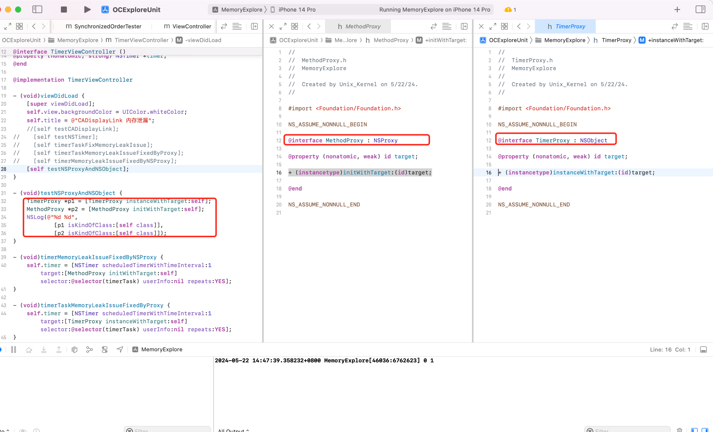
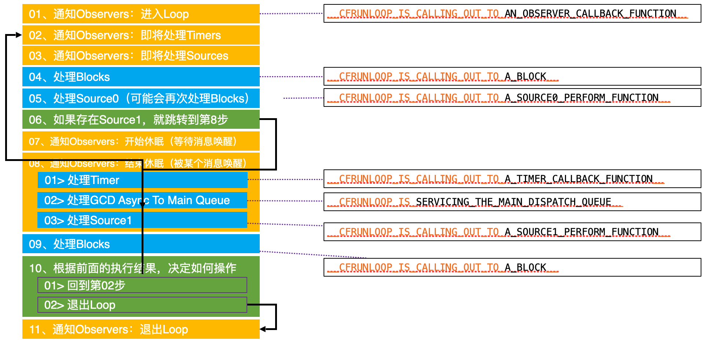

# NSTimer、CSDisplayLink 中的内存泄露


## CADisplayLink 内存泄漏


可以看到 CADisplayLink 和 VC，VC 和 CADisplayLink 互相持有，造成内存泄漏，没有释放。即使页面离开，定时器还在继续运行，不断打印。


## NSTimer 内存泄漏

### 对比实验

NSTimer 的基础 API `[NSTimer scheduledTimersWithTimeInterval:1 repeat:YES block:nil]` 和当前的 VC 都会互相持有，造成环，会存在内存泄漏问题

Demo 如下：


但是当使用 `[NSTimer scheduledTimerWithTimeInterval:1 target:self selector:@selector(timerTask) userInfo:nil repeats:NO];` repeats 为 NO 的时候，好像不会内存泄漏。这是为什么？


### 源码分析

查看 gnu 源码发现

```objective-c
// NSTimer.m
+ (NSTimer*) timerWithTimeInterval: (NSTimeInterval)ti
			    target: (id)object
			  selector: (SEL)selector
			  userInfo: (id)info
			   repeats: (BOOL)f
{
  return AUTORELEASE([[self alloc] initWithFireDate: nil
					   interval: ti
					     target: object
					   selector: selector
					   userInfo: info
					    repeats: f]);
}
```

内部调用下面的函数 

```objective-c
- (id) initWithFireDate: (NSDate*)fd
	       interval: (NSTimeInterval)ti
		 target: (id)object
	       selector: (SEL)selector
	       userInfo: (id)info
		repeats: (BOOL)f
{
  if (ti <= 0.0)
    {
      ti = 0.0001;
    }
  if (fd == nil)
    {
      _date = [[NSDate_class allocWithZone: NSDefaultMallocZone()]
        initWithTimeIntervalSinceNow: ti];
    }
  else
    {
      _date = [fd copyWithZone: NSDefaultMallocZone()];
    }
  _target = RETAIN(object);
  _selector = selector;
  _info = RETAIN(info);
  if (f == YES)
    {
      _repeats = YES;
      _interval = ti;
    }
  else
    {
      _repeats = NO;
      _interval = 0.0;
    }
  return self;
}
```

外面的 repeat 根据传递的布尔值，内部赋值给 _repeats 参数。

内部会自动调用 fire

```objective-c
- (void) fire
{
  /* We check that we have not been invalidated before we fire.
   */
  if (NO == _invalidated) {
      if ((id)_block != nil) {
          CALL_BLOCK(_block, self);
      } else {
          id	target;

          /* We retain the target so it won't be deallocated while we are using
           * it (if this timer gets invalidated while we are firing).
           */
          target = RETAIN(_target);

          if (_selector == 0) {
              NS_DURING {
                  [(NSInvocation*)target invoke];
              }
              NS_HANDLER {
                  NSLog(@"*** NSTimer ignoring exception '%@' (reason '%@') "
		    @"raised during posting of timer with target %s(%s) "
		    @"and selector '%@'",
		    [localException name], [localException reason],
		    GSClassNameFromObject(target),
		    GSObjCIsInstance(target) ? "instance" : "class",
		    NSStringFromSelector([target selector]));
            }
              NS_ENDHANDLER
	    } else {
              NS_DURING {
                  [target performSelector: _selector withObject: self];
              }
              NS_HANDLER {
                  NSLog(@"*** NSTimer ignoring exception '%@' (reason '%@') "
		    @"raised during posting of timer with target %p and "
		    @"selector '%@'",
		    [localException name], [localException reason], target,
		    NSStringFromSelector(_selector));
            }
              NS_ENDHANDLER
            }
          RELEASE(target);
        }

      if (_repeats == NO) {
          [self invalidate];
      }
  }
}
```

可以看到如果 repeat 为 NO ，则会执行 `[target performSelector: _selector withObject: self];` 调用1次方法，然后会执行 `invalidate` 函数，`invalidate` 实现如下

```objective-c
- (void) invalidate
{
  /* OPENSTEP allows this method to be called multiple times. */
  _invalidated = YES;
  if (_target != nil)
    {
      DESTROY(_target);
    }
  if (_info != nil)
    {
      DESTROY(_info);
    }
}
```

可以看到当 target 和 info 存在的时候，都会在 `invalidate` 方法中被 destory，也就是释放。

```
#define	DESTROY(object) 	({ \
  void *__o = (void*)object; \
  object = nil; \
  [(id)__o release]; \
})
#endif
```

结论：通过 gnu 可以看到，NSTimer 会对传入的 target、info 对象进行持有强引用，当 repeat 参数为 NO 的时候，则会立马通过 performSelector 的方式执行定时器任务，然后执行 invalidate 方法，对其内部引用的 object、info 进行释放。


上面的代码主要是利用定时器重复执行 p_doSomeThing 方法，在合适的时候调用 p_stopDoSomeThing 方法使定时器失效。

能看出问题吗？在开始讨论上面代码问题之前，需要对 NSTimer 做一点说明。NSTimer 的 `scheduledTimerWithTimeInterval:target:selector:userInfo:repeats:` 方法的最后一个参数为 YES 时，NSTimer 会保留目标对象，等到自身失效才释放目标对象。执行完任务后，一次性的定时器会自动失效；重复性的定时器，需要主动调用 invalidate 方法才会失效。

当前的 VC 和 定时器互相引用，造成循环引用。所以思路如下：

如果能在合适的时机打破循环引用就不会有问题了

1. 控制器不再强引用定时器
2. 定时器不再保留当前的控制器


## 解决方案

### 改用 block 的方式替换 API，不再持有 target


该种方式，控制器 （self）强引用 timer，timer 强引用 block，block 弱引用 self，3者没有形成环。


### 采用系统 NSProxy 代替自定义的中间类


注意：继承自 NSProxy 的类，不能 init。


QA：自己写的继承自 NSObject 的代理对象和继承自 NSProxy 的代理有何区别？看上去反而是自定义的 NSObject 使用更简单呀？

答：**NSProxy 效率更高**。NSProxy 的主要作用是为消息转发提供一个通用的接口，是一个继承自 NSObject 的对象，虽然看上去 API 更简单，写法简单，但内部运行的时候还是基于 isa 去查找类对象、元类对象的 cache 中查找，找不到再去 class_rw_t 中查找，找不到再从 superclass 找父类的类对象、元类对象...流程，最后还是找不到，则走 runtime 的动态方法解析、消息转发阶段。


看一段神奇的代码



为什么打印出 `0 1`？

分析：

- p1 是 `TimerProxy` 类，继承于 NSObject 所以就不是 UIViewController 类型。

- p2 是 `MethodProxy` 类，继承自 NSProxy，当调用 isKindOfClass 这个方法的时候，也会进行消息转发，即调用 `forwardInvocation` 方法，其内部实现 `[invocation invokeWithTarget:self.target];` 则触发 self.target 的逻辑。此时 self.target 就是 self，所以上面的 `[p2 isKindOfClass:[self class]]` 等价于 `[self isKindOfClass:[self.class]]`，所以为 1。

也就是说继承自 NSProxy 类的对象，调用方法的时候，会自动走消息转发的流程。

这一点可以查看 GUN 查看下源码印证。`NSProxy.m`

```objectivec
- (BOOL) isKindOfClass: (Class)aClass
{
  NSMethodSignature    *sig;
  NSInvocation        *inv;
  BOOL            ret;
  sig = [self methodSignatureForSelector: _cmd];
  inv = [NSInvocation invocationWithMethodSignature: sig];
  [inv setSelector: _cmd];
  [inv setArgument: &aClass atIndex: 2];
  [self forwardInvocation: inv];
  [inv getReturnValue: &ret];
  return ret;
}
```

可以看到内部直接调用了消息转发。


### GCD Timer

**CADisplayLink、NSTimer 都是依靠 RunLoop 实现的，所以当 RunLoop 任务繁重的时候，定时器可能不准。**




假设一个 NSTimer 被加到 RunLoop  开头，NSTimer 执行周期为1s，RunLoop 前面任务繁重，第一次走完一个完整的 RunLoop 需要0.4s，然后从头检测 NSTimer 有没有到时间，发现还没到继续执行 RunLoop 后续逻辑。后面遇到卡顿任务了，第二次 RunLoop 用了0.5s，然后从头检测 NSTimer 有没有到时间，0.4+0.5还不到时间，继续跑，第三次 RunLoop 比较轻松，耗时0.2s，再判断定时器时间有没有到，则此次已经0.4+0.5+0.2=1.1s了，此时 NSTimer 的事件被执行，此时精确度已经不够了（每次 RunLoop 的执行时间不固定）

如果 NSTimer 被添加到了一个特定的模式，当滚动视图时， RunLoop 会切换到 `UITrackingRunLoopMode`，如果 NSTimer 没有被添加到这个模式，它就不会触发。

当 RunLoop 没有事件可处理时，它会进入休眠状态。这意味着即使定时器的时间间隔到了，但 `RunLoop` 可能还在休眠中，因此定时器不会立即触发。


网上有些针对 FPS 帧率的检测是基于 CADisplayLink 计算的，所以这种方案不准确。具体可以查看文章：[带你打造一套 APM 监控系统](./1.74.md)


GCD 的 timer 会更加准时，底层依赖系统内核，不依赖 RunLoop。

```objectivec
@property (nonatomic, strong) dispatch_source_t timer;
// 创建队列
dispatch_queue_t queue = dispatch_get_main_queue();
// 创建 GCD 定时器
dispatch_source_t timerSource = dispatch_source_create(DISPATCH_SOURCE_TYPE_TIMER, 0, 0, queue);
uint64_t start = 2.0;
uint64_t interval = 1.0;
// 设置定时器周期
dispatch_source_set_timer(timerSource, dispatch_time(DISPATCH_TIME_NOW, start * NSEC_PER_SEC), interval * NSEC_PER_SEC, 0);
// 设置定时器任务
dispatch_source_set_event_handler(timerSource, ^{
    NSLog(@"tick tock");
});
// 启动定时器
dispatch_resume(timerSource);
self.timer = timerSource;
```

为什么 GCD timer 会更准确？因为普通定时器运行依赖 RunLoop，RunLoop 一个运行周期内的任务繁忙程度是不确定的。当某次任务繁重，那么定时器调度就不准时。

GCD timer 不依赖 RunLoop，系统底层驱动，所以会更加准确。因为和 RunLoop 无关，所以和 UI 滚动，RunLoop mode 切换到 UITrackingMode 也不影响 GCD timer。


### 打破循环引用，NSTimer target 自定义


### 高精度定时器封装

项目中经常使用定时器，普通定时器存在精度丢失的问题、循环引用的问题，为了使用方法我们封装一个定时器

```objectivec
#import <Foundation/Foundation.h>

@interface PreciousTimer : NSObject

+ (NSString *)execTask:(void(^)(void))task
           start:(NSTimeInterval)start
        interval:(NSTimeInterval)interval
         repeats:(BOOL)repeats
           async:(BOOL)async;

+ (NSString *)execTask:(id)target
              selector:(SEL)selector
                 start:(NSTimeInterval)start
              interval:(NSTimeInterval)interval
               repeats:(BOOL)repeats
                 async:(BOOL)async;

+ (void)cancelTask:(NSString *)name;

@end

#import "PreciousTimer.h"

@implementation PreciousTimer

static NSMutableDictionary *timers_;
dispatch_semaphore_t semaphore_;
+ (void)initialize
{
    static dispatch_once_t onceToken;
    dispatch_once(&onceToken, ^{
        timers_ = [NSMutableDictionary dictionary];
        semaphore_ = dispatch_semaphore_create(1);
    });
}

+ (NSString *)execTask:(void (^)(void))task start:(NSTimeInterval)start interval:(NSTimeInterval)interval repeats:(BOOL)repeats async:(BOOL)async
{
    if (!task || start < 0 || (interval <= 0 && repeats)) return nil;

    // 队列
    dispatch_queue_t queue = async ? dispatch_get_global_queue(0, 0) : dispatch_get_main_queue();

    // 创建定时器
    dispatch_source_t timer = dispatch_source_create(DISPATCH_SOURCE_TYPE_TIMER, 0, 0, queue);

    // 设置时间
    dispatch_source_set_timer(timer,
                              dispatch_time(DISPATCH_TIME_NOW, start * NSEC_PER_SEC),
                              interval * NSEC_PER_SEC, 0);


    dispatch_semaphore_wait(semaphore_, DISPATCH_TIME_FOREVER);
    // 定时器的唯一标识
    NSString *name = [NSString stringWithFormat:@"%zd", timers_.count];
    // 存放到字典中
    timers_[name] = timer;
    dispatch_semaphore_signal(semaphore_);

    // 设置回调
    dispatch_source_set_event_handler(timer, ^{
        task();

        if (!repeats) { // 不重复的任务
            [self cancelTask:name];
        }
    });

    // 启动定时器
    dispatch_resume(timer);

    return name;
}

+ (NSString *)execTask:(id)target selector:(SEL)selector start:(NSTimeInterval)start interval:(NSTimeInterval)interval repeats:(BOOL)repeats async:(BOOL)async
{
    if (!target || !selector) return nil;

    return [self execTask:^{
        if ([target respondsToSelector:selector]) {
#pragma clang diagnostic push
#pragma clang diagnostic ignored "-Warc-performSelector-leaks"
            [target performSelector:selector];
#pragma clang diagnostic pop
        }
    } start:start interval:interval repeats:repeats async:async];
}

+ (void)cancelTask:(NSString *)name
{
    if (name.length == 0) return;

    dispatch_semaphore_wait(semaphore_, DISPATCH_TIME_FOREVER);

    dispatch_source_t timer = timers_[name];
    if (timer) {
        dispatch_source_cancel(timer);
        [timers_ removeObjectForKey:name];
    }

    dispatch_semaphore_signal(semaphore_);
}

@end
```

使用 Demo

```objectivec
- (void)viewDidLoad{
    [super viewDidLoad];
    NSLog(@"now");
    self.timerId = [PreciousTimer execTask:^{
        NSLog(@"tick tock %@", [NSThread currentThread]);
    } start:2 interval:1 repeats:YES async:YES];
}
- (void)touchesBegan:(NSSet<UITouch *> *)touches withEvent:(UIEvent *)event
{
    [PreciousTimer cancelTask:self.timerId];
}
```

说明：直接 `performSelector` 存在警告，可以告诉编译器忽略警告。可以在 Xcode 点开警告，查看详情，复制 `[]`  里面的字符串去忽略警告


### 采用 Block 的形式为 NSTimer 增加分类

```objectivec
//.h文件
#import <Foundation/Foundation.h>

@interface NSTimer (UnRetain)
+ (NSTimer *)lbp_scheduledTimerWithTimeInterval:(NSTimeInterval)inerval
                                        repeats:(BOOL)repeats
                                          block:(void(^)(NSTimer *timer))block;
@end

//.m文件
#import "NSTimer+SGLUnRetain.h"

@implementation NSTimer (SGLUnRetain)

+ (NSTimer *)lbp_scheduledTimerWithTimeInterval:(NSTimeInterval)inerval repeats:(BOOL)repeats block:(void (^)(NSTimer *timer))block{

    return [NSTimer scheduledTimerWithTimeInterval:inerval target:self selector:@selector(lbp_blcokInvoke:) userInfo:[block copy] repeats:repeats];
}

+ (void)lbp_blcokInvoke:(NSTimer *)timer {

    void (^block)(NSTimer *timer) = timer.userInfo;

    if (block) {
        block(timer);
    }
}
@end

//控制器.m

#import "ViewController.h"
#import "NSTimer+UnRetain.h"

//定义了一个__weak的self_weak_变量
#define weakifySelf  \
__weak __typeof(&*self)weakSelf = self;

//局域定义了一个__strong的self指针指向self_weak
#define strongifySelf \
__strong __typeof(&*weakSelf)self = weakSelf;

@interface ViewController ()

@property(nonatomic， strong) NSTimer *timer;

@end

@implementation ViewController
- (void)viewDidLoad {
    [super viewDidLoad];

    __block NSInteger i = 0;
    weakifySelf
    self.timer = [NSTimer lbp_scheduledTimerWithTimeInterval:0.1 repeats:YES block:^(NSTimer *timer) {
        strongifySelf
        [self p_doSomething];
        NSLog(@"----------------");
        if (i++ > 10) {
            [timer invalidate];
        }
    }];
}

- (void)p_doSomething {

}

- (void)dealloc {
      // 务必在当前线程调用invalidate方法，使得Runloop释放对timer的强引用(具体请参阅官方文档)
     [self.timer invalidate];
}
@end
```

上面的方法之所以能解决内存泄漏的问题，关键在于把保留转移到了定时器的类对象身上，这样就避免了实例对象被保留。

当我们谈到循环引用时，其实是指实例对象间的引用关系。类对象在 App 杀死时才会释放，在实际开发中几乎不用关注类对象的内存管理。下面的代码摘自苹果开源的 NSObject.mm 文件，从中可以看出，对于类对象，并不需要像实例对象那样进行内存管理。

```objective-c
+ (id)retain {
    return (id)self;
}

// Replaced by ObjectAlloc
- (id)retain {
    return ((id)self)->rootRetain();
}

+ (oneway void)release {
}

// Replaced by ObjectAlloc
- (oneway void)release {
    ((id)self)->rootRelease();
}

+ (id)autorelease {
    return (id)self;
}

// Replaced by ObjectAlloc
- (id)autorelease {
    return ((id)self)->rootAutorelease();
}

+ (NSUInteger)retainCount {
    return ULONG_MAX;
}

- (NSUInteger)retainCount {
    return ((id)self)->rootRetainCount();
}
```

iOS 10 中，定时器 api 增加了 block 方法，实现原理与此类似，这里采用分类为 NSTimer 增加 block 参数的方法，最终的行为一致


## 检测

根据 Instrucments 提供的工具的工作原理，写一个野指针探针工具去发现并定位问题。具体见[野指针监控工具](./1.74.md#zombieSniffer)