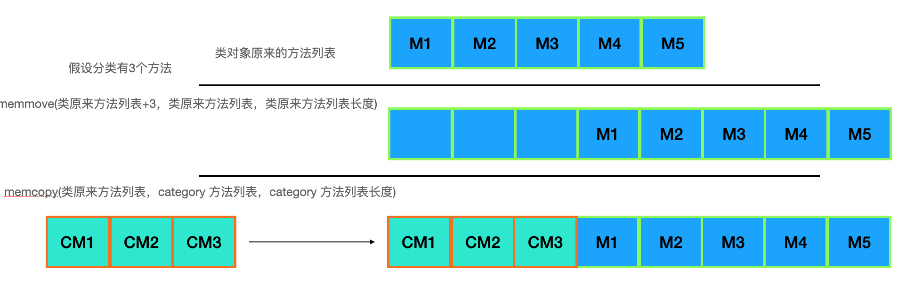
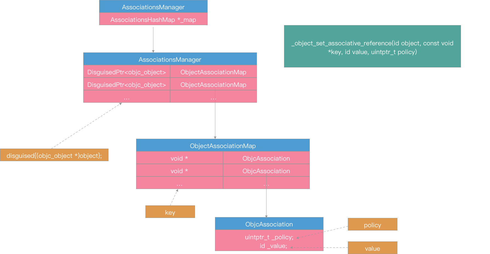
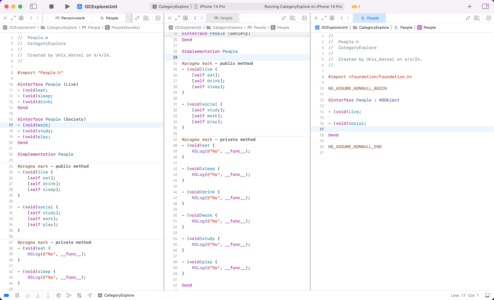

# Category 底层原理

> 很多人都知道  Category、Extension 的用法，但是对于一些细节就不是很清楚了:
>
> - Category 中添加到属性、对象方法、类方法、协议在内存中是怎么存储的？
> - Category 中添加的到属性、对象方法、类方法、协议，是什么时候、如何与 Class 本身的属性、对象方法、类方法、协议合并的？
> - 假设一个 Person 类存在2个 Category，分别是 Person+Work、Person+Study，都有对象方法 play，当实例对象调用 play 的时候，会调用最后编译的 Category （Person+Study）里的 play 实现。但为什么 load 不是调用最后一个 Category 的 +load，而是3个都调用？
>
> 本文主要探索这3个知识点


## 类别（Category）

### 文件特征

- 类别文件有2个，分别为 .h 和 .m
- 命名为： “类名+类别名.h”和“类名+类别名.m”

### 文件内容格式

.h 文件格式

```
#import "类名.h"

@interface 类名 (类别名)
// 在此处声明方法
@end
```

.m 文件格式

```
#import "类名+类别名.h"

@implementation 类名 (类别名)
// 在此处实现声明的方法
@end
```

### 类别的作用

可以把类的实现分开在几个不同的源文件里，所以好处是：

- 减少耽搁文件的代码行数
- 可以把不痛的功能组织到不同的 category 里
- 可以由多个开发者共同完成一个大的类，方便协作
- 拓展当前类，为类添加方法
- 声明私有方法

### 类别的局限性

- 无法向现有的类添加实例变量（编译器报“instance variables may not be placed in categories”）。Category 一般只为类提供方法的拓展，不提供属性的拓展。但是利用 Runtime 可以在 Category 中添加属性

- 方法名称冲突的情况下，如果 Category 中的方法与当前类的方法名称重名，Category 具有更高的优先级，类别中的方法将完全取代现有类中的方法（调用方法的时候不会去调用现有类里面的方法实现）。

- 当现有类具有多个 Category 的时候，如果每个 Category 都有同名的方法，那么在调用方法的时候肯定不会调用现有类的方法实现。系统根据编译顺序决定调用哪个 Category 下的方法实现。（可以在 Targets -> Build phases -> Compile Sources 下给多个 Category 更换顺序看看到底在执行哪个方法）

### Category 的使用和注意

1. Category 中的方法如果和现有类方法一致，工程中任何调用当前类的方法的时候都会去调用 Category 里面的方法（比如：UIViewCtroller、UITableView这些）的方法时要慎重。因为用Category重写类中的方法会对子类造成很大的影响。比如：用Category 重写了 UIViewCtroller 的方法 A，那么如果你在工程中用到的所有继承自 UIViewCtroller 的子类，去调用方法 A 时，执行的都是 Category 中重写的方法 A,如果不幸的是，你写的方法 A 有 Bug，那么会造成整个工程中调用该方法的所有 UIViewCtroller 子类的不正常。除非你在子类中重写了父类的方法 A，这样子类调用方法 A 时是调用的自己重写的方法 A，消除了父类 Category 中重写方法对自己的影响

2. Category拓展方法按照有没有重写当前类中的方法，分为未重写的拓展方法和重写拓展方法。且类引用自己的 Category 时，只能在 .m 文件中引用（.h 文件引用自己的类别会报错）。子类引用父类的 Category 在 .h 或 .m 都可以。如果类调用 Category 中重写的方法，不用引入 Category 头文件，系统会自动调用 Category 中的重写方法

3. Category 中如果重写了 A 类从父类继承来的某方法，不会影响与 A 同层级的 B 类

4. 子类会不会继承父类的 Category： Category 中重写的方法会对子类造成影响，但是子类不会继承非重写的方法（现有类中没有的方法）。但是在子类中引入父类 Category 的声明文件后，子类就会继承 Category 的非重写方法。继承的表现是：当子类的方法和父类 Category 中的方法名完全相同，那么子类里的方法会覆盖掉父类 Category，相当于子类重写了继承自父类的方法

5. Category 的作用是向下有效的。即只会影响到该类的所有子类。比如 A 类和 B 类是继承自 Super 类的2个子类，当给 A 类添加一个 Category sayHello 方法，仅有A 类的子类才可以使用 sayHello 方法


## Category 底层原理

### Category 的真面目是 category_t 结构体

来一个简单的 Person 类，为其添加一个 Category，增加一些属性和类方法、对象方法、遵循协议

```objectivec
// Person
#import <Foundation/Foundation.h>
NS_ASSUME_NONNULL_BEGIN
@interface Person : NSObject
@property (nonatomic, strong) NSString *name;
- (void)sayHi;
- (void)sleep;
@end
NS_ASSUME_NONNULL_END

// Person.m
#import "Person.h"
@implementation Person
- (void)sayHi {
    NSLog(@"Hello world");
}
- (void)sleep{
    NSLog(@"Time to slepp");
}
@end 

// Person+Study.h
#import "Person.h"
NS_ASSUME_NONNULL_BEGIN
@interface Person (Study)<NSCopying>
@property (nonatomic, assign) NSInteger score;
- (void)study;
+ (void)sleep;
@end
NS_ASSUME_NONNULL_END

// Person+Study.m
#import "Person+Study.h"
@implementation Person (Study)
- (void)study {

}
+ (void)sleep {
    NSLog(@"Time to sleep");
}
- (void)setScore:(NSInteger)score {
    
}
- (NSInteger)score {
    return 100;
}
- (id)copyWithZone:(NSZone *)zone{
    return self;
}
@end
```

clang 转为 c++ 代码，具体指令为 `xcrun --sdk iphoneos clang -arch arm64 -rewrite-objc Person+Study.m`

查看 `Person+Study.cpp` 文件，可以看到 Category 本质是一个结构体

```c++
struct _class_t {
	struct _class_t *isa;
	struct _class_t *superclass;
	void *cache;
	void *vtable;
	struct _class_ro_t *ro;
};

struct _category_t {
	const char *name;
	struct _class_t *cls;
	const struct _method_list_t *instance_methods;
	const struct _method_list_t *class_methods;
	const struct _protocol_list_t *protocols;
	const struct _prop_list_t *properties;
};
extern "C" __declspec(dllimport) struct objc_cache _objc_empty_cache;
#pragma warning(disable:4273)

static struct /*_method_list_t*/ {
	unsigned int entsize;  // sizeof(struct _objc_method)
	unsigned int method_count;
	struct _objc_method method_list[4];
} _OBJC_$_CATEGORY_INSTANCE_METHODS_Person_$_Study __attribute__ ((used, section ("__DATA,__objc_const"))) = {
	sizeof(_objc_method),
	4,
	{{(struct objc_selector *)"study", "v16@0:8", (void *)_I_Person_Study_study},
	{(struct objc_selector *)"setScore:", "v24@0:8q16", (void *)_I_Person_Study_setScore_},
	{(struct objc_selector *)"score", "q16@0:8", (void *)_I_Person_Study_score},
	{(struct objc_selector *)"copyWithZone:", "@24@0:8^{_NSZone=}16", (void *)_I_Person_Study_copyWithZone_}}
};

static struct /*_method_list_t*/ {
	unsigned int entsize;  // sizeof(struct _objc_method)
	unsigned int method_count;
	struct _objc_method method_list[1];
} _OBJC_$_CATEGORY_CLASS_METHODS_Person_$_Study __attribute__ ((used, section ("__DATA,__objc_const"))) = {
	sizeof(_objc_method),
	1,
	{{(struct objc_selector *)"sleep", "v16@0:8", (void *)_C_Person_Study_sleep}}
};

static const char *_OBJC_PROTOCOL_METHOD_TYPES_NSCopying [] __attribute__ ((used, section ("__DATA,__objc_const"))) = 
{
	"@24@0:8^{_NSZone=}16"
};

static struct /*_method_list_t*/ {
	unsigned int entsize;  // sizeof(struct _objc_method)
	unsigned int method_count;
	struct _objc_method method_list[1];
} _OBJC_PROTOCOL_INSTANCE_METHODS_NSCopying __attribute__ ((used, section ("__DATA,__objc_const"))) = {
	sizeof(_objc_method),
	1,
	{{(struct objc_selector *)"copyWithZone:", "@24@0:8^{_NSZone=}16", 0}}
};

struct _protocol_t _OBJC_PROTOCOL_NSCopying __attribute__ ((used)) = {
	0,
	"NSCopying",
	0,
	(const struct method_list_t *)&_OBJC_PROTOCOL_INSTANCE_METHODS_NSCopying,
	0,
	0,
	0,
	0,
	sizeof(_protocol_t),
	0,
	(const char **)&_OBJC_PROTOCOL_METHOD_TYPES_NSCopying
};
struct _protocol_t *_OBJC_LABEL_PROTOCOL_$_NSCopying = &_OBJC_PROTOCOL_NSCopying;

static struct /*_protocol_list_t*/ {
	long protocol_count;  // Note, this is 32/64 bit
	struct _protocol_t *super_protocols[1];
} _OBJC_CATEGORY_PROTOCOLS_$_Person_$_Study __attribute__ ((used, section ("__DATA,__objc_const"))) = {
	1,
	&_OBJC_PROTOCOL_NSCopying
};

static struct /*_prop_list_t*/ {
	unsigned int entsize;  // sizeof(struct _prop_t)
	unsigned int count_of_properties;
	struct _prop_t prop_list[1];
} _OBJC_$_PROP_LIST_Person_$_Study __attribute__ ((used, section ("__DATA,__objc_const"))) = {
	sizeof(_prop_t),
	1,
	{{"score","Tq,N"}}
};

extern "C" __declspec(dllimport) struct _class_t OBJC_CLASS_$_Person;

static struct _category_t _OBJC_$_CATEGORY_Person_$_Study __attribute__ ((used, section ("__DATA,__objc_const"))) = 
{
	"Person",
	0, // &OBJC_CLASS_$_Person,
	(const struct _method_list_t *)&_OBJC_$_CATEGORY_INSTANCE_METHODS_Person_$_Study,
	(const struct _method_list_t *)&_OBJC_$_CATEGORY_CLASS_METHODS_Person_$_Study,
	(const struct _protocol_list_t *)&_OBJC_CATEGORY_PROTOCOLS_$_Person_$_Study,
	(const struct _prop_list_t *)&_OBJC_$_PROP_LIST_Person_$_Study,
};
static void OBJC_CATEGORY_SETUP_$_Person_$_Study(void ) {
	_OBJC_$_CATEGORY_Person_$_Study.cls = &OBJC_CLASS_$_Person;
}
```

可以看到 `Person+Study` 的 Category 底层赋值代码如下，就是结构体对象的初始化（参考上面的结构体各个成员变量）

```c++
static struct _category_t _OBJC_$_CATEGORY_Person_$_Study __attribute__ ((used, section ("__DATA,__objc_const"))) = 
{
	"Person",								
	0, // &OBJC_CLASS_$_Person,
	(const struct _method_list_t *)&_OBJC_$_CATEGORY_INSTANCE_METHODS_Person_$_Study,
	(const struct _method_list_t *)&_OBJC_$_CATEGORY_CLASS_METHODS_Person_$_Study,
	(const struct _protocol_list_t *)&_OBJC_CATEGORY_PROTOCOLS_$_Person_$_Study,
	(const struct _prop_list_t *)&_OBJC_$_PROP_LIST_Person_$_Study,
};
```

其中

```c++
struct _category_t {
	const char *name;
	struct _class_t *cls;
	const struct _method_list_t *instance_methods;
	const struct _method_list_t *class_methods;
	const struct _protocol_list_t *protocols;
	const struct _prop_list_t *properties;
};
```

- `name` 是类的名字，不是 category 小括号里写的名字
- `cls` 是要拓展的类对象，编译期间这个值不会有，在 runtime 加载时，才会根据 `name` 对应到类对象
- `instance_methods `这个 category 所有的 `-` 方法（对象方法）
- `class_methods` 这个 category 所有的 `+` 方法（类方法）
- `protocols `这个 category 实现的 protocol
- `properties `这个 category 所有的 property，这也是 category 里面可以定义属性的原因，不过不会 `@synthesize` 实例变量，一般有需求添加实例变量属性时会采用 `objc_setAssociatedObject` 和 `objc_getAssociatedObject` 方法绑定方法绑定。

`_OBJC_$_CATEGORY_INSTANCE_METHODS_Person_$_Study` 结构体存放的是对象方法信息，如下

```c++
static struct /*_method_list_t*/ {
	unsigned int entsize;  // sizeof(struct _objc_method)
	unsigned int method_count;
	struct _objc_method method_list[4];
} _OBJC_$_CATEGORY_INSTANCE_METHODS_Person_$_Study __attribute__ ((used, section ("__DATA,__objc_const"))) = {
	sizeof(_objc_method),
	4,
	{{(struct objc_selector *)"study", "v16@0:8", (void *)_I_Person_Study_study},
	{(struct objc_selector *)"setScore:", "v24@0:8q16", (void *)_I_Person_Study_setScore_},
	{(struct objc_selector *)"score", "q16@0:8", (void *)_I_Person_Study_score},
	{(struct objc_selector *)"copyWithZone:", "@24@0:8^{_NSZone=}16", (void *)_I_Person_Study_copyWithZone_}}
};
```

`_OBJC_$_CATEGORY_CLASS_METHODS_Person_$_Study` 结构体存放的是类方法信息，如下

```c++
static struct /*_method_list_t*/ {
	unsigned int entsize;  // sizeof(struct _objc_method)
	unsigned int method_count;
	struct _objc_method method_list[1];
} _OBJC_$_CATEGORY_CLASS_METHODS_Person_$_Study __attribute__ ((used, section ("__DATA,__objc_const"))) = {
	sizeof(_objc_method),
	1,
	{{(struct objc_selector *)"sleep", "v16@0:8", (void *)_C_Person_Study_sleep}}
};
```

`_OBJC_CATEGORY_PROTOCOLS_$_Person_$_Study` 结构体存放的是遵循的协议信息，如下

```c++
static struct /*_protocol_list_t*/ {
	long protocol_count;  // Note, this is 32/64 bit
	struct _protocol_t *super_protocols[1];
} _OBJC_CATEGORY_PROTOCOLS_$_Person_$_Study __attribute__ ((used, section ("__DATA,__objc_const"))) = {
	1,
	&_OBJC_PROTOCOL_NSCopying
};
```

`_OBJC_$_PROP_LIST_Person_$_Study` 存放的是 Category 中的属性信息，如下 

```c++
static struct /*_prop_list_t*/ {
	unsigned int entsize;  // sizeof(struct _prop_t)
	unsigned int count_of_properties;
	struct _prop_t prop_list[1];
} _OBJC_$_PROP_LIST_Person_$_Study __attribute__ ((used, section ("__DATA,__objc_const"))) = {
	sizeof(_prop_t),
    1,
	1,
	{{"score","Tq,N"}}
};
```

最后，这个类的 category 们生成了一个数组，存在了 `__DATA` 段下的 `__objc_catlist` section 里

```c++
static struct _category_t *L_OBJC_LABEL_CATEGORY_$ [1] __attribute__((used, section ("__DATA, __objc_catlist,regular,no_dead_strip")))= {
	&_OBJC_$_CATEGORY_Person_$_Study,
};
```


看完上述信息，可以得出一个结论：

在编译阶段，Class 和 Category 里面的数据是分开的。“将来”分类中的对象方法会塞到类对象中去，分类中的类方法会被塞到元类对象中去。这个“将来”是什么时候？后面继续探究

查看 [Objc 4 源代码](http://opensource.apple.com/tarballs/objc4/)，Category 定义如下

```c++
struct category_t {
    const char *name;
    classref_t cls;
    WrappedPtr<method_list_t, method_list_t::Ptrauth> instanceMethods;
    WrappedPtr<method_list_t, method_list_t::Ptrauth> classMethods;
    struct protocol_list_t *protocols;
    struct property_list_t *instanceProperties;
    // Fields below this point are not always present on disk.
    struct property_list_t *_classProperties;

    method_list_t *methodsForMeta(bool isMeta) const {
        if (isMeta) return classMethods;
        else return instanceMethods;
    }

    property_list_t *propertiesForMeta(bool isMeta, struct header_info *hi) const;
    
    protocol_list_t *protocolsForMeta(bool isMeta) const {
        if (isMeta) return nullptr;
        else return protocols;
    }
};
```


结论：

- 为某个类添加的分类，分类中可能有属性、对象方法、类方法、遵循的协议、协议方法，本质都是存储到 `category_t` 结构体里面。
- 当有多个分类的时候，是通过 category_t 数组来承载的

 

### category 中定义的方法，存储在哪？

抛个问题：当对象调用方法的时候，不管这个方法是类自身的方法，还是通过分类添加的方法，本质都是通过 isa 指针去寻找方法实现，（如果是对象方法，则通过 instance 的 isa 去找到类对象，最后找到对象方法的实现去调用；如果是类对象方法，则通过 class 的 isa 找到元类对象，最后找到类方法的实现进行调用），那给 Category 添加的方法，是「**如何“塞到”类对象或者元类对象的方法列表中去的**」？

带着问题查看 [objc4 的源代码](http://opensource.apple.com/tarballs/objc4/) `objc-os.mm` 文件中的 `_objc_init` 方法。

在 library 加载前由 libSystem dyld 调用，进行初始化工作。

```c++
/***********************************************************************
* _objc_init
* Bootstrap initialization. Registers our image notifier with dyld.
* Called by libSystem BEFORE library initialization time
**********************************************************************/
void _objc_init(void) {
    static bool initialized = false;
    if (initialized) return;
    initialized = true;
    // fixme defer initialization until an objc-using image is found?
    environ_init();
    tls_init();
    static_init();
    lock_init();
    exception_init();
    _dyld_objc_notify_register(&map_images, load_images, unmap_image);
}
```

`_objc_init` 内部会调用 `map_images` 方法，将文件中的 image（镜像）map 到内存，其内部如下

```c++
/***********************************************************************
* map_images
* Process the given images which are being mapped in by dyld.
* Calls ABI-agnostic code after taking ABI-specific locks.
*
* Locking: write-locks runtimeLock
**********************************************************************/
void map_images(unsigned count, const char * const paths[],
           const struct mach_header * const mhdrs[]) {
    rwlock_writer_t lock(runtimeLock);
    return map_images_nolock(count, paths, mhdrs);
}
```

`map_images` 内部会调用 `map_images_nolock`

```c++
void map_images_nolock(unsigned mhCount, const char * const mhPaths[],
                  const struct mach_header * const mhdrs[]) {
    static bool firstTime = YES;
    header_info *hList[mhCount];
    uint32_t hCount;
    size_t selrefCount = 0;

    // Perform first-time initialization if necessary.
    // This function is called before ordinary library initializers. 
    // fixme defer initialization until an objc-using image is found?
    if (firstTime) {
        preopt_init();
    }

    if (PrintImages) {
        _objc_inform("IMAGES: processing %u newly-mapped images...\n", mhCount);
    }

    // Find all images with Objective-C metadata.
    hCount = 0;

    // Count classes. Size various table based on the total.
    int totalClasses = 0;
    int unoptimizedTotalClasses = 0;
    {
        uint32_t i = mhCount;
        while (i--) {
            const headerType *mhdr = (const headerType *)mhdrs[i];

            auto hi = addHeader(mhdr, mhPaths[i], totalClasses, unoptimizedTotalClasses);
            if (!hi) {
                // no objc data in this entry
                continue;
            }

            if (mhdr->filetype == MH_EXECUTE) {
                // Size some data structures based on main executable's size
#if __OBJC2__
                size_t count;
                _getObjc2SelectorRefs(hi, &count);
                selrefCount += count;
                _getObjc2MessageRefs(hi, &count);
                selrefCount += count;
#else
                _getObjcSelectorRefs(hi, &selrefCount);
#endif

#if SUPPORT_GC_COMPAT
                // Halt if this is a GC app.
                if (shouldRejectGCApp(hi)) {
                    _objc_fatal_with_reason
                        (OBJC_EXIT_REASON_GC_NOT_SUPPORTED, 
                         OS_REASON_FLAG_CONSISTENT_FAILURE, 
                         "Objective-C garbage collection " 
                         "is no longer supported.");
                }
#endif
            }

            hList[hCount++] = hi;

            if (PrintImages) {
                _objc_inform("IMAGES: loading image for %s%s%s%s%s\n", 
                             hi->fname(),
                             mhdr->filetype == MH_BUNDLE ? " (bundle)" : "",
                             hi->info()->isReplacement() ? " (replacement)" : "",
                             hi->info()->hasCategoryClassProperties() ? " (has class properties)" : "",
                             hi->info()->optimizedByDyld()?" (preoptimized)":"");
            }
        }
    }

    // Perform one-time runtime initialization that must be deferred until 
    // the executable itself is found. This needs to be done before 
    // further initialization.
    // (The executable may not be present in this infoList if the 
    // executable does not contain Objective-C code but Objective-C 
    // is dynamically loaded later.
    if (firstTime) {
        sel_init(selrefCount);
        arr_init();

#if SUPPORT_GC_COMPAT
        // Reject any GC images linked to the main executable.
        // We already rejected the app itself above.
        // Images loaded after launch will be rejected by dyld.

        for (uint32_t i = 0; i < hCount; i++) {
            auto hi = hList[i];
            auto mh = hi->mhdr();
            if (mh->filetype != MH_EXECUTE  &&  shouldRejectGCImage(mh)) {
                _objc_fatal_with_reason
                    (OBJC_EXIT_REASON_GC_NOT_SUPPORTED, 
                     OS_REASON_FLAG_CONSISTENT_FAILURE, 
                     "%s requires Objective-C garbage collection "
                     "which is no longer supported.", hi->fname());
            }
        }
#endif

#if TARGET_OS_OSX
        // Disable +initialize fork safety if the app is too old (< 10.13).
        // Disable +initialize fork safety if the app has a
        //   __DATA,__objc_fork_ok section.

        if (dyld_get_program_sdk_version() < DYLD_MACOSX_VERSION_10_13) {
            DisableInitializeForkSafety = true;
            if (PrintInitializing) {
                _objc_inform("INITIALIZE: disabling +initialize fork "
                             "safety enforcement because the app is "
                             "too old (SDK version " SDK_FORMAT ")",
                             FORMAT_SDK(dyld_get_program_sdk_version()));
            }
        }

        for (uint32_t i = 0; i < hCount; i++) {
            auto hi = hList[i];
            auto mh = hi->mhdr();
            if (mh->filetype != MH_EXECUTE) continue;
            unsigned long size;
            if (getsectiondata(hi->mhdr(), "__DATA", "__objc_fork_ok", &size)) {
                DisableInitializeForkSafety = true;
                if (PrintInitializing) {
                    _objc_inform("INITIALIZE: disabling +initialize fork "
                                 "safety enforcement because the app has "
                                 "a __DATA,__objc_fork_ok section");
                }
            }
            break;  // assume only one MH_EXECUTE image
        }
#endif
    }

    if (hCount > 0) {
        _read_images(hList, hCount, totalClasses, unoptimizedTotalClasses);
    }
    firstTime = NO;
}
```

 `map_images_nolock` 会调用 `_read_images` 方法，用于初始化 map 后的 `image`，这里面干了很多的事情，像 load所 有的类、协议和 category，著名的`+ load` 方法就是这一步调用的。如下：

```c++
void _read_images(header_info **hList, uint32_t hCount, int totalClasses, int unoptimizedTotalClasses)
{
    header_info *hi;
    uint32_t hIndex;
    size_t count;
    size_t i;
    Class *resolvedFutureClasses = nil;
    size_t resolvedFutureClassCount = 0;
    static bool doneOnce;
    TimeLogger ts(PrintImageTimes);

    runtimeLock.assertWriting();

#define EACH_HEADER \
    hIndex = 0;         \
    hIndex < hCount && (hi = hList[hIndex]); \
    hIndex++

    if (!doneOnce) {
        doneOnce = YES;

#if SUPPORT_NONPOINTER_ISA
        // Disable non-pointer isa under some conditions.

# if SUPPORT_INDEXED_ISA
        // Disable nonpointer isa if any image contains old Swift code
        for (EACH_HEADER) {
            if (hi->info()->containsSwift()  &&
                hi->info()->swiftVersion() < objc_image_info::SwiftVersion3)
            {
                DisableNonpointerIsa = true;
                if (PrintRawIsa) {
                    _objc_inform("RAW ISA: disabling non-pointer isa because "
                                 "the app or a framework contains Swift code "
                                 "older than Swift 3.0");
                }
                break;
            }
        }
# endif

# if TARGET_OS_OSX
        // Disable non-pointer isa if the app is too old
        // (linked before OS X 10.11)
        if (dyld_get_program_sdk_version() < DYLD_MACOSX_VERSION_10_11) {
            DisableNonpointerIsa = true;
            if (PrintRawIsa) {
                _objc_inform("RAW ISA: disabling non-pointer isa because "
                             "the app is too old (SDK version " SDK_FORMAT ")",
                             FORMAT_SDK(dyld_get_program_sdk_version()));
            }
        }

        // Disable non-pointer isa if the app has a __DATA,__objc_rawisa section
        // New apps that load old extensions may need this.
        for (EACH_HEADER) {
            if (hi->mhdr()->filetype != MH_EXECUTE) continue;
            unsigned long size;
            if (getsectiondata(hi->mhdr(), "__DATA", "__objc_rawisa", &size)) {
                DisableNonpointerIsa = true;
                if (PrintRawIsa) {
                    _objc_inform("RAW ISA: disabling non-pointer isa because "
                                 "the app has a __DATA,__objc_rawisa section");
                }
            }
            break;  // assume only one MH_EXECUTE image
        }
# endif

#endif

        if (DisableTaggedPointers) {
            disableTaggedPointers();
        }

        if (PrintConnecting) {
            _objc_inform("CLASS: found %d classes during launch", totalClasses);
        }

        // namedClasses
        // Preoptimized classes don't go in this table.
        // 4/3 is NXMapTable's load factor
        int namedClassesSize = 
            (isPreoptimized() ? unoptimizedTotalClasses : totalClasses) * 4 / 3;
        gdb_objc_realized_classes =
            NXCreateMapTable(NXStrValueMapPrototype, namedClassesSize);

        ts.log("IMAGE TIMES: first time tasks");
    }


    // Discover classes. Fix up unresolved future classes. Mark bundle classes.
    for (EACH_HEADER) {
        if (! mustReadClasses(hi)) {
            // Image is sufficiently optimized that we need not call readClass()
            continue;
        }

        bool headerIsBundle = hi->isBundle();
        bool headerIsPreoptimized = hi->isPreoptimized();

        classref_t *classlist = _getObjc2ClassList(hi, &count);
        for (i = 0; i < count; i++) {
            Class cls = (Class)classlist[i];
            Class newCls = readClass(cls, headerIsBundle, headerIsPreoptimized);

            if (newCls != cls  &&  newCls) {
                // Class was moved but not deleted. Currently this occurs 
                // only when the new class resolved a future class.
                // Non-lazily realize the class below.
                resolvedFutureClasses = (Class *)
                    realloc(resolvedFutureClasses, 
                            (resolvedFutureClassCount+1) * sizeof(Class));
                resolvedFutureClasses[resolvedFutureClassCount++] = newCls;
            }
        }
    }

    ts.log("IMAGE TIMES: discover classes");

    // Fix up remapped classes
    // Class list and nonlazy class list remain unremapped.
    // Class refs and super refs are remapped for message dispatching.

    if (!noClassesRemapped()) {
        for (EACH_HEADER) {
            Class *classrefs = _getObjc2ClassRefs(hi, &count);
            for (i = 0; i < count; i++) {
                remapClassRef(&classrefs[i]);
            }
            // fixme why doesn't test future1 catch the absence of this?
            classrefs = _getObjc2SuperRefs(hi, &count);
            for (i = 0; i < count; i++) {
                remapClassRef(&classrefs[i]);
            }
        }
    }

    ts.log("IMAGE TIMES: remap classes");

    // Fix up @selector references
    static size_t UnfixedSelectors;
    sel_lock();
    for (EACH_HEADER) {
        if (hi->isPreoptimized()) continue;

        bool isBundle = hi->isBundle();
        SEL *sels = _getObjc2SelectorRefs(hi, &count);
        UnfixedSelectors += count;
        for (i = 0; i < count; i++) {
            const char *name = sel_cname(sels[i]);
            sels[i] = sel_registerNameNoLock(name, isBundle);
        }
    }
    sel_unlock();

    ts.log("IMAGE TIMES: fix up selector references");

#if SUPPORT_FIXUP
    // Fix up old objc_msgSend_fixup call sites
    for (EACH_HEADER) {
        message_ref_t *refs = _getObjc2MessageRefs(hi, &count);
        if (count == 0) continue;

        if (PrintVtables) {
            _objc_inform("VTABLES: repairing %zu unsupported vtable dispatch "
                         "call sites in %s", count, hi->fname());
        }
        for (i = 0; i < count; i++) {
            fixupMessageRef(refs+i);
        }
    }

    ts.log("IMAGE TIMES: fix up objc_msgSend_fixup");
#endif

    // Discover protocols. Fix up protocol refs.
    for (EACH_HEADER) {
        extern objc_class OBJC_CLASS_$_Protocol;
        Class cls = (Class)&OBJC_CLASS_$_Protocol;
        assert(cls);
        NXMapTable *protocol_map = protocols();
        bool isPreoptimized = hi->isPreoptimized();
        bool isBundle = hi->isBundle();

        protocol_t **protolist = _getObjc2ProtocolList(hi, &count);
        for (i = 0; i < count; i++) {
            readProtocol(protolist[i], cls, protocol_map, 
                         isPreoptimized, isBundle);
        }
    }

    ts.log("IMAGE TIMES: discover protocols");

    // Fix up @protocol references
    // Preoptimized images may have the right 
    // answer already but we don't know for sure.
    for (EACH_HEADER) {
        protocol_t **protolist = _getObjc2ProtocolRefs(hi, &count);
        for (i = 0; i < count; i++) {
            remapProtocolRef(&protolist[i]);
        }
    }

    ts.log("IMAGE TIMES: fix up @protocol references");

    // Realize non-lazy classes (for +load methods and static instances)
    for (EACH_HEADER) {
        classref_t *classlist = 
            _getObjc2NonlazyClassList(hi, &count);
        for (i = 0; i < count; i++) {
            Class cls = remapClass(classlist[i]);
            if (!cls) continue;

            // hack for class __ARCLite__, which didn't get this above
#if TARGET_OS_SIMULATOR
            if (cls->cache._buckets == (void*)&_objc_empty_cache  &&  
                (cls->cache._mask  ||  cls->cache._occupied)) 
            {
                cls->cache._mask = 0;
                cls->cache._occupied = 0;
            }
            if (cls->ISA()->cache._buckets == (void*)&_objc_empty_cache  &&  
                (cls->ISA()->cache._mask  ||  cls->ISA()->cache._occupied)) 
            {
                cls->ISA()->cache._mask = 0;
                cls->ISA()->cache._occupied = 0;
            }
#endif

            realizeClass(cls);
        }
    }

    ts.log("IMAGE TIMES: realize non-lazy classes");

    // Realize newly-resolved future classes, in case CF manipulates them
    if (resolvedFutureClasses) {
        for (i = 0; i < resolvedFutureClassCount; i++) {
            realizeClass(resolvedFutureClasses[i]);
            resolvedFutureClasses[i]->setInstancesRequireRawIsa(false/*inherited*/);
        }
        free(resolvedFutureClasses);
    }    

    ts.log("IMAGE TIMES: realize future classes");

    // Discover categories. 
    for (EACH_HEADER) {
        category_t **catlist = 
            _getObjc2CategoryList(hi, &count);
        bool hasClassProperties = hi->info()->hasCategoryClassProperties();

        for (i = 0; i < count; i++) {
            category_t *cat = catlist[i];
            Class cls = remapClass(cat->cls);

            if (!cls) {
                // Category's target class is missing (probably weak-linked).
                // Disavow any knowledge of this category.
                catlist[i] = nil;
                if (PrintConnecting) {
                    _objc_inform("CLASS: IGNORING category \?\?\?(%s) %p with "
                                 "missing weak-linked target class", 
                                 cat->name, cat);
                }
                continue;
            }

            // Process this category. 
            // First, register the category with its target class. 
            // Then, rebuild the class's method lists (etc) if 
            // the class is realized. 
            bool classExists = NO;
            if (cat->instanceMethods ||  cat->protocols  
                ||  cat->instanceProperties) 
            {
                addUnattachedCategoryForClass(cat, cls, hi);
                if (cls->isRealized()) {
                    remethodizeClass(cls);
                    classExists = YES;
                }
                if (PrintConnecting) {
                    _objc_inform("CLASS: found category -%s(%s) %s", 
                                 cls->nameForLogging(), cat->name, 
                                 classExists ? "on existing class" : "");
                }
            }

            if (cat->classMethods  ||  cat->protocols  
                ||  (hasClassProperties && cat->_classProperties)) 
            {
                addUnattachedCategoryForClass(cat, cls->ISA(), hi);
                if (cls->ISA()->isRealized()) {
                    remethodizeClass(cls->ISA());
                }
                if (PrintConnecting) {
                    _objc_inform("CLASS: found category +%s(%s)", 
                                 cls->nameForLogging(), cat->name);
                }
            }
        }
    }

    ts.log("IMAGE TIMES: discover categories");

    // Category discovery MUST BE LAST to avoid potential races 
    // when other threads call the new category code before 
    // this thread finishes its fixups.

    // +load handled by prepare_load_methods()

    if (DebugNonFragileIvars) {
        realizeAllClasses();
    }


    // Print preoptimization statistics
    if (PrintPreopt) {
        static unsigned int PreoptTotalMethodLists;
        static unsigned int PreoptOptimizedMethodLists;
        static unsigned int PreoptTotalClasses;
        static unsigned int PreoptOptimizedClasses;

        for (EACH_HEADER) {
            if (hi->isPreoptimized()) {
                _objc_inform("PREOPTIMIZATION: honoring preoptimized selectors "
                             "in %s", hi->fname());
            }
            else if (hi->info()->optimizedByDyld()) {
                _objc_inform("PREOPTIMIZATION: IGNORING preoptimized selectors "
                             "in %s", hi->fname());
            }

            classref_t *classlist = _getObjc2ClassList(hi, &count);
            for (i = 0; i < count; i++) {
                Class cls = remapClass(classlist[i]);
                if (!cls) continue;

                PreoptTotalClasses++;
                if (hi->isPreoptimized()) {
                    PreoptOptimizedClasses++;
                }

                const method_list_t *mlist;
                if ((mlist = ((class_ro_t *)cls->data())->baseMethods())) {
                    PreoptTotalMethodLists++;
                    if (mlist->isFixedUp()) {
                        PreoptOptimizedMethodLists++;
                    }
                }
                if ((mlist=((class_ro_t *)cls->ISA()->data())->baseMethods())) {
                    PreoptTotalMethodLists++;
                    if (mlist->isFixedUp()) {
                        PreoptOptimizedMethodLists++;
                    }
                }
            }
        }

        _objc_inform("PREOPTIMIZATION: %zu selector references not "
                     "pre-optimized", UnfixedSelectors);
        _objc_inform("PREOPTIMIZATION: %u/%u (%.3g%%) method lists pre-sorted",
                     PreoptOptimizedMethodLists, PreoptTotalMethodLists, 
                     PreoptTotalMethodLists
                     ? 100.0*PreoptOptimizedMethodLists/PreoptTotalMethodLists 
                     : 0.0);
        _objc_inform("PREOPTIMIZATION: %u/%u (%.3g%%) classes pre-registered",
                     PreoptOptimizedClasses, PreoptTotalClasses, 
                     PreoptTotalClasses 
                     ? 100.0*PreoptOptimizedClasses/PreoptTotalClasses
                     : 0.0);
        _objc_inform("PREOPTIMIZATION: %zu protocol references not "
                     "pre-optimized", UnfixedProtocolReferences);
    }

#undef EACH_HEADER
}
```

仔细看 category 的初始化，循环调用了 `_getObjc2CategoryList` 方法，

```c++
// Look for a __DATA or __DATA_CONST or __DATA_DIRTY section 
// with the given name that stores an array of T.
template <typename T>
T* getDataSection(const headerType *mhdr, const char *sectname, 
                  size_t *outBytes, size_t *outCount)
{
    unsigned long byteCount = 0;
    T* data = (T*)getsectiondata(mhdr, "__DATA", sectname, &byteCount);
    if (!data) {
        data = (T*)getsectiondata(mhdr, "__DATA_CONST", sectname, &byteCount);
    }
    if (!data) {
        data = (T*)getsectiondata(mhdr, "__DATA_DIRTY", sectname, &byteCount);
    }
    if (outBytes) *outBytes = byteCount;
    if (outCount) *outCount = byteCount / sizeof(T);
    return data;
}

#define GETSECT(name, type, sectname)                                   \
    type *name(const headerType *mhdr, size_t *outCount) {              \
        return getDataSection<type>(mhdr, sectname, nil, outCount);     \
    }                                                                   \
    type *name(const header_info *hi, size_t *outCount) {               \
        return getDataSection<type>(hi->mhdr(), sectname, nil, outCount); \
    }

//      function name                 content type     section name
GETSECT(_getObjc2CategoryList,        category_t *,    "__objc_catlist");
```

眼熟的 `__objc_catlist`，就是上面 category 存放的数据段了，可以串连起来了。


可以看到内部有 `Discover categories` 相关逻辑，里面和 category 方法相关的有 `remethodizeClass`，其实现如下

```c
static void remethodizeClass(Class cls){
    category_list *cats;
    bool isMeta;
    runtimeLock.assertWriting();
    isMeta = cls->isMetaClass();
    // Re-methodizing: check for more categories
    if ((cats = unattachedCategoriesForClass(cls, false/*not realizing*/))) {
        if (PrintConnecting) {
            _objc_inform("CLASS: attaching categories to class '%s' %s", 
                         cls->nameForLogging(), isMeta ? "(meta)" : "");
        }
        attachCategories(cls, cats, true /*flush caches*/);        
        free(cats);
    }
}
```

可以看到内部调用 `attachCategories` 方法。 `attachCategories` 方法传入 3个参数，第一个参数是类对象，比如 `[Person class]`，第二个参数是 Category 数组，比如 `[category_t(Person+Study), category_t(Person+Work)]`。内部实现如下

```c++
static void attachCategories(Class cls, category_list *cats, bool flush_caches){
    if (!cats) return;
    if (PrintReplacedMethods) printReplacements(cls, cats);

    bool isMeta = cls->isMetaClass();
    // fixme rearrange to remove these intermediate allocations
	  // 方法数组，是"二维数组"。比如：[[personWork 对象方法1, personWork 对象方法2, personWork 对象方法3], [personStudy 对象方法1, personStudy 对象方法2, personStudy 对象方法3]]
    method_list_t **mlists = (method_list_t **)
        malloc(cats->count * sizeof(*mlists));
	  // 属性数组，"二维数组"。比如：[[personWork 属性1, personWork 属性2, personWork 属性3], [personStudy 属性1, personStudy 属性2, personStudy 属性3]]
    property_list_t **proplists = (property_list_t **)
        malloc(cats->count * sizeof(*proplists));
	  // 协议数组，"二维数组"。比如：[[personWork 协议1, personWork 协议2, personWork 协议3], [personStudy 协议1, personStudy 协议2, personStudy 协议3]]
    protocol_list_t **protolists = (protocol_list_t **)
        malloc(cats->count * sizeof(*protolists));

    // Count backwards through cats to get newest categories first
    int mcount = 0;
    int propcount = 0;
    int protocount = 0;
    int i = cats->count;
    bool fromBundle = NO;
    while (i--) {
      	// 取出某个分类。比如 Person+Work
        auto& entry = cats->list[i];
				// isMeta 为 NO，取出分类中的对象方法
        method_list_t *mlist = entry.cat->methodsForMeta(isMeta);
        if (mlist) {
          	// 将分类中的对象方法数组，放到 mlists 里面去。所以 mlists 是一个"二维数组"。由于 i 是 Category 数组总长度递减的，所以编译越后面的 Category 的对象方法越靠前
            mlists[mcount++] = mlist;
            fromBundle |= entry.hi->isBundle();
        }
      	// 取出当前分类的属性数组
        property_list_t *proplist = 
            entry.cat->propertiesForMeta(isMeta, entry.hi);
        if (proplist) {
          	// 将当前分类的属性数组，放到 proplists 中去，所以 proplists 是一个"二维数组"
            proplists[propcount++] = proplist;
        }
				// 取出当前分类的协议数组
        protocol_list_t *protolist = entry.cat->protocols;
        if (protolist) {
          	// 将当前分类的协议数组，放到 protolists 中去，所以 protolists 是一个"二维数组"
            protolists[protocount++] = protolist;
        }
    }
		// 取出类对象的 class_rw_t
    auto rw = cls->data();
    prepareMethodLists(cls, mlists, mcount, NO, fromBundle);
	  // 将所有分类的对象方法，附加到类对象的方法列表后面
    rw->methods.attachLists(mlists, mcount);
    free(mlists);
    if (flush_caches  &&  mcount > 0) flushCaches(cls);
		// 将所有分类的属性，附加到类对象的属性列表后面
    rw->properties.attachLists(proplists, propcount);
    free(proplists);
		// 将所有分类的协议，附加到类对象的协议列表后面
    rw->protocols.attachLists(protolists, protocount);
    free(protolists);
}
```

观察到采用  `i--` 的方式，当 while 循环结束的时候，方法数组 `mlists` 保存了全部分类中的方法，属性数组 `proplists` 保存了全部分类中的属性，协议数组 `protolists` 保存了所有分类所遵循的协议。

可以看到通过传入的类对象 `cls` 调用其 `cls->data()` 方法，找到对应的类 `class_rw_t` 信息，里面存放：方法列表、属性列表、协议列表信息。

```c
// 类对象结构体
struct objc_class : objc_object {
    // Class ISA;
    Class superclass;
    }cache_t cache;             // formerly cache pointer and vtable
    class_data_bits_t bits;    // class_rw_t * plus custom rr/alloc flags

    class_rw_t *data() { 
        return bits.data();
    }
}

struct class_rw_t {
    uint32_t flags;
    uint32_t version;
    const class_ro_t *ro;
    method_array_t methods;
    property_array_t properties;
    protocol_array_t protocols;

    class_rw_t* data() {
        return (class_rw_t *)(bits & FAST_DATA_MASK);
    }
}
```

可以看到最后调用 `attachLists`，内部实现如下

```c
void attachLists(List* const * addedLists, uint32_t addedCount) {
    if (addedCount == 0) return;

    if (hasArray()) {
        // many lists -> many lists
        uint32_t oldCount = array()->count;
        uint32_t newCount = oldCount + addedCount;
        setArray((array_t *)realloc(array(), array_t::byteSize(newCount)));
        array()->count = newCount;
      	// 下面会有解释
        memmove(array()->lists + addedCount, array()->lists, 
                oldCount * sizeof(array()->lists[0]));
        memcpy(array()->lists, addedLists, 
                addedCount * sizeof(array()->lists[0]));
    }
    else if (!list  &&  addedCount == 1) {
        // 0 lists -> 1 list
        list = addedLists[0];
    } 
    else {
        // 1 list -> many lists
        List* oldList = list;
        uint32_t oldCount = oldList ? 1 : 0;
        uint32_t newCount = oldCount + addedCount;
        setArray((array_t *)malloc(array_t::byteSize(newCount)));
        array()->count = newCount;
        if (oldList) array()->lists[addedCount] = oldList;
        memcpy(array()->lists, addedLists, 
                addedCount * sizeof(array()->lists[0]));
    }
}
```

其中关键函数 `memmove` 代表将 __src 中的前 __len 个字节长度移动到 __dst 中去。

```c++
memmove(array()->lists + addedCount, array()->lists, 
        oldCount * sizeof(array()->lists[0]));
memcpy(array()->lists, addedLists, 
        addedCount * sizeof(array()->lists[0]));
```

等价于

```c++
memmove(类对象原来的方法列表 + addedCount,
       	类对象原来的方法列表,
        oldCount * sizeof(array()->lists[0]))
  
memcopy(类对象原来的方法列表,
       	所有分类的方法列表,
        addedCount * sizeof(array()->lists[0]))
```

其中，`array()->lists` 代表类对象原来的方法列表、`oldCount * sizeof(array()->lists[0])` 代表类对象原来方法列表长度，`addedCount` 代表 category 方法列表长度。

c 数组指针 `array()->lists + addedCount` 可以代表其中的位置。

`memmove` 的效果是，将类原来的方法列表移动到第 n个（n为 category 方法列表长度位置，前面空出n个坑位，预留坑位给所有分类的方法）

`memcopy` 效果将 Category 方法列表拷贝到类原方法列表的前面去。位置刚好是 `memmove` 留出的坑位。 

过程如下



结果就是类方法列表中，最前面的就是所有分类的方法列表，最后是类自身的方法列表。

效果为 `[[PersonWork Category 方法列表],  [PersonStudy Category 方法列表],  [Person类自身对象方法列表]]`

 

总结：

Category 编译之后 底层结构为 struct category_t，里面存储着分类的对象方法、类方法、属性、协议信息

程序运行的时候，runtime 会将 Category 中的数据，合并到类自身信息中（类对象、元类对象）


### QA

#### 为什么二维数组打了引号？

`method_array_t` 中存储了 `method_list_t`，`method_list_t` 的元素为 `method_list_t`， 为什么不直接称它为二维数组？

严格来说，不是二维数组，只不过是 array 里添加的对象也是 array，且各个数组不等长，也不会补空。

为什么需要设计为这样的结构？

调用方法，比如调用 load 是 runtime 加载的时候找到方法地址直接调用的。普通方法走的是消息机制，根据对象方法还是类方法，会根据isa 找类对象（对象方法）和元类对象（对象方法）信息中先从 cache中找方法是否有，没有再通过方法二维数组查找（二维是因为类存在分类，分类可能也有方法）没找到则通过 superclass 继续找父类对象或者父元类对象继续找，找到则执行并给当前类的 cache 方法散列表缓存下来。找到NSObject 还是没找到则走消息转发机制，起死回生几个阶段

   另外 load 调用会根据编译顺序决定，如果遇到某个类存在父类则先调用父类的load、再执行子类的 load。category 会按照编译顺序，runtime 会给方法进行重新组合顺序，源码显示最后 category 的方法会排到最前面。

   本类的 class method List 和 category methodList 都是 array，category List 会插在本类 method List 前面，匹配到 category method List 同名方法，本类就不调用了，看着有点像被"覆盖"了。

   

#### 分类中可以写属性吗？

不可以。从源码角度来讲，查看分类的 category_t 结构体可以看到没有 `const ivar_list_t * ivars;` ，所以 category 声明属性底层只会生成 setter、getter 方法声明，没有实现。需要程序员利用 runtime 关联属性自己实现

同理，分类中也不可以添加成员变量，下面代码会报错。

```objective-c
@interface Person (Study)<NSCopying>
{
    int _age;
}
@end
```


从代码设计角度来讲，假设一个 Person 类只有1个 `_age` 成员变量，其内存布局在编译阶段就可以确定。内存布局大概为：

```objective-c
struct Person_IMPL {
	Class isa;
	int _age;
}
```

但 Category  是苹果利用 Runtime 实现的，是运行期动态修改 `class_rw_t` 决定的。


#### 为什么分类中的方法需要放在类自身方法列表的开头？

查看源码为什么分类中的方法需要放在类自身方法列表的开头？因为需要优先保证 Category 中的方法优先被调用。


#### 分类中存在同名方法存在什么问题

对象调用方法的时候会根据对象的 isa 指针，找到类对象方法列表，然后查找方法，由于分类方法在方法列表的前面，类自身方法在方法列表的后面，所以当优先找到分类方法实现的时候就停止查找了，给人的感受就是，方法”被覆盖了 “

Demo: 为 Person 类创建2个 Category，分别存在同名方法 study，具有不同实现。在控制器的手势事件中打印方法列表

```objective-c
- (void)displayMethodName:(Class)cls {
    unsigned int count;
    Method *methodList = class_copyMethodList(cls, &count);
    NSMutableString *methodNames = [NSMutableString string];
    for (int i = 0; i < count; i++) {
        Method method = methodList[i];
        NSString *methodName = NSStringFromSelector(method_getName(method));
        [methodNames appendString:methodName];
        [methodNames appendString:@", "];
    }
    free(methodList);
    NSLog(@"className: %@, methodNames: %@", NSStringFromClass(cls) , methodNames);
}

- (void)viewDidLoad {
    [super viewDidLoad];
    self.p = [[Person alloc] init];
}

- (void)touchesBegan:(NSSet<UITouch *> *)touches withEvent:(UIEvent *)event {
    [self.p study];
    [self displayMethodName:[Person class]];
}
```


可以看到 sayHi 方法存在多个，但是由于 Category 同名的方法在方法列表的前面，所以类自身的方法实现”被覆盖了“（根据 isa 查找方法实现的时候，优先查找到 Category 的方法实现，则停止查找了）


#### 2个分类存在同名方法，谁先调用

- 分类方法优先级高于类自身方法
- 同样是分类方法，由编译顺序决定哪个方法会被调用（Xcode：Build Phases -> Compile Sources），编译顺序越后面的方法优先被调用

Demo: 为 Person 类创建2个 Category，分别存在同名方法 study，具有不同实现。探索编译顺序决定方法实现


2个对比实验：

让 `Person+Study` 参与后编译


让 `Person+Learn` 参与后编译


## 拓展（Extension）

### 文件特征

- 只存在一个文件

- 命名方式：“类名_拓展名.h”

  ```
  #import "类名.h"
  @interface 类名 ()
  // 在此添加私有成员变量、属性、声明方法
  @end
  ```

### 拓展的作用

1. 为类增加额外的属性、成员变量、方法声明

2. 一般将类拓展直接写到当前类的 .m 文件中。不单独创建

3. 一般私有的属性和方法写到类拓展中

4. 和 Category 类似，但是小括号里面没有拓展的名字

5. 拓展里面的属性和方法，会在编译阶段将相关数据和类本身合并（分类 Category 在编译期无法确定，只有在运行时才会合并到类对象、元类对象的属性、方法列表中去）

### 拓展的局限性

1. Extension 中添加的属性、成员变量、方法属于私有（只可以在本类的 .m 文件中访问、调用。在其他类里面是无法访问的，同时子类也是无法继承的）。假如我们有这样一个需求，一个属性对外是只读的，对内是可以读写的，那么我们可以通过 Extension 实现。

2. 通常 Extension 都写在 .m 文件中，不会单独建立一个 Extension 文件。而且 Extension 必须写到 @implementation 上方，否则编译报错

3. 类拓展定义的方法和属性必须在类的实现文件中实现。如果单独定义类扩展的文件并且只定义属性的话，也需要将类实现文件中包含进类扩展文件，否则会找不到属性的 setter 和 getter 方法。

   ```objectivec
   //Web.h
   #import "Person.h"
   NS_ASSUME_NONNULL_BEGIN
   @interface Web : Person
   @end
   NS_ASSUME_NONNULL_END
   
   //Web.m
   #import "Web.h"
   #import "Web+H5.h"
   @interface Web ()
   @property (nonatomic, strong) NSString *skillStacks;
   @end
   @implementation Web
   
   - (void)test {
      self.skills = @"iOS && Web && Node && Hybrid";
      self.skillStacks = @"iOS && Web && Node && Hybrid";
   }
   - (void)show {
      NSLog(@"%@",self.skillStacks);
   }
   @end
   ```

4. 不能为系统类添加拓展


### QA

Category 的实现原理是什么？

Category 编译之后的底层实现是 struct category_t，里面存储着分类的对象方法、类方法、属性、协议信息。

程序运行过程中，runtime 会将 Category 的数据，合并到类信息中（类对象、元类对象）


Category 和 Class Extension 的区别是什么？

Class Extension 在编译的时候，它的数据就已经包含在类信息中。

Category 是在运行时，才将数据合并到类信息中（类对象、元类对象）


## 总结

1. Category 能拓充实例方法、类方法、协议、属性（属性虽然不可以直接拓展，利用 Runtime 关联属性可以实现）、不能拓展成员变量（包含成员变量会报错）
2. 如果 Category 中声明了1个属性，那么 Category 只会生成 setter 和 getter 的声明，不会有实现
3. 分类的方法本质是追加在当前类方法列表后，所以分类的方法会覆盖当前类的方法。
4. Category 具有运行时决议的特点。为某个类添加的 Category 被 runtime 加载后，原本来的方法，可能会被优先找到分类中的方法实现，而“覆盖”（假的覆盖，只是优先查找到 category 的方法实现的时候，原始类的方法查找中止而已）
5. Category 可以为系统类添加分类，而拓展不行。


关于第3点，我们可以查看源代码印证下。去 opensource 下载 objc4

OC 入口函数`_objc_init`

```objectivec
void _objc_init(void)
{
    // ...
    _dyld_objc_notify_register(&map_images, load_images, unmap_image);
}
```

之后注册各种镜像，那么 map_images 哪里来的？

```objectivec
void 
map_images_nolock(unsigned mhCount, const char * const mhPaths[],
                  const struct mach_header * const mhdrs[])
{
    // ...
    if (hCount > 0) {
        _read_images(hList, hCount, totalClasses, unoptimizedTotalClasses);
    }
    firstTime = NO;
}
```

_read_images 方法内部会调用 remethodizeClass

```objectivec
void _read_images(header_info **hList, uint32_t hCount, int totalClasses, int unoptimizedTotalClasses)
{
// ...
    if (cls->isRealized()) {
        remethodizeClass(cls);
// ...
}
```

remethodizeClass 内部会调用 attachCategories

```objectivec
static void remethodizeClass(Class cls)
{
    category_list *cats;
    bool isMeta;

    runtimeLock.assertWriting();

    isMeta = cls->isMetaClass();

    // Re-methodizing: check for more categories
    if ((cats = unattachedCategoriesForClass(cls, false/*not realizing*/))) {
        if (PrintConnecting) {
            _objc_inform("CLASS: attaching categories to class '%s' %s", 
                         cls->nameForLogging(), isMeta ? "(meta)" : "");
        }

        attachCategories(cls, cats, true /*flush caches*/);        
        free(cats);
    }
}
```

attachCategories 会调用  attachLists

```objectivec
static void 
attachCategories(Class cls, category_list *cats, bool flush_caches)
{
    if (!cats) return;
    if (PrintReplacedMethods) printReplacements(cls, cats);

    bool isMeta = cls->isMetaClass();

    // fixme rearrange to remove these intermediate allocations
    method_list_t **mlists = (method_list_t **)
        malloc(cats->count * sizeof(*mlists));
    property_list_t **proplists = (property_list_t **)
        malloc(cats->count * sizeof(*proplists));
    protocol_list_t **protolists = (protocol_list_t **)
        malloc(cats->count * sizeof(*protolists));

    // Count backwards through cats to get newest categories first
    int mcount = 0;
    int propcount = 0;
    int protocount = 0;
    int i = cats->count;
    bool fromBundle = NO;
    while (i--) {
        auto& entry = cats->list[i];

        method_list_t *mlist = entry.cat->methodsForMeta(isMeta);
        if (mlist) {
            mlists[mcount++] = mlist;
            fromBundle |= entry.hi->isBundle();
        }

        property_list_t *proplist = 
            entry.cat->propertiesForMeta(isMeta, entry.hi);
        if (proplist) {
            proplists[propcount++] = proplist;
        }

        protocol_list_t *protolist = entry.cat->protocols;
        if (protolist) {
            protolists[protocount++] = protolist;
        }
    }

    auto rw = cls->data();

    prepareMethodLists(cls, mlists, mcount, NO, fromBundle);
    rw->methods.attachLists(mlists, mcount);
    free(mlists);
    if (flush_caches  &&  mcount > 0) flushCaches(cls);

    rw->properties.attachLists(proplists, propcount);
    free(proplists);

    rw->protocols.attachLists(protolists, protocount);
    free(protolists);
}
```

attachLists 内部会调用 realloc、memmove、memmcpy

```objectivec
void attachLists(List* const * addedLists, uint32_t addedCount) {
        if (addedCount == 0) return;

        if (hasArray()) {
            // many lists -> many lists
            uint32_t oldCount = array()->count;
            uint32_t newCount = oldCount + addedCount;
            setArray((array_t *)realloc(array(), array_t::byteSize(newCount)));
            array()->count = newCount;
            memmove(array()->lists + addedCount, array()->lists, 
                    oldCount * sizeof(array()->lists[0]));
            memcpy(array()->lists, addedLists, 
                   addedCount * sizeof(array()->lists[0]));
        }
        else if (!list  &&  addedCount == 1) {
            // 0 lists -> 1 list
            list = addedLists[0];
        } 
        else {
            // 1 list -> many lists
            List* oldList = list;
            uint32_t oldCount = oldList ? 1 : 0;
            uint32_t newCount = oldCount + addedCount;
            setArray((array_t *)malloc(array_t::byteSize(newCount)));
            array()->count = newCount;
            if (oldList) array()->lists[addedCount] = oldList;
            memcpy(array()->lists, addedLists, 
                   addedCount * sizeof(array()->lists[0]));
        }
    }
```

最后会把类对象、元类对象、分类二元数组整体处理，结果为最后编译的分类在整合后数组的最前面，也就是为什么说分类和原类存在同名方法时，会被覆盖，且最后编译的分类的方法实现是会被调用的原因。

- 通过 Runtime 加载某个类所有的 Category 

- 所有的 Category 方法、属性、协议数据，合并到一个大数组中，后面参与编译的 Category 数据，会放在数组前面

- 合并后的 Category 数据(属性、方法、协议)插入到类原来数据的前面(比如class_rw_t->methods)


## 底层剖析 load 方法

假设一个 Person 类存在2个 Category，分别是 Person+Work、Person+Study，都有对象方法 play，当实例对象调用 play 的时候，会调用最后编译的 Category （Person+Study）里的 play 实现。但为什么 load 不是调用最后一个 Category 的 +load，而是3个都调用？

Demo 验证

```objectivec
@interface Person : NSObject
@end

@interface Student : Person
@end

@interface Student (Good)
@end

@interface Student (Bad)
@end
// 其中每个类都存在3个方法
+ (void)load{
    NSLog(@"%s", __func__);
}
+ (void)initialize{
    NSLog(@"%s", __func__);
}
- (void)test{
    NSLog(@"%s", __func__);
}
// Test
Student *st = [[Student alloc] init];

2022-04-16 01:35:22.237692+0800 Main[8752:2908124] +[Person load]
2022-04-16 01:35:22.238305+0800 Main[8752:2908124] +[Student load]
2022-04-16 01:35:22.238450+0800 Main[8752:2908124] +[Student(Good) load]
2022-04-16 01:35:22.238562+0800 Main[8752:2908124] +[Student(Bad) load]
2022-04-16 01:35:22.238664+0800 Main[8752:2908124] +[Person initialize]
2022-04-16 01:35:22.238733+0800 Main[8752:2908124] +[Student(Bad) initialize]
2022-04-16 01:35:22.238794+0800 Main[8752:2908124] -[Student(Bad) test]
```


### 为什么 load 方法不是按照 Category 编译顺序倒序调用 load 方法？

看源代码 Objc4（我的版本是 objc4-838.1）

```c
// objc-os.mm
/***********************************************************************
* _objc_init
* Bootstrap initialization. Registers our image notifier with dyld.
* Called by libSystem BEFORE library initialization time
**********************************************************************/
// Objc 启动会调用该方法，内部会调用 _dyld_objc_notify_register。其中 load_images 方法用于加载模块
void _objc_init(void)
{
    static bool initialized = false;
    if (initialized) return;
    initialized = true;
    
    // fixme defer initialization until an objc-using image is found?
    environ_init();
    tls_init();
    static_init();
    runtime_init();
    exception_init();
#if __OBJC2__
    cache_t::init();
#endif
    _imp_implementationWithBlock_init();

    _dyld_objc_notify_register(&map_images, load_images, unmap_image);

#if __OBJC2__
    didCallDyldNotifyRegister = true;
#endif
}

// objc-runtime-new.mm
// load_images 方法中最后会调用 call_load_methods 方法，用于调用全部的 +(void)load 方法
void
load_images(const char *path __unused, const struct mach_header *mh)
{
    if (!didInitialAttachCategories && didCallDyldNotifyRegister) {
        didInitialAttachCategories = true;
        loadAllCategories();
    }

    // Return without taking locks if there are no +load methods here.
    if (!hasLoadMethods((const headerType *)mh)) return;

    recursive_mutex_locker_t lock(loadMethodLock);

    // Discover load methods
    {
        mutex_locker_t lock2(runtimeLock);
        prepare_load_methods((const headerType *)mh);
    }

    // Call +load methods (without runtimeLock - re-entrant)
    call_load_methods();
}

// objc-loadmethod.mm
/***********************************************************************
* call_load_methods
* Call all pending class and category +load methods.
* Class +load methods are called superclass-first. 
* Category +load methods are not called until after the parent class's +load.
* 
* This method must be RE-ENTRANT, because a +load could trigger 
* more image mapping. In addition, the superclass-first ordering 
* must be preserved in the face of re-entrant calls. Therefore, 
* only the OUTERMOST call of this function will do anything, and 
* that call will handle all loadable classes, even those generated 
* while it was running.
*
* The sequence below preserves +load ordering in the face of 
* image loading during a +load, and make sure that no 
* +load method is forgotten because it was added during 
* a +load call.
* Sequence:
* 1. Repeatedly call class +loads until there aren't any more
* 2. Call category +loads ONCE.
* 3. Run more +loads if:
*    (a) there are more classes to load, OR
*    (b) there are some potential category +loads that have 
*        still never been attempted.
* Category +loads are only run once to ensure "parent class first" 
* ordering, even if a category +load triggers a new loadable class 
* and a new loadable category attached to that class. 
*
* Locking: loadMethodLock must be held by the caller 
*   All other locks must not be held.
**********************************************************************/
// 在调用 call_load_methods 方法内部，会先调用类的 +load 方法，再调用分类的 +load
void call_load_methods(void)
{
    static bool loading = NO;
    bool more_categories;

    loadMethodLock.assertLocked();

    // Re-entrant calls do nothing; the outermost call will finish the job.
    if (loading) return;
    loading = YES;

    void *pool = objc_autoreleasePoolPush();

    do {
        // 1. Repeatedly call class +loads until there aren't any more
	      // 先调用全部类的 +load
        while (loadable_classes_used > 0) {
            call_class_loads();
        }
			
        // 2. Call category +loads ONCE
        // 再调用分类的 +load
        more_categories = call_category_loads();

        // 3. Run more +loads if there are classes OR more untried categories
    } while (loadable_classes_used > 0  ||  more_categories);

    objc_autoreleasePoolPop(pool);

    loading = NO;
}

/***********************************************************************
* call_class_loads
* Call all pending class +load methods.
* If new classes become loadable, +load is NOT called for them.
*
* Called only by call_load_methods().
**********************************************************************/
// 该方法用于调用全部类的 +load 方法
static void call_class_loads(void)
{
    int i;
    
    // Detach current loadable list.
    struct loadable_class *classes = loadable_classes;
    int used = loadable_classes_used;
    loadable_classes = nil;
    loadable_classes_allocated = 0;
    loadable_classes_used = 0;
    
    // Call all +loads for the detached list.
    for (i = 0; i < used; i++) {
        Class cls = classes[i].cls;
	      // 从可加载的类数组 classes 中取出当前类的 method.这个类是 loadable_class 结构体，只有2个成员，cls 和 method，所以该 method 就是 +load 方法
        load_method_t load_method = (load_method_t)classes[i].method;
        if (!cls) continue; 

        if (PrintLoading) {
            _objc_inform("LOAD: +[%s load]\n", cls->nameForLogging());
        }
      	// 直接调用 +load 方法，而不是采用发消息的形式
        (*load_method)(cls, @selector(load));
    }
    
    // Destroy the detached list.
    if (classes) free(classes);
}

typedef void(*load_method_t)(id, SEL);

struct loadable_class {
    Class cls;  // may be nil
    IMP method;
};

struct loadable_category {
    Category cat;  // may be nil
    IMP method;
};

/***********************************************************************
* call_category_loads
* Call some pending category +load methods.
* The parent class of the +load-implementing categories has all of 
*   its categories attached, in case some are lazily waiting for +initalize.
* Don't call +load unless the parent class is connected.
* If new categories become loadable, +load is NOT called, and they 
*   are added to the end of the loadable list, and we return TRUE.
* Return FALSE if no new categories became loadable.
*
* Called only by call_load_methods().
**********************************************************************/
// 该方法用于调用分类的 +load 方法
static bool call_category_loads(void)
{
    int i, shift;
    bool new_categories_added = NO;
    
    // Detach current loadable list.
    struct loadable_category *cats = loadable_categories;
    int used = loadable_categories_used;
    int allocated = loadable_categories_allocated;
    loadable_categories = nil;
    loadable_categories_allocated = 0;
    loadable_categories_used = 0;

    // Call all +loads for the detached list.
    for (i = 0; i < used; i++) {
        Category cat = cats[i].cat;
      	// 从可加载的分类数组 cats 中取出当前分类，这个类是 loadable_category 结构体，只有2个成员，cat 和 method，所以该 method 就是 +load 方法
        load_method_t load_method = (load_method_t)cats[i].method;
        Class cls;
        if (!cat) continue;

        cls = _category_getClass(cat);
        if (cls  &&  cls->isLoadable()) {
            if (PrintLoading) {
                _objc_inform("LOAD: +[%s(%s) load]\n", 
                             cls->nameForLogging(), 
                             _category_getName(cat));
            }
	          // 直接调用 Category 的 +load，不是采用发消息的方式
            (*load_method)(cls, @selector(load));
            cats[i].cat = nil;
        }
    }

    // Compact detached list (order-preserving)
    shift = 0;
    for (i = 0; i < used; i++) {
        if (cats[i].cat) {
            cats[i-shift] = cats[i];
        } else {
            shift++;
        }
    }
    used -= shift;

    // Copy any new +load candidates from the new list to the detached list.
    new_categories_added = (loadable_categories_used > 0);
    for (i = 0; i < loadable_categories_used; i++) {
        if (used == allocated) {
            allocated = allocated*2 + 16;
            cats = (struct loadable_category *)
                realloc(cats, allocated *
                                  sizeof(struct loadable_category));
        }
        cats[used++] = loadable_categories[i];
    }

    // Destroy the new list.
    if (loadable_categories) free(loadable_categories);

    // Reattach the (now augmented) detached list. 
    // But if there's nothing left to load, destroy the list.
    if (used) {
        loadable_categories = cats;
        loadable_categories_used = used;
        loadable_categories_allocated = allocated;
    } else {
        if (cats) free(cats);
        loadable_categories = nil;
        loadable_categories_used = 0;
        loadable_categories_allocated = 0;
    }

    if (PrintLoading) {
        if (loadable_categories_used != 0) {
            _objc_inform("LOAD: %d categories still waiting for +load\n",
                         loadable_categories_used);
        }
    }

    return new_categories_added;
}
```

阅读源码发现：

1. 在调用 `+load` 方法的时候，系统会先调用（可加载）类的 `+load` 方法，再调用分类的 `+load` 方法
2. `call_class_loads`、`call_category_loads` 方法内部实现，是通过 `loadable_class` `loadable_category` 结构体的 method 成员值 ，通过  `load_method_t load_method = (load_method_t)classes[i].method`  找到  `+ load` 方法地址。最后直接调用 `(*load_method)(cls, SEL_load)` 方法本身，没有采用消息机制。


### 为什么总是父类的 +load 比子类先执行？

无论在 Xcode 中怎么调节编译顺序，发现总是父类的 +load 比子类先执行，为什么？还是从源码角度白盒探究下。

梳理下思路：关于 +load 的执行顺序，类的 +load 比分类先执行，这一点认知是拉齐的吧。那我们聚焦下，看看类里面父类、子类这样的情况是如何调用 +load 的 。

```c++
static void call_class_loads(void)
{
    int i;
    
    // Detach current loadable list.
    struct loadable_class *classes = loadable_classes;
    int used = loadable_classes_used;
    loadable_classes = nil;
    loadable_classes_allocated = 0;
    loadable_classes_used = 0;
    
    // Call all +loads for the detached list.
    for (i = 0; i < used; i++) {
        Class cls = classes[i].cls;
        load_method_t load_method = (load_method_t)classes[i].method;
        if (!cls) continue; 

        if (PrintLoading) {
            _objc_inform("LOAD: +[%s load]\n", cls->nameForLogging());
        }
        (*load_method)(cls, @selector(load));
    }
    
    // Destroy the detached list.
    if (classes) free(classes);
}
```

我们在类的 +load 执行方法 `call_class_loads` 里看到，方法内部说顺序遍历并执行 +load 的。看到 `loadable_classes` 很可疑。它是不是决定了父类、子类的顺序？

```c++
void
load_images(const char *path __unused, const struct mach_header *mh)
{
    if (!didInitialAttachCategories && didCallDyldNotifyRegister) {
        didInitialAttachCategories = true;
        loadAllCategories();
    }

    // Return without taking locks if there are no +load methods here.
    if (!hasLoadMethods((const headerType *)mh)) return;

    recursive_mutex_locker_t lock(loadMethodLock);

    // Discover load methods
    {
        mutex_locker_t lock2(runtimeLock);
        prepare_load_methods((const headerType *)mh);
    }

    // Call +load methods (without runtimeLock - re-entrant)
    call_load_methods();
}
```

发现在调用 `call_load_methods` 方法之前，有个 `prepare_load_methods` 方法。看名字，感觉像是在做调用 +load 方法前的准备工作。

```c++
void prepare_load_methods(const headerType *mhdr)
{
    size_t count, i;

    runtimeLock.assertLocked();

    classref_t const *classlist = 
        _getObjc2NonlazyClassList(mhdr, &count);
    for (i = 0; i < count; i++) {
      	// 做一些前置定制动作
        schedule_class_load(remapClass(classlist[i]));
    }

    category_t * const *categorylist = _getObjc2NonlazyCategoryList(mhdr, &count);
    for (i = 0; i < count; i++) {
        category_t *cat = categorylist[i];
        Class cls = remapClass(cat->cls);
        if (!cls) continue;  // category for ignored weak-linked class
        if (cls->isSwiftStable()) {
            _objc_fatal("Swift class extensions and categories on Swift "
                        "classes are not allowed to have +load methods");
        }
        realizeClassWithoutSwift(cls, nil);
        ASSERT(cls->ISA()->isRealized());
      	
        add_category_to_loadable_list(cat);
    }
}

/***********************************************************************
* prepare_load_methods
* Schedule +load for classes in this image, any un-+load-ed 
* superclasses in other images, and any categories in this image.
**********************************************************************/
// Recursively schedule +load for cls and any un-+load-ed superclasses.
// cls must already be connected.
static void schedule_class_load(Class cls)
{
    if (!cls) return;
    ASSERT(cls->isRealized());  // _read_images should realize

    if (cls->data()->flags & RW_LOADED) return;

    // Ensure superclass-first ordering
  	// 递归调用，传入当前类的父类
    schedule_class_load(cls->getSuperclass());
		// 将 cls 添加到 loadable_classes 数组的最后面
    add_class_to_loadable_list(cls);
    cls->setInfo(RW_LOADED); 
}
```

通过源码，我们可以看出：

- 系统会通过 `schedule_class_load` 方法，保证优先调用当前类的全部父类的加入到 `loadable_classes`，然后将当前类加入到 `loadable_classes`
- 最后执行 +load 的时候会按照 `loadable_classes` 里的顺序，依次调用 +load 方法 

顺便看看分类的调用顺序是怎么控制的？

```c++
void prepare_load_methods(const headerType *mhdr)
{
    size_t count, i;

    runtimeLock.assertLocked();

    classref_t const *classlist = 
        _getObjc2NonlazyClassList(mhdr, &count);
    for (i = 0; i < count; i++) {
        schedule_class_load(remapClass(classlist[i]));
    }

    category_t * const *categorylist = _getObjc2NonlazyCategoryList(mhdr, &count);
    for (i = 0; i < count; i++) {
        category_t *cat = categorylist[i];
        Class cls = remapClass(cat->cls);
        if (!cls) continue;  // category for ignored weak-linked class
        if (cls->isSwiftStable()) {
            _objc_fatal("Swift class extensions and categories on Swift "
                        "classes are not allowed to have +load methods");
        }
        realizeClassWithoutSwift(cls, nil);
        ASSERT(cls->ISA()->isRealized());
        add_category_to_loadable_list(cat);
    }
}

/***********************************************************************
* add_category_to_loadable_list
* Category cat's parent class exists and the category has been attached
* to its class. Schedule this category for +load after its parent class
* becomes connected and has its own +load method called.
**********************************************************************/
void add_category_to_loadable_list(Category cat)
{
    IMP method;

    loadMethodLock.assertLocked();

    method = _category_getLoadMethod(cat);

    // Don't bother if cat has no +load method
    if (!method) return;

    if (PrintLoading) {
        _objc_inform("LOAD: category '%s(%s)' scheduled for +load", 
                     _category_getClassName(cat), _category_getName(cat));
    }
    
    if (loadable_categories_used == loadable_categories_allocated) {
        loadable_categories_allocated = loadable_categories_allocated*2 + 16;
        loadable_categories = (struct loadable_category *)
            realloc(loadable_categories,
                              loadable_categories_allocated *
                              sizeof(struct loadable_category));
    }

    loadable_categories[loadable_categories_used].cat = cat;
    loadable_categories[loadable_categories_used].method = method;
    loadable_categories_used++;
}
```

可以看到通过 `schedule_class_load` 处理完类之后，分类是直接通过 `_getObjc2NonlazyCategoryList(mhdr, &count)` 获取的，之后也是直接添加到 `loadable_categories` 中去。


### +load 总结

- `+load` 方法是系统通过 runtime 在加载类、分类的时候调用的
- 每个类、分类的 `+load` 在程序运行过程中只调用1次
- 调用顺序方面：
  - 先调用类的 `+load` 方法
    - 存在继承关系的话，调用子类的 `+load` 之前会调用父类的 `+load` 方法（runtime 会保证好，先调用父类的 `+load` ，再调用子类的 `+load` ）
    - 不存在继承关系的话，会按照编译顺序调用 `+load`（先编译的先调用）
  - 再调用分类的 `+load` 方法
    - 按照编译顺序调用 `+load`（先编译的先调用）


### QA

1.Category 中有 `+load` 方法吗？`+load` 调用时机是什么时候？`+load` 可以继承吗？

Category 存在 `+load` 方法。`+load` 是系统在启动阶段通过 runtime 来加载、准备（通过递归的手段保证，如果当前类存在父类，则会加入到 `loadable_classes` 中去），然后先调用类的 `+load`，再调用分类的 `+load`。

`+load` 可以继承。但是这个问法背后的想法有点神奇，因为继承的本质是面向对象，类继承了，方法会重写逻辑。但是 iOS 官方文档说 `+load` 适合做和本类相关的逻辑。所以这个继承就显得不那么合理。但是可以继承的，比如下面的代码：

```objective-c
@interface Person : NSObject
@end

@implementation Person
+ (load) {
	NSLog(@"Person +load");
}
@end

@interface Student : Person
@end
@implementation Person
@end
  
[Student load];
// console
Person +load
```

可以看到，我们主动调用 `[Student load]` 由于 Student 自身没有实现 `+load`，由于存在继承，所以调用了 Person 的 `+load` 。手动调用 `+load` 本质上就是给 runtime 消息机制，等价于 `objc_msgSend([Student class], @selector(load))` ，通过 Student 类对象的 isa，找到 Student 元类对象，判断有没有类方法 `+load`，发现没有，则根据 Student 元类对象的 `superclass` 找到父类的元类对象，也就是 Person 的元类对象，发现有 `+load` 实现，即调用了 `+load` ，打印 `Person +load`


2.为什么 load 方法打印顺序是这样的？

因为调用  student alloc，相当于发送了消息。则肯定先执行 load 方法。类在 Runtime 启动阶段会调用 `schedule_class_load` 方法。方法内部递归调用，如果当前类存在父类则递归调用，否则将当前类加载到 loadable_classes 最后面。load 方法在本质上是执行 `call_load_methods`，方法地址是确定的（查看下面的源代码可以发现 `load` 方法是在编译期就可以确定的）。不走 `objc_msgSend` 这套流程。所以先打印父类 load、再打印子类 load、最后打印分类 load。如果存在多个分类，则按照编译顺序打印 load。


## 底层剖析 Initialize 方法

上 Demo

```objectivec
@interface Person : NSObject
@end

@interface Student : Person
@end

@interface Student (Good)
@end
```

`Person *p1 = [[Person alloc] init];` 这句代码输出什么? 

这个比较简单，initialize 方法在类第一次收到消息的时候调用。所以输出 `+[Person initialize]`

`Student *st = [[Student alloc] init];` 输出什么?

```objectivec
+[Person initialize]
+[Student(Good) initialize]
```

查看分类在 Runtime 加载类信息时候的调用原理可以知道，分类中的类方法、对象方法都会被加载原始类的前面去（initialize 是类方法）如下图：


  ### 为什么给子类发消息，父类和子类的 +initialize 都会被调用？且父类的先调用

梳理下目前掌握的信息：当类第一次接收消息，也就是第一次调用对象方法的时候，该类的 `+initialize` 方法会被调用。所以需要从 objc_msgSend 或者 获取对象方法、的角度去查看源码。聚焦下，以 `class_getInstanceMethod` 方法为入口，分析源码

```c++
/***********************************************************************
* class_getInstanceMethod.  Return the instance method for the
* specified class and selector.
**********************************************************************/
Method class_getInstanceMethod(Class cls, SEL sel)
{
    if (!cls  ||  !sel) return nil;

    // This deliberately avoids +initialize because it historically did so.

    // This implementation is a bit weird because it's the only place that 
    // wants a Method instead of an IMP.

#warning fixme build and search caches
        
    // Search method lists, try method resolver, etc.
    lookUpImpOrForward(nil, sel, cls, LOOKUP_RESOLVER);

#warning fixme build and search caches

    return _class_getMethod(cls, sel);
}
```

内部调用的是 `lookUpImpOrForward`

```c++
NEVER_INLINE
IMP lookUpImpOrForward(id inst, SEL sel, Class cls, int behavior)
{
    const IMP forward_imp = (IMP)_objc_msgForward_impcache;
    IMP imp = nil;
    Class curClass;

    runtimeLock.assertUnlocked();

    if (slowpath(!cls->isInitialized())) {
        // The first message sent to a class is often +new or +alloc, or +self
        // which goes through objc_opt_* or various optimized entry points.
        //
        // However, the class isn't realized/initialized yet at this point,
        // and the optimized entry points fall down through objc_msgSend,
        // which ends up here.
        //
        // We really want to avoid caching these, as it can cause IMP caches
        // to be made with a single entry forever.
        //
        // Note that this check is racy as several threads might try to
        // message a given class for the first time at the same time,
        // in which case we might cache anyway.
        behavior |= LOOKUP_NOCACHE;
    }

    // runtimeLock is held during isRealized and isInitialized checking
    // to prevent races against concurrent realization.

    // runtimeLock is held during method search to make
    // method-lookup + cache-fill atomic with respect to method addition.
    // Otherwise, a category could be added but ignored indefinitely because
    // the cache was re-filled with the old value after the cache flush on
    // behalf of the category.

    runtimeLock.lock();

    // We don't want people to be able to craft a binary blob that looks like
    // a class but really isn't one and do a CFI attack.
    //
    // To make these harder we want to make sure this is a class that was
    // either built into the binary or legitimately registered through
    // objc_duplicateClass, objc_initializeClassPair or objc_allocateClassPair.
    checkIsKnownClass(cls);
		// 关注这里
    cls = realizeAndInitializeIfNeeded_locked(inst, cls, behavior & LOOKUP_INITIALIZE);
    // runtimeLock may have been dropped but is now locked again
    runtimeLock.assertLocked();
    curClass = cls;

    // The code used to lookup the class's cache again right after
    // we take the lock but for the vast majority of the cases
    // evidence shows this is a miss most of the time, hence a time loss.
    //
    // The only codepath calling into this without having performed some
    // kind of cache lookup is class_getInstanceMethod().

    for (unsigned attempts = unreasonableClassCount();;) {
        if (curClass->cache.isConstantOptimizedCache(/* strict */true)) {
#if CONFIG_USE_PREOPT_CACHES
            imp = cache_getImp(curClass, sel);
            if (imp) goto done_unlock;
            curClass = curClass->cache.preoptFallbackClass();
#endif
        } else {
            // curClass method list.
            method_t *meth = getMethodNoSuper_nolock(curClass, sel);
            if (meth) {
                imp = meth->imp(false);
                goto done;
            }

            if (slowpath((curClass = curClass->getSuperclass()) == nil)) {
                // No implementation found, and method resolver didn't help.
                // Use forwarding.
                imp = forward_imp;
                break;
            }
        }

        // Halt if there is a cycle in the superclass chain.
        if (slowpath(--attempts == 0)) {
            _objc_fatal("Memory corruption in class list.");
        }

        // Superclass cache.
        imp = cache_getImp(curClass, sel);
        if (slowpath(imp == forward_imp)) {
            // Found a forward:: entry in a superclass.
            // Stop searching, but don't cache yet; call method
            // resolver for this class first.
            break;
        }
        if (fastpath(imp)) {
            // Found the method in a superclass. Cache it in this class.
            goto done;
        }
    }

    // No implementation found. Try method resolver once.

    if (slowpath(behavior & LOOKUP_RESOLVER)) {
        behavior ^= LOOKUP_RESOLVER;
        return resolveMethod_locked(inst, sel, cls, behavior);
    }

 done:
    if (fastpath((behavior & LOOKUP_NOCACHE) == 0)) {
#if CONFIG_USE_PREOPT_CACHES
        while (cls->cache.isConstantOptimizedCache(/* strict */true)) {
            cls = cls->cache.preoptFallbackClass();
        }
#endif
        log_and_fill_cache(cls, imp, sel, inst, curClass);
    }
 done_unlock:
    runtimeLock.unlock();
    if (slowpath((behavior & LOOKUP_NIL) && imp == forward_imp)) {
        return nil;
    }
    return imp;
}
```

`    cls = realizeAndInitializeIfNeeded_locked(inst, cls, behavior & LOOKUP_INITIALIZE);` 看上去是实现 initialize 相关逻辑的。

```c++
/***********************************************************************
* realizeAndInitializeIfNeeded_locked
* Realize the given class if not already realized, and initialize it if
* not already initialized.
* inst is an instance of cls or a subclass, or nil if none is known.
* cls is the class to initialize and realize.
* initializer is true to initialize the class, false to skip initialization.
**********************************************************************/
static Class
realizeAndInitializeIfNeeded_locked(id inst, Class cls, bool initialize)
{
    runtimeLock.assertLocked();
    if (slowpath(!cls->isRealized())) {
        cls = realizeClassMaybeSwiftAndLeaveLocked(cls, runtimeLock);
        // runtimeLock may have been dropped but is now locked again
    }
		// 需要初始化并且没有被初始化过，则执行 if 里面的逻辑
    if (slowpath(initialize && !cls->isInitialized())) {
        cls = initializeAndLeaveLocked(cls, inst, runtimeLock);
        // runtimeLock may have been dropped but is now locked again

        // If sel == initialize, class_initialize will send +initialize and
        // then the messenger will send +initialize again after this
        // procedure finishes. Of course, if this is not being called
        // from the messenger then it won't happen. 2778172
    }
    return cls;
}
```

`realizeAndInitializeIfNeeded_locked` 内部判断，当 class 需要被初始化且没有初始化过的时候则执行 `initializeAndLeaveLocked`

```
// Locking: caller must hold runtimeLock; this may drop and re-acquire it
static Class initializeAndLeaveLocked(Class cls, id obj, mutex_t& lock)
{
    return initializeAndMaybeRelock(cls, obj, lock, true);
}

/***********************************************************************
* class_initialize.  Send the '+initialize' message on demand to any
* uninitialized class. Force initialization of superclasses first.
* inst is an instance of cls, or nil. Non-nil is better for performance.
* Returns the class pointer. If the class was unrealized then 
* it may be reallocated.
* Locking: 
*   runtimeLock must be held by the caller
*   This function may drop the lock.
*   On exit the lock is re-acquired or dropped as requested by leaveLocked.
**********************************************************************/
static Class initializeAndMaybeRelock(Class cls, id inst,
                                      mutex_t& lock, bool leaveLocked)
{
    lock.assertLocked();
    ASSERT(cls->isRealized());

    if (cls->isInitialized()) {
        if (!leaveLocked) lock.unlock();
        return cls;
    }

    // Find the non-meta class for cls, if it is not already one.
    // The +initialize message is sent to the non-meta class object.
    Class nonmeta = getMaybeUnrealizedNonMetaClass(cls, inst);

    // Realize the non-meta class if necessary.
    if (nonmeta->isRealized()) {
        // nonmeta is cls, which was already realized
        // OR nonmeta is distinct, but is already realized
        // - nothing else to do
        lock.unlock();
    } else {
        nonmeta = realizeClassMaybeSwiftAndUnlock(nonmeta, lock);
        // runtimeLock is now unlocked
        // fixme Swift can't relocate the class today,
        // but someday it will:
        cls = object_getClass(nonmeta);
    }

    // runtimeLock is now unlocked, for +initialize dispatch
    ASSERT(nonmeta->isRealized());
    initializeNonMetaClass(nonmeta);

    if (leaveLocked) runtimeLock.lock();
    return cls;
}
```

重点在 `initializeNonMetaClass` 方法中

```c++
/***********************************************************************
* class_initialize.  Send the '+initialize' message on demand to any
* uninitialized class. Force initialization of superclasses first.
**********************************************************************/
void initializeNonMetaClass(Class cls)
{
    ASSERT(!cls->isMetaClass());

    Class supercls;
    bool reallyInitialize = NO;

    // Make sure super is done initializing BEFORE beginning to initialize cls.
    // See note about deadlock above.
    supercls = cls->getSuperclass();
  	// 存在父类，并且父类没有被初始化，则递归调用 initializeNonMetaClass
    if (supercls  &&  !supercls->isInitialized()) {
        initializeNonMetaClass(supercls);
    }
    
    // Try to atomically set CLS_INITIALIZING.
    SmallVector<_objc_willInitializeClassCallback, 1> localWillInitializeFuncs;
    {
        monitor_locker_t lock(classInitLock);
        if (!cls->isInitialized() && !cls->isInitializing()) {
            cls->setInitializing();
            reallyInitialize = YES;

            // Grab a copy of the will-initialize funcs with the lock held.
            localWillInitializeFuncs.initFrom(willInitializeFuncs);
        }
    }
    
    if (reallyInitialize) {
        // We successfully set the CLS_INITIALIZING bit. Initialize the class.
        
        // Record that we're initializing this class so we can message it.
        _setThisThreadIsInitializingClass(cls);

        if (MultithreadedForkChild) {
            // LOL JK we don't really call +initialize methods after fork().
            performForkChildInitialize(cls, supercls);
            return;
        }
        
        for (auto callback : localWillInitializeFuncs)
            callback.f(callback.context, cls);

        // Send the +initialize message.
        // Note that +initialize is sent to the superclass (again) if 
        // this class doesn't implement +initialize. 2157218
        if (PrintInitializing) {
            _objc_inform("INITIALIZE: thread %p: calling +[%s initialize]",
                         objc_thread_self(), cls->nameForLogging());
        }

        // Exceptions: A +initialize call that throws an exception 
        // is deemed to be a complete and successful +initialize.
        //
        // Only __OBJC2__ adds these handlers. !__OBJC2__ has a
        // bootstrapping problem of this versus CF's call to
        // objc_exception_set_functions().
#if __OBJC2__
        @try
#endif
        {
            callInitialize(cls);

            if (PrintInitializing) {
                _objc_inform("INITIALIZE: thread %p: finished +[%s initialize]",
                             objc_thread_self(), cls->nameForLogging());
            }
        }
#if __OBJC2__
        @catch (...) {
            if (PrintInitializing) {
                _objc_inform("INITIALIZE: thread %p: +[%s initialize] "
                             "threw an exception",
                             objc_thread_self(), cls->nameForLogging());
            }
            @throw;
        }
        @finally
#endif
        {
            // Done initializing.
            lockAndFinishInitializing(cls, supercls);
        }
        return;
    }
    
    else if (cls->isInitializing()) {
        // We couldn't set INITIALIZING because INITIALIZING was already set.
        // If this thread set it earlier, continue normally.
        // If some other thread set it, block until initialize is done.
        // It's ok if INITIALIZING changes to INITIALIZED while we're here, 
        //   because we safely check for INITIALIZED inside the lock 
        //   before blocking.
        if (_thisThreadIsInitializingClass(cls)) {
            return;
        } else if (!MultithreadedForkChild) {
            waitForInitializeToComplete(cls);
            return;
        } else {
            // We're on the child side of fork(), facing a class that
            // was initializing by some other thread when fork() was called.
            _setThisThreadIsInitializingClass(cls);
            performForkChildInitialize(cls, supercls);
        }
    }
    
    else if (cls->isInitialized()) {
        // Set CLS_INITIALIZING failed because someone else already 
        //   initialized the class. Continue normally.
        // NOTE this check must come AFTER the ISINITIALIZING case.
        // Otherwise: Another thread is initializing this class. ISINITIALIZED 
        //   is false. Skip this clause. Then the other thread finishes 
        //   initialization and sets INITIALIZING=no and INITIALIZED=yes. 
        //   Skip the ISINITIALIZING clause. Die horribly.
        return;
    }
    
    else {
        // We shouldn't be here. 
        _objc_fatal("thread-safe class init in objc runtime is buggy!");
    }
}
```

可以看到，存在父类，并且父类没有被初始化，则递归调用 `initializeNonMetaClass`。如果不存在父类或者父类已经初始化了，则继续走下面的逻辑。会调用 `callInitialize` 方法

```c++
void callInitialize(Class cls)
{
    ((void(*)(Class, SEL))objc_msgSend)(cls, @selector(initialize));
    asm("");
}
```

可以看到，调用 initialize 方法的本质是通过 runtime 消息机制的能力。

至此，可以解释 Demo 中的现象了。


###  为什么 `initialize`方法存在“覆盖”的情况？

有个现象：打印了 Student Category 的 `initialize`，却没有打印 Student 自己的 `initialize`，为什么？

查看 objc 源码发现调用 `initialize` 方法本质上就是通过 runtime 的 `objc_msgSend ` 发消息来实现的。也就是通过 isa 指针查看类对象或元类对象的方法列表中（方法列表中包含当前类各个 Category 的各个方法）查找方法实现。所以当找到方法列表中排列较前的 `initialize` 时，就不再继续查找方法实现了，也就出现了 `initialize` 被覆盖的情况了。

```c++
void callInitialize(Class cls)
{
    ((void(*)(Class, SEL))objc_msgSend)(cls, @selector(initialize));
    asm("");
}
```


### `+initialize` 总结

`+initialize` 和 `+load` 最大区别是 `+initialize` 是通过 `objc_msgSend` 进行调用的

- 调用方式：`load` 根据函数地址直接调用，`initialize` 是根据 `objc_msgSend` 调用的

- 调用时刻：load 是 runtime 加载类、分类的时候调用的。initialize 是在类第一次接收消息的时候调用的。每个类只会 initialize 一次，但是父类的 initialize 可能会调用多次（比如子类第一次接收消息，但是子类内部没有实现 `+initialize`，由于消息机制，父类如果实现了 `+initialize` 则会被调用。该父类至少调用2次）

- 调用顺序：

  - load：先调用类的 load（先编译的类优先调用 load、调用子类的 load，会先调用父类的 load）、再调用分类的 load（先编译的分类，优先调用 load ）
  - 如果子类没有实现 `+initialize` 则会调用父类的 `+initialize`（所以父类的 `+initialize` 可能会被调用多次）
  - 如果分类实现了 `+initialize`，就会覆盖类本身的 `+initialize` 调用

查看源码，伪代码如下：

```objective-c
if (自己没有初始化) {
    if (父类存在 && 父类没有初始化) {
        objc_msgSend(父类，@selector(initializ))
    }
    objc_msgSend(子类，@selector(initializ))    
}
```


## 为 Category 实现属性的 Setter 和 Getter

为一个类写一个 `@property nonatomic, strong) NSString *name` 编译器会做3件事情：

- 生成成员变量 `_name`

- 在 `.h` 中生成 getter、setter 声明，即 `-(void)setName:(NSString *)name`、`-(NSString *)name`

- 在 `.m` 中生成 setter、getter 的实现

  ```objective-c
  -(void)setName:(NSString *)name {
  	_name = name;
  }
  
  -(NSString *)name {
  	return _name;
  }
  ```

但是为一个分类写 `@property nonatomic, strong) NSString *name` 编译器会做1件事情：

- 在 `.h` 中生成 getter、setter 声明，即 `-(void)setName:(NSString *)name`、`-(NSString *)name`

所以在 Category 中增加分类，需要我们自己实现，利用关联对象的技术。


| **objc_AssociationPolicy**        | **对应的修饰符**  |
| --------------------------------- | ----------------- |
| OBJC_ASSOCIATION_ASSIGN           | assign            |
| OBJC_ASSOCIATION_RETAIN_NONATOMIC | strong, nonatomic |
| OBJC_ASSOCIATION_COPY_NONATOMIC   | copy, nonatomic   |
| OBJC_ASSOCIATION_RETAIN           | strong, atomic    |
| OBJC_ASSOCIATION_COPY             | copy, atomic      |

```objectivec
#import "Person.h"

NS_ASSUME_NONNULL_BEGIN

@interface Person (Student)

@property (nonatomic, strong) NSString *studyNumber;	

@end

NS_ASSUME_NONNULL_END


#import "Person+Student.h"
#import <objc/message.h>

@implementation Person (Student)

- (void)sayHi {
    NSLog(@"大家好，我叫%@，我今年%zd岁了",self.name,self.age);
}
 
/*
 * 传统的做法是在 setter 里面这样写
 _studyNumber = studyNumber;
 ARC 自动管理内存
 MRC
 [_studyNumber release];
 [studyNumber retain];
 _studyNumber = studyNumber;

 但是在 Category里面不会生成对应的实例变量，因此我们可以利用 Runtime 为我们的 category 关联属性的值
 setter:objc_setAssociatedObject(self, @selector(firstView), firstView, OBJC_ASSOCIATION_RETAIN);
 getter:objc_getAssociatedObject(self, @selector(firstView));
 }
 */
- (void)setStudyNumber:(NSString *)studyNumber {
    objc_setAssociatedObject(self, @selector(studyNumber), studyNumber
                             , OBJC_ASSOCIATION_RETAIN);
}

//@selector(studyNumber)
- (NSString *)studyNumber {
    return  objc_getAssociatedObject(self, @selector(studyNumber));
}

@end
```

说明： `objc_setAssociatedObject` 的第二个参数是`const void * _Nonnull key` 所以可以用 "studyNumber" 或者利用 `@selector()` 的特性返回的数据类型也满足，所以示例代码选用第二种方式。


给分类添加属性的时候，为了避免多人开发对于属性添加造成的覆盖，我们需要为属性起一个独特的名字。比如我们的工程是组件化、模块化开展的工程，那么我们可以为属性命名的时候在前面添加当前模块的前缀。

比如我们在 Login-Register-Module 模块为 NSURL 的 Category 添加一个 title 的属性的时候，可以这样命名 LR_Title。请查看下面的代码

```Objective-c
#import <Foundation/Foundation.h>

NS_ASSUME_NONNULL_BEGIN

@interface NSURL (Title)

@property (nonatomic, copy) NSString *LR_title;

@end

NS_ASSUME_NONNULL_END

#import "NSURL+Title.h"
#import <objc/runtime.h>

@implementation NSURL (Title)

- (void)setLR_title:(NSString *)LR_title
{
    objc_setAssociatedObject(self, @selector(LR_title), LR_title
                             , OBJC_ASSOCIATION_RETAIN);
}

- (NSString *)LR_title
{
    return objc_getAssociatedObject(self, @selector(LR_title));
}

@end
```


## 关联对象的底层实现

技术实现的几个核心类：

- AssociationsManager
- AssociationsHashMap
- ObjectAssociationMap
- ObjcAssociation

查看 objc 源码

```c++
// objc-runtime.mm
void objc_setAssociatedObject(id object, const void *key, id value, objc_AssociationPolicy policy) {
    _object_set_associative_reference(object, (void *)key, value, policy);
}


```

简化版

```c++
class AssociationsManager {
		static AssociationsHashMap *_map;
}

typedef DenseMap<DisguisedPtr<objc_object>, ObjectAssociationMap> AssociationsHashMap;
typedef DenseMap<const void *, ObjcAssociation> ObjectAssociationMap;

class ObjcAssociation {
    uintptr_t _policy;
    id _value;
}

void _object_set_associative_reference(id object, void *key, id value, uintptr_t policy) {
    // retain the new value (if any) outside the lock.
    ObjcAssociation old_association(0, nil);
    id new_value = value ? acquireValue(value, policy) : nil;
    {
        AssociationsManager manager;
        AssociationsHashMap &associations(manager.associations());
        disguised_ptr_t disguised_object = DISGUISE(object); // 指针地址，按位取反
      	// 新值有值
        if (new_value) {
            // break any existing association.
	          // 从全局的 AssociationsHashMap 中根据对象地址按位取反后的结果为 key，查找对应的 ObjectAssociationMap
            AssociationsHashMap::iterator i = associations.find(disguised_object);
          	// 如果找到对应的 ObjectAssociationMap
            if (i != associations.end()) {
                // secondary table exists
                ObjectAssociationMap *refs = i->second;
              	// 从 ObjectAssociationMap 中，根据 key 查找有没有值
                ObjectAssociationMap::iterator j = refs->find(key);
                if (j != refs->end()) {	// 有值，则说明该 key 之前设置过关联对象，本次就做更新
                    old_association = j->second;
                    j->second = ObjcAssociation(policy, new_value);
                } else { // 没有值，则给 ObjectAssociationMap 中添加一个 ObjcAssociation 类型的值。ObjcAssociation 由 policy 和 newValue 构成
                    (*refs)[key] = ObjcAssociation(policy, new_value);
                }
            } else {
                // create the new association (first time).
              	// 如果没有找到则说明第一次为该对象设置关联对象，本次需要创建一个新的 ObjectAssociationMap 
                ObjectAssociationMap *refs = new ObjectAssociationMap;
              	// AssociationsHashMap 中以对象地址为 key，ObjectAssociationMap 为 value，新增一条数据
                associations[disguised_object] = refs;
	              // ObjectAssociationMap 中以关联对象传入的 key 为 key，value 为 ObjcAssociation 为 value 插入一条数据。ObjcAssociation 由 policy 和 newValue 组成
                (*refs)[key] = ObjcAssociation(policy, new_value);
                object->setHasAssociatedObjects();
            }
        } else {
            // setting the association to nil breaks the association.
          	// 没有 newValue 则说明需要将 AssociationHashMap 中对象地址对应 ObjectAssociationMap 中 key 对应的的 value 移除
            AssociationsHashMap::iterator i = associations.find(disguised_object);
          	// 以对象地址为 key，从 AssociationsHashMap 中找到了 ObjectAssociationMap
            if (i !=  associations.end()) {
                ObjectAssociationMap *refs = i->second;
                ObjectAssociationMap::iterator j = refs->find(key);
              	// 从 ObjectAssociationMap 中找到了 key  记录
                if (j != refs->end()) {
                  	// 从 ObjectAssociationMap 中移除 ObjectAssociation
                    old_association = j->second;
                    refs->erase(j);
                }
            }
        }
    }
    // release the old value (outside of the lock).
    if (old_association.hasValue()) ReleaseValue()(old_association);
}

```

梳理后，如下图所示：



AssociationsManager 管理的 AssociationHashMap 结构如下：

```objective-c
{
  "0x4927298732": {
    "@selector(studyNumber)" : {
      "value": "2022122201",
      "policy": "retain"
    },
    "@selector(title)": {
      "value": "Hello category",
      "policy": "retain"
    }
  },
  "0x3666444222": {
    "@selector(backgroundColor)" : {
      "value": "0xff0021",
      "policy": "retain"
    }
  }
}
```


## Category 的使用场景

### 给现有类添加方法

拓展功能，最基础的


### 将类的实现代码分散到多个分类中

类中经常容易填满各种方法，而这些方法的代码则全部堆在一个巨大的实现文件中。可以通过 Category 机制，把类代码按照逻辑划分到几个分区中。

- 可以减少单个文件的体积
- 可以把不同的功能组织到不同的category里
- 可以由多个开发者共同完成一个类
- 可以按需加载想要的category等等


比如 Person 类

```objective-c
#import <Foundation/Foundation.h>

NS_ASSUME_NONNULL_BEGIN

@interface Person : NSObject

@property (nonatomic, copy, readonly) NSString *firstName;
@property (nonatomic, copy, readonly) NSString *lastName;
@property (nonatomic, copy, readonly) NSArray *friends;

- (instancetype)initWithFirstName:(NSString *)firstName
                      andLastName:(NSString *)lastName;
#pragma mark - FriendShip methods
- (void)addFriend:(Person *)person;
- (void)removeFriends:(Person *)person;
- (BOOL)isFriendsWith:(Person *)person;

#pragma mark - Work methods
- (void)performDaysWork;
- (void)takeVacationFromWork;

#pragma mark - Play methods
- (void)goToTheCinema;
- (void)goToSportsGame;

@end

NS_ASSUME_NONNULL_END
```

拆分后

```objective-c
// Person.h
@interface Person : NSObject

@property (nonatomic, copy, readonly) NSString *firstName;
@property (nonatomic, copy, readonly) NSString *lastName;
@property (nonatomic, copy, readonly) NSArray *friends;

- (instancetype)initWithFirstName:(NSString *)firstName
                      andLastName:(NSString *)lastName;
@end
  
// Person+FriendShip.h
@interface Person(FriendShip)
- (void)addFriend:(Person *)person;
- (void)removeFriends:(Person *)person;
- (BOOL)isFriendsWith:(Person *)person; 
@end
// Person+Work.h 
@interface Person(Work)
- (void)performDaysWork;
- (void)takeVacationFromWork;
@end
// Person+Play.h 
@interface Person(Play)
- (void)goToTheCinema;
- (void)goToSportsGame;
@end 
```

使用分类后，依然可以把整个类都定义在一个接口文件中，但把实现写到 Category 中。但如果分类越来越多或者觉得不合理，可以将相关 API 也放到 Category 的 `.h` 中。


### 声明私有方法




### UI 和点击事件处理的代码聚合

UIAlertView 的点击后的判断是通过 delegate 进行处理的。一个看上去看起来还好，但假如一个类里面存在多个 AlertView 呢。是不是就需要在代理方法里面判断 alertView 属于哪个，buttonIndex 属于哪个？ UIAlertView 的视图创建和点击事件的处理放在2个地方，阅读起来不方便。

```objective-c
- (void)showAlertView {
    UIAlertView *alertView = [UIAlertView alloc] initWithTitle:@"Question" message:@"What do you want to do?" delegate:self cancelButtonTitle:@"Cancel" otherButtonTitles:@"Continue", nil];
    [alertView show];
}

- (void)alertView:(UIAlertView *)alertView clickedButtonAtIndex:(NSInteger)buttonIndex {
    if (buttonIndex == 0) {
        [self handleCancel];
    } else {
        [self handleContinue];
    }
}
```

接下去利用关联对象优化下代码

```objective-c
static void *AlertViewDialogHandlerKey = "AlertViewDialogHandlerKey";

- (void)showAlertView {
    UIAlertView *alertView = [UIAlertView alloc] initWithTitle:@"Question" message:@"What do you want to do?" delegate:self cancelButtonTitle:@"Cancel" otherButtonTitles:@"Continue", nil];
    void(^clickHandler)(NSInteger index) = ^(NSInteger buttonIndex) {
        if (buttonIndex == 0) {
            [self handleCancel];
        } else {
            [self handleContinue];
        }
    };
    objc_setAssociatedObject(alertView, AlertViewDialogHandlerKey, clickHandler, OBJC_ASSOCIATION_COPY)
    [alertView show];
}

- (void)alertView:(UIAlertView *)alertView clickedButtonAtIndex:(NSInteger)buttonIndex {
    void(^clickHandler)(NSInteger buttonIndex) = objc_getAssociatedObject(self, AlertViewDialogHandlerKey);
    clickHandler(buttonIndex);
}
```

