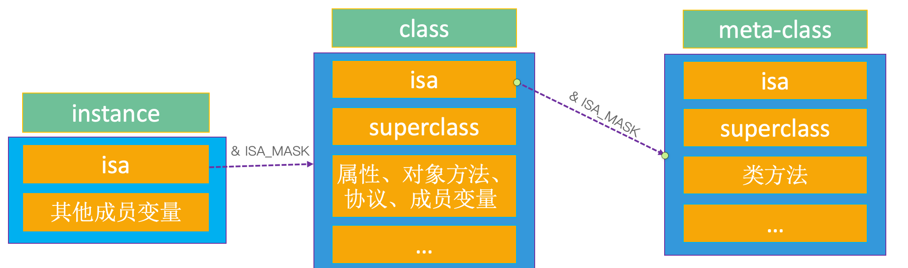

# 对象在内存中的存储底层原理

## 一、 栈、堆、BSS、数据段、代码段是什么？

栈（stack）：又称作堆栈，用来存储程序的局部变量（但不包括static声明的变量，static修饰的数据存放于数据段中）。除此之外，在函数被调用时，栈用来传递参数和返回值。

堆（heap）：用于存储程序运行中被动态分配的内存段，它的大小并不固定，可动态的扩张和缩减。操作函数(malloc／free)

BSS段（bss segment）：通常用来存储程序中未被初始化的全局变量和静态变量的一块内存区域。BSS是英文Block Started by Symbol的简称。BSS段输入静态内存分配

数据段（data segment）：通常用来存储程序中已被初始化的全局变量和静态变量和字符串的一块内存区域

代码段（code segment）：通常是指用来存储程序可执行代码的一块内存区域。这部分区域的大小在程序运行前就已经确定，并且内存区域通常属于只读，某些架构也允许代码段为可写，即允许修改程序。在代码段中，也有可能包含一些只读的常数变量，例如字符串常量。


## 二、研究下对象在内存中如何存储？

```Objective-C
Person *p1 = [Person new]
```

看这行代码，先来看几个注意点：

new底层做的事情：

* 在堆内存中申请1块合适大小的空间
* 在这块内存上根据类模版创建对象。类模版中定义了什么属性就依次把这些属性声明在对象中；对象中还存在一个属性叫做**isa**，是一个指针，指向对象所属的类在代码段中地址
* 初始化对象的属性。这里初始化有几个原则：a、如果属性的数据类型是基本数据类型则赋值为0；b、如果属性的数据类型是C语言的指针类型则赋值为NULL；c、如果属性的数据类型为OC的指针类型则赋值为nil。
* 返回堆空间上对象的地址

注意：

* 对象只有属性，没有方法。包括类本身的属性和一个指向代码段中的类isa指针
* 如何访问对象的属性？指针名-&gt;属性名；本质：根据指针名找到指针指向的对象，再根据属性名查找来访问对象的属性值
* 如何调用方法？[指针名 方法];本质：根据指针名找到指针指向的对象，再发现对象需要调用方法，再通过对象的isa指针找到代码段中的类，再调用类里面方法

为什么不把方法存储在对象中？

* 因为以类为模版创建的对象只有属性可能不相同，而方法相同，如果堆区的对象里面也保存方法的话就会很重复，浪费了堆空间，因此将方法存储与代码段

* 所以一个类创建的n个对象的isa指针的地址值都相同，都指向代码段中的类地址

做个小实验

```Objective-C
#import <Foundation/Foundation.h>
@interface Person : NSObject{
    @public
    int _age;
    NSString *_name;
    int *p;
}

-(void)sayHi;
@end

@implementation Person

-(void)sayHi{
    NSLog(@"Hi, %@",_name);
}

@end

int main(int argc, const char * argv[]) {
    Person *p1 = [Person new];
    Person *p2 = [Person new];
    Person *p3 = [Person new];
    p1->_age = 20;
    p2->_age = 20;

    [p1 sayHi];
    [p2 sayHi];
    [p3 sayHi];

    return 0;
}
```

`Person  *p1 = [Person new];` 这句代码在内存分配原理如下图所示


**结论**


**可以 看到Person类的3个对象p1、p2、p3的isa的值相同。**

## 三、一个对象占用多少内存空间？

```objectivec
size_t class_getInstanceSize(Class cls)
{
    if (!cls) return 0;
    return cls->alignedInstanceSize();
}
 // Class's ivar size rounded up to a pointer-size boundary.
uint32_t alignedInstanceSize() {
    return word_align(unalignedInstanceSize());
}
```

```objectivec
id class_createInstance(Class cls, size_t extraBytes)
{
    return _class_createInstanceFromZone(cls, extraBytes, nil);
}

static __attribute__((always_inline)) 
id
_class_createInstanceFromZone(Class cls, size_t extraBytes, void *zone, 
                              bool cxxConstruct = true, 
                              size_t *outAllocatedSize = nil)
{
    if (!cls) return nil;

    assert(cls->isRealized());

    // Read class's info bits all at once for performance
    bool hasCxxCtor = cls->hasCxxCtor();
    bool hasCxxDtor = cls->hasCxxDtor();
    bool fast = cls->canAllocNonpointer();

    size_t size = cls->instanceSize(extraBytes);
    if (outAllocatedSize) *outAllocatedSize = size;

    id obj;
    if (!zone  &&  fast) {
        obj = (id)calloc(1, size);
        if (!obj) return nil;
        obj->initInstanceIsa(cls, hasCxxDtor);
    } 
    else {
        if (zone) {
            obj = (id)malloc_zone_calloc ((malloc_zone_t *)zone, 1, size);
        } else {
            obj = (id)calloc(1, size);
        }
        if (!obj) return nil;

        // Use raw pointer isa on the assumption that they might be 
        // doing something weird with the zone or RR.
        obj->initIsa(cls);
    }

    if (cxxConstruct && hasCxxCtor) {
        obj = _objc_constructOrFree(obj, cls);
    }

    return obj;
}

size_t instanceSize(size_t extraBytes) {
    size_t size = alignedInstanceSize() + extraBytes;
    // CF requires all objects be at least 16 bytes.
    if (size < 16) size = 16;
    return size;
}
```

用2种方式获取：

- class_getInstanceSize([NSObject class]):8。返回实例对象的成员变量所占用的内存大小，一个空对象，只有 isa 指针，所以只有8字节
- malloc_size((__bridge const void *)obj):16。Apple 规定，对象至少16个字节。但是只有一个 isa，所以只占用8个字节。
  内存对齐：结构体的最终大小必须是最大成员的倍数。比如

```c
struct Person_IMPL { 
struct NSObject_IMPL NSObject_IVARS; // 8字节
 int age; // 4字节
};
```

 8*2=16字节

## 四、类继承的本质

写一个最基础的类

```objectivec
@interface Person:NSObject
@end

@implementation Person
@end
```

clang 转为 c 代码看看, `xcrun -sdk iphoneos clang -arch arm64 -rewrite-objc main.m -o main.cpp`

```c
struct NSObject_IMPL {
 Class isa;
}

struct Person_IMPL {
 struct NSObject_IMPL NSObject_IVARS;
};
```

如果创建一个继承自 Person 的 Student 类呢

```c
struct Student_IMPL {
 struct Person_IMPL Person_IVARS;
 NSInteger _age;
 NSString *_name;
};
```

首先我们可以知道一个 OC 类的属性可以写多种数据类型，那么大概率是 C 结构体实现。用 clang 转为 c 可以得到印证。另外存在类的继承关系的时候，子类结构体中第一个信息是父类结构体对象。其次是当前子类自己的信息。根节点一定是 NSObject_IMPL 结构体，且其中只有 `Class isa`

观察 clang 转换后的 c 代码，发现 property 没有看到 setter、getter 方法。为什么这么设计？
方法不会存储到实例对象中去的。因为方法在各个对象中是通用的，方法存储在类对象的方法列表中。

```objectivec
@interface Person:NSObject
{
 int _height;
 int _age;
 int _weight;
}
@end

@implementation Person
@end

struct NSObject_IMPL {
 Class isa;
};

struct PersonIMPL {
 struct NSObject_IMPL ivars;
 int _height;
 int _age;
 int _weight;
};

struct PersonIMPL person = {};
Person *p = [[Person alloc] init];
NSLog(@"%zd", class_getInstanceSize([Person class])); // 24，这个数值代表我们这个类，这个结构体，创建出来至少只需要24字节.
NSLog(@"%zd", sizeof(person)); // 24，这个数值代表我们这个类，这个结构体只需要24字节就够
NSLog(@"%zd", malloc_size((__bridge const void *)p)); // 32。iOS 系统会做优化，比如为了加速访问速度，会按照16的倍数进行分配。
```

`class_getInstanceSize`这个数值代表我们这个类，这个结构体，创建出来至少只需要24字节. `malloc_size` iOS 系统会做优化，比如为了加速访问速度，会按照16的倍数进行分配。
iOS 中，系统分配内存，都是16的倍数。pageSize？系统在分配内存的时候也存在内存对齐。
GUN 都存在内存对齐这个概念。
sizeof 是运算符。

实例对象：
类对象：isa、superclass、属性信息、对象方法信息、协议信息、成员变量信息...
元类对象：存储 isa、superclass、类方法信息...
一个实例对象只有一个类对象，一个实例对象只有一个元类对象。 `class_isMetaClass()`判断一个类是否为元类对象

`objc_getClass()` 如果传递 instance 实例对象，返回 class 类对象；传递 Class 类对象，返回 meta-class 元类对象；传递 meta-class 元对象，则返回 NSObject(基类)的 meta-class 对象



instance 的 isa 指向 Class。当调用方法时，通过 instance 的 isa 找到 Class，最后找到对象方法的实现进行调用
class 的 isa 指向 meta-class。当调用类方法的时，通过 class 的 isa 找到 meta-class，最后找到类方法进行调用。


当 Student 实例对象调用 Person 的对象方法时，首先根据 Student 对象的 isa 找到 Stduent 的 Class 类对象，然后根据 Stduent Class 类对象中的 superClass 找到 Person 的 Class 类对象，在类对象的对象方法列表中找到方法实现并调用。
当 Stduent 实例对象调用 init 方法时候，首先根据 Student 对象的 isa 找到 Stduent 的 Class 类对象，然后根据 Stduent Class 类对象中的 superClass 找到 Person 的 Class 类对象，找到 Person Claas 的 superClass 到 NSObject 类对象，在 NSObject 类对象的方法列表中找到 `init` 方法并调用。


当 Stduent 对象调用类方法的时候，先根据 isa 找到 Student 的元类对象，然后在元类对象的 superclass 找到 Person 的元类对象，再根据 Person 元类对象的 superClass 找到 NSObject 的元类对象。最后找到元类对象的方法列表，调用到对象方法。


```objectivec
@interface Student : NSObject
@end

@implementation Person
@end

@interface NSObject(TestMessage)
@end

@implementation NSObject(TestMessage)

- (void)test
{
  NSLog(@"%s", __func__);
}
@end
```

奇怪的是，我们给 Student 类对象调用 test 方法，`[Student test]` 则调用成功。是不是很奇怪？站在面向对象的角度出发，Student 类对象根据 isa 找到元对象，此时元对象方法列表中没有类对象，所以根据 superclass 找到 NSObject 元类对象，发现元类对象自身也没有类方法。但是为什么调用了 `-(void)test` 对象方法？

因为NSObject 元类对象的 superClass 继承自 NSObject 的类对象，类对象是存储对象方法的，所以定义在 NSObject 分类中的 `-(void)test` 最终会被调用。

从64位开始，iOS 的 isa 需要与 ISA_MASK 进行与位运算。& ISA_MASK 才可以得到真正的类对象地址。
为了打印和研究类对象中的 superclass、isa

```objectivec
// 实例对象
Person *p = [[Person alloc] init];
Student *s = [[Student alloc] init];
// 类对象
class pclass = object_getClass(p);
class sclass = object_getClass(s);
// Mock 系统结构体 object_class
struct mock_object_class {
  class isa;
  class superclass;
};
// 转换如下
struct mock_object_class *person = (__bridge mock_object_class *)[[Person alloc] init];
struct mock_object_class *student = (__bridge mock_object_class *)[[Student alloc] init];
```

如何查看类真正的结构？在 Xcode 中打印出来
思路：查看 Class 内部的数据，发现是 struct，所以我们自己定义一个 struct，去承接类对象的元类对象信息

```c
#import <Foundation/Foundation.h>

#ifndef MockClassInfo_h
#define MockClassInfo_h

# if __arm64__
#   define ISA_MASK        0x0000000ffffffff8ULL
# elif __x86_64__
#   define ISA_MASK        0x00007ffffffffff8ULL
# endif

#if __LP64__
typedef uint32_t mask_t;
#else
typedef uint16_t mask_t;
#endif
typedef uintptr_t cache_key_t;

struct bucket_t {
    cache_key_t _key;
    IMP _imp;
};

struct cache_t {
    bucket_t *_buckets;
    mask_t _mask;
    mask_t _occupied;
};

struct entsize_list_tt {
    uint32_t entsizeAndFlags;
    uint32_t count;
};

struct method_t {
    SEL name;
    const char *types;
    IMP imp;
};

struct method_list_t : entsize_list_tt {
    method_t first;
};

struct ivar_t {
    int32_t *offset;
    const char *name;
    const char *type;
    uint32_t alignment_raw;
    uint32_t size;
};

struct ivar_list_t : entsize_list_tt {
    ivar_t first;
};

struct property_t {
    const char *name;
    const char *attributes;
};

struct property_list_t : entsize_list_tt {
    property_t first;
};

struct chained_property_list {
    chained_property_list *next;
    uint32_t count;
    property_t list[0];
};

typedef uintptr_t protocol_ref_t;
struct protocol_list_t {
    uintptr_t count;
    protocol_ref_t list[0];
};

struct class_ro_t {
    uint32_t flags;
    uint32_t instanceStart;
    uint32_t instanceSize;  // instance对象占用的内存空间
#ifdef __LP64__
    uint32_t reserved;
#endif
    const uint8_t * ivarLayout;
    const char * name;  // 类名
    method_list_t * baseMethodList;
    protocol_list_t * baseProtocols;
    const ivar_list_t * ivars;  // 成员变量列表
    const uint8_t * weakIvarLayout;
    property_list_t *baseProperties;
};

struct class_rw_t {
    uint32_t flags;
    uint32_t version;
    const class_ro_t *ro;
    method_list_t * methods;    // 方法列表
    property_list_t *properties;    // 属性列表
    const protocol_list_t * protocols;  // 协议列表
    Class firstSubclass;
    Class nextSiblingClass;
    char *demangledName;
};

#define FAST_DATA_MASK          0x00007ffffffffff8UL
struct class_data_bits_t {
    uintptr_t bits;
public:
    class_rw_t* data() {
        return (class_rw_t *)(bits & FAST_DATA_MASK);
    }
};

/* OC对象 */
struct mock_objc_object {
    void *isa;
};

/* 类对象 */
struct mock_objc_class : mock_objc_object {
    Class superclass;
    cache_t cache;
    class_data_bits_t bits;
public:
    class_rw_t* data() {
        return bits.data();
    }

    mock_objc_class* metaClass() {
        return (mock_objc_class *)((long long)isa & ISA_MASK);
    }
};

#endif /* MockClassInfo_h */

Student *stu = [[Student alloc] init];
stu->_weight = 10;

mock_objc_class *studentClass = (__bridge mock_objc_class *)([Student class]);
mock_objc_class *personClass = (__bridge mock_objc_class *)([Person class]);

class_rw_t *studentClassData = studentClass->data();
class_rw_t *personClassData = personClass->data();

class_rw_t *studentMetaClassData = studentClass->metaClass()->data();
class_rw_t *personMetaClassData = personClass->metaClass()->data();
```

## 五、 内存对齐

Demo1

```objectivec
@interface Person : NSObject
{
    int _age;
    int _height;
}
@end

struct Person_IMPL {
    Class isa;
    int _age;
    int _height;
};

Person *person = [[Person alloc] init];
NSLog(@"%zd", malloc_size((__bridge const void *)person)); // 16
NSLog(@"%zd", sizeof(struct Person_IMPL)); // 16
```

isa 指针8字节 + int _age 4字节 + _hright 字节 = 16 字节

 Demo2

```objectivec
@interface Person : NSObject
{
    int _age;
    int _height;
    int _no;
}
@end

struct Person_IMPL {
    Class isa;
    int _age;
    int _height;
    int _no;
};

Person *person = [[Person alloc] init];
NSLog(@"%zd", malloc_size((__bridge const void *)person)); // 32
NSLog(@"%zd", sizeof(struct Person_IMPL)); // 24
```

isa 指针8字节 + int _age 4字节 + _hright 字节  + _no 4 字节 = 20 字节，因为存在内存对齐，因为结构体本身对齐内存对齐，必须为8的倍数，所以占据24个字节的内存。

结构体占据24字节，为什么运行起来后通过 `malloc_size` 得到32个字节？这个涉及到运行时内存对齐。规定 **iOS 中内存对齐以 16 的倍数为准**。

 Demo

```objectivec
void *temp = malloc(4);
NSLog(@"%zd", malloc_size(temp));
// 16
```

可以看到 malloc 申请了4个字节，但是打印却看到16个字节。

查看源码也可以出来分配内存最小是以16的倍数为基准进行分配的。

```c
#define NANO_MAX_SIZE 256 /* Buckets sized {16, 32, 48, 64, 80, 96, 112, ...} */
```