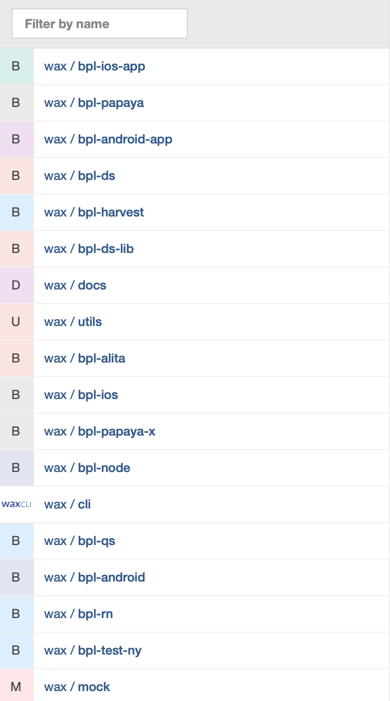

# 上架包预检

## 常见被拒原因汇总

### iOS 

钱伴

敏感词：审核、热更新、开关
1. App 内包含分发下载分发功能（比如贷款超市、引导用户下载 App 等功能）。
2. 提供的测试账号无法查看贷款实际利率。
3. notification 接口返回：showupgrade：true，提示用户升级。 审核期间接口不要返回该字段。
4. 审核账号，任何时候在任何ip登录看到的都是审核版。 
5. 审核的时候屏蔽 getwarehouseinfo 接口（tab接口）。审核期间 getwarehouseinfo 接口不返回数据。读取本地的配置
6. upgrade：签到不能展示。    方案：把现在提额页copy一份，通过审核开关控制展示哪个页面。隐藏活动入口
7. getSdkConfig 屏蔽接口返回内容。审核阶段接口返回空
8. switch字样接口
9. review字样接口

基金：
没有发版问题


挖财宝：
1. App 内部某个控件点击后跳转到了信用卡的 H5 页面，可以引导用户线下办卡
2. 提供的登陆账号和密码不对，登陆不上
3. 运营填写的营销关键字有问题
4. 元数据问题，iPhoneX 截图中 iPhone 壳子是 iPhone7 的，应该是 iPhoneX
5. 说明隐私权限的作用。

闪电公积金：
1. 苹果看到“代缴公积金”，这个需要有政府机构资质，此类功能在审核期间都关闭。


社保：
1. 修改隐私权限相关的文案，做到让审核人员看得懂


记账：
1. Guidelines 3.2.2 审核期间，隐藏邀请好友、天天挖宝相关的运营活动


信用保镖：
1. 狗年大礼包： 修改元数据后申诉；更换销售地区后提审。
  

### Android

信贷超人：
1. App 无法登陆进去，属于 bug 级别
2. App 没有适配 ipad。
3. Privacy - Data Collection and Storage，说明 App 没有做隐私权限的收集。
4. 访问 h5 页面出现问题。 属于 bug 级别

微记账：
暂无


挖财宝：

1. 原因：挖财宝集成了设备指纹SDK, 会上传用户设备安装应用列表，所以被拒.   解决：移除设备指纹SDK, 成功上架
2. 原因：挖财宝中，存在更多App按钮，会导向应用宝，所以被华为拒过，其他应用市场没有拒过. 解决：移除更多App按钮，无再被华为拒过。
  

基金：
暂未遇到审核被拒的情况。

快贷：
暂未遇到审核被拒的情况。

钱伴：
暂未遇到审核被拒的情况。

信用卡：

1. 经检测你的应用targetsdk版本低于26 ，请修改。
2. 你的应用未加固
3. 你提交的应用被检测到存在不合理获取短信/通话记录相关权限的行为，请勿获取SEND_SMS、READ_SMS、READ_CALL_LOG、RECEIVE_SMS权限。
4. 你的应用注册登录界面的《用户协议》内容空白，请添加。
5. 你的应用注册登录时无法接收验证码，注册登录时需输入图形验证码，且无图形参考，请定位修复。
6. 在你的应用内任选一款借贷产品注册点击下载应用后直接进入第三方下载渠道，请修改为华为应用市场下载链接或者直接删除应用分发模块。
7. 你的应用版权未通过审核，请提供a.《计算机软件著作权证书》或《APP电子版权证书》； b. ICP备案；c.《免责函》；d.你提供的合作协议已到期，请重新提供至少三家贷款产品合作单位的金融监管部门备案登记文件、授权书。e.请提供《金融许可证》或对应银行信用卡中心授权证明（至少三家）。免责函模板下载链接，https://url.cloud.huawei.com/1vbaVckwPC 
8. 你的应用截图与实际内容不相符，请修改。如有疑问，请发邮件至developer@huawei.com。
9. 使用了动态更新的能力。回复苹果，问具体使用的地方，并贴出代码。


只能根据政策去做，比如当前的隐私权权限问题就是政策
还有一些如理财、贷款类，没有资质就无法过审，这个也是政策。

解决方案：

苹果那边是把接口字段定义的隐晦一点。之前是定义了一个颜色值作为审核的开关
如果是对应的颜色，就开启相应功能。


## 原因汇总

从 Android 和 iOS 2端 App 被驳回的一些信息来看，驳回原因一般划分为下面几类：

1. 审核期间，资源和配置都应该调节为审核模式
2. App 包含某些关键字
3. 审核相关的元数据问题（截图与实际内容不匹配、机型和截图不匹配、提供给审核的账号和密码登陆不上）
4. 使用的隐私权限必须说明，文案描述必须清晰
5. App 存在 bug （账号无法登陆、没有适配 ipad、访问 h5 打不开  ）
6. 诱导用户打开查看更多 App
7. Android 应用未加固
8. 应用缺乏相关的资质和证书


## 方案

### 敏感词云

loan、online、ischeck、isonline、switch、review、审核、热更新、开关、代缴公积金

扫描是基于源代码出发的扫描的
1. 关键词词云在什么阶段分析，构建前、构建后？
   放在构建前进行。因为需要对敏感词划分等级，如果是 error 级别，则在扫描构建的时候匹配，匹配任意一个则马上构建失败；如果是 warning 级别，则需要在构建完成后展示出来。
2. 词云要不要分等级，比如 error、warning。
   遇到 error 构建马上停止；waring 的话给出警告 console
3. 私有 api 要不要扫描，扫描的话怎么做？
   性质和关键词一样。做到一个 yml 文件里面。然后用正则将一堆关键词和每个代码文件进行匹配。
4. 私有 api 是做 top 100 呢？还是 top 50，还是全部的？
   私有 api 扫描要做，将私有 api 打包到关键词 yml 文件中。所以本质上还是字符串查找的问题。
5. 私有 api 要不要设置开关，让打包的人选择要不要扫描私有 api
   不做关键词扫描的场景目前没想到，所以最好是每个打包都需要做关键词扫描。

测试实验：
NodeJS 实现： 9个铭感词语、代码文件5967个，耗时3.5秒


## 技术方案

1. 业务线需要自定义敏感词云（因为每条业务线的关键词云都不一样）
2. 敏感词需要划分等级：error、warning。扫描到 error 需要马上停止构建，并提示「已扫描到你的源码中存在敏感词***，可能存在提交审核失败的可能，请修改后再次构建」。warning 的情况不需要马上停止构建，等任务全部结束后汇总给出提示「已扫描到你的源码中存在敏感词***、***...，可能存在提交审核失败的可能，请开发者自己确认」
3. 铭感词云的格式。scaner.yml 文件。
   - error: 数组的格式。后面写需要扫描的关键词，且等级为 error，表示扫描到 error 则马上停止构建
   - warning：数组的格式。后面写需要扫描的关键词，且等级为 warning，扫描结果不影响构建，最终只是展示出来
   - searchPath：字符串格式。可以让业务线自定义需要进行扫描的路径。
   - fileType：数组格式。可以让业务线自定义需要扫描的文件类型。默认为 `sh|pch|json|xcconfig|mm|cpp|h|m`
   - warningkeywordsScan：布尔值。业务线可以设置是否需要扫描 warning 级别的关键词。
   - errorKeywordsScan：布尔值。业务线可以设置是否需要扫描 error 级别的关键词。
   ```
    error:
      - checkSwitch
    warning:
      - loan
      - online
      - ischeck
    searchPath:
      ../fixtures
    fileType:
      - h
      - m
      - cpp
      - mm
      - js
    warningkeywordsScan:
      true
    errorKeywordsScan:
      true
   ```
4. iOS 端存在私有 api 的情况，Android 端不存在该问题
   私有 api 70111个文件，每个文件假设10个方法，则共70万个 api。所以计划找出 top 100.去扫描匹配，支持业务线是否开启的选项
5. 利用 NodeJS 实现关键词预审能力，wax cli 调度各个模版的能力实现相应的功能，所以要做的事情就是找到相应的时机去编码实现相应的需求。几个问题需要确认？包预检需要放在构建的什么阶段？需要不需要设置关键词的等级？需要不需要设置关键词扫描的文件路径？需要不需要支持自定义文件匹配类型？

其实这些问题都是业界标准的做法，肯定需要预留这样的能力，所以自定义规则的格式可以查看上面 yml 文件的各个字段所确定。明确了做什么事，以及做事情的标准，那就可以很快的开展并落地实现。


<details>

<summary>点击展开代码</summary>

```javascript
'use strict'

const { Error, logger } = require('@wac/wax-utils')
const fs = require('fs-extra')
const glob = require('glob')
const YAML = require('yamljs')

module.exports = class PreBuildCommand {
  constructor(ctx) {
    this.ctx = ctx
    this.projectPath = ''
    this.fileNum = 0
    this.isExist = false
    this.errorFiles = []
    this.warningFiles = []
    this.keywordsObject = {}
    this.errorReg = null
    this.warningReg = null
    this.warningkeywordsScan = false
    this.errorKeywordsScan = false
    this.scanFileTypes = ''
  }

  async fetchCodeFiles(dirPath, fileType = 'sh|pch|json|xcconfig|mm|cpp|h|m') {
    return new Promise((resolve, reject) => {
      glob(`**/*.?(${fileType})`, { root: dirPath, cwd: dirPath, realpath: true }, (err, files) => {
        if (err) reject(err)
        resolve(files)
      })
    })
  }

  async scanConfigurationReader(keywordsPath) {
    return new Promise((resolve, reject) => {
      fs.readFile(keywordsPath, 'UTF-8', (err, data) => {
        if (!err) {
          let keywords = YAML.parse(data)
          resolve(keywords)
        } else {
          reject(err)
        }
      })
    })
  }

  async run() {
    const { argv } = this.ctx
    const buildParam = {
      scheme: argv.opts.scheme,
      cert: argv.opts.cert,
      env: argv.opts.env
    }

    // 处理包关键词扫描（敏感词汇 + 私有 api）
    this.keywordsObject = (await this.scanConfigurationReader(this.ctx.cwd + '/.scaner.yml')) || {}
    this.warningkeywordsScan = this.keywordsObject.warningkeywordsScan || false
    this.errorKeywordsScan = this.keywordsObject.errorKeywordsScan || false
    if (Array.isArray(this.keywordsObject.fileType)) {
      this.scanFileTypes = this.keywordsObject.fileType.join('|')
    }
    if (Array.isArray(this.keywordsObject.error)) {
      this.errorReg = this.keywordsObject.error.join('|')
    }
    if (Array.isArray(this.keywordsObject.warning)) {
      this.warningReg = this.keywordsObject.warning.join('|')
    }

    // 从指定目录下获取所有文件
    this.projectPath = this.keywordsObject ? this.keywordsObject.searchPath : this.ctx.cwd
    const files = await this.fetchCodeFiles(this.projectPath, this.scanFileTypes)

    if (this.errorReg && this.errorKeywordsScan) {
      await Promise.all(
        files.map(async file => {
          try {
            const content = await fs.readFile(file, 'utf-8')
            const result = await content.match(new RegExp(`(${this.errorReg})`, 'g'))
            if (result) {
              if (result.length > 0) {
                this.isExist = true
                this.fileNum++
                this.errorFiles.push(
                  `编号: ${this.fileNum}, 所在文件: ${file},  出现次数: ${result &&
                    (result.length || 0)}`
                )
              }
            }
          } catch (error) {
            throw error
          }
        })
      )
    }

    if (this.errorFiles.length > 0) {
      throw new Error(
        `从你的项目中扫描到了 error 级别的敏感词，建议你修改方法名称、属性名、方法注释、文档描述。\n敏感词有 「${
          this.errorReg
        }」\n存在问题的文件有 ${JSON.stringify(this.errorFiles, null, 2)}`
      )
    }

    // warning
    if (this.warningReg && !this.isExist && this.fileNum === 0 && this.warningkeywordsScan) {
      await Promise.all(
        files.map(async file => {
          try {
            const content = await fs.readFile(file, 'utf-8')
            const result = await content.match(new RegExp(`(${this.warningReg})`, 'g'))
            if (result) {
              if (result.length > 0) {
                this.isExist = true
                this.fileNum++
                this.warningFiles.push(
                  `编号: ${this.fileNum}, 所在文件: ${file},  出现次数: ${result &&
                    (result.length || 0)}`
                )
              }
            }
          } catch (error) {
            throw error
          }
        })
      )

      if (this.warningFiles.length > 0) {
        logger.info(
          `从你的项目中扫描到了 warning 级别的敏感词，建议你修改方法名称、属性名、方法注释、文档描述。\n敏感词有 「${
            this.warningReg
          }」。有问题的文件有${JSON.stringify(this.warningFiles, null, 2)}`
        )
      }
    }

    for (const key in buildParam) {
      if (!buildParam[key]) {
        throw new Error(`build: ${key} 参数缺失`)
      }
    }
  }
}
```

</details>


## wax ？
公司自研工具 wax 是「一站式协同开发利器，重新定义混合开发」。包含若干子项目，每个子项目就是所谓的 “**模版**”，每个模版其实就是一个 Node 工程，一个 npm 模块，主要负责以下功能：

- 特定项目类型的目录结构
- 自定义命令供开发、构建等使用
- 模版持续更新及 patch 等

按照 iOS 端 `pod install` 这个过程，cocoapods 为我们预留了钩子：`PreInstallHook.rb`、`PostInstallHook.rb`，允许我们在不同的阶段为工程做一些自定义的操作，所以我们的 iOS 模版设计也参考了这个思想，在打包构建前、构建中、构建后提供了钩子：`prebuild`、`build`、`postbuild`。定位好了问题，要做的就是在 prebuild 里面进行关键词扫描的编码工作。




