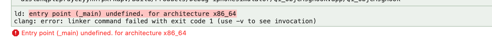

# __asm__ 重命名符号

> 最近看到 __asm__ ，所以在自己简单实验下，有了本文。


## 探索

1. 实验1
```c
#import <Foundation/Foundation.h>【爬sw

int age __asm__("objc_age") = 25;

void foo(void) __asm__("@杭城小刘");
void foo (void) {
    printf("Hello world\n");
}

int main(int argc, const char * argv[]) {
    foo();
    return 0;
}
```

在 foo 方法里面下断点，见下图


可以看到，`foo` 方法的 symbol 被变为 `@杭城小刘`，变量 `age` 被变为 `objc_age`。

2. 实验2
```objective-c
#import "AppDelegate.h"

int main(int argc, char * argv[]) __asm__("mook_main");
int main(int argc, char * argv[]) {
    NSString * appDelegateClassName;
    @autoreleasepool {
        // Setup code that might create autoreleased objects goes here.
        appDelegateClassName = NSStringFromClass([AppDelegate class]);
    }
    return UIApplicationMain(argc, argv, nil, appDelegateClassName);
}
```



可以看到 App 工程主入口函数 `main` 函数，想修改为 `mook_main`。但是报错 `ld: entry point (_main) undefined. fir architecture x86_64`

当把 `main` 函数修改为 `_main` 发现成功。


## 应用

鉴于 __asm__ 可以修改 symbol 名称，那么我们可以给工程做混淆。

等待深入研究后继续更新...


## 引用

- [Assembler labels](http://infocenter.arm.com/help/index.jsp?topic=/com.arm.doc.dui0491f/Cacgegch.html)
