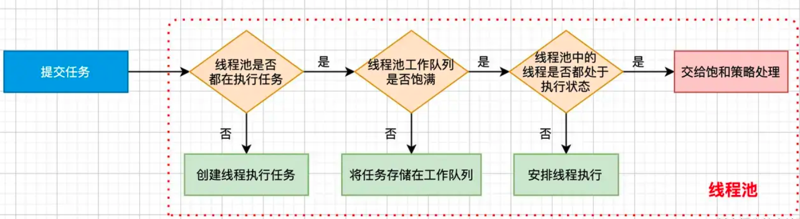

# GCD 源码探究

## 基础知识

Mach 是 XNU 的核心，被 BSD 层包装。XNU 由以下部分组成：

- Mach 内核：
  - 进程和线程抽象
  - 虚拟内存管理
  - 任务调度
  - 进程间通信和消息传递机制
- BSD
  - UNIX 进程模型
  - POSIX 线程模型
  - 网络协议栈
  - 文件系统访问
  - 设备访问
- libKern
- I/O Kit

Mach的独特之处在于选择了通过消息传递的方式实现对象与对象之间的通信。而其他架构一个对象要访问另一个对象需要通过一个大家都知道的接口，而Mach对象不能直接调用另一个对象，而是必须传递消息

一条消息就像网络包一样，定义为透明的 `blob(binary larger object`，二进制大对象)，通过固定的包头进行分装

```c++
typedef struct
{
        mach_msg_header_t       header;
        mach_msg_body_t         body;
} mach_msg_base_t;

typedef struct 
{
  mach_msg_bits_t   msgh_bits; // 消息头标志位
  mach_msg_size_t   msgh_size; // 大小
  mach_port_t       msgh_remote_port; // 目标(发消息)或源(接消息)
  mach_port_t       msgh_local_port; // 源(发消息)或目标(接消息)
  mach_port_name_t  msgh_voucher_port;
  mach_msg_id_t     msgh_id; // 唯一id
} mach_msg_header_t;
```


Mach消息的发送和接收都是通过同一个API函数`mach_msg()`进行的。这个函数在用户态和内核态都有实现。为了实现消息的发送和接收，`mach_msg()`函数调用了一个Mach陷阱(trap)。Mach陷阱就是Mach中和系统调用等同的概念。在用户态调用mach_msg_trap()会引发陷阱机制，切换到内核态，在内核态中，内核实现的`mach_msg()`会完成实际的工作。这个函数也将会在下面的源码分析中遇到。

每一个`BSD`进程都在底层关联一个`Mach`任务对象，因为`Mach`提供的都是非常底层的抽象，提供的API从设计上讲很基础且不完整，所以需要在这之上提供一个更高的层次以实现完整的功能。我们开发层遇到的进程和线程就是BSD层对`Mach`的任务和线程的复杂包装。

进程填充的是线程，而线程是二进制代码的实际执行单元。用户态的线程始于对`pthread_create`的调用。这个函数的又由`bsdthread_create`系统调用完成，而`bsdthread_create`又其实是`Mach`中的`thread_create`的复杂包装，说到底真正的线程创建还是有Mach层完成。

在`UNIX`中，进程不能被创建出来，都是通过fork()系统调用复制出来的。复制出来的进程都会被要加载的执行程序覆盖整个内存空间。

接着，了解下常用的宏和常用的数据结构


## 源码中常见的宏

### __builtin_expect

这个其实是个函数，针对编译器优化的一个函数，后面几个宏是对这个函数的封装，所以提前拎出来说一下。写代码中我们经常会遇到条件判断语句

```objective-c
if (今天是工作日) {
    printf("好好上班");
} else {
    printf("好好睡觉");
}
```

CPU读取指令的时候并非一条一条的来读，而是多条一起加载进来，比如已经加载了if(今天是工作日) printf(“好好上班”);的指令，这时候条件式如果为非，也就是非工作日，那么CPU继续把printf(“好好睡觉”);这条指令加载进来，这样就造成了性能浪费的现象。
`__builtin_expect`的第一个参数是实际值，第二个参数是预测值。使用这个目的是告诉编译器if条件式是不是有更大的可能被满足。


### likely、unlikely

这个宏后其实是对 `__builtin_expect` 封装，likely表示更大可能成立，`unlikely`表示更大可能不成立。

```c++
#define likely(x) __builtin_expect(!!(x), 1)
#define unlikely(x) __builtin_expect(!!(x), 0)
```

遇到 `if(likely(a == 0))` 理解成 `if(a==0)` 即可。


### fastpath、slowpath

`fastpath` 表示更大可能成立，`slowpath` 表示更大可能不成立

```c++
#define fastpath(x) ((typeof(x))__builtin_expect(_safe_cast_to_long(x), ~0l))
#define slowpath(x) ((typeof(x))__builtin_expect(_safe_cast_to_long(x), 0l))
```

### os_atomic_cmpxchg

其内部就是 `atomic_compare_exchange_strong_explicit` 函数，这个函数的作用是：第二个参数与第一个参数值比较，如果相等，第三个参数的值替换第一个参数的值。如果不相等，把第一个参数的值赋值到第二个参数上

```c++
#define os_atomic_cmpxchg(p, e, v, m) \
        ({ _os_atomic_basetypeof(p) _r = (e); \
        atomic_compare_exchange_strong_explicit(_os_atomic_c11_atomic(p), \
        &_r, v, memory_order_##m, memory_order_relaxed); })
```


### os_atomic_store2o

将第二个参数，保存到第一个参数

```
#define os_atomic_store2o(p, f, v, m)  os_atomic_store(&(p)->f, (v), m)
#define os_atomic_store(p, v, m) \
      atomic_store_explicit(_os_atomic_c11_atomic(p), v, memory_order_##m)
```


### os_atomic_inc_orig

将1保存到第一个参数中

```
#define os_atomic_inc_orig(p, m)  os_atomic_add_orig((p), 1, m)
#define os_atomic_add_orig(p, v, m) _os_atomic_c11_op_orig((p), (v), m, add, +)
#define _os_atomic_c11_op_orig(p, v, m, o, op) \
        atomic_fetch_##o##_explicit(_os_atomic_c11_atomic(p), v, \
        memory_order_##m)
```


## 源码中的数据结构

### dispatch_queue_t

```objective-c
typedef struct dispatch_queue_s *dispatch_queue_t;
```

`dispatch_queue_t` 是一个结构体指针

```objective-c
struct dispatch_queue_s {
    _DISPATCH_QUEUE_HEADER(queue);
    DISPATCH_QUEUE_CACHELINE_PADDING; 
} DISPATCH_ATOMIC64_ALIGN;
```

解开 `_DISPATCH_QUEUE_HEADER` 后发现又一个 `DISPATCH_OBJECT_HEADER` 宏定义，继续拆解.

还有一层宏 `_DISPATCH_OBJECT_HEADER`

```c++
#define _DISPATCH_QUEUE_HEADER(x) \
    struct os_mpsc_queue_s _as_oq[0]; \
    DISPATCH_OBJECT_HEADER(x); \
    _OS_MPSC_QUEUE_FIELDS(dq, dq_state); \
    uint32_t dq_side_suspend_cnt; \
    dispatch_unfair_lock_s dq_sidelock; \
    union { \
        dispatch_queue_t dq_specific_q; \
        struct dispatch_source_refs_s *ds_refs; \
        struct dispatch_timer_source_refs_s *ds_timer_refs; \
        struct dispatch_mach_recv_refs_s *dm_recv_refs; \
    }; \
    DISPATCH_UNION_LE(uint32_t volatile dq_atomic_flags, \
        const uint16_t dq_width, \
        const uint16_t __dq_opaque \
    ); \
    DISPATCH_INTROSPECTION_QUEUE_HEADER
    

#define DISPATCH_OBJECT_HEADER(x) \
    struct dispatch_object_s _as_do[0]; \
    _DISPATCH_OBJECT_HEADER(x)
```

`##` 可以理解为拼接成字符串，比如 x 为 group 的话，下面就会拼接为 dispatch_group

```c++
#define _DISPATCH_OBJECT_HEADER(x) \
    struct _os_object_s _as_os_obj[0]; \
    OS_OBJECT_STRUCT_HEADER(dispatch_##x); \
    struct dispatch_##x##_s *volatile do_next; \
    struct dispatch_queue_s *do_targetq; \
    void *do_ctxt; \
    void *do_finalizer
```


来到`OS_OBJECT_STRUCT_HEADER`之后，我们需要注意一个成员变量，记住这个成员变量名字叫做`do_vtable`。再继续拆解`_OS_OBJECT_HEADER`发现里面起就是一个`isa`指针和引用计数一些信息。

```objective-c
#define OS_OBJECT_STRUCT_HEADER(x) \
    _OS_OBJECT_HEADER(\
    const void *_objc_isa, \
    do_ref_cnt, \
    do_xref_cnt); \
    // 注意这个成员变量，后面将任务Push到队列就是通过这个变量
    const struct x##_vtable_s *do_vtable

#define _OS_OBJECT_HEADER(isa, ref_cnt, xref_cnt) \
        isa; /* must be pointer-sized */ \
        int volatile ref_cnt; \
        int volatile xref_cnt
```


### dispatch_continuation_t

结构体就是用来封装 block 对象的，保存 block的上下文环境和执行函数等。

```c++
typedef struct dispatch_continuation_s {
    struct dispatch_object_s _as_do[0];
    DISPATCH_CONTINUATION_HEADER(continuation);
} *dispatch_continuation_t;
```

看下里面的宏: `DISPATCH_CONTINUATION_HEADER`

```c++
#define DISPATCH_CONTINUATION_HEADER(x) \
    union { \
        const void *do_vtable; \
        uintptr_t dc_flags; \
    }; \
    union { \
        pthread_priority_t dc_priority; \
        int dc_cache_cnt; \
        uintptr_t dc_pad; \
    }; \
    struct dispatch_##x##_s *volatile do_next; \
    struct voucher_s *dc_voucher; \
    dispatch_function_t dc_func; \
    void *dc_ctxt; \
    void *dc_data; \
    void *dc_other
```

###  dispatch_function_t

`dispatch_function_t `只是一个函数指针

```c++
typedef void (*dispatch_function_t)(void *_Nullable);
```


## 死锁

死锁堆栈报错：`_dispatch_sync_f_slow` 


## dispatch_queue_create

创建队列，其内部又调用了 `_dispatch_queue_create_with_targe`t函数，`DISPATCH_TARGET_QUEUE_DEFAULT` 这个宏其实就是null

```objective-c
dispatch_queue_t dispatch_queue_create(const char *label, dispatch_queue_attr_t attr)
    {   // attr一般我们都是传DISPATCH_QUEUE_SERIAL、DISPATCH_QUEUE_CONCURRENT或者nil
        // 而DISPATCH_QUEUE_SERIAL其实就是null
        return _dispatch_queue_create_with_target(label, attr,
                DISPATCH_TARGET_QUEUE_DEFAULT, true);
    }
```

`_dispatch_queue_create_with_target`函数，这里会创建一个`root`队列,并将自己新建的队列绑定到所对应的`root`队列上。

```
static dispatch_queue_t _dispatch_queue_create_with_target(const char *label, dispatch_queue_attr_t dqa,
        dispatch_queue_t tq, bool legacy)
{   // 根据上文代码注释里提到的，作者认为调用者传入DISPATCH_QUEUE_SERIAL和nil的几率要大于传DISPATCH_QUEUE_CONCURRENT。所以这里设置个默认值。
    // 这里怎么理解呢？只要看做if(!dqa)即可
    if (!slowpath(dqa)) {
        // _dispatch_get_default_queue_attr里面会将dqa的dqa_autorelease_frequency指定为DISPATCH_AUTORELEASE_FREQUENCY_INHERIT的，inactive也指定为false。这里就不展开了，只需要知道赋了哪些值。因为后面会用到。
        dqa = _dispatch_get_default_queue_attr();
    } else if (dqa->do_vtable != DISPATCH_VTABLE(queue_attr)) {
        DISPATCH_CLIENT_CRASH(dqa->do_vtable, "Invalid queue attribute");
    }

    // 取出优先级
    dispatch_qos_t qos = _dispatch_priority_qos(dqa->dqa_qos_and_relpri);

    // overcommit单纯从英文理解表示过量使用的意思，那这里这个overcommit就是一个标识符，表示是不是就算负荷很高了，但还是得给我新开一个线程出来给我执行任务。
    _dispatch_queue_attr_overcommit_t overcommit = dqa->dqa_overcommit;
    if (overcommit != _dispatch_queue_attr_overcommit_unspecified && tq) {
        if (tq->do_targetq) {
            DISPATCH_CLIENT_CRASH(tq, "Cannot specify both overcommit and "
                    "a non-global target queue");
        }
    }

    // 如果overcommit没有被指定
    if (overcommit == _dispatch_queue_attr_overcommit_unspecified) {
         // 所以对于overcommit，如果是串行的话默认是开启的，而并行是关闭的
        overcommit = dqa->dqa_concurrent ?
                _dispatch_queue_attr_overcommit_disabled :
                _dispatch_queue_attr_overcommit_enabled;
    }

    // 之前说过初始化队列默认传了DISPATCH_TARGET_QUEUE_DEFAULT，也就是null，所以进入if语句。
    if (!tq) {
        // 获取一个管理自己队列的root队列。
        tq = _dispatch_get_root_queue(
                qos == DISPATCH_QOS_UNSPECIFIED ? DISPATCH_QOS_DEFAULT : qos,
                overcommit == _dispatch_queue_attr_overcommit_enabled);
        if (slowpath(!tq)) {
            DISPATCH_CLIENT_CRASH(qos, "Invalid queue attribute");
        }
    }

    // legacy默认是true的
    if (legacy) {
        // 之前说过，默认是会给dqa_autorelease_frequency指定为DISPATCH_AUTORELEASE_FREQUENCY_INHERIT，所以这个判断式是成立的
        if (dqa->dqa_inactive || dqa->dqa_autorelease_frequency) {
            legacy = false;
        }
    }

    // vtable变量很重要，之后会被赋值到之前说的dispatch_queue_t结构体里的do_vtable变量上
    const void *vtable;
    dispatch_queue_flags_t dqf = 0;
    
    // legacy变为false了
    if (legacy) {
        vtable = DISPATCH_VTABLE(queue);
    } else if (dqa->dqa_concurrent) {
        // 如果创建队列的时候传了DISPATCH_QUEUE_CONCURRENT，就是走这里
        vtable = DISPATCH_VTABLE(queue_concurrent);
    } else {
        // 如果创建线程没有指定为并行队列，无论你传DISPATCH_QUEUE_SERIAL还是nil，都会创建一个串行队列。
        vtable = DISPATCH_VTABLE(queue_serial);
    }

    if (label) {
        // 判断传进来的字符串是否可变的，如果可变的copy成一份不可变的
        const char *tmp = _dispatch_strdup_if_mutable(label);
        if (tmp != label) {
            dqf |= DQF_LABEL_NEEDS_FREE;
            label = tmp;
        }
    }

    // _dispatch_object_alloc里面就将vtable赋值给do_vtable变量上了。
    dispatch_queue_t dq = _dispatch_object_alloc(vtable,
            sizeof(struct dispatch_queue_s) - DISPATCH_QUEUE_CACHELINE_PAD);
    // 第三个参数根据是否并行队列，如果不是则最多开一个线程，如果是则最多开0x1000 - 2个线程，这个数量很惊人了已经,换成十进制就是（4096 - 2）个。
    // dqa_inactive之前说串行是false的
    // DISPATCH_QUEUE_ROLE_INNER 也是0，所以这里串行队列的话dqa->dqa_state是0
    _dispatch_queue_init(dq, dqf, dqa->dqa_concurrent ?
            DISPATCH_QUEUE_WIDTH_MAX : 1, DISPATCH_QUEUE_ROLE_INNER |
            (dqa->dqa_inactive ? DISPATCH_QUEUE_INACTIVE : 0));

    dq->dq_label = label;
#if HAVE_PTHREAD_WORKQUEUE_QOS
    dq->dq_priority = dqa->dqa_qos_and_relpri;
    if (overcommit == _dispatch_queue_attr_overcommit_enabled) {
        dq->dq_priority |= DISPATCH_PRIORITY_FLAG_OVERCOMMIT;
    }
#endif
    _dispatch_retain(tq);
    if (qos == QOS_CLASS_UNSPECIFIED) {
        _dispatch_queue_priority_inherit_from_target(dq, tq);
    }
    if (!dqa->dqa_inactive) {
        _dispatch_queue_inherit_wlh_from_target(dq, tq);
    }
    // 自定义的queue的目标队列是root队列
    dq->do_targetq = tq;
    _dispatch_object_debug(dq, "%s", __func__);
    return _dispatch_introspection_queue_create(dq);
}
```

这个函数里面还是有几个重要的地方拆出来看下:

首先是创建一个 `root` 队列 `_dispatch_get_root_queue` 函数。取`root`队列，一般是从一个装有12个`root`队列数组里面取

```c++
static inline dispatch_queue_t
_dispatch_get_root_queue(dispatch_qos_t qos, bool overcommit)
{
    if (unlikely(qos == DISPATCH_QOS_UNSPECIFIED || qos > DISPATCH_QOS_MAX)) {
        DISPATCH_CLIENT_CRASH(qos, "Corrupted priority");
    }
    return &_dispatch_root_queues[2 * (qos - 1) + overcommit];
}
```

看下这个`_dispatch_root_queues`数组。我们可以看到，每一个优先级都有对应的`root`队列，每一个优先级又分为是不是可以过载的队列。

```c++
struct dispatch_queue_s _dispatch_root_queues[] = {
#define _DISPATCH_ROOT_QUEUE_IDX(n, flags) \
    ((flags & DISPATCH_PRIORITY_FLAG_OVERCOMMIT) ? \
        DISPATCH_ROOT_QUEUE_IDX_##n##_QOS_OVERCOMMIT : \
        DISPATCH_ROOT_QUEUE_IDX_##n##_QOS)
#define _DISPATCH_ROOT_QUEUE_ENTRY(n, flags, ...) \
    [_DISPATCH_ROOT_QUEUE_IDX(n, flags)] = { \
        DISPATCH_GLOBAL_OBJECT_HEADER(queue_root), \
        .dq_state = DISPATCH_ROOT_QUEUE_STATE_INIT_VALUE, \
        .do_ctxt = &_dispatch_root_queue_contexts[ \
                _DISPATCH_ROOT_QUEUE_IDX(n, flags)], \
        .dq_atomic_flags = DQF_WIDTH(DISPATCH_QUEUE_WIDTH_POOL), \
        .dq_priority = _dispatch_priority_make(DISPATCH_QOS_##n, 0) | flags | \
                DISPATCH_PRIORITY_FLAG_ROOTQUEUE | \
                ((flags & DISPATCH_PRIORITY_FLAG_DEFAULTQUEUE) ? 0 : \
                DISPATCH_QOS_##n << DISPATCH_PRIORITY_OVERRIDE_SHIFT), \
        __VA_ARGS__ \
    }
    _DISPATCH_ROOT_QUEUE_ENTRY(MAINTENANCE, 0,
        .dq_label = "com.apple.root.maintenance-qos",
        .dq_serialnum = 4,
    ),
    _DISPATCH_ROOT_QUEUE_ENTRY(MAINTENANCE, DISPATCH_PRIORITY_FLAG_OVERCOMMIT,
        .dq_label = "com.apple.root.maintenance-qos.overcommit",
        .dq_serialnum = 5,
    ),
    _DISPATCH_ROOT_QUEUE_ENTRY(BACKGROUND, 0,
        .dq_label = "com.apple.root.background-qos",
        .dq_serialnum = 6,
    ),
    _DISPATCH_ROOT_QUEUE_ENTRY(BACKGROUND, DISPATCH_PRIORITY_FLAG_OVERCOMMIT,
        .dq_label = "com.apple.root.background-qos.overcommit",
        .dq_serialnum = 7,
    ),
    _DISPATCH_ROOT_QUEUE_ENTRY(UTILITY, 0,
        .dq_label = "com.apple.root.utility-qos",
        .dq_serialnum = 8,
    ),
    _DISPATCH_ROOT_QUEUE_ENTRY(UTILITY, DISPATCH_PRIORITY_FLAG_OVERCOMMIT,
        .dq_label = "com.apple.root.utility-qos.overcommit",
        .dq_serialnum = 9,
    ),
    _DISPATCH_ROOT_QUEUE_ENTRY(DEFAULT, DISPATCH_PRIORITY_FLAG_DEFAULTQUEUE,
        .dq_label = "com.apple.root.default-qos",
        .dq_serialnum = 10,
    ),
    _DISPATCH_ROOT_QUEUE_ENTRY(DEFAULT,
            DISPATCH_PRIORITY_FLAG_DEFAULTQUEUE | DISPATCH_PRIORITY_FLAG_OVERCOMMIT,
        .dq_label = "com.apple.root.default-qos.overcommit",
        .dq_serialnum = 11,
    ),
    _DISPATCH_ROOT_QUEUE_ENTRY(USER_INITIATED, 0,
        .dq_label = "com.apple.root.user-initiated-qos",
        .dq_serialnum = 12,
    ),
    _DISPATCH_ROOT_QUEUE_ENTRY(USER_INITIATED, DISPATCH_PRIORITY_FLAG_OVERCOMMIT,
        .dq_label = "com.apple.root.user-initiated-qos.overcommit",
        .dq_serialnum = 13,
    ),
    _DISPATCH_ROOT_QUEUE_ENTRY(USER_INTERACTIVE, 0,
        .dq_label = "com.apple.root.user-interactive-qos",
        .dq_serialnum = 14,
    ),
    _DISPATCH_ROOT_QUEUE_ENTRY(USER_INTERACTIVE, DISPATCH_PRIORITY_FLAG_OVERCOMMIT,
        .dq_label = "com.apple.root.user-interactive-qos.overcommit",
        .dq_serialnum = 15,
    ),
};
```

其中 `DISPATCH_GLOBAL_OBJECT_HEADER(queue_root)`，解析到最后是 `OSdispatch##name##_class` 这样的，对应的实例对象是如下代码，指定了`root`队列各个操作对应的函数

```c++
DISPATCH_VTABLE_SUBCLASS_INSTANCE(queue_root, queue,
    .do_type = DISPATCH_QUEUE_GLOBAL_ROOT_TYPE,
    .do_kind = "global-queue",
    .do_dispose = _dispatch_pthread_root_queue_dispose,
    .do_push = _dispatch_root_queue_push,
    .do_invoke = NULL,
    .do_wakeup = _dispatch_root_queue_wakeup,
    .do_debug = dispatch_queue_debug,
);
```


## dispatch_group_t

### dispatch_group_t 本质

```c++
dispatch_queue_t group1 = dispatch_group_create();
```

下断点后可以看到 `dispatch_group_create` 是位于 `libdispatch.dylib` 库中的。


打开 `libdispatch.dylib` 搜索 `dispatch_group_create`。可以看到源码实现。

```c++
DISPATCH_ALWAYS_INLINE
static inline dispatch_group_t
_dispatch_group_create_with_count(uint32_t n)
{
	dispatch_group_t dg = _dispatch_object_alloc(DISPATCH_VTABLE(group),
			sizeof(struct dispatch_group_s));
	dg->do_next = DISPATCH_OBJECT_LISTLESS;
	dg->do_targetq = _dispatch_get_default_queue(false);
	if (n) {
		os_atomic_store(&dg->dg_bits,
				(uint32_t)-n * DISPATCH_GROUP_VALUE_INTERVAL, relaxed);
		_dispatch_retain(dg); // <rdar://22318411>
	}
	return dg;
}
```

`dispatch_group_create` 调用 `_dispatch_group_create_with_count`, `_dispatch_group_create_with_count` 调用 `_dispatch_object_alloc`，有2个参数：`DISPATCH_VTABLE(group)` 和 `sizeof(struct dispatch_group_s)` 


在汇编调试模式下，对其打印输出，对于 x86 架构的汇编，第一个参数存放在 rdi，第二个参数存放在 rsi 中。

第一个参数值就是 `OS_dispatch_group`，用来声明当前类的名称。第二个参数其实就是 dispatch_group_t 的内存大小，为72字节。


汇编代码继续向下执行，输入 si，最后到 `_os_object_alloc_realized` 的地方。通过汇编可以看到内部调用了 `class_createInstance` 一看就是在做内存分配的事情。

然后顺着源码看看，左侧可以看到内部就是调用 `calloc` 分配的内存。


那 `dispatch_group_t` 是什么就很明显了。和 id 一样，是一个结构体指针。

- id 是 `objc_object` 结构体指针

- `dispatch_group_t` 是 `dispatch_group_s` 结构体指针

```objective-c
struct dispatch_group_s *dispatch_group_t

typedef struct dispatch_group_s *dispatch_group_t;

struct dispatch_group_s {
	DISPATCH_OBJECT_HEADER(group);
	DISPATCH_UNION_LE(uint64_t volatile dg_state,
			uint32_t dg_bits,
			uint32_t dg_gen
	) DISPATCH_ATOMIC64_ALIGN;
	struct dispatch_continuation_s *volatile dg_notify_head;
	struct dispatch_continuation_s *volatile dg_notify_tail;
};
```


### dispatch_group_enter

对 `dispach_group_enter` 下断点，可以看到如下图


一进断点就查看寄存器的值，因为 dispatch_group_enter 函数就一个参数，所以直接读取寄存器 rdi 的值，可以看到就是 `dispatch_group_t` 对象。其中 count 为0.

```c++
void
dispatch_group_enter(dispatch_group_t dg)
{
	// The value is decremented on a 32bits wide atomic so that the carry
	// for the 0 -> -1 transition is not propagated to the upper 32bits.
	uint32_t old_bits = os_atomic_sub_orig(&dg->dg_bits,
			DISPATCH_GROUP_VALUE_INTERVAL, acquire);
	uint32_t old_value = old_bits & DISPATCH_GROUP_VALUE_MASK;
	if (unlikely(old_value == 0)) {
		_dispatch_retain(dg); // <rdar://problem/22318411>
	}
	if (unlikely(old_value == DISPATCH_GROUP_VALUE_MAX)) {
		DISPATCH_CLIENT_CRASH(old_bits,
				"Too many nested calls to dispatch_group_enter()");
	}
}
```

当经过第6行汇编后继续查看，可以发现其 count 的值已经加1了。

`unlikely`是一个宏，用于指示编译器这个条件分支不太可能发生，从而优化代码。

这行代码检查操作前的引用计数是否为0。如果是0，说明这是第一次进入调度组，需要增加调度组的引用计数。


### dispatch_group_leave

与 `dispatch_group_enter` 成对存在。一个 +1，一个-1

```c++
void
dispatch_group_leave(dispatch_group_t dg)
{
	// The value is incremented on a 64bits wide atomic so that the carry for
	// the -1 -> 0 transition increments the generation atomically.
	uint64_t new_state, old_state = os_atomic_add_orig(&dg->dg_state,
			DISPATCH_GROUP_VALUE_INTERVAL, release);
	uint32_t old_value = (uint32_t)(old_state & DISPATCH_GROUP_VALUE_MASK);

	if (unlikely(old_value == DISPATCH_GROUP_VALUE_1)) {
		old_state += DISPATCH_GROUP_VALUE_INTERVAL;
		do {
			new_state = old_state;
			if ((old_state & DISPATCH_GROUP_VALUE_MASK) == 0) {
				new_state &= ~DISPATCH_GROUP_HAS_WAITERS;
				new_state &= ~DISPATCH_GROUP_HAS_NOTIFS;
			} else {
				// If the group was entered again since the atomic_add above,
				// we can't clear the waiters bit anymore as we don't know for
				// which generation the waiters are for
				new_state &= ~DISPATCH_GROUP_HAS_NOTIFS;
			}
			if (old_state == new_state) break;
		} while (unlikely(!os_atomic_cmpxchgv(&dg->dg_state,
				old_state, new_state, &old_state, relaxed)));
		return _dispatch_group_wake(dg, old_state, true);
	}

	if (unlikely(old_value == 0)) {
		DISPATCH_CLIENT_CRASH((uintptr_t)old_value,
				"Unbalanced call to dispatch_group_leave()");
	}
}
```

``if (unlikely(old_value == DISPATCH_GROUP_VALUE_1))` ：这行代码检查操作前的引用计数是否为1，这意味着如果这次调用后引用计数变为0，表示所有任务都已完成

可以看到内部，当所有任务都已完成，调用 `_dispatch_group_wake` 唤醒等待调度组的线程。


### dispatch_group_notify

```c++
DISPATCH_ALWAYS_INLINE
static inline void
_dispatch_group_notify(dispatch_group_t dg, dispatch_queue_t dq,
		dispatch_continuation_t dsn)
{
	dsn->dc_data = dq;
	dsn->do_next = NULL;
	_dispatch_retain(dq);
  // 更新链表，将新的任务放到链表尾部
	if (os_mpsc_push_update_tail(dg, dg_notify, dsn, do_next)) {
		_dispatch_retain(dg);
		os_atomic_store2o(dg, dg_notify_head, dsn, ordered);
		// seq_cst with atomic store to notify_head <rdar://problem/11750916>
    // 取出 dg_value,和0比较。等于0，则说明没有要执行的任务了，则唤醒
		if (os_atomic_load2o(dg, dg_value, ordered) == 0) {
			_dispatch_group_wake(dg, false);
		}
	}
}
```

它用于设置一个通知，当一个调度组（`dispatch_group_t`）中的所有任务完成时，会执行 `_dispatch_group_wake`

```c++
DISPATCH_NOINLINE
static long
_dispatch_group_wake(dispatch_group_t dg, bool needs_release)
{
	dispatch_continuation_t next, head, tail = NULL;
	long rval;

	// cannot use os_mpsc_capture_snapshot() because we can have concurrent
	// _dispatch_group_wake() calls
  // 原子性的存取操作，取出 head
	head = os_atomic_xchg2o(dg, dg_notify_head, NULL, relaxed);
	if (head) {
    // 有 head，则取出尾部
		// snapshot before anything is notified/woken <rdar://problem/8554546>
		tail = os_atomic_xchg2o(dg, dg_notify_tail, NULL, release);
	}
  // 调用 dispatch_group_wait 函数阻塞的任务
	rval = (long)os_atomic_xchg2o(dg, dg_waiters, 0, relaxed);
	if (rval) {
		// wake group waiters
		_dispatch_sema4_create(&dg->dg_sema, _DSEMA4_POLICY_FIFO);
		_dispatch_sema4_signal(&dg->dg_sema, rval);
	}
	uint16_t refs = needs_release ? 1 : 0; // <rdar://problem/22318411>
	if (head) {
		// async group notify blocks
		do {
			next = os_mpsc_pop_snapshot_head(head, tail, do_next);
			dispatch_queue_t dsn_queue = (dispatch_queue_t)head->dc_data;
      // 循环内，在目标队列执行任务
			_dispatch_continuation_async(dsn_queue, head);
			_dispatch_release(dsn_queue);
		} while ((head = next));
		refs++;
	}
	if (refs) _dispatch_release_n(dg, refs);
	return 0;
}
```


### dispatch_group_wait


```c++
long
dispatch_group_wait(dispatch_group_t dg, dispatch_time_t timeout)
{
	if (dg->dg_value == 0) {
		return 0;
	}
	if (timeout == 0) {
		return _DSEMA4_TIMEOUT();
	}
	return _dispatch_group_wait_slow(dg, timeout);
}


DISPATCH_NOINLINE
static long
_dispatch_group_wait_slow(dispatch_group_t dg, dispatch_time_t timeout)
{
	long value;
	int orig_waiters;

	// check before we cause another signal to be sent by incrementing
	// dg->dg_waiters
	value = os_atomic_load2o(dg, dg_value, ordered); // 19296565
	if (value == 0) {
		return _dispatch_group_wake(dg, false);
	}

	(void)os_atomic_inc2o(dg, dg_waiters, relaxed);
	// check the values again in case we need to wake any threads
	value = os_atomic_load2o(dg, dg_value, ordered); // 19296565
	if (value == 0) {
		_dispatch_group_wake(dg, false);
		// Fall through to consume the extra signal, forcing timeout to avoid
		// useless setups as it won't block
		timeout = DISPATCH_TIME_FOREVER;
	}

	_dispatch_sema4_create(&dg->dg_sema, _DSEMA4_POLICY_FIFO);
	switch (timeout) {
	default:
		if (!_dispatch_sema4_timedwait(&dg->dg_sema, timeout)) {
			break;
		}
		// Fall through and try to undo the earlier change to
		// dg->dg_waiters
	case DISPATCH_TIME_NOW:
		orig_waiters = dg->dg_waiters;
		while (orig_waiters) {
			if (os_atomic_cmpxchgvw2o(dg, dg_waiters, orig_waiters,
					orig_waiters - 1, &orig_waiters, relaxed)) {
				return _DSEMA4_TIMEOUT();
			}
		}
		// Another thread is running _dispatch_group_wake()
		// Fall through and drain the wakeup.
	case DISPATCH_TIME_FOREVER:
		_dispatch_sema4_wait(&dg->dg_sema);
		break;
	}
	return 0;
}
```

主要是根据信号量来处理 wait 逻辑。


## 线程

线程的生命周期分为5种：新建 -> 就绪 -> 运行  -> 阻塞 -> 死亡


- 新建：使用 `new` 实例化一个线程对象，但该线程对象还未使用 `start()` 方法启动线程这个阶段，该阶段只在内存的堆中为该对象的实例变量分配了内存空间，但线程还**无法参与抢夺CPU的使用权**
- 就绪：一个线程对象调用 `start()` 方法将线程加入到 **可调度线程池**，同时也变成就绪状态，等待 CPU 来调度执行
- 运行：当 CPU 开始调度处于就绪状态的线程时，此时线程才是真正执行，进入运行状态。线程要想进入运行状态，必须要进入就绪状态。运行状态和就绪状态会来回切换，是 CPU 调度的结果。
- 阻塞：处于运行中的线程，由于某种原因（sleep、等待同步锁、从可调度线程池移除等），会进入阻塞状态。比如 `sleepUntilDate`、`synchronized` 等 api 可使线程进入阻塞状态
- 死亡：
  - 正常死亡：线程执行完毕
  - 非正常死亡：当线程因异常而退出，或调用 `exit`


## 可调度线程池



有新任务过来，会先判断线程池是否都在执行任务：

- 如果没有，则会创建线程执行任务
- 如果都在执行，就会检查工作队列是否饱满：
  - 如果没有饱满，则会将任务存储在工作队列
  - 如果饱满，则会判断线程是否处于执行状态
    - 如果没有，则安排非核心线程去执行
    - 如果都在执行状态，则交给**饱和策略**去处理


## 饱和策略

- `AbortPolicy`： 直接抛出 `RejectedExecutionExeception` 异常来阻止系统正常运行
- `CallerRunsPolicy`：将任务回退到调用者
- `DisOldestPolicy`：丢掉等待最久的任务
- `DisCardPolicy`：直接丢弃任务


## 优先级

`IO密集型` 的线程特点是频繁等待，而 `CPU密集型` 则很少等待，所以`CPU密集型`的优先级要高，但优先级提高后也不一定执行，只是比低优先级的线程更可能运行。

可以通过 `NSThread` 中的 `setThreadPriority:`，或 `POSIX` 的 `pthread_setschedparam` 方法来设置优先级


## 队列

GCD 有12个队列。

```c++
struct dispatch_queue_global_s _dispatch_root_queues[] = {
#define _DISPATCH_ROOT_QUEUE_IDX(n, flags) \
		((flags & DISPATCH_PRIORITY_FLAG_OVERCOMMIT) ? \
		DISPATCH_ROOT_QUEUE_IDX_##n##_QOS_OVERCOMMIT : \
		DISPATCH_ROOT_QUEUE_IDX_##n##_QOS)
#define _DISPATCH_ROOT_QUEUE_ENTRY(n, flags, ...) \
	[_DISPATCH_ROOT_QUEUE_IDX(n, flags)] = { \
		DISPATCH_GLOBAL_OBJECT_HEADER(queue_global), \
		.dq_state = DISPATCH_ROOT_QUEUE_STATE_INIT_VALUE, \
		.do_ctxt = _dispatch_root_queue_ctxt(_DISPATCH_ROOT_QUEUE_IDX(n, flags)), \
		.dq_atomic_flags = DQF_WIDTH(DISPATCH_QUEUE_WIDTH_POOL), \
		.dq_priority = flags | ((flags & DISPATCH_PRIORITY_FLAG_FALLBACK) ? \
				_dispatch_priority_make_fallback(DISPATCH_QOS_##n) : \
				_dispatch_priority_make(DISPATCH_QOS_##n, 0)), \
		__VA_ARGS__ \
	}
	_DISPATCH_ROOT_QUEUE_ENTRY(MAINTENANCE, 0,
		.dq_label = "com.apple.root.maintenance-qos",
		.dq_serialnum = 4,
	),
	_DISPATCH_ROOT_QUEUE_ENTRY(MAINTENANCE, DISPATCH_PRIORITY_FLAG_OVERCOMMIT,
		.dq_label = "com.apple.root.maintenance-qos.overcommit",
		.dq_serialnum = 5,
	),
	_DISPATCH_ROOT_QUEUE_ENTRY(BACKGROUND, 0,
		.dq_label = "com.apple.root.background-qos",
		.dq_serialnum = 6,
	),
	_DISPATCH_ROOT_QUEUE_ENTRY(BACKGROUND, DISPATCH_PRIORITY_FLAG_OVERCOMMIT,
		.dq_label = "com.apple.root.background-qos.overcommit",
		.dq_serialnum = 7,
	),
	_DISPATCH_ROOT_QUEUE_ENTRY(UTILITY, 0,
		.dq_label = "com.apple.root.utility-qos",
		.dq_serialnum = 8,
	),
	_DISPATCH_ROOT_QUEUE_ENTRY(UTILITY, DISPATCH_PRIORITY_FLAG_OVERCOMMIT,
		.dq_label = "com.apple.root.utility-qos.overcommit",
		.dq_serialnum = 9,
	),
	_DISPATCH_ROOT_QUEUE_ENTRY(DEFAULT, DISPATCH_PRIORITY_FLAG_FALLBACK,
		.dq_label = "com.apple.root.default-qos",
		.dq_serialnum = 10,
	),
	_DISPATCH_ROOT_QUEUE_ENTRY(DEFAULT,
			DISPATCH_PRIORITY_FLAG_FALLBACK | DISPATCH_PRIORITY_FLAG_OVERCOMMIT,
		.dq_label = "com.apple.root.default-qos.overcommit",
		.dq_serialnum = 11,
	),
	_DISPATCH_ROOT_QUEUE_ENTRY(USER_INITIATED, 0,
		.dq_label = "com.apple.root.user-initiated-qos",
		.dq_serialnum = 12,
	),
	_DISPATCH_ROOT_QUEUE_ENTRY(USER_INITIATED, DISPATCH_PRIORITY_FLAG_OVERCOMMIT,
		.dq_label = "com.apple.root.user-initiated-qos.overcommit",
		.dq_serialnum = 13,
	),
	_DISPATCH_ROOT_QUEUE_ENTRY(USER_INTERACTIVE, 0,
		.dq_label = "com.apple.root.user-interactive-qos",
		.dq_serialnum = 14,
	),
	_DISPATCH_ROOT_QUEUE_ENTRY(USER_INTERACTIVE, DISPATCH_PRIORITY_FLAG_OVERCOMMIT,
		.dq_label = "com.apple.root.user-interactive-qos.overcommit",
		.dq_serialnum = 15,
	),
};
```


- userInteractive、default、unspecified、userInitiated、utility 6个，他们的 overcommit 版本6个。 支持 overcommit 的队列在创建队列时无论系统是否有足够的资源都会重新开一个线程。 

  串行队列和主队列是 overcommit 的，创建队列会创建1个新的线程。并行队列是非 overcommit 的，不一定会新建线程，会从线程池中的 64 个线程中获取并使用。

- 优先级 `userInteractive > default > unspecified > userInitiated > utility > background`

- 全局队列是root队列。

一个队列最多64个线程同时工作。


其实我们平时用到的全局队列也是其中一个root队列，这个只要查看 `dispatch_get_global_queue`

```c++
dispatch_queue_global_t
dispatch_get_global_queue(intptr_t priority, uintptr_t flags)
{
	dispatch_assert(countof(_dispatch_root_queues) ==
			DISPATCH_ROOT_QUEUE_COUNT);

	if (flags & ~(unsigned long)DISPATCH_QUEUE_OVERCOMMIT) {
		return DISPATCH_BAD_INPUT;
	}
	dispatch_qos_t qos = _dispatch_qos_from_queue_priority(priority);
#if !HAVE_PTHREAD_WORKQUEUE_QOS
	if (qos == QOS_CLASS_MAINTENANCE) {
		qos = DISPATCH_QOS_BACKGROUND;
	} else if (qos == QOS_CLASS_USER_INTERACTIVE) {
		qos = DISPATCH_QOS_USER_INITIATED;
	}
#endif
	if (qos == DISPATCH_QOS_UNSPECIFIED) {
		return DISPATCH_BAD_INPUT;
	}
	return _dispatch_get_root_queue(qos, flags & DISPATCH_QUEUE_OVERCOMMIT);
}
```


## 线程池

共两个线程池。一个是主线程池，另一个是除了主线程池之外的线程池。


## 奇葩问题

### 滥用单例之dispatch_once死锁

遇到一个神奇的 crash，堆栈如下

```objective-c
Application Specific Information:
com.***.*** failed to scene-create in time

Elapsed total CPU time (seconds): hhh秒 (user hhh, system 0.000), k% CPU
Elapsed application CPU time (seconds): 0.h秒, k% CPU

Thread 0 name:  Dispatch queue: com.apple.main-thread
Thread 0:
0   libsystem_kernel.dylib            0x36cb2540 semaphore_wait_trap + 8
1   libsystem_platform.dylib          0x36d3d430 _os_semaphore_wait + 8
2   libdispatch.dylib                 0x36be04a6 dispatch_once_f + 250
3   xxxx                              偏移量 0x4000 + 947290
// ...
```

重点关注 `com.xxx.yyy failed to scene-create in time`，这句话提示我们：我们的应用程序在：**规定的时间没能加载成功，无法显示。看起来这个原因是启动加载过长直接被干掉**。那么问题来了，原因具体是啥？

复现 Demo 

```objective-c
@implementation ManagerA
+ (ManageA *)sharedInstance {
    static ManagerA *manager = nil;
    static dispatch_once_t token;
    dispatch_once(&token, ^{
        manager = [[ManagerA alloc] init];
    });
    return manager;
}

- (instancetype)init {
    if (self = [super init]) {
        [ManagerB sharedInstance];
    }
    return self;
}
@end

@implementation ManagerB
+ (ManageB *)sharedInstance {
    static ManagerB *manager = nil;
    static dispatch_once_t token;
    dispatch_once(&token, ^{
        manager = [[ManagerB alloc] init];
    });
    return manager;
}

- (instancetype)init {
    if (self = [super init]) {
        [ManagerA sharedInstance];
    }
    return self;
}
```

crash 堆栈如下

```shell
#0    0x000000011054acd2 in semaphore_wait_trap ()
#1    0x00000001101b1b1a in _dispatch_thread_semaphore_wait ()
#2    0x00000001101b1d48 in dispatch_once_f ()
#3    0x000000010d01c857 in _dispatch_once [inlined] at once.h:68
#4    0x000000010d01c839 in +[ManageA sharedInstance] at ManageA.m:18
#5    0x000000010d01cad8 in -[ManageB init] at ManageA.m:54
#6    0x000000010d01ca42 in __25+[ManageB sharedInstance]_block_invoke at ManageA.m:44
#7    0x00000001101c649b in _dispatch_client_callout ()
#8    0x00000001101b1e28 in dispatch_once_f ()
#9    0x000000010d01c9e7 in _dispatch_once [inlined] at once.h:68
#10    0x000000010d01c9c9 in +[ManageB sharedInstance] at ManageA.m:43
#11    0x000000010d01c948 in -[ManageA init] at ManageA.m:29
#12    0x000000010d01c8b2 in __25+[ManageA sharedInstance]_block_invoke at ManageA.m:19
#13    0x00000001101c649b in _dispatch_client_callout ()
#14    0x00000001101b1e28 in dispatch_once_f ()
#15    0x000000010d01c857 in _dispatch_once [inlined] at once.h:68
#16    0x000000010d01c839 in +[ManageA sharedInstance] at /ManageA.m:18
#17    0x000000010d01c5cc in -[AppDelegate application:didFinishLaunchingWithOptions:]         at /AppDelegate.m:21
```

嫌疑点： `sharedInstance` 和 `dispatch_once_f` 多次出现。查阅之后发现 `dispatch_once_f` 函数造成了信号量永久等待，从而死锁。为什么 dispatch_once 会死锁，难道单例写法不是安全的？

查看 dispatch_once 源码（libdispatch，剔除注释部分）

```c++
#include "internal.h"

#undef dispatch_once
#undef dispatch_once_f

struct _dispatch_once_waiter_s {
    volatile struct _dispatch_once_waiter_s *volatile dow_next;
    _dispatch_thread_semaphore_t dow_sema;
};

#define DISPATCH_ONCE_DONE ((struct _dispatch_once_waiter_s *)~0l)

#ifdef __BLOCKS__
// 1. 我们的应用程序调用的入口
void
dispatch_once(dispatch_once_t *val, dispatch_block_t block)
{
    struct Block_basic *bb = (void *)block;

    // 2. 内部逻辑
    dispatch_once_f(val, block, (void *)bb->Block_invoke);
}
#endif

DISPATCH_NOINLINE
void
dispatch_once_f(dispatch_once_t *val, void *ctxt, dispatch_function_t func)
{
#if !DISPATCH_ONCE_INLINE_FASTPATH
	if (likely(os_atomic_load(val, acquire) == DLOCK_ONCE_DONE)) {
		return;
	}
#endif // !DISPATCH_ONCE_INLINE_FASTPATH
	return dispatch_once_f_slow(val, ctxt, func);
}

// 通过包装token作为唯一标识，判断（v == DLOCK_ONCE_DONE）是否已经完成初始化，实际就是判断是否调用过block（func内部调用）。如果已经初始化完成，那么v == DLOCK_ONCE_DONE，直接返回；如果还未初始化完成则往下走。

DISPATCH_NOINLINE
void
dispatch_once_f(dispatch_once_t *val, void *ctxt, dispatch_function_t func)
{
    struct _dispatch_once_waiter_s * volatile *vval =
            (struct _dispatch_once_waiter_s**)val;

    // 3. 地址类似于简单的哨兵位
    struct _dispatch_once_waiter_s dow = { NULL, 0 };

    // 4. 在Dispatch_Once的block执行期进入的dispatch_once_t更改请求的链表
    struct _dispatch_once_waiter_s *tail, *tmp;

    // 5.局部变量，用于在遍历链表过程中获取每一个在链表上的更改请求的信号量
    _dispatch_thread_semaphore_t sema;

    // 6. Compare and Swap（用于首次更改请求）
    if (dispatch_atomic_cmpxchg(vval, NULL, &dow)) {
        dispatch_atomic_acquire_barrier();

        // 7.调用dispatch_once的block
        _dispatch_client_callout(ctxt, func);

        dispatch_atomic_maximally_synchronizing_barrier();
        //dispatch_atomic_release_barrier(); // assumed contained in above

        // 8. 更改请求成为DISPATCH_ONCE_DONE(原子性的操作)
        tmp = dispatch_atomic_xchg(vval, DISPATCH_ONCE_DONE);
        tail = &dow;

        // 9. 发现还有更改请求，继续遍历
        while (tail != tmp) {

            // 10. 如果这个时候tmp的next指针还没更新完毕，等一会
            while (!tmp->dow_next) {
                _dispatch_hardware_pause();
            }

            // 11. 取出当前的信号量，告诉等待者，我这次更改请求完成了，轮到下一个了
            sema = tmp->dow_sema;
            tmp = (struct _dispatch_once_waiter_s*)tmp->dow_next;
            _dispatch_thread_semaphore_signal(sema);
        }
    } else {
        // 12. 非首次请求，进入这块逻辑块
        dow.dow_sema = _dispatch_get_thread_semaphore();
        for (;;) {
            // 13. 遍历每一个后续请求，如果状态已经是Done，直接进行下一个
            // 同时该状态检测还用于避免在后续wait之前，信号量已经发出(signal)造成
            // 的死锁
            tmp = *vval;
            if (tmp == DISPATCH_ONCE_DONE) {
                break;
            }
            dispatch_atomic_store_barrier();
            // 14. 如果当前dispatch_once执行的block没有结束，那么就将这些
            // 后续请求添加到链表当中
            if (dispatch_atomic_cmpxchg(vval, tmp, &dow)) {
                dow.dow_next = tmp;
                _dispatch_thread_semaphore_wait(dow.dow_sema);
            }
        }
        _dispatch_put_thread_semaphore(dow.dow_sema);
    }
}
```

分析：

- dispatch_once 并不是只执行1次那么简单

- dispatch_once 本质上可以接受多次请求，会对此维护一个请求链表

- 如果在 block 执行期间，多次进入调用同类的 dispatch_once 函数（即单例函数）会导致整体链表无限增长，造成永久性死锁。事实上只要进入2次就有问题，原因是 block_invoke 的完成依赖于第二次进入的请求的完成，而第二次请求的完成又必须依赖于之前信号量的出发。可是第一次 block 不结束，信号量就不会发出。（block调用完成之后通过_dispatch_once_gate_broadcast广播通知初始化完成，把v标记为DLOCK_ONCE_DONE，并释放锁。

  如果block正在调用，有其他线程进来，这时候它们尝试获取锁失败，进入等待状态。等到第一次进来初始化完成之后发出广播，它们收到消息立即返回。

- 有时候，启动耗时是因为占用了太多的CPU资源。但是从我们的 Crash Log 中可以发现，我们仅仅占用了**Elapsed application CPU time (seconds): 0.h秒, k% CPU**。通过这个，我们也可以发现，CPU 占用率高并不是导致启动阶段 App Crash 的唯一原因

在单例使用上：

- 仅仅使用一次的模块，可以不使用单例，可以采用在对应的周期内维护成员实例变量进行替换
- 和状态无关的模块，可以采用静态（类）方法直接替换
- 可以通过页面跳转进行依赖注入的模块，可以采用依赖注入或者变量传递等方式解决

当然，的确有一些情况我们仍然需要使用单例。那在这种情况，也请将 `dispatch_once` 调用的 block 内减少尽可能多的任务，最好是仅仅负责初始化，剩下的配置、调用等等在后续进行。比如先 `sharedInstance`，得到对象后再调用 `defaultConfiguration` 方法。


## dispatch_after

用来延迟执行代码。类似NSTimer。需要注意的是：dispatch_after 方法并不是在指定时间之后才开始执行任务，而是在指定时间之后将任务追加到主队列中。


