# block 底层原理

> 大家写 OC 肯定用过不少 block。有这样4个问题：
>
> - block 原理是什么，系统是如何实现的？
> - __block 的作用是什么？
> - block 作为属性时，为什么用 copu 修饰？
> - block 在修改 NSMutableArray 的时候，需要加 __block 吗？
>
> 带着问题探究本文。


## block 本质探索

### 实验探索

Demo

```objective-c
NSInteger age = 27;
    void(^block)(NSInteger, NSInteger) = ^(NSInteger a, NSInteger b) {
        NSLog(@"age is %zd", age);
        NSLog(@"a is %zd, b is %zd", a, b);
    };
    block(1, 2);
```

用指令`xcrun --sdk iphoneos clang -arch arm64 ViewController.m -rewrite-objc -o ViewController-arm64.cpp` 转为 c++

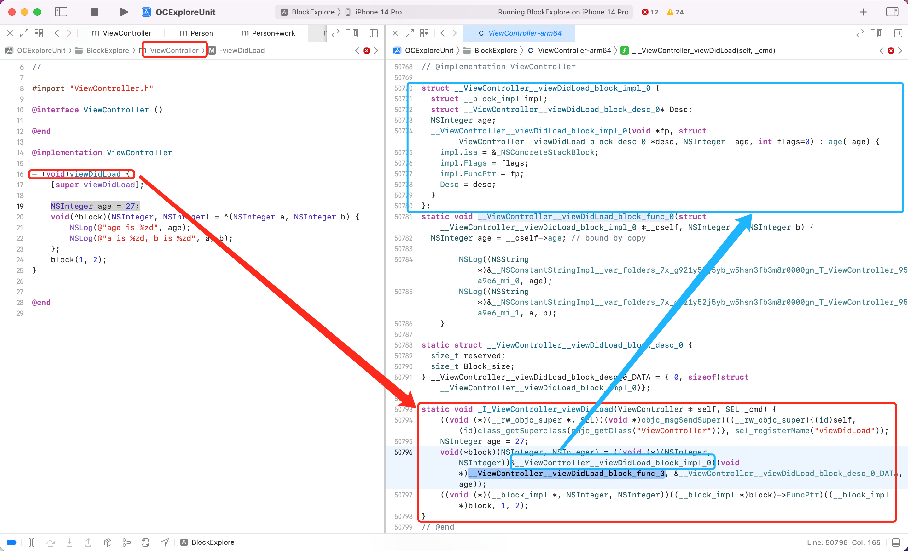

`ViewController.m` 的 `viewDidLoad` 函数为 `_I_ViewController_viewDidLoad`

```c
static void _I_ViewController_viewDidLoad(ViewController * self, SEL _cmd) {
    ((void (*)(__rw_objc_super *, SEL))(void *)objc_msgSendSuper)((__rw_objc_super){(id)self, (id)class_getSuperclass(objc_getClass("ViewController"))}, sel_registerName("viewDidLoad"));
    NSInteger age = 27;
    void(*block)(NSInteger, NSInteger) = ((void (*)(NSInteger, NSInteger))&__ViewController__viewDidLoad_block_impl_0((void *)__ViewController__viewDidLoad_block_func_0, &__ViewController__viewDidLoad_block_desc_0_DATA, age));
    ((void (*)(__block_impl *, NSInteger, NSInteger))((__block_impl *)block)->FuncPtr)((__block_impl *)block, 1, 2);
}
```

block 被定义为一个叫做 `__ViewController__viewDidLoad_block_impl_0` 的结构体

```c++
struct __ViewController__viewDidLoad_block_impl_0 {
  struct __block_impl impl;
  struct __ViewController__viewDidLoad_block_desc_0* Desc;
  NSInteger age;
  __ViewController__viewDidLoad_block_impl_0(void *fp, struct __ViewController__viewDidLoad_block_desc_0 *desc, NSInteger _age, int flags=0) : age(_age) {
    impl.isa = &_NSConcreteStackBlock;
    impl.Flags = flags;
    impl.FuncPtr = fp;
    Desc = desc;
  }
};

struct __block_impl {
  void *isa;
  int Flags;
  int Reserved;
  void *FuncPtr;
};
```

因为 `__block_impl` 结构体位于 `__ViewController__viewDidLoad_block_impl_0` 结构体的第一个成员，所以上述代码等价于 

```c++
struct __ViewController__viewDidLoad_block_impl_0 {
  void *isa;
  int Flags;
  int Reserved;
  void *FuncPtr;
  struct __ViewController__viewDidLoad_block_desc_0* Desc;
  NSInteger age;
  __ViewController__viewDidLoad_block_impl_0(void *fp, struct __ViewController__viewDidLoad_block_desc_0 *desc, NSInteger _age, int flags=0) : age(_age) {
    impl.isa = &_NSConcreteStackBlock;
    impl.Flags = flags;
    impl.FuncPtr = fp;
    Desc = desc;
  }
};
```

block 内部的 NSLog 语句，被封装为 `__ViewController__viewDidLoad_block_func_0` 结构体

```c++
static void __ViewController__viewDidLoad_block_func_0(struct __ViewController__viewDidLoad_block_impl_0 *__cself, NSInteger a, NSInteger b) {
  NSInteger age = __cself->age; // bound by copy

        NSLog((NSString *)&__NSConstantStringImpl__var_folders_7x_g921y52j5yb_w5hsn3fb3m8r0000gn_T_ViewController_95a9e6_mi_0, age);
        NSLog((NSString *)&__NSConstantStringImpl__var_folders_7x_g921y52j5yb_w5hsn3fb3m8r0000gn_T_ViewController_95a9e6_mi_1, a, b);
    }

__ViewController__viewDidLoad_block_impl_0(void *fp, struct __ViewController__viewDidLoad_block_desc_0 *desc, NSInteger _age, int flags=0) : age(_age) {
    impl.isa = &_NSConcreteStackBlock;
    impl.Flags = flags;
    impl.FuncPtr = fp;
    Desc = desc;
  }
```

可以看到构造函数 `__ViewController__viewDidLoad_block_impl_0` 有4个参数。

第一个参数：

在 `viewDidLoad` 中，`__ViewController__viewDidLoad_block_func_0` 当作构造函数 `__ViewController__viewDidLoad_block_impl_0` 的参数，传递给了参数 fp，构造函数内部将 fp 赋值给了 impl 的 FuncPtr。在

```c++
((void (*)(__block_impl *, NSInteger, NSInteger))((__block_impl *)block)->FuncPtr)((__block_impl *)block, 1, 2);
```

最后在 viewDidLoad 函数中通过结构体 impl 的成员 FuncPtr，调用了函数。

第二个参数：

`__ViewController__viewDidLoad_block_desc_0_DATA` 可以看成是一个 block 信息的描述，占用了  `sizeof(struct __ViewController__viewDidLoad_block_impl_0)` 大小的空间。

```c++
static struct __ViewController__viewDidLoad_block_desc_0 {
  size_t reserved;
  size_t Block_size;
} __ViewController__viewDidLoad_block_desc_0_DATA = { 0, sizeof(struct __ViewController__viewDidLoad_block_impl_0)
```


QA：

```c++
((void (*)(__block_impl *, NSInteger, NSInteger))((__block_impl *)block)->FuncPtr)((__block_impl *)block, 1, 2);
```

为什么 `block->FuncPtr` 可以直接访问，而不是 block 先访问 impl，再访问 FuncPtr？因为  __block_impl 就是 __main_block_impl_0 这个结构体的第一个变量地址（结构体特性）

上述的代码，等价于 `block->impl.FuncPtr`

```c
struct __block_impl {
  void *isa;
  int Flags;
  int Reserved;
  void *FuncPtr;
};
```

类似于下面代码

```c++
struct __main_block_impl_0 {
  void *isa;
  int Flags;
  int Reserved;
  void *FuncPtr;
  struct __main_block_desc_0* Desc;
  int age;
  __main_block_impl_0(void *fp, struct __main_block_desc_0 *desc, int _age, int flags=0) : age(_age) {
    impl.isa = &_NSConcreteStackBlock;
    impl.Flags = flags;
    impl.FuncPtr = fp;
    Desc = desc;
  }
}; 
```

通过 clang 转为 c++ 分析后，知道了 block 的本质，然后自定义结构体，mock 对象去承载 block 信息，然后查看

```objective-c
struct __block_impl {
  void *isa;
  int Flags;
  int Reserved;
  void *FuncPtr;
};

struct __ViewController__viewDidLoad_block_impl_0 {
  struct __block_impl impl;
  struct __ViewController__viewDidLoad_block_desc_0* Desc;
  NSInteger age;
};

struct __ViewController__viewDidLoad_block_desc_0 {
  size_t reserved;
  size_t Block_size;
};

- (void)viewDidLoad {
    [super viewDidLoad];
    
    NSInteger age = 27;
    void(^block)(NSInteger, NSInteger) = ^(NSInteger a, NSInteger b) {
        NSLog(@"age is %zd", age);
        NSLog(@"a is %zd, b is %zd", a, b);
    };
    block(1, 2);
    
    struct __ViewController__viewDidLoad_block_impl_0 *mockBlock = (__bridge struct __ViewController__viewDidLoad_block_impl_0 *)block;
    NSLog(@"");
}
```

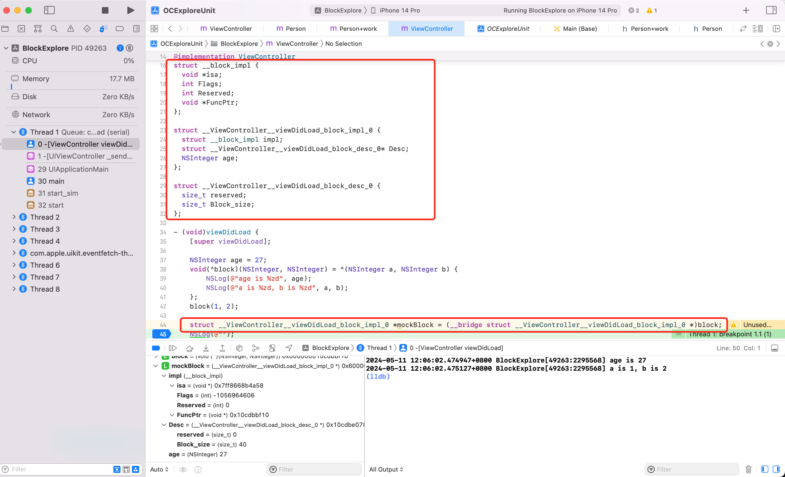


### 结论

通过探索发现：

- block 本质上就是一个 oc 对象，也有 isa 指针

- block 是封装了函数调用和函数调用环境的 OC 对象


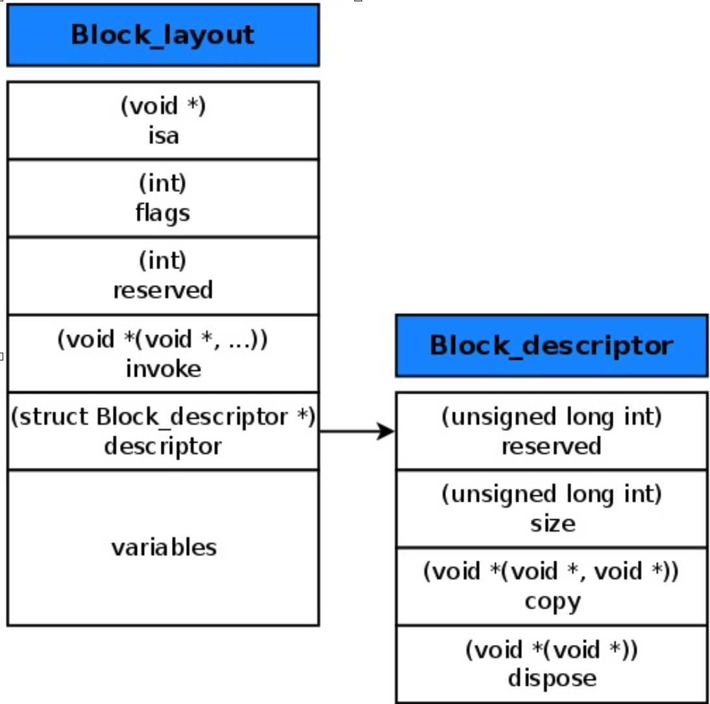


## block 变量捕获

### auto 变量捕获

Demo1：

一个最简单的 block，参数和返回值都是 void，内部仅一条打印语句。

```objective-c
void(^printBlock)(void) = ^ {
    NSLog(@"Hello block");
};
printBlock();
```

用 `xcrun --sdk iphoneos clang -arch arm64 ViewController.m -rewrite-objc -o ViewController-arm64.cpp` 转换为 c++

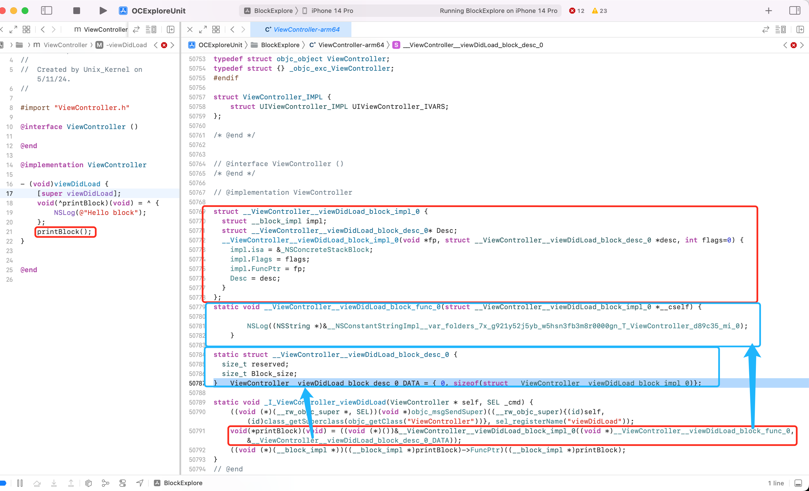

概括如下：

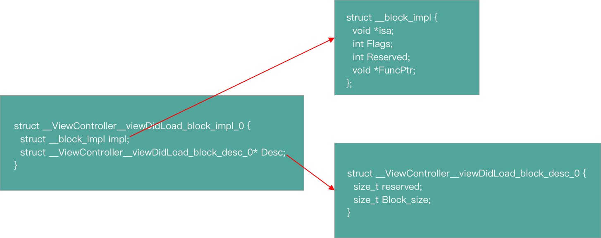


Demo2: 捕获外部变量

```objective-c
void(^printAgeBlock)(void) = ^ {
    NSLog(@"age is %zd", age);
};
age = 28;
printAgeBlock();
```

用指令 `xcrun --sdk iphoneos clang -arch arm64 ViewController.m -rewrite-objc -o ViewController-arm64.cpp` 转换为 c++ 代码

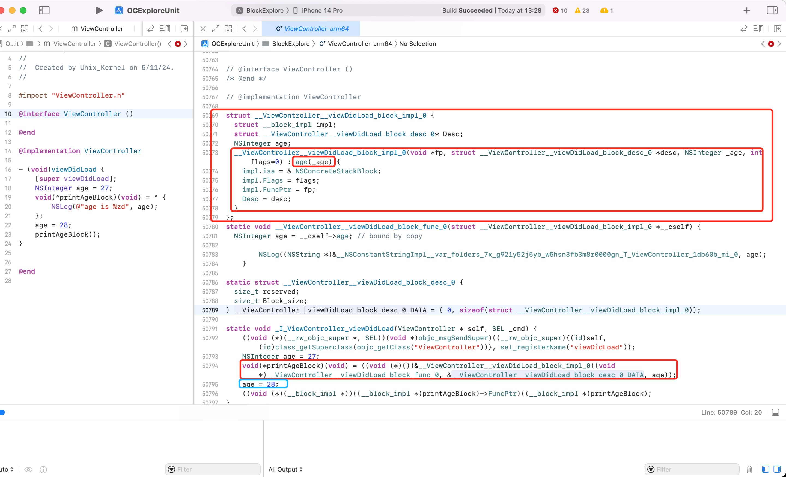

代码分析：

- 可以看到我们编写的 block 被声明为一个 `__ViewController__viewDidLoad_block_impl_0` 类型的结构体
- 结构体内有个构造函数，见50773行代码。
- c++ 中，构造方法中 `age(_age) `的写法，表明传入的 `_age` 会被赋值给结构体内的 age
- 50794行代码，调用结构体的构造方法，传入参数。结构体构造方法内部将 参数 age 的值保存到结构体内部的 age 中。
- 因为是值传递。所以即使在 50795 行代码对 age 进行了修改，结构体内部的 age 值不变
- 所以执行 block，输出 age 依旧为27


block 内部多了一个变量来存储外部变量，这个现象叫做 block 捕获了外部变量。

c++ 中，在函数内部定义的变量，默认用 **auto** 修饰，叫做自动变量，离开作用域后自动销毁。上述 age 等价于 `auto NSInterge age = 27;`

所以上述的情况，叫做 block 的 auto 变量捕获。


### static 变量捕获

```objective-c
auto NSInteger age = 27;
static NSInteger height = 175;
void(^printInfoBlock)(void) = ^ {
    NSLog(@"age is %zd, height is %zd", age, height);
};
age = 28;
height = 176;
printInfoBlock();
```

用指令 `xcrun --sdk iphoneos clang -arch arm64 ViewController.m -rewrite-objc -o ViewController-arm64.cpp` 转换为 c++ 代码

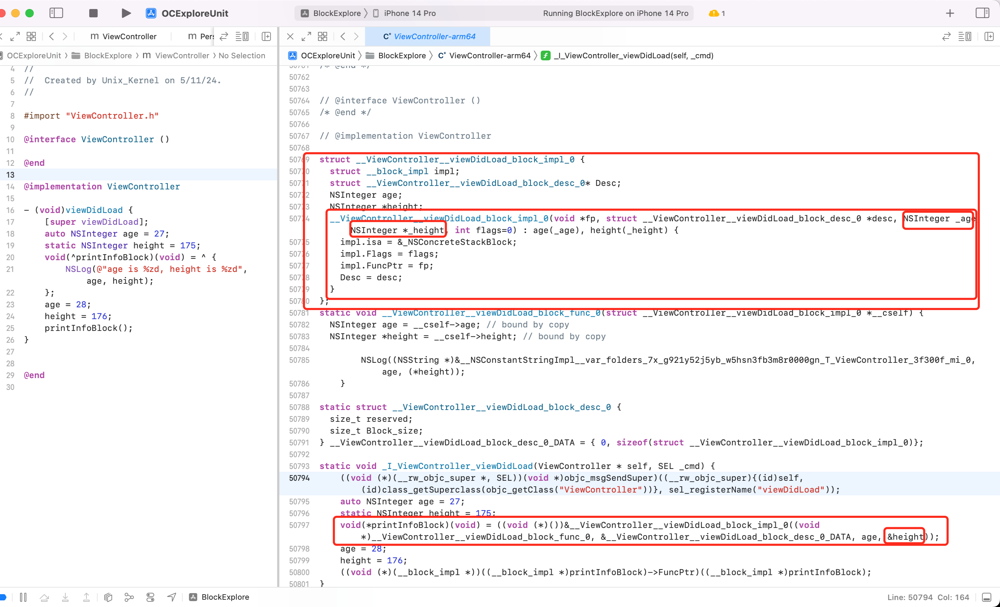


对代码进行分析：

- 可以看到我们编写的 block 被声明为一个 `__ViewController__viewDidLoad_block_impl_0` 类型的结构体
- 结构体内有个构造函数，见50774行代码。
- c++ 中，构造方法中 `age(_age) `的写法，表明传入的 `_age` 会被赋值给结构体内的 age，age 为值传递；`height(_height)` 写法，表明传入的 `_height` 会被复制给结构体内的 height，height 为引用传递
- 50797行代码，调用结构体的构造方法，age 以值传递的方式传入参数，结构体构造方法内部将 参数 age 的值保存到结构体内部的 age 中。height 以引用传递的方式传入参数，结构体构造方法内，将参数 height 的引用保存起来
- 因为 age 是值传递。所以即使在 50798 行代码对 age 进行了修改，结构体内部的 age 值不变
- 因为 height 是引用传递。所以在 50799 行代码对 height 进行了修改，结构体内部的 height 值跟着改变
- 所以执行 block，输出 age 依旧为27，输出 height 的时候，根据保存地址，找到 height，也就是最新的 height 会被输出


### 全局变量捕获

```objective-c
NSInteger age = 27;
static NSInteger height = 175;

@implementation ViewController

- (void)viewDidLoad {
    [super viewDidLoad];
    
    void(^printInfoBlock)(void) = ^ {
        NSLog(@"age is %zd, height is %zd", age, height);
    };
    age = 28;
    height = 176;
    printInfoBlock();
}
@end
// console
age is 28, height is 176
```

用指令 `xcrun --sdk iphoneos clang -arch arm64 ViewController.m -rewrite-objc -o ViewController-arm64.cpp` 转换为 c++ 代码

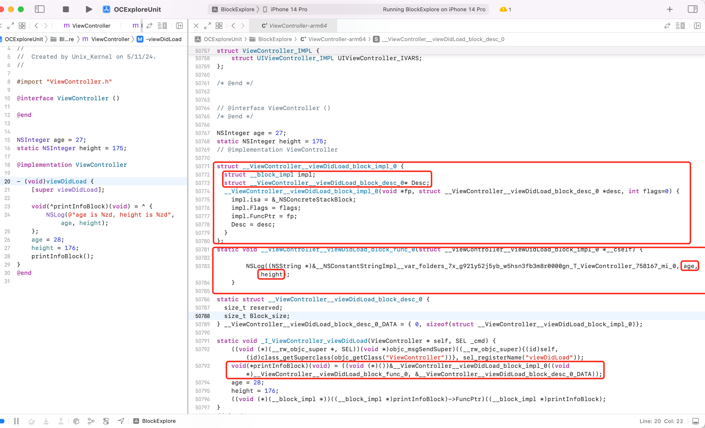


代码分析：

- 可以看到我们编写的 block 被声明为一个 `__ViewController__viewDidLoad_block_impl_0` 类型的结构体
- 结构体内有个构造函数，见50774行代码。可见针对全局变量，结构体内部不会捕获全局变量
- block 内部的指令，被封装为一个叫做 `__ViewController__viewDidLoad_block_func_0` 的结构体，打印的时候直接访问全局变量
- 针对全局变量的修改会实时生效
- 所以执行 block，输出 age 和 height 的时候，直接输出全局变量的值


QA：为什么局部变量存在捕获，全局变量不需要捕获？

全局变量到哪都可以访问，所以没必要捕获。局部变量因为作用域的问题，所以需要捕获到哪步，以便后续使用。


### 变量捕获总结

block 截获变量可以分为：

- 局部变量
  - 基本数据类型：对于基本数据类型的局部变量，截获其值
  - 对象类型：对于对象类型的局部变量，连同所有权修饰符一起截获
- 静态局部变量：以指针形式进行截获的
- 全局变量：不截获
- 静态全局变量：不截获

变量分为：static、auto、register。

- static：表示作为静态变量存储在数据区。

- auto：一般的变量不加修饰词则默认为 auto，auto 表示作为自动变量存储在栈上。意味着离开作用域变量会自动销毁。

- register：这个关键字告诉编译器尽可能的将变量存在CPU内部寄存器中，而不是通过内存寻址访问，以提高效率。是尽可能，不是绝对。如果定义了很多 register 变量，可能会超过CPU 的寄存器个数，超过容量。所以只是可能。

| 作用域        | 捕获到 block 内部 | 访问方式 |
| ---------- | ------------ | ---- |
| 局部变量 auto  | YES          | 值传递  |
| 局部变量static | YES          | 指针传递 |
| 全局变量       | NO           | 直接访问 |


来一个开发中常见的 case：

下面的例子中 的 block，self 会被捕获吗？

```objective-c
#import "Person.h"

@implementation Person

- (instancetype)initWithName:(NSString *)name {
    if (self = [super init]) {
        _name = name;
    }
    return self;
}

- (void)play {
    void(^playBlock)(void) = ^{
        NSLog(@"%@ is playing", self);
    };
    playBlock();
}

@end
```

用指令 `xcrun --sdk iphoneos clang -arch arm64 Person.m -rewrite-objc -o Person-arm64.cpp` 转换为 c++ 代码

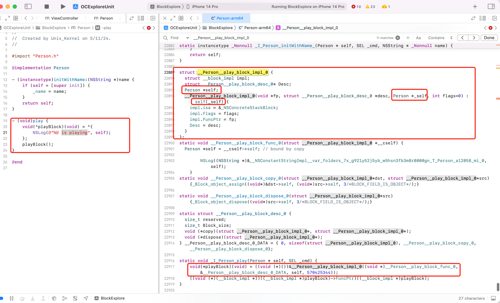


代码分析：

- 可以看到我们编写的 block 被声明为一个 `__Person__play_block_impl_0` 类型的结构体

- 结构体内有个构造函数，见22893行代码。

- 因为 objective-c 的方法，默认会携带2个参数，`self` 和 ` _cmd`，等价于 `void play(Person *self, SEL _cmd)`，所以22917行代码  调用构造函数的时候，self 会被传递进去。查看 c++ 代码，可以看到 OC 的 play 方法被转换为 

  ```c++
  static void _I_Person_play(Person * self, SEL _cmd) {
      void(*playBlock)(void) = ((void (*)())&__Person__play_block_impl_0((void *)__Person__play_block_func_0, &__Person__play_block_desc_0_DATA, self, 570425344));
      ((void (*)(__block_impl *))((__block_impl *)playBlock)->FuncPtr)((__block_impl *)playBlock);
  }
  ```

- block 为了局部变量 self 的将来访问，结构体内部也增加了一个 Person 类型的 self，所以存在 self 的变量捕获。


所以，答案是会，因为 self 就是局部变量。 一个 oc 方法转换为 `void test(Person *self, SEL _cmd)` 形式，所以 self 也是局部变量，会被捕获。


## block 类型

### 类型划分

我们知道 block 可以看成是一个 oc 对象，所以它有类型，写个 Demo1 验证下

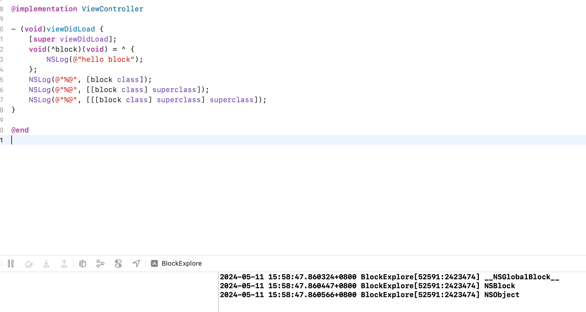

也就是说： `__NSGlobalBlock__` -> `NSBlock`  -> `NSObject`。

继续验证，Demo2

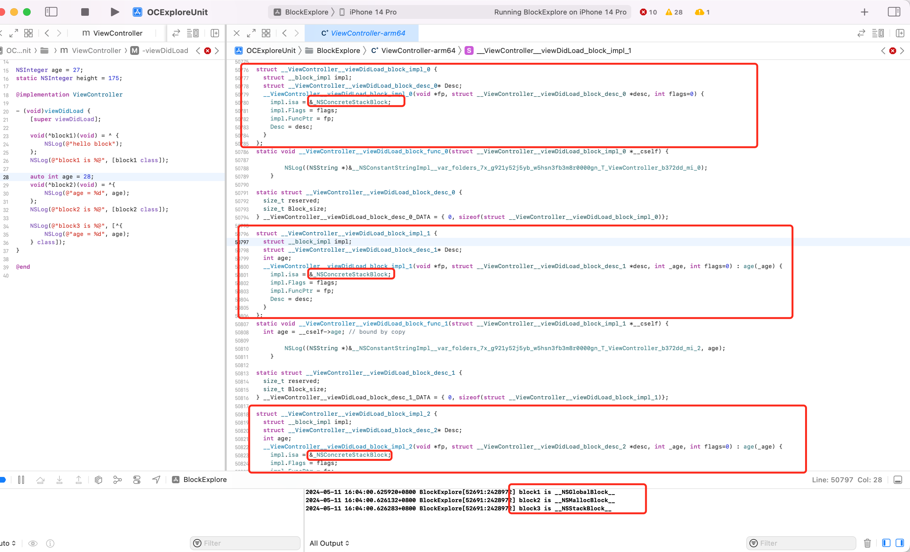

同时利用指令 `xcrun --sdk iphoneos clang -arch arm64 ViewController.m -rewrite-objc -o ViewController-arm64.cpp` 转换为 c++

梳理分析下：

- 通过打印发现，block1 为 `__NSGlobalBlock__` 类型，但是 clang 转为 c++ 后为 `_NSConcreteStackBlock` 类型
- block1 为 `__NSMallocBlock__` 类型，但是 clang 转为 c++ 后为 `_NSConcreteStackBlock` 类型
- block2 为 `__NSStackBlock__` 类型，但是 clang 转为 c++ 后为 `_NSConcreteStackBlock` 类型
- 虽然可以用 clang 将 OC 转换为 c++ 来分析问题，但是 OC 最强大的是运行时，所以编译期转换为 c++ 看到的信息不一定是准确的，还是以运行时的信息为准


简单结论：

block 的类型可以通过 isa 或者 class 方法查看，最终都是继承自 NSBlock 类型，共存在3种类型的 block：

- `__NSGlobalBlock__` (`_NSConcreteGlobalBlock`)：程序的数据区域（.data 区）

- `__NSStackBlock__` (`_NSConcreteStackBlock`)，会自动销毁

- `__NSMallocBlock__`(`_NSConcreteMallockBlock`)，需要程序员自己管理内存

这3种 block 在内存中的排布如下图：


### 如何判断 block 属于什么类型

Demo：

由于 ARC 默认会做一些优化，我们将工程的 ARC 关掉（Build Setting 里 Automatic Reference Counting 设置为 No）

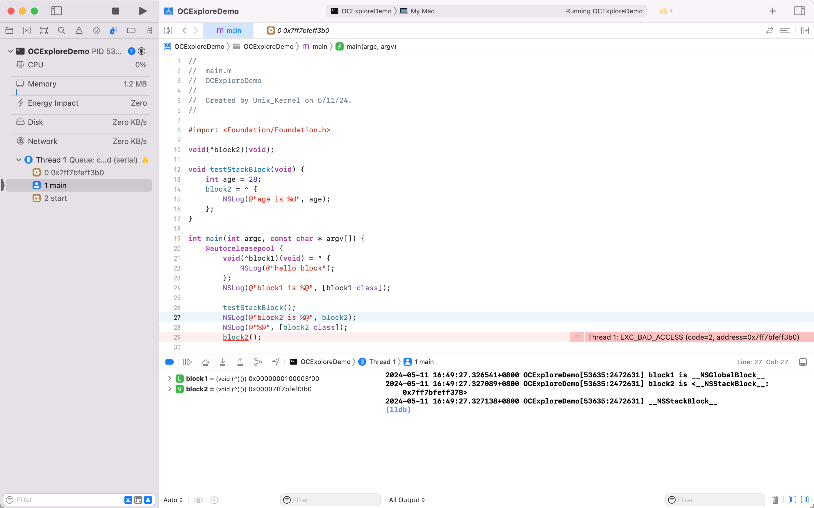

分析：

- block1 是 `__NSGlobalBlock__` ，此**类型的 block 用结构体实例的内容不依赖于执行时的状态，所以整个程序只需要1个实例。因此存放于全局变量相同的数据区域即可。**
- block2 是 `__NSStackBlock__`.
- 为什么执行  block2 的时候发生了 crash？猜测由于在 test 方法内给 block2 赋值，也就是在栈上定义和捕获了栈上的变量 age，test 方法结束，可能栈上的数据消失或者乱了，所以这个情况下调用 block2 会 crash。

针对 block2 的问题该怎么处理？

当 `__NSStackBlock__` 调用 copy 方法后会变为 `__NSMallocBlock__`。如下图：

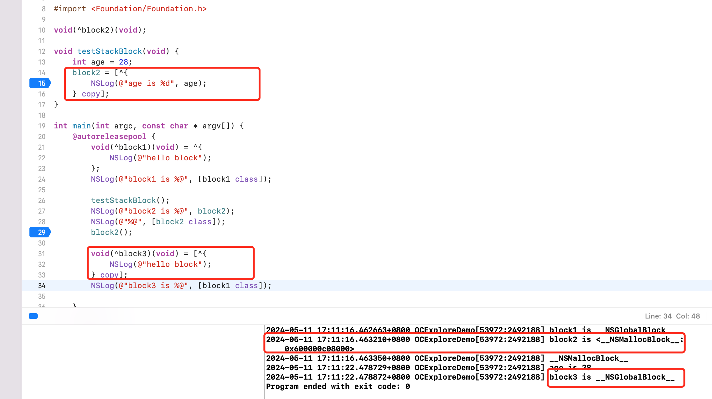


Demo 也同时发现，当对 `__NSGlobalBlock__`  调用 copy ，不会变为 `__NSMallocBlock__` 。


### 总结

| block 类型            | 环境                             |
| ------------------- | ------------------------------ |
| `__NSGlobalBlock__` | 没有访问 auto 变量                   |
| `__NSStackBlock__`  | 访问了 auto 变量                    |
| `__NSMallocBlock__` | `__NSStackBlock__` 调用了 copy 方法 |

调用 copy 方法

| Block 类                    | 原本位置     | 复制效果   |
| --------------------------- | ------------ | ---------- |
| `__NSConcreteStackBlock__`  | 栈           | 栈复制到堆 |
| `__NSConcreteGlobalBlock__` | 程序的数据段 | 什么也不做 |
| `__NSConcreteMallocBlock__` | 堆           | 引用计数+1 |


## 内存管理

### ARC 针对 block 的优化

#### block 作为函数返回值，并且捕获了 auto 变量

MRC 下 block 作为函数的返回值是比较危险的。在方法内部，也就是栈上定义的 block，函数调用结束后可能一些相关数据就释放了，存在潜在风险。

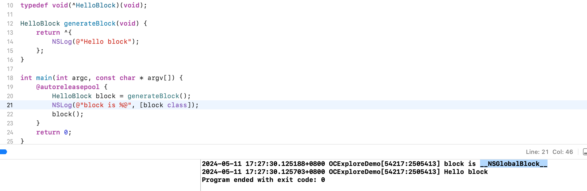


MRC 下如果函数返回值是 block，且 block 内做了 auto 变量捕获的逻辑，编译器会报错：`Returning block that lives on the local stack`。此时 block 应该为 `__NSStackBlock__`

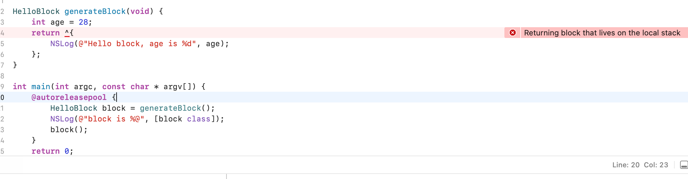


改为 ARC，看看 

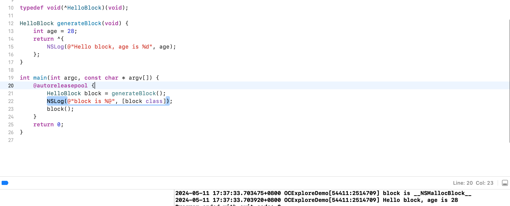

也就是说，ARC 模式下，当 block 捕获了 auto 变量，并且作为函数返回值的时候，ARC 会自动调用 copy 方法，将 `__NSStackBlock__` 变为 `__NSMallocBlock__`


Demo1: 

```objectivec
MyBlock block;
{
    Person *person = [[Personalloc] init];
    block = ^{
        NSLog(@"block called");
    };
    NSLog(@"%@", [block class]); 
};
```

MRC 环境： 如果 block 不访问外部局部变量，则`__NSGlobalBlock__`

ARC 环境：如果 block 不访问外部局部变量，则`__NSGlobalBlock__`

Demo2: 

```objectivec
typedef void(^MyBlock)(void);
int main(int argc, const char * argv[]) {
    @autoreleasepool {
        MyBlock block;
        {
            auto Person *person = [[Person alloc] init];
            person.age = 10;
            block = ^{
                NSLog(@"age:%zd", person.age);
            };
            NSLog(@"%@", [block class]);    // __NSStackBlock__
        };
    }
    return 0;
}
```

MRC 环境下：如果访问了 auto 变量，则为 `__NSStackBlock__`

ARC 环境下：**ARC 下面比较特殊，默认局部变量对象都是强指针，存放在堆里面。所以 block 为 `__NSMallocStack__`**

Demo3: 

```objectivec
typedef void(^MyBlock)(void);
int main(int argc, const char * argv[]) {
    @autoreleasepool {
        MyBlock block;
        {
            auto Person *person = [[Person alloc] init];
            person.age = 10;
            block = [^{
                NSLog(@"age:%zd", person.age);
            } copy];
            NSLog(@"%@", [block class]);    // __NSMallocBlock__
        };
    }
    return 0;
}
```

MRC 下：如果 block 调用 copy 方法，则 block 为 `__NSMallocStck__`

ARC 下：如果 block 调用 copy 方法，则  block 仍旧为 `__NSMallocBlock__`。`__NSMallocBlock__` 调用 copy 仍旧为 `__NSMallocBlock__`

在 ARC 下，如果有一个强指针引用 block，则 block 会被拷贝到堆上，成为  `__NSMallocStck`


#### ARC 针对强指针指向的 block 会调用 copy 

MRC 下，栈内捕获了 auto 变量的 block 为 `__NSStackBlock__`

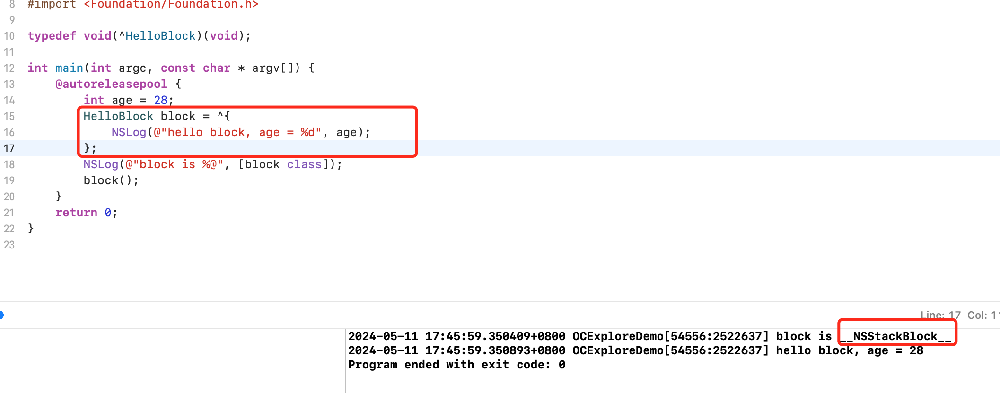

改为 ARC 

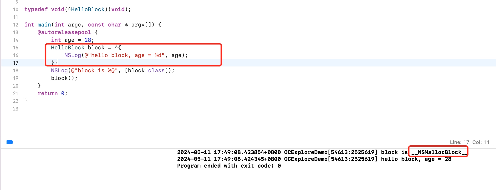


说明：ARC 模式下，如果 block 被强指针指向，则会自动调用 copy 方法。

- 捕获了 auto 变量的 `__NSStackBlock__`，ARC 下调用 copy 会变为  `__NSMallocBlock__`
- 没有捕获变量的 `__NSGlobalBlock__`，ARC 下调用 copy 依旧为 `__NSGlobalBlock__`


#### 总结

在 ARC 下，编译器会根据情况，自动将战上的 block 复制到对上，比如：

- block作为函数返回值时
- 将 block 赋值给 `__strong` 指针时
- block 传递给 Cocoa API 中名字含有 usingBlock 的方法参数时
- block 传递给 GCD 的方法参数时


ARC 下：block 对象捕获了 auto 外部变量，是一种 `__NSMallocBlock__`，捕获的对象将会在 block 销毁后销毁


MRC 下：block 对象捕获了 auto 外部变量，是一种 `__NSMallocBlock__`，因为是 MRC，所以需要手动管理内存。会发现对象将在离开作用域后立马销毁，不会被 block 所捕获。

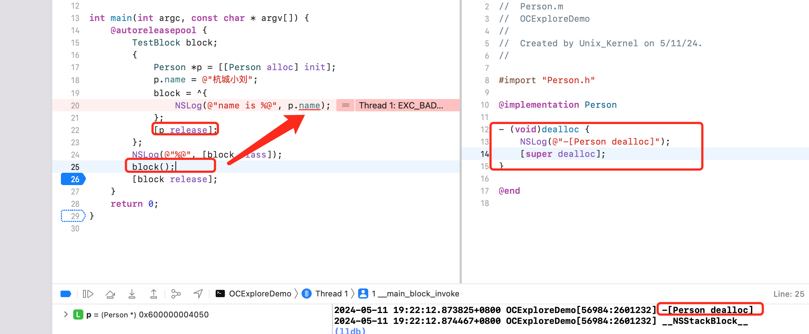


MRC，对 block 加 copy，变为 `__NSMallocBlock__` 呢？

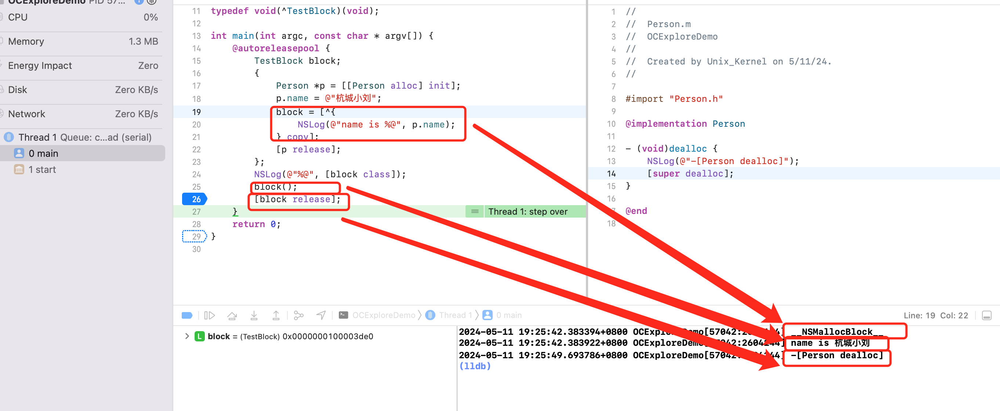

ARC 下对 block 引用的对象加 `__weak` 修饰呢？


用指令 `xcrun --sdk iphoneos clang -arch arm64 main.m -rewrite-objc -fobjc-arc -fobjc-runtime=ios-8.0.0 -o main-arm64.cpp` 转换为 c++ 进行分析看看。注意，因为 weak 涉及运行时，需要在 clang 后添加 runtime 参数


如果对 Person 不加 `__weak` 修饰，block 结构体内部将会是`__strong`。

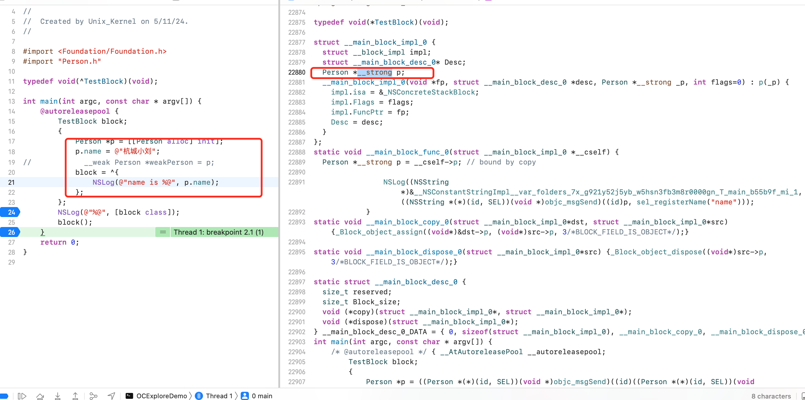


思考：发现生成的 c++ 代码中，block_desc 里面多了2个成员变量。

````c++
static struct __main_block_desc_0 {
  size_t reserved;
  size_t Block_size;
  void (*copy)(struct __main_block_impl_0*, struct __main_block_impl_0*);
  void (*dispose)(struct __main_block_impl_0*);
} __main_block_desc_0_DATA = { 0, sizeof(struct __main_block_impl_0), __main_block_copy_0, __main_block_dispose_0};
````

仔细想想，查看 block 编译成 c++ 代码的源码可以发现 `__main_block_desc_0` 结构体内部是变化的。什么意思呢？reserved、Block_size 是一直有的，`void (*copy)`、`void (*dispose)` 只有在修饰对象的时候才有。为什么这么设计？


### block 的 copy、dispose

```c++
static struct __main_block_desc_0 {
  size_t reserved;
  size_t Block_size;
  void (*copy)(struct __main_block_impl_0*, struct __main_block_impl_0*);
  void (*dispose)(struct __main_block_impl_0*);
} __main_block_desc_0_DATA = { 0, sizeof(struct __main_block_impl_0), __main_block_copy_0, __main_block_dispose_0};
```

因为 block 会对变量进行内存管理。`void *copy`、`void *dispose` 都是内存管理的方法。

如果 block 访问的不是对象，则结构体没有  `void *copy`、`void *dispose`

```c++
static void __main_block_copy_0(struct __main_block_impl_0*dst, struct __main_block_impl_0*src) {_Block_object_assign((void*)&dst->p, (void*)src->p, 3/*BLOCK_FIELD_IS_OBJECT*/);}

static void __main_block_dispose_0(struct __main_block_impl_0*src) {_Block_object_dispose((void*)src->p, 3/*BLOCK_FIELD_IS_OBJECT*/);}
```

其中 `_Block_object_assign` 会根据要不要拥有对象，内部决定要不要给对象调用 retain 方法。

Demo1:

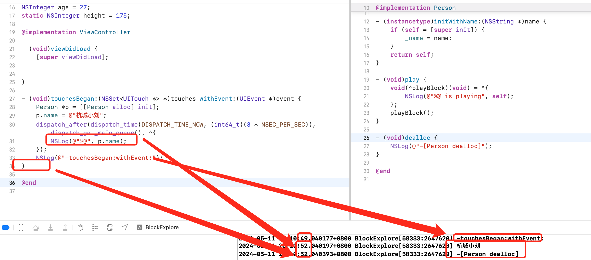

Demo2

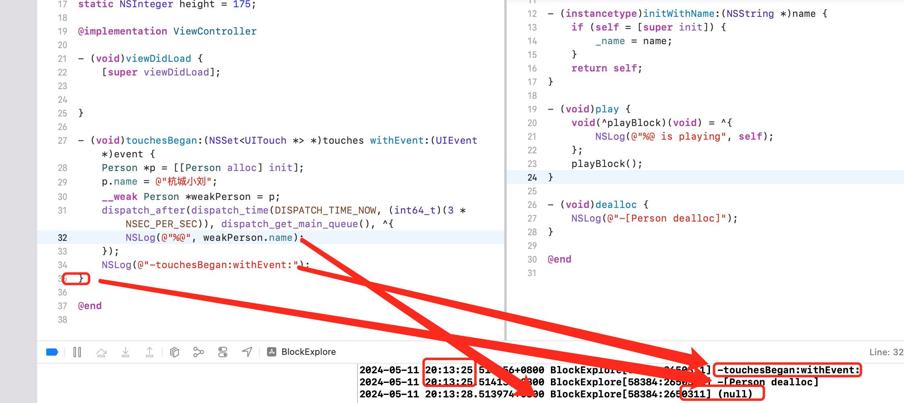


马上执行了 Person 的 dealloc 方法。因为 `__weak` 修饰，block 内部的 `_Block_object_assign` 会根据 `__strong` 为对象引用计数 +1，`__weak` 则引用计数不变。所以是 `__weak` 修饰，出离作用域则立马会释放 Person 对象。

`_Block_object_assign` 会根据内存修饰符来对内存进行操作。

Demo3

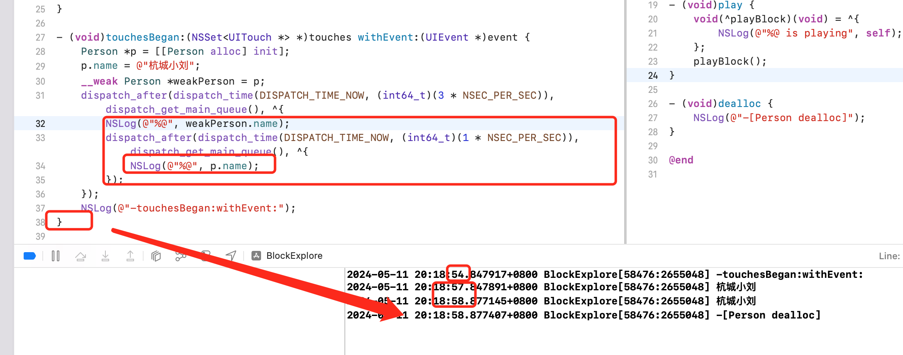

因为 GCD 是给 MainQueue 添加任务的，所以是串行，2个任务前后按照3s、1s 后打印。由于最晚的一个任务是访问强指针对象，所以不会释放。等到 GCD 全部执行完后，Person 才释放。

Demo4

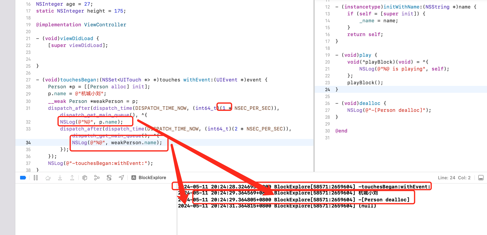


在给 MainQueue 提交同步任务的时候，第一个任务是一个 block，访问了强指针指向的 Person（内部会调用 `_Block_object_assign`，发现是强引用，对 p 的引用计数 +1，当 block 执行完后，调用 `_Block_object_dispose` 对 p 的引用计数 -1），第二个任务是弱指针指向的 Person，引用计数不做操作。当1s 后第一个任务执行后，Person 被释放。第二个任务执行的时候，访问 name 属性就是给 nil 发消息，不会 crash，但是为 null。


### block 如何修改变量

#### __block 修饰基本数据类型

```objectivec
typedef void(^MyBlock)(void);
int main(int argc, const char * argv[]) {
    @autoreleasepool {
        int age = 27;
        MyBlock block = ^{
            age = 28;
        };
        NSLog(@"%zd", age);
    }
    return 0;
}
```

编译会报错 `// Variable is not assignable (missing __block type specifier)` 为什么不能修改？

把 block 内修改的那行代码注释了，转成 c++ 看看

```c
struct __ViewController__viewDidLoad_block_impl_0 {
  struct __block_impl impl;
  struct __ViewController__viewDidLoad_block_desc_0* Desc;
  int age;
  __ViewController__viewDidLoad_block_impl_0(void *fp, struct __ViewController__viewDidLoad_block_desc_0 *desc, int _age, int flags=0) : age(_age) {
    impl.isa = &_NSConcreteStackBlock;
    impl.Flags = flags;
    impl.FuncPtr = fp;
    Desc = desc;
  }
};
static void __ViewController__viewDidLoad_block_func_0(struct __ViewController__viewDidLoad_block_impl_0 *__cself) {
  int age = __cself->age; // bound by copy

        NSLog((NSString *)&__NSConstantStringImpl__var_folders_7x_g921y52j5yb_w5hsn3fb3m8r0000gn_T_ViewController_3ceae4_mi_0, age);
    }

static struct __ViewController__viewDidLoad_block_desc_0 {
  size_t reserved;
  size_t Block_size;
} __ViewController__viewDidLoad_block_desc_0_DATA = { 0, sizeof(struct __ViewController__viewDidLoad_block_impl_0)};

static void _I_ViewController_viewDidLoad(ViewController * self, SEL _cmd) {
    ((void (*)(__rw_objc_super *, SEL))(void *)objc_msgSendSuper)((__rw_objc_super){(id)self, (id)class_getSuperclass(objc_getClass("ViewController"))}, sel_registerName("viewDidLoad"));
    int age = 27;
    void(*ChangeValueBlock)(void) = ((void (*)())&__ViewController__viewDidLoad_block_impl_0((void *)__ViewController__viewDidLoad_block_func_0, &__ViewController__viewDidLoad_block_desc_0_DATA, age));
}
```

可以看到， block 内部的逻辑被包装成一个新的 `__ViewController__viewDidLoad_block_func_0`方法，然而 age 定义在 `_I_ViewController_viewDidLoad` 方法中。没有传递引用，也没任何特殊处理，所以没办法修改。


思考：那如何实现修改一个变量？

全局变量、static 变量、`__block`修饰的变量在 block 内部可以修改。 

- `__block` 用于解决 block 内部无法修改 auto 变量的问题。

- `__block` 不能修饰 static、全局变量

- 编译器会将 `__block` 修饰的变量包装为一个对象（后续修改则通过指针找到结构体对象，结构体对象再修改里面的值）

Demo

```objectivec
__block int age = 27;
MyBlock block = ^{
    age = 28;
};
```

转为 C++ 

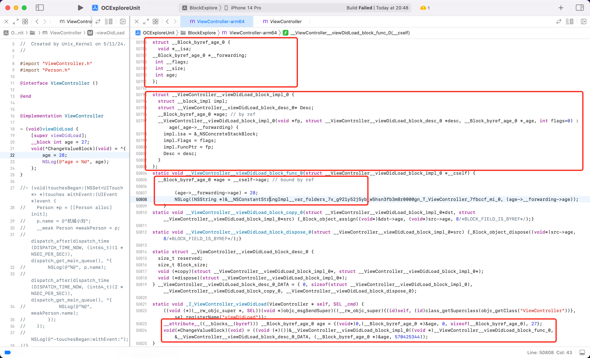

```c++
struct __Block_byref_age_0 {
  void *__isa;
__Block_byref_age_0 *__forwarding;
 int __flags;
 int __size;
 int age;
};

struct __ViewController__viewDidLoad_block_impl_0 {
  struct __block_impl impl;
  struct __ViewController__viewDidLoad_block_desc_0* Desc;
  __Block_byref_age_0 *age; // by ref
  __ViewController__viewDidLoad_block_impl_0(void *fp, struct __ViewController__viewDidLoad_block_desc_0 *desc, __Block_byref_age_0 *_age, int flags=0) : age(_age->__forwarding) {
    impl.isa = &_NSConcreteStackBlock;
    impl.Flags = flags;
    impl.FuncPtr = fp;
    Desc = desc;
  }
};
static void __ViewController__viewDidLoad_block_func_0(struct __ViewController__viewDidLoad_block_impl_0 *__cself) {
  __Block_byref_age_0 *age = __cself->age; // bound by ref

        (age->__forwarding->age) = 28;
        NSLog((NSString *)&__NSConstantStringImpl__var_folders_7x_g921y52j5yb_w5hsn3fb3m8r0000gn_T_ViewController_7fbccf_mi_0, (age->__forwarding->age));
    }

static void _I_ViewController_viewDidLoad(ViewController * self, SEL _cmd) {
    ((void (*)(__rw_objc_super *, SEL))(void *)objc_msgSendSuper)((__rw_objc_super){(id)self, (id)class_getSuperclass(objc_getClass("ViewController"))}, sel_registerName("viewDidLoad"));
    __attribute__((__blocks__(byref))) __Block_byref_age_0 age = {(void*)0,(__Block_byref_age_0 *)&age, 0, sizeof(__Block_byref_age_0), 27};
    void(*ChangeValueBlock)(void) = ((void (*)())&__ViewController__viewDidLoad_block_impl_0((void *)__ViewController__viewDidLoad_block_func_0, &__ViewController__viewDidLoad_block_desc_0_DATA, (__Block_byref_age_0 *)&age, 570425344));
}
```

可以看到 `__block int age = 27;` 变为了 `__Block_byref_age_0` 结构体，给结构体赋值的时候，第二个成员变量的值就是结构体自身地址。

`__ViewController__viewDidLoad_block_impl_0` 结构体构造函数  `age(_age->__forwarding)` 就是把外面传递进来结构体的指针，所指向的结构体的 `__forwarding` 成员变量赋值给 block 结构体内的 age 成员变量。

block 内部的函数在修改 age 的时候其实就是通过 `__main_block_impl_0` 结构体的 age 找到 `__Block_byref_age_0`，然后访问 `__Block_byref_age_0` 中的成员变量 `__forwarding` 访问成员变量 age，并修改值。


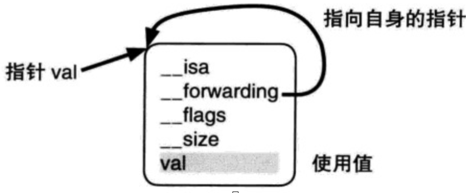


QA：为什么`__block` 变量的 `__Block_byref_age_0` 结构体并不在 block 结构体 `__main_block_impl_0` 中？

因为这样做可以在多个 block 中使用 `__block` 变量。


看个有趣的例子，验证下 __block 的效果

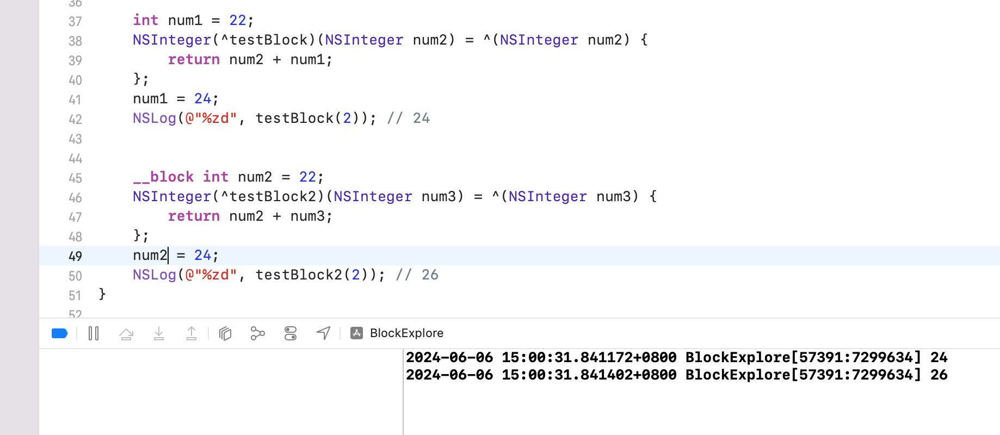

转换成 c++ 可以看到

```c++
struct __ViewController__viewDidLoad_block_impl_1 {
  struct __block_impl impl;
  struct __ViewController__viewDidLoad_block_desc_1* Desc;
  __Block_byref_num2_0 *num2; // by ref
  __ViewController__viewDidLoad_block_impl_1(void *fp, struct __ViewController__viewDidLoad_block_desc_1 *desc, __Block_byref_num2_0 *_num2, int flags=0) : num2(_num2->__forwarding) {
    impl.isa = &_NSConcreteStackBlock;
    impl.Flags = flags;
    impl.FuncPtr = fp;
    Desc = desc;
  }
};
static long __ViewController__viewDidLoad_block_func_1(struct __ViewController__viewDidLoad_block_impl_1 *__cself, NSInteger num3) {
  __Block_byref_num2_0 *num2 = __cself->num2; // bound by ref

        return (num2->__forwarding->num2) + num3;
    }
static void __ViewController__viewDidLoad_block_copy_1(struct __ViewController__viewDidLoad_block_impl_1*dst, struct __ViewController__viewDidLoad_block_impl_1*src) {_Block_object_assign((void*)&dst->num2, (void*)src->num2, 8/*BLOCK_FIELD_IS_BYREF*/);}

static void __ViewController__viewDidLoad_block_dispose_1(struct __ViewController__viewDidLoad_block_impl_1*src) {_Block_object_dispose((void*)src->num2, 8/*BLOCK_FIELD_IS_BYREF*/);}

static struct __ViewController__viewDidLoad_block_desc_1 {
  size_t reserved;
  size_t Block_size;
  void (*copy)(struct __ViewController__viewDidLoad_block_impl_1*, struct __ViewController__viewDidLoad_block_impl_1*);
  void (*dispose)(struct __ViewController__viewDidLoad_block_impl_1*);
} __ViewController__viewDidLoad_block_desc_1_DATA = { 0, sizeof(struct __ViewController__viewDidLoad_block_impl_1), __ViewController__viewDidLoad_block_copy_1, __ViewController__viewDidLoad_block_dispose_1};

__attribute__((__blocks__(byref))) __Block_byref_num2_0 num2 = {(void*)0,(__Block_byref_num2_0 *)&num2, 0, sizeof(__Block_byref_num2_0), 22};
    NSInteger(*testBlock2)(NSInteger num3) = ((long (*)(NSInteger))&__ViewController__viewDidLoad_block_impl_1((void *)__ViewController__viewDidLoad_block_func_1, &__ViewController__viewDidLoad_block_desc_1_DATA, (__Block_byref_num2_0 *)&num2, 570425344));
    (num2.__forwarding->num2) = 24;
```

外面的 num2 被 `__block` 修饰后变为了对象。通过 num2 对象的 `__forwarding` 指针，再访问 num2 即可修改值。


#### __block 修饰对象

对` __block` 修饰的对象，clang 转换为 c++ 后如下：

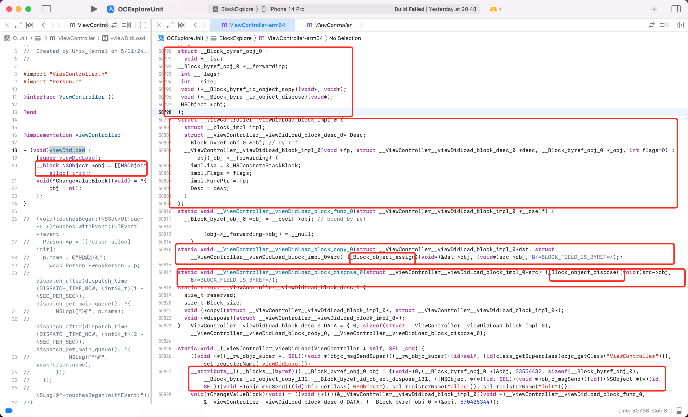


分析发现：

- 对于  `__block` 修饰对象数据，对于生成的结构体也不一样。`__Block_byref_obj_0` 中含有2个操作内存的成员变量`__Block_byref_id_object_copy`、`__Block_byref_id_object_dispose`
- 其他的逻辑和 `__block` 修饰基本数据类型一致


注意：

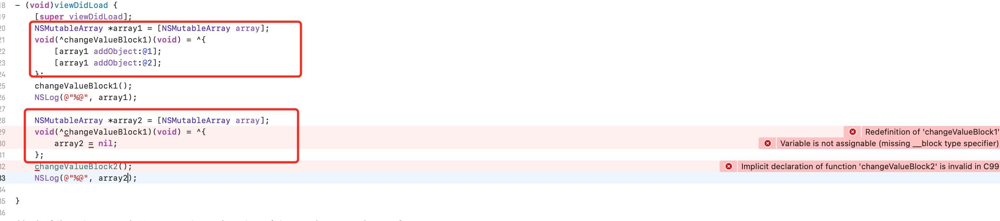


- block 外定义的 NSMutableArray，block 内只是使用数组则不需要`  __block`

- 如果在 block 利操作指针，则需要加  `__block`

注意：`__weak` 只可以用来修饰对象，（终端用 clang 处理）否则 clang 会报错 `warning: 'objc_ownership' only applies to Objective-C object or block pointer types; type here is 'int' [-Wignored-attributes]`


Demo：知道 `__block` 的本之后，下面打印的 age 的地址是 struct 里面哪个的值？

```objectivec
__block int age = 27;
MyBlock block = ^{
    age = 28;
};
NSLog(@"%p", &age);
```

知道转换为c++后的效果，我们可以在代码中按照结构体，自己定义并转接到 block

```objectivec
struct __Block_byref_age_0 {
  void *__isa;  // 0x0000000105231f70 +8
 struct __Block_byref_age_0 *__forwarding; // 0x0000000105231f78 + 8
 int __flags; // 0x0000000105231f80 +4
 int __size; // 0x0000000105231f84 + 4
 int age;   // 0x0000000105231f88
};

struct __block_impl {
  void *isa;
  int Flags;
  int Reserved;
  void *FuncPtr;
};

struct __main_block_desc_0 {
  size_t reserved;
  size_t Block_size;
  void (*copy)(void);
    void (*dispose)(void);
};

struct __main_block_impl_0 {
  struct __block_impl impl;
  struct __main_block_desc_0* Desc;
  struct __Block_byref_age_0 *age; // by ref
};


typedef void(^MyBlock)(void);
int main(int argc, const char * argv[]) {
    @autoreleasepool {
        __block int age = 27;
        MyBlock block = ^{
            age = 28;
        };
        struct __main_block_impl_0 *blockImpl = (__bridge struct __main_block_impl_0 *)block;
        NSLog(@"%p", &age);
    }
    return 0;
}
```

我们将断点设置到 NSLog 这里，打印出自定义结构体 `__main_block_impl_0` 中的 age 。

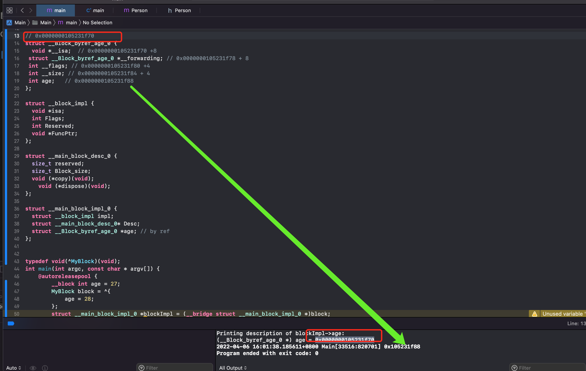

```c
// 0x0000000105231f70
struct __Block_byref_age_0 {
  void *__isa;  // 地址：0x0000000105231f70 长度：+8
 struct __Block_byref_age_0 *__forwarding; //  地址：0x0000000105231f78 长度：+8
 int __flags; // 地址：0x0000000105231f80 长度：+4
 int __size; // 地址：0x0000000105231f84 长度：+4
 int age;   // 地址：0x0000000105231f88
};

```

将地址打印出来。该地址就是 `__Block_byref_age_0`  结构体的地址，也就是结构体内第一个 `isa` 的地址。我们计算下，规则如下：

- 指针长度8个字节

- int 长度4个字节

算出来 age 的地址为 `0x0000000105231f88` ，此时 Xcode 打印出的地址也是 `0x105231f88`。其实也就是 `blockImple->age->age` 的地址

block 内部对变量的值修改其实就是对 block 内部自定义结构体内部的变量修改。

当 block 被 copy 到堆上

- 会调用 block 内部的 copy 函数

- copy 函数内部会调用 `_Block_object_assign` 函数

- `_Block_object_assign` 函数会根据所指向对象的修饰符（__strong、__weak、__unsafe_unretained）做出相应的操作，形成强引用（retain）或者弱引用（注意：这里仅限于ARC时会retain，MRC时不会retain）

当 block 从堆中移除

- 会调用 block 内部的 dispose 函数

- dispose 函数会调用 `_Block_object_dispose` 函数

- `_Block_object_dispose` 函数会自动释放 `__block` 修饰的变量（release）


#### 什么情况下需要 __block

局部变量：基本数据类型、对象数据类型


#### 什么情况下不需要 __block

- 全局变量（不截获）
- 静态全局变量（不截获）
- 静态局部变量（截获指针）


## `__forwarding` 的设计

看一个例子，`__block` 如何修改外部变量

```objective-c
- (void)viewDidLoad {
    [super viewDidLoad];
    __block int age = 27;
    NSLog(@"1: age = %d, address is %p", age, &age);
    void(^block1)(void) = ^{
        age = 28;
        NSLog(@"in block: age = %d, address is %p", age, &age);
    };
    NSLog(@"2: age = %d, address is %p", age, &age);
    block1();
    NSLog(@"3: age = %d, address is %p", age, &age);
    age = 29;
    NSLog(@"4: age = %d, address is %p", age, &age);
}
// console 
1: age = 27, address is 0x7ff7b0faebf8
2: age = 27, address is 0x600000464938
in block: age = 28, address is 0x600000464938
3: age = 28, address is 0x600000464938
4: age = 29, address is 0x600000464938
```


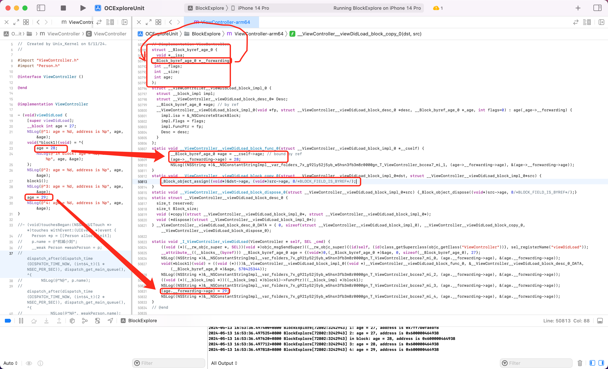

分析：

- `__block` 修饰的外部变量将会被封装为一个结构体对象，该结构体对象内有一个 `__forwarding` 成员变量

  ```c++
  struct __Block_byref_age_0 {
    void *__isa;
  __Block_byref_age_0 *__forwarding;
   int __flags;
   int __size;
   int age;
  };
  ```

- 在给 block 赋值的时候，其成员变量 `__forwarding`的值是由当前结构体对象的地址赋值的

  ````c++
  __attribute__((__blocks__(byref))) __Block_byref_age_0 age = {(void*)0,(__Block_byref_age_0 *)&age, 0, sizeof(__Block_byref_age_0), 27};
  ````

- block 内部代码，将被封装为一个新的函数 `__ViewController__viewDidLoad_block_func_0`，其内部通过结构体指针` _cself` 的 age 成员变量，获取到 `__Block_byref_age_0` 指针，该指针命名为 age。然后通过 age 指针访问到结构体的 `__forwarding` 成员变量，该成员变量指向的是结构体自己，然后再访问 age 拿到真正的 age 进行修改。

  ```c++
  static void __ViewController__viewDidLoad_block_func_0(struct __ViewController__viewDidLoad_block_impl_0 *__cself) {
  		__Block_byref_age_0 *age = __cself->age; // bound by ref
  		(age->__forwarding->age) = 28;
  		NSLog((NSString *)&__NSConstantStringImpl__var_folders_7x_g921y52j5yb_w5hsn3fb3m8r0000gn_T_ViewController_bccea7_mi_1, (age->__forwarding->age), &(age->__forwarding->age));
  }
  ```

- 第一行输出 `1: age = 27, address is 0x7ff7b0faebf8` 是因为此时 age 在栈上，高地址 `0x7ff7b0faebf8`

- 第二行输出 `2: age = 27, address is 0x600000464938` 是因为 block 被拷贝到此对上，内部对于使用到的` __block` 变量也会拷贝到堆上，是通过一个结构体对象来实现的。由于在栈上，地址变为 `0x600000464938`，相较于栈上的地址，地址变低了。

- 将 block 从栈拷贝到堆上时，block 所捕获的 `__block` 变量也会从栈拷贝到堆上，但是此时我们在该函数的作用域内（即 block 外）仍然是可以对 age 变量进行修改的

- 第三行输出 `in block: age = 28, address is 0x600000464938` 是因为此时 age 在堆上，低地址 `0x600000464938`。通过结构体  `__ViewController__viewDidLoad_block_impl_0`的 age 成员变量指向的  `__Block_byref_age_0` 指针，再通过指针指向的 `__forwarding` 指向自己，再访问 age 来修改值

- 为了将上述修改进行同步，在将 `__block` 变量从栈拷贝到堆上时，栈上的 `__Block_byref_val_0` 结构体的 `__forwarding` 指针将会指向堆上的 `__Block_byref_val_0` 结构体。所以此时，`age` 变量（即`age.__forwarding->age`变量）的地址改变了

- 第四行输出 `3: age = 28, address is 0x600000464938` 是因为此时 age 在堆上，低地址 `0x600000464938`，且值为28

- 第五行输出  `4: age = 29, address is 0x600000464938` 是因为此时通过栈上的 age 结构体，通过成员变量 `__forwarding` 指向对上的结构体地址，然后再通过指向堆上的结构体的 age 成员变量已经被修改为 29 了

总结下：

那么` __forwarding` 的作用是什么？为什么这么设计


 

- 当  block在栈中时，`__Block_byref_age_0` 结构体内的 `__forwarding` 指针指向栈上的结构体自己

- 而当 block  被复制到堆中时，栈中的`__Block_byref_age_0` 结构体也会被复制到堆中一份，而此时栈中的 `__Block_byref_age_0` 结构体的成员变量 `__forwarding` 指针指向的就是堆中的 `__Block_byref_age_0`结构体，堆中 `__Block_byref_age_0`结构体内的 `__forwarding` 指针依然指向自己，此时再访问成员变量 age 就可以修改堆上的值

**一言以蔽之，`__forwarding` 指针是为了在 `__block` 变量从栈复制到堆上后，在 block 外对 `__block` 变量的修改也可以同步到堆上实际存储的  `__block` 变量的结构体上。也就是抹平栈、堆上对变量操作的差异。**

不论在

## Block 内存引用

对于` __block` 修饰的变量进行研究

Demo1

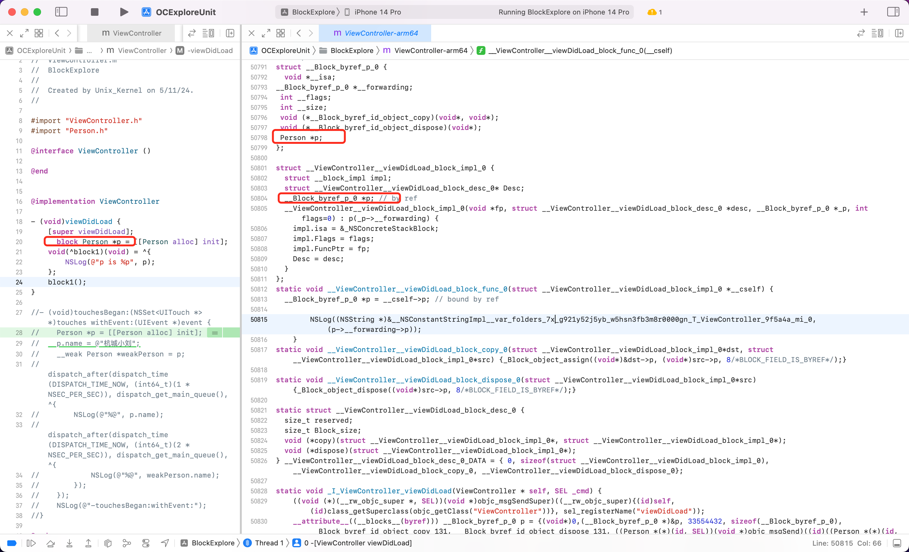


Demo2

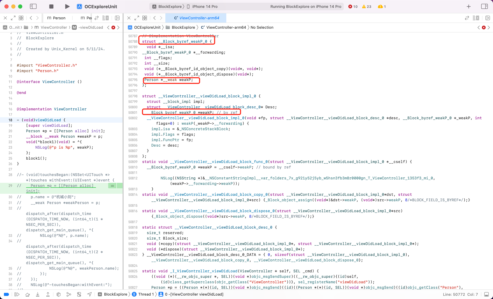

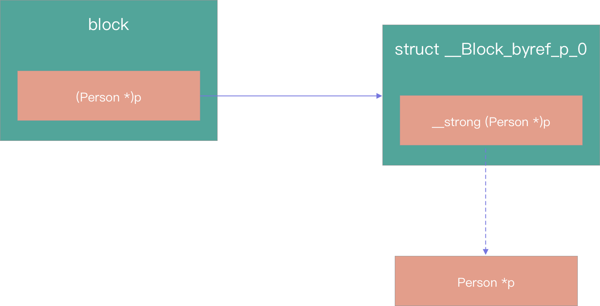


分析：

- block 结构体里面的针对变量生成的结构体新对象，都是 strong 指针
- block 所捕获的对象是` __weak` 还是` __strong` 决定的是新生成结构体对象里面的对象内存访问修饰符。

```c
int main(int argc, const char * argv[]) {
    /* @autoreleasepool */ { __AtAutoreleasePool __autoreleasepool; 
       __attribute__((__blocks__(byref))) __Block_byref_p_0 p = {(void*)0,(__Block_byref_p_0 *)&p, 33554432, sizeof(__Block_byref_p_0), __Block_byref_id_object_copy_131, __Block_byref_id_object_dispose_131, ((Person *(*)(id, SEL))(void *)objc_msgSend)((id)((Person *(*)(id, SEL))(void *)objc_msgSend)((id)objc_getClass("Person"), sel_registerName("alloc")), sel_registerName("init"))};
        void(*block)(void) = ((void (*)())&__main_block_impl_0((void *)__main_block_func_0, &__main_block_desc_0_DATA, (__Block_byref_p_0 *)&p, 570425344));
    }
    return 0;
}


static void __Block_byref_id_object_copy_131(void *dst, void *src) {
 _Block_object_assign((char*)dst + 40, *(void * *) ((char*)src + 40), 131);
}

static void __main_block_copy_0(struct __main_block_impl_0*dst, struct __main_block_impl_0*src) {
    _Block_object_assign((void*)&dst->p, (void*)src->p, 8/*BLOCK_FIELD_IS_BYREF*/);
}
```

如果 `__block` 修饰 `__strong` 则表示 block_impl 结构体中的 person 成员变量指向一个新的结构体 `__Block_byref_person_0`。这个线是强引用。

`__Block_byref_person_0` 结构体成员变量 person 真正的 Person 对象的引用关系要看 block 外部 person 的修饰是 `__strong` 还是 `__weak`，因为从栈上拷贝到堆上，会调用 block 的 desc 的 `__main_block_copy_0`，本质上调用的是 `_Block_object_assign` 

`__Block_byref_id_object_copy_131` 方法里的 40 代表什么?

```c

struct __Block_byref_p_0 {
    void *__isa; 8
__Block_byref_p_0 *__forwarding;    8
    int __flags; 4
    int __size; 4
    void (*__Block_byref_id_object_copy)(void*, void*); 8
    void (*__Block_byref_id_object_dispose)(void*); 8
    Person *p;
};


__attribute__((__blocks__(byref))) __Block_byref_p_0 p = {
    0,
    &p,
    33554432,
    sizeof(__Block_byref_p_0),
    __Block_byref_id_object_copy_131,
    __Block_byref_id_object_dispose_131,
    ((Person *(*)(id, SEL))(void *)objc_msgSend)((id)((Person *(*)(id, SEL))(void *)objc_msgSend)((id)objc_getClass("Person"), sel_registerName("alloc")), sel_registerName("init"))
    
};
```

`__Block_byref_p_0` 结构体地址上偏移40就是 p 对象。


## 循环引用

 self 是一个局部变量，block 访问 self，即存在捕获变量的效果。

为什么会存在循环引用？block 会对截获的变量是对象类型，会把所有权也进行捕获。为什么 strong 类型的对象，会造成对象和 block 的循环引用


### ARC 下

 `__weak`、`__unsafe_unretained` 修饰 `__block` 所修饰的变量。区别在于：

- `__weak` 不会产生强引用，指向的对象销毁时，会自动给指针置为 nil

- `__unsafe_retained` 不会产生强引用，不安全。当指向的对象销毁时，指针地址值不变。

```objectivec
@interface Person : NSObject
@property (nonatomic, assign) NSInteger age;
@property (nonatomic, copy) void (^block)(void);
- (void)test;
@end

@implementation Person
- (void)dealloc
{
    NSLog(@"%s", __func__);
}
- (void)test
{
    __weak typeof(self) weakself = self;
    self.block = ^{
        weakself.age = 23;
    };
    self.block();
    NSLog(@"age:%ld",  (long)self.age);
}
@end

Person *p = [[Person alloc] init];
[p test];
```

方法1: `__weak` 修饰。`__weak typeof(self) weakself = self;`

方法2: `__unsafe_retained` 修饰。`__unsafe_unretained typeof(self) weakself = self;`

方法3: `__block` 修饰。因为此时会构成3角关系。所以需要调用 block，block 内部需要将对象设置为 nil。虽然` __block` 方案也可以解决循环引用的问题，但是缺点是该 block 需要执行，方案会有限制。

```objectivec
__block Person *weakself = [[Person alloc] init];
p.block = ^{
    weakself.age = 23;
    NSLog(@"%ld", weakself.age);
    weakself = nil;
};
p.block();
```

`__unsafe_retained` 因为不安全所以不推荐，`__block` 因为使用繁琐，且必须等到调用 block 才会释放内存，所以不推荐。ARC 下最佳用 `__weak`

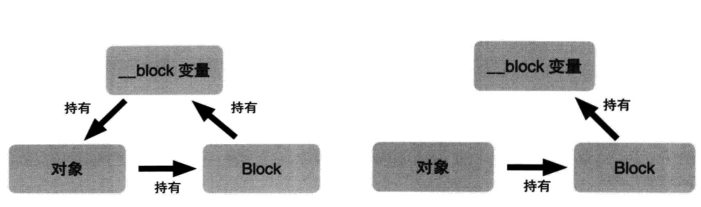


### MRC 下

方法1: `__unsafe_retained` 修饰。`__unsafe_unretained typeof(self) weakself = self;`

方法2: `__block` 修饰。MRC 下不会对 block 内部的对象引用计数 +1


## 总结

1. block 本质是什么？封装了函数调用及其调用环境的 OC 对象。本质实现是一个结构体。
2. `__block` 的作用是什么？可以对 block 外部的变量进行捕获，可以修改。但是需要注意内存管理相关问题。比如`__weak`、`__unsafe_unretained`、`__block` 
3. 修改 NSMutableArray 不需要加 `__block`? 是的，如果修改 NSMutableArray 指针比如`array = nil` 则需要加`__block `
4. block 属性修饰词为什么是 copy？没有进行 copy 操作的时候，block  就不会在堆上，对于 block 生命周期以及所使用到的内存，没办法灵活控制（由栈控制，出栈就死）。因为 block 的高频使用场景就是作为方法参数传递、作为类的属性值，所以最常见的场景是：赋值的地方不是使用的地方，所以要捕获周围环境参数和管理所捕获的内存、以及自身内存。
5. 为什么会产生循环引用？
   1. 如果当前当前 block 对于某个变量进行捕获，变量也是强引用类型的，block 捕获变量后，block 对变量是强引用关系，当前对象（VC）对 block 是强引用关系，变量也是 VC 强引用的，就产生了循环引用。
   2. 用 __block 修饰：
      - MRC 下不会产生循环引用
      - ARC 下会产生循环引用，可以采用断环的方式解决。