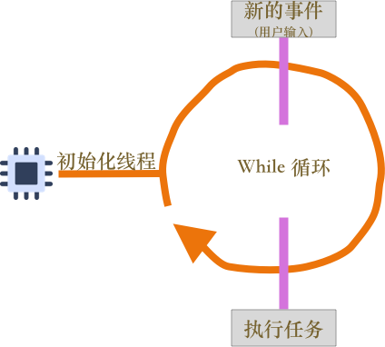
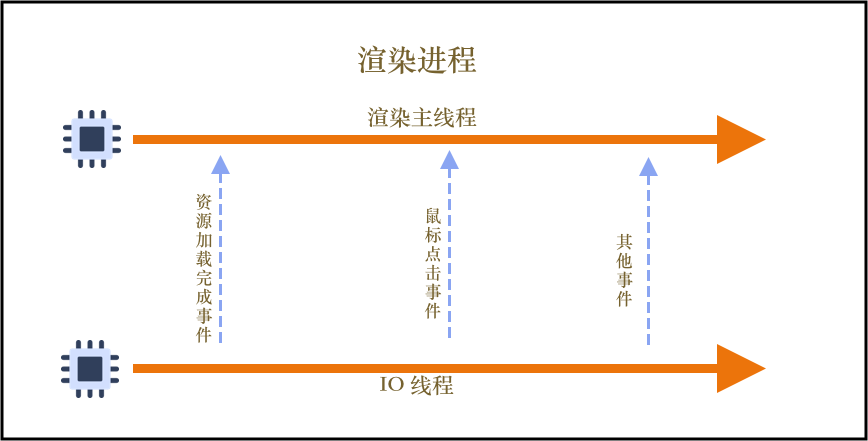
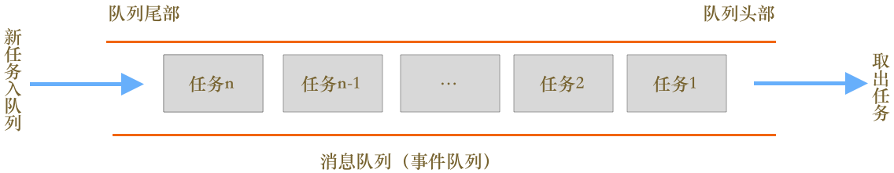
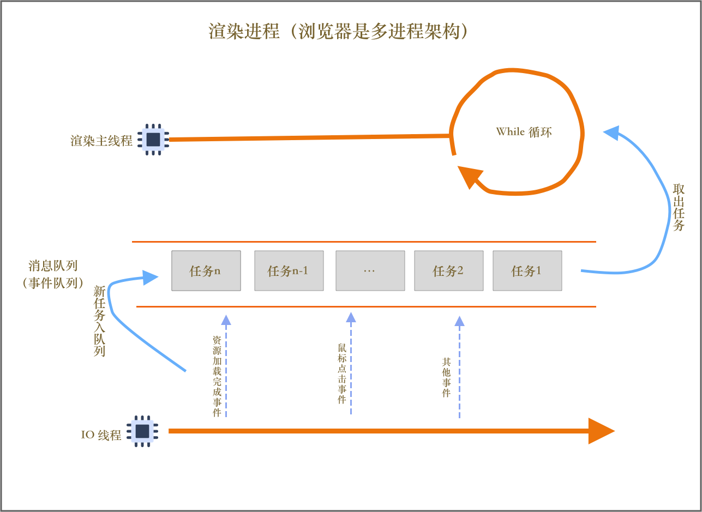

# 从 flutter 和前端角度出发，聊聊单线程模型下如何保证 UI 流畅性


> 文章主题是“单线程模型下如何保证 UI 的流畅性”。该话题针对的是 flutter 性能原理展开的，但是 dart 语言就是 js 的延伸，很多概念和机制都是一样的。具体不细聊。此外 js 也是单线程模型，在界面展示和 IO 等方面和 dart 类似。所以结合对比讲一下，帮助梳理和类比，更加容易掌握本文的主题，和知识的横向拓展。
>
> 先从前端角度出发，分析下 event loop 和事件队列模型。再从 flutter 层出发聊聊 dart 侧的事件队列和同步异步任务之间的关系。

## 一、单线程模型的设计

### 1. 最基础的单线程处理简单任务

假设有几个任务：

- 任务1: "姓名：" +  "杭城小刘"
- 任务2:  "年龄：" + "1995" + "02" + "20" 
- 任务3:  "大小："  + (2021 - 1995 + 1)
- 任务4:  打印任务1、2、3 的结果

在单线程中执行，代码可能如下：

```c++
//c
void mainThread () {
  string name = "姓名：" + "杭城小刘";
  string birthday = "年龄：" + "1995" + "02" + "20" 
  int age = 2021 - 1995 + 1;
	printf("个人信息为：%s, %s, 大小：%d", name.c_str(), birthday.c_str(), age);
}
```

线程开始执行任务，按照需求，单线程依次执行每个任务，执行完毕后线程马上退出。


### 2. 线程运行过程中来了新的任务怎么处理？

问题1 介绍的线程模型太简单太理想了，不可能从一开始就 n 个任务就确定了，大多数情况下，会接收到新的 m 个任务。那么 section1 中的设计就无法满足该需求。

**要在线程运行的过程中，能够接受并执行新的任务，就需要有一个事件循环机制。**最基础的事件循环可以想到用一个循环来实现。

```c++
// c++
int getInput() {
  int input = 0;
  cout<< "请输入一个数";
  cin>>input;
  return input;
}

void mainThread () {
  while(true) {
    int input1 = getInput();
    int input2 = getInput();
    int sum = input1 + input2;
    print("两数之和为：%d", sum);
  }
}
```

相较于第一版线程设计，这一版做了以下改进：

- 引入了**循环机制**，线程不会做完事情马上退出。
- 引入了**事件**。线程一开始会等待用户输入，等待的时候线程处于暂停状态，当用户输入完毕，线程得到输入的信息，此时线程被激活。执行相加的操作，最终输出结果。不断的等待输入，并计算输出。




### 3. 处理来自其他线程的任务

真实环境中的线程模块远远没有这么简单。比如浏览器环境下，线程可能正在绘制，可能会接收到1个来自用户鼠标点击的事件，1个来自网络加载 css 资源完成的事件等等。第二版线程模型虽然引入了事件循环机制，可以接受新的事件任务，但是发现没？这些任务之来自线程内部，该设计是无法接受来自其他线程的任务的。




从上图可以看出，渲染主线程会频繁接收到来自于 IO 线程的一些事件任务，当接受到的资源加载完成后的消息，则渲染线程会开始 DOM 解析；当接收到来自鼠标点击的消息，渲染主线程则会执行绑定好的鼠标点击事件脚本（js）来处理事件。

需要一个合理的数据结构，来存放并获取其他线程发送的消息？

**消息队列**这个词大家都听过，在 GUI 系统中，事件队列是一个通用解决方案。




**消息队列（事件队列）是一种合理的数据结构。要执行的任务添加到队列的尾部，需要执行的任务，从队列的头部取出。**

有了消息队列之后，线程模型得到了升华，如下：




