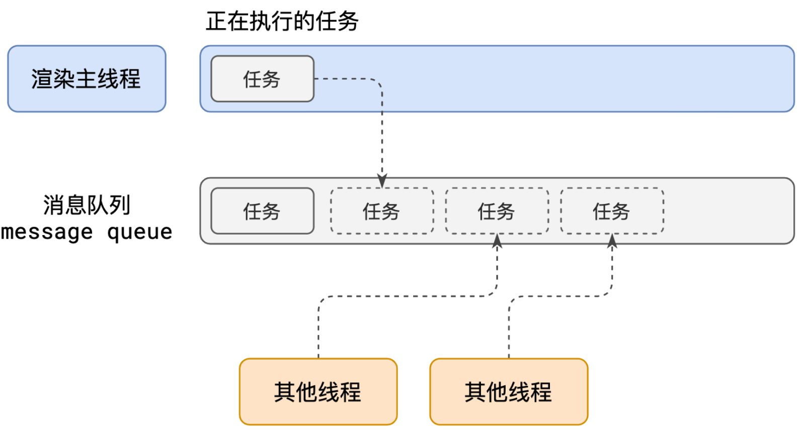

# 事件循环


## 浏览器多进程架构
从安全性、高性能等原因出发，目前浏览器已经是多进程架构模式，至于演进历史，本文不再展开，感兴趣的可以查看这篇[“Electron” 一个可圈可点的 PC 多端融合方案]()文章。

现在的架构设计如下：


一个页面最少包括：1个网络进程、1个浏览器进程、1个 GPU 进程、多个渲染进程、多个插件进程

- 浏览器进程：负责界面展示、用户交互（比如滚动条）、子进程管理协作、同时提供存储功能。同时内部会启动多个线程处理不同的任务
- 渲染进程：核心任务是将 HTML、CSS、Javascript 转换为用户可以与之的网页，排版引擎 Blink 和 Javascript 引擎 V8 都是运行在该进程中。默认情况下，Chrome 为每个 tab 标签页创建一个新的渲染进程。出于安全考虑，渲染进程都是运行在沙箱机制下的。渲染进程启动后，会开启一个渲染主线程，主线程负责执行 HTML、CSS、JS 代码。
- GPU 进程：最早 Chrome 刚发布的时候是没有 GPU 进程的，而 GPU 的使用初衷是实现 css 3D 效果。随后网页、Chrome 的 UI 界面都选择采用 GPU 来绘制，这使得 GPU 成为浏览器普遍需求。最后 Chrome 多进程架构中也引入了 GPU 进程。
- 网络进程：主要负责页面的网络资源请求加载。早期是作为一个模块运行在浏览器进程里面的，最近才独立出来作为一个单独的进程。网络进程内部会启动多个线程来处理不同的网路任务
- 插件进程：主要负责插件的运行。因插件代码由普通开发者书写，所以在 QA 方面可能不是那么完善，代码质量参差不齐，插件容易奔溃，所以需要通过插件进程来隔离，以保证插件进程的奔溃不会对浏览器和页面造成影响。

所以，你会发现打开一个页面，查看进程发现有4个进程。凡事具有两面性，上面说了多进程架构带来浏览器稳定性、安全性、流畅性，但是也带来一些问题：

- 更高资源占用：每个进程都会包含公共基础结构的副本（如 Javascript 运行环境），这意味着浏览器将会消耗更多的资源
- 更复杂的体系结构：浏览器各模块之间耦合度高、拓展性差，会导致现在的架构很难适应新需求。


## 渲染主线程是如何工作的

渲染主线程是浏览器中最繁忙的线程，需要它处理的任务包括但不限于：

- HTML 解析和构建 DOM 树：渲染主线程会解析 HTML 代码，并构建 DOM（文档对象模型）树。DOM 树是网页的结构化表示，它描述了网页中的元素、标签和它们之间的关系。
- CSS 解析和构建样式树：渲染主线程会解析 CSS 样式表，并构建样式树。样式树表示了网页中的元素和它们的样式信息，包括颜色、字体、布局等属性。
- 布局（Layout）：渲染主线程会根据 DOM 树和样式树计算元素在页面中的位置和大小，确定它们的布局。布局过程也被称为回流（reflow）或重排（relayout）。
- 绘制（Painting）：渲染主线程会将布局后的元素绘制到屏幕上，形成可见的网页内容。这个过程包括生成绘制命令、将命令发送给图形系统，并最终在屏幕上绘制出来。
- JavaScript 执行：渲染主线程会执行网页中的 JavaScript 代码，处理交互、动画和事件等。JavaScript 的执行可能会引起 DOM 树和样式树的变化，进而触发布局和绘制。
- 处理用户输入：渲染主线程会监听用户的输入事件，如鼠标点击、键盘输入等，并根据用户的操作进行相应的处理。这包括响应用户的点击、滚动、拖拽等操作，以及处理表单提交和页面跳转等事件。

渲染主线程是渲染进程中的核心部分，它负责将网页的结构、样式和交互转化为可视化的网页内容。通过优化渲染主线程的性能和效率，可以提高网页的渲染速度和用户体验。同时，渲染主线程也需要与其他线程（如网络线程、合成线程等）进行协作，以实现流畅的页面渲染和交互效果。


## 主线程如何有条不紊工作

浏览器主线程很繁忙，遇到以下情况该怎么处理：

- 正在执行某个方法，此时用户点击了按钮触发了事件，该立即去执行点击事件的处理函数吗?
- 正在执行某个方法，此时某个计时器到达了时间，该立即去执行它的回调吗? 
- Input 输入框内容改变了，触发了 `oninput` 事件 ，此时刚好某个计时器也到达了时间，回调函数和 oninput 事件如何调度？

熟悉其他系统设计的同学可能会立马想到用**队列**来解决问题。浏览器对这个 case 也采用队列，叫做事件队列。




解释下这个事件队列：

1. 一开始，渲染主线程开启一个事件循环（也可以认为是死循环一直在跑）
2. 每一次循环会检查消息队列中是否有任务存在。如果有，就取出第一个任务执行，执行完一个后进入下一次循环;如果没有，则进入休眠状态
3. 其他所有线程（包括浏览器其他进程中的线程）都可以向这个事件队列中添加任务，新任务会被添加到队列尾部。添加新任务时，如果主线程是休眠的，则会唤醒主线程，继续从事件队列头部读取任务并不断执行
4. 持续这个流程

当然，这个解释是相对宏观宽泛的，具包括哪些队列、不同任务里的任务优先级是怎么样的下面会逐步展开。


1. 执行当前的同步任务：JS 引擎每次执行当前的同步任务，将其推入调用栈中执行。同步任务是按照代码顺序执行的，知道遇到异步任务
2. 执行微任务队列：在执行同步任务的过程中，如果遇到微任务（Microtask）如 Promise 的回调函数、MutationObserver 的回调函数则被添加到微任务队列（Microtask Queue）中。当前的同步任务执行完毕后，在进入下一轮事件循环之前，JS 引擎会按照顺序执行微任务队列中的事件。
3. 

1. 每次循环都会检查消息队列中是否存在任务，如果存在，就取出第一个任务执行，执行完一个后进入另一个


## 异步任务

### 何为异步

代码在执行的过程中会遇到一些无法立即处理的逻辑，比如：

- 计时器完成之后需要执行的任务：setTimeout、setInterval
- 网络通信完成后需要执行的任务：XHR、Fetch
- 用户交互后需要执行的任务：addEventListener

如果渲染主线程遇到这些任务时等待的话，就会让主线程处于等待的状态，对于用户而言，就是浏览器的「卡死」。

应对这种情况，浏览器采用异步的设计来解决，如下图


使用异步的方案，可以使得主线程不等待、不阻塞，高效有序的执行逻辑。

何为异步？异步（Asynchronous）是指一种非阻塞的执行方式，允许同时执行多个任务而不会阻塞主线程。异步任务是指那些不会立即执行或不会阻塞代码执行的任务。

以下是常见的异步操作和写法：

1. 回调函数：使用回调函数是一种常见的处理异步操作的方式。在执行异步操作时，可以提供一个回调函数，在操作完成后调用回调函数来处理结果。
2. Promise：ES6 引入的一种处理异步操作的机制。它可以用于处理异步操作的成功和失败，并支持链式调用。
3. async/await：ES8 引入的一种更直观处理异步操作的语法。通过在函数前面加上 `async` 关键字，可以在函数内部使用 `await` 关键字来等待异步操作的结果。
4. 定时器函数：JavaScript 提供了一些定时器函数，如 `setTimeout` 和 `setInterval`，它们可以用来延迟执行代码或定期执行代码
5. XHR 和 Fetch：通过使用 AJAX 或 Fetch API，可以发送异步请求并获取服务器返回的数据。
6. 交互事件：当事件发生时，注册好的回调函数通过异步来处理事件，而不会阻塞主线程的执行


### 异步的意义

浏览器是一个多进程架构，包含诸多进程，不同进程核心处理的问题不一样。浏览器进程负责界面展示、用户交互（比如滚动条）等。JS 是一门单线程语言，因为运行在浏览器渲染主线程中。然而这个浏览器主线程工作特别繁忙，渲染页面、执行 JS、负责用户交互等，如果采用同步的方式，很有可能会导致主线程阻塞，从而导致消息队列 中的很多其他任务无法得到执行。这样一来，一方面会导致繁忙的主线程白 白的消耗时间，另一方面导致⻚面无法及时更新，给用户造成卡死现象。

为了解决同步带来的问题，浏览器采用异步的设计。做法是渲染主线程存在一个事件队列，当某些任务（上述描述的异步任务）发生时，主线程会将该任务派发给其他线程处理（比如定时任务交给计时器线程处理），自身立即结束该任务的执行，转而执行后续逻辑。当派发给其他线程的异步任务执行完毕后，该异步事件的回调函数将被包装成任务，添加到消息队列的尾部，待主线程调度执行。

这种设计使得即使是单线程的 JS，运行也不会卡顿，渲染主线程有条不紊、高效的执行，保证了浏览器的流畅性。

**通过使用异步，可以更好地处理耗时的操作、网络请求、文件读写等任务，提高程序的性能和用户体验。**


## JS 为何会阻塞渲染？

由于 JS 可以操作 DOM，如果在修改 DOM 元素属性的同时渲染界面（JS 线程与 UI 线程同时运行），那么可能会发生一些不符合预期的结果了，渲染线程前后获得的元素数据不一致。

因此为了防止产生渲染产生不符合预期的结果，**浏览器设置 GUI 渲染线程和 JS 引擎为互斥关系**。当 JS 引擎执行时 GUI 线程会被挂起。GUI 的更新会被保存在一个队列中，等到 JS 引擎线程空闲时立即被执行。

因为互斥，所以可以推导出，JS 如果执行时间过长就会阻塞页面。

举个例子：

```
<h1>你好</h1>
<button>问好</button>
<script>
  let h1 = document.querySelector('h1');
  let btn = document.querySelector('button');
  let delay = function(duration) {
    let startTime = Date.now();
    while (Date.now() - startTime < duration) {}
  }
  btn.onclick = function () {
    h1.textContent = '早上好，小刘';
    delay(3000);
  };
</script>
```

效果就是：点击按钮修改 h1 标签内的文本。但是在点击后停了3秒后才开始执行。那这个现象如何解释呢？

T0 时刻：最开始的时候，主线程没有任务任务需要执行。但是主线程告诉交互线程，你需要监听用户的点击事件，点击后需要执行 callback


T1时刻：当用户点击后，交互线程会把 callback 封装成一个任务，添加到事件循环队列的尾部。此时主线程依旧没有任务，所以主线程事件循环将被唤醒，从事件队列的头部取出一个任务去执行。大的一个任务里包含2个子事件：修改 DOM 和 延迟3秒。修改 DOM 这句指令执行后，浏览器要想看的见，需要内部会产生一个绘制任务（硬件设备显示图形的画家算法）。绘制任务被添加到事件队列尾部后，立马执行延迟3秒的事件。


T2时刻：到达T2时刻后，主线程又空了，此时从事件队列中读取绘制任务。进而去显示出 DOM 文本修改后的结果（但此时前面已经等待了3秒钟，所以体感上会有一种卡顿的现象）


## 任务有优先级吗

任务没有优先级，因为在消息队列中，无差别从对头选出任务，给队尾添加任务。

**但消息队列是有优先级的。**怎么理解？因为存在多个队列

根据 W3C 定义：

- 每个任务都有一个任务类型，同一种任务类型的任务归属于同一个队列。不同任务类型的任务被派发到不同的队列中（在一次事件循环中，浏览器可以根据实际情况从不同的任务队列中取出任务并执行）
- 浏览器必须事先准备好1个微任务队列。微队列中的任务优先所有其他任务执行，优先级最高

浏览器的复杂度急剧提升，W3C 不再使用宏队列的说法。

目前 chromium 中，至少包含以下队列：

- 延时队列：用于存放计时器到达后的回调任务，优先级「中」
- 交互队列：用于存放用户操作后产生的事件处理任务，优先级「高」
- 微队列：用户存放需要最快执行的任务，优先级「最高」

添加任务到微队列的主要方式主要是使用 Promise、MutationObserver。此外新加入的 [`queueMicrotask()`](https://developer.mozilla.org/zh-CN/docs/Web/API/queueMicrotask) 方法增加了一种标准的方式，可以安全的引入微任务。


## JS 事件循环

事件循环又叫消息循环，是指在单线程中处理任务队列的机制。

1. JS 引擎会创建一个全局作用域，并将其添加到调用栈中
2. 如果有同步任务，则直接进入主线程执行该任务
3. 若存在微任务或者用户交互事件、定时器事件等异步任务，则分门别类，添加到对应的任务队列中
4. 当所有的同步任务执行完毕后，JS 引擎开始按照队列优先级检查任务队列是否存在未执行的任务
   - 如果微任务队列中存在任务，则优先从微任务队列对头取出1个任务执行，然后再次返回到主线程检查是否有新的同步任务。重复此过程，直到微任务队列为空
   - 如果微任务队列已经没有任务了，则从交互队列队列中判断，如果用户触发了某个事件，则把交互队列中对应的回调取出来放到主线程执行
   - 如果交互队列为空了，而定时器队列不为空，则判断定时器任务有没有到时见，如果已经达到可执行的条件，则把对应的回调事件放到主线程进行执行
   - 如果微任务队列和用户交互队列、定时器队列都为空，那么 JS 引擎会抛出一个“There are no more tasks to run.“ 的错误信息，表示事件循环结束


QA：JS 计时器准吗？

不准。存在以下几个原因：

- 计算机硬件没有原子钟，无法做到精确计时。依靠网络来和拥有原子钟的服务器进行同步
- 操作系统的计时函数本身就有少量偏差，由于 JS 的计时器最终调用的是操作系统的函数，也就携带了这些偏差
- 按照 W3C 的标准，浏览器实现计时器时，如果嵌套层级超过 5 层，则会带有 4 毫秒的最少时间
- 受事件循环的影响，计时器的回调函数只能在主线程空闲时运行，因此又带来了偏差


