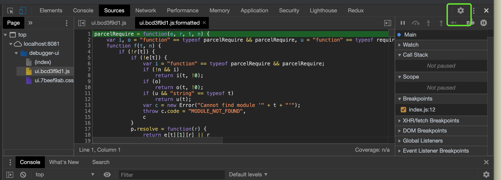
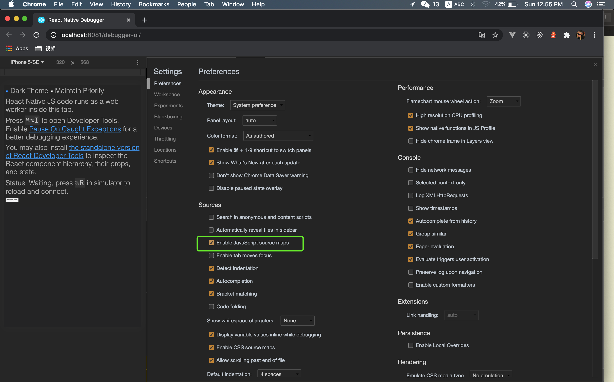
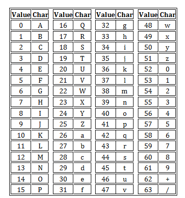
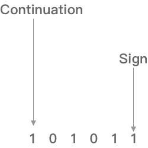

# sourceMap 闪亮登场

[jQuery 1.9](http://blog.jquery.com/2013/01/15/jquery-1-9-final-jquery-2-0-beta-migrate-final-released/)发布。


这是2.0版之前的最后一个新版本，有很多新功能，其中一个就是支持Source Map。

访问 http://ajax.googleapis.com/ajax/libs/jquery/1.9.0/jquery.min.js，打开压缩后的版本，滚动到底部，你可以看到最后一行是这样的：

```js
//@ sourceMappingURL=jquery.min.map
```

这就是 Source Map。它是一个独立的 map 文件，与源码在同一个目录下，你可以[点击进去](http://ajax.googleapis.com/ajax/libs/jquery/1.9.0/jquery.min.map)，看看它的样子。

这是一个很有用的功能，本文将详细讲解这个功能。


## 一、从源码转换讲起

JavaScript脚本正变得越来越复杂。大部分源码（尤其是各种函数库和框架）都要经过转换，才能投入生产环境。

常见的源码转换，主要是以下三种情况：

1. 压缩，减小体积。比如jQuery 1.9的源码，压缩前是252KB，压缩后是32KB。
2. 多个文件合并，减少HTTP请求数。
3. 其他语言编译成JavaScript。最常见的例子就是CoffeeScript。

这三种情况，都使得实际运行的代码不同于开发代码，除错（debug）变得困难重重。

通常，JavaScript 的解释器会告诉你，第几行第几列代码出错。但是，这对于转换后的代码毫无用处。举例来说，jQuery 1.9 压缩后只有3行，每行3万个字符，所有内部变量都改了名字。你看着报错信息，感到毫无头绪，根本不知道它所对应的原始位置。

这就是 Source map 想要解决的问题。


## 二、什么是 Source map

简单说，Source map 就是一个信息文件，里面储存着位置信息。也就是说，转换后的代码的每一个位置，所对应的转换前的位置。

有了它，出错的时候，除错工具将直接显示原始代码，而不是转换后的代码。这无疑给开发者带来了很大方便。


Chrome 浏览器支持这个功能。在 Developer Tools 的 Setting 设置中，确认选中 "Enable source maps"。






##  三、如何启用 Source map

正如前文所提到的，只要在转换后的代码尾部，加上一行就可以了。

```js
//@ sourceMappingURL=/path/to/file.js.map
```

map 文件可以放在网络上，也可以放在本地文件系统。


## 四、如何生成 Source map 

最常用的方法是使用 Google 的 [Closure编译器](https://developers.google.com/closure/compiler/)。

生成命令的格式如下：

```shell
java -jar compiler.jar \ 
　　　　--js script.js \
　　　　--create_source_map ./script-min.js.map \
　　　　--source_map_format=V3 \
　　　　--js_output_file script-min.js
```

各个参数的意义如下：

- js： 转换前的代码文件
　　- create_source_map： 生成的source map文件
　　- source_map_format：source map的版本，目前一律采用V3。
　　- js_output_file： 转换后的代码文件。

其他的生成方法可以参考[这篇文章](http://net.tutsplus.com/tutorials/tools-and-tips/source-maps-101/)。


## 五、Source map 的格式

打开 Source map 文件，它大概是这个样子：

```json
{
　　　　version : 3,
　　　　file: "out.js",
　　　　sourceRoot : "",
　　　　sources: ["foo.js", "bar.js"],
　　　　names: ["src", "maps", "are", "fun"],
　　　　mappings: "AAgBC,SAAQ,CAAEA"
　　}
```

整个文件就是一个 JavaScript 对象，可以被解释器读取。它主要有以下几个属性：

- version：Source map的版本，目前为3。
- file：转换后的文件名。

- sourceRoot：转换前的文件所在的目录。如果与转换前的文件在同一目录，该项为空。
- sources：转换前的文件。该项是一个数组，表示可能存在多个文件合并。
- names：转换前的所有变量名和属性名。
- mappings：记录位置信息的字符串，下文详细介绍。


## 六、mappings 属性

下面才是真正有趣的部分：两个文件的各个位置是如何一一对应的。

关键就是 map 文件的 mappings 属性。这是一个很长的字符串，它分成三层。

第一层是**行对应**，以分号（;）表示，每个分号对应转换后源码的一行。所以，第一个分号前的内容，就对应源码的第一行，以此类推。

第二层是**位置对应**，以逗号（,）表示，每个逗号对应转换后源码的一个位置。所以，第一个逗号前的内容，就对应该行源码的第一个位置，以此类推。

第三层是**位置转换**，以 [VLQ编码](http://en.wikipedia.org/wiki/Variable-length_quantity) 表示，代表该位置对应的转换前的源码位置。

举例来说，假定mappings属性的内容如下：

```json
mappings:"AAAAA,BBBBB;CCCCC"
```

就表示，转换后的源码分成两行，第一行有两个位置，第二行有一个位置。


## 七、位置对应的原理 

每个位置使用五位，表示五个字段。

从左边算起，

- 第一位，表示这个位置在（转换后的代码的）的第几列。

- 第二位，表示这个位置属于sources属性中的哪一个文件。

- 第三位，表示这个位置属于转换前代码的第几行。

-  第四位，表示这个位置属于转换前代码的第几列。

- 第五位，表示这个位置属于names属性中的哪一个变量。

  有几点需要说明。首先，所有的值都是以0作为基数的。其次，第五位不是必需的，如果该位置没有对应  name 属性中的变量，可以省略第五位。再次，每一位都采用 VLQ 编码表示；由于 VLQ 编码是变长的，所以每一位可以由多个字符构成。

如果某个位置是 AAAAA，由于 A 在 VLQ 编码中表示0，因此这个位置的五个位实际上都是0。它的意思是，该位置在转换后代码的第0列，对应sources属性中第0个文件，属于转换前代码的第0行第0列，对应 names 属性中的第0个变量。


## 八、VLQ 编码

最后，谈谈如何用 [VLQ编码](http://en.wikipedia.org/wiki/Variable-length_quantity) 表示数值。

这种编码最早用于 MIDI 文件，后来被多种格式采用。它的特点就是可以非常精简地表示很大的数值。

VLQ 编码是变长的。如果（整）数值在-15到+15之间（含两个端点），用一个字符表示；超出这个范围，就需要用多个字符表示。它规定，每个字符使用6个两进制位，正好可以借用 [Base 64](http://en.wikipedia.org/wiki/Base_64) 编码的字符表。



在这6个位中，左边的第一位（最高位）表示是否"连续"（continuation）。如果是1，代表这６个位后面的6个位也属于同一个数；如果是0，表示该数值到这6个位结束。



这6个位中的右边最后一位（最低位）的含义，取决于这6个位是否是某个数值的VLQ编码的第一个字符。如果是的，这个位代表"符号"（sign），0为正，1为负（Source map的符号固定为0）；如果不是，这个位没有特殊含义，被算作数值的一部分。


## 九、VLQ 编码：实例

下面看一个例子，如何对数值16进行VLQ编码。

第一步，将16改写成二进制形式10000。

第二步，在最右边补充符号位。因为16大于0，所以符号位为0，整个数变成100000。

第三步，从右边的最低位开始，将整个数每隔5位，进行分段，即变成1和00000两段。如果最高位所在的段不足5位，则前面补0，因此两段变成00001和00000。

第四步，将两段的顺序倒过来，即00000和00001。

第五步，在每一段的最前面添加一个"连续位"，除了最后一段为0，其他都为1，即变成100000和000001。

第六步，将每一段转成Base 64编码。

查表可知，100000 为 g，000001 为 B。因此，数值 16 的 VLQ 编码为 `gB`。具体可以看代码：https://github.com/mozilla/source-map


## 参考资料

- [Source Map Revision 3 Proposal](https://docs.google.com/document/d/1U1RGAehQwRypUTovF1KRlpiOFze0b-_2gc6fAH0KY0k/edit#heading=h.ue4jskhddao6)
- [Introduction to JavaScript Source Maps](https://www.html5rocks.com/en/tutorials/developertools/sourcemaps/)
- [JavaScript Source Map 详解](http://www.ruanyifeng.com/blog/2013/01/javascript_source_map.html)