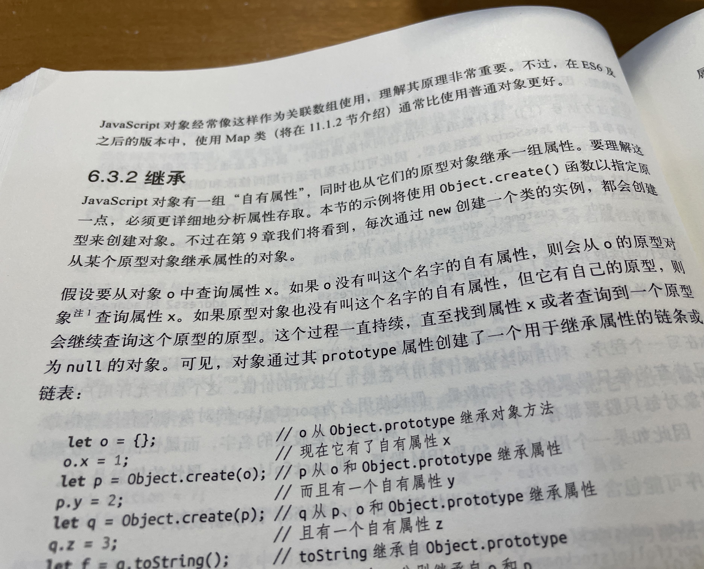

# JS原型链与Objective-C内存布局不能说的秘密

## 一、原型链与 Objective-C 的秘密

假期看了本关于 JS 的书。很多地方就是已知知识。但是看到2个地方感觉和现有知识体系有关联，蛮有意思。拍照记录了下

Javascript 借鉴了 Self 语言中关于原型的继承，可能会比较陌生，什么是“Self”？
看看 JS 的表现：假设从对象 O 中查询属性 X

1. 如果 O 没有 X 这个自有属性，则会从 O 的原型对象查询属性 X
2. 如果原型对象也没有叫做 X 的自有属性，但它有自己的原型，则继续查询这个原型的原型
3. 这个过程会不断继续，直至找到属性 X 或者查询到一个原型为 null 的对象
可见，对象通过其 prototype 属性创建了一个用于继承属性的链条或链表。

其实，Self 语言由派生自 Smalltalk，也就是 Objective-C 的借鉴语言。访问 JS 对象属性、方法（找不到则从原型链上不断回溯，直到找到或者找到元类对象 null），这个特性和 OC 一模一样。

关于 Self 语言有2个中文 PDF可供翻阅。[SELF:简洁的威力](./selfpower-zh.pdf)、[克隆的反攻](./crpitv13noble-zh.pdf)

