# TCP、UDP 的比较

> 网络协议是每个工程师都需要了解和掌握的知识。 TCP/IP 中有2个最具代表性的传输层协议：TCP、UDP。
>
> 记住这句话：TCP 是面向字节流协议、UDP 是面向报文协议。主要是因为发送方的发送消息的机制不同。
>
> 下面的内容会探索这些。

## 一、TCP/IP 网络模型

计算机与网络设备要相互通信，双方就必须基于相同的方法。比如，如何探测到通信目标、由哪一边先发起通信、使用哪种语言进行通信、怎样结束通信等规则都需要事先确定。不同的硬件、操作系统之间的通信，所有的这一切都需要一种规则。而我们就把这种规则称为协议（protocol）。

TCP/IP 是协议簇，比如：TCP、UDP、IP、FTP、HTTP、ICMP、SMTP 等都属于 TCP/IP 簇内的协议。

TCP/IP模型是互联网的基础，它是一系列网络协议的总称。这些协议可以划分为四层，分别为链路层、网络层、传输层和应用层。

- 链路层：负责封装和解封装 IP 报文，发送和接受 ARP/RARP 报文等。
- 网络层：负责路由以及把分组报文发送给目标网络或主机。
- 传输层：负责对报文进行分组和重组，并以 TCP 或 UDP 协议格式封装报文。
- 应用层：负责向用户提供应用程序，比如HTTP、FTP、Telnet、DNS、SMTP等。

| OSI 七层模型 |  TCP/IP 概念层模型 |  功能 |  TCP/IP 协议簇 |
|-|-|-|-|
|应用层 |应用层 |文件传输、电子邮件、文件服务、虚拟终端 | FTP、SMTP、TELNET、DNS|
|表示层 |应用层 |数据格式化、代码转换、数据加密 | 没有协议|
|会话层 |应用层 |解除或建立别的节点的联系 | 没有协议 |
|传输层 | 传输层 |提供端对端的接口 | UDP、TCP |
|网络层 |网络层 |为数据包选择路由 | IP、ICMP、RIP、OSPF、BGP、IGMP|
|物理链路层 |链路层 |传输有地址的帧以及错误检测功能 | SLIP、CSLIP、PPP、ARP、RARP、MTU|
|物理层 |链路层 |以二进制数据形式在物理媒体上传输数据 | ISO2110、IEEE802、IEEE802.2|

在网络体系结构中网络通信的建立必须是在通信双方的对等层进行，不能交错。 在整个数据传输过程中，数据在发送端时经过各层时都要附加上相应层的协议头和协议尾（仅数据链路层需要封装协议尾）部分，也就是要对数据进行协议封装，以标识对应层所用的通信协议。接下去介绍 TCP/IP 中有两个具有代表性的传输层协议：TCP 和 UDP。

## 二、UDP

UDP（User Data Protocol）协议全称是用户数据报协议，在网络中它与  TCP 协议一样用于处理数据包，是一种无连接的协议。在 OSI 模型中，位于第四层即传输层，处于 IP 协议的上一层。UDP 有不提供数据包分组、组装和不能对数据包进行排序的缺点，也就是说，当报文发送之后，是无法得知其是否安全完整到达的。

特点：

### 1.面向无连接

首先 UDP 是不需要和 TCP一样在发送数据前进行三次握手建立连接的，想发数据就可以开始发送了。并且也只是数据报文的搬运工，不会对数据报文进行任何拆分和拼接操作。

具体来说就是：
- 在发送端，应用层将数据传递给传输层的 UDP 协议，UDP 只会给数据增加一个 UDP 头标识下是 UDP 协议，然后就传递给网络层了
- 在接收端，网络层将数据传递给传输层，UDP 只去除 IP 报文头就传递给应用层，不会任何拼接操作
  
### 2.有单播、多播、广播的功能

UDP 不止支持一对一的传输方式，同样支持一对多，多对多，多对一的方式，也就是说 UDP 提供了单播，多播，广播的功能。

### 3.UDP是面向报文的

发送方的 UDP 对应用程序交下来的报文，在添加首部后就向下交付 IP 层。UDP 对应用层交下来的报文，既不合并，也不拆分，而是保留这些报文的边界。因此，应用程序必须选择合适大小的报文

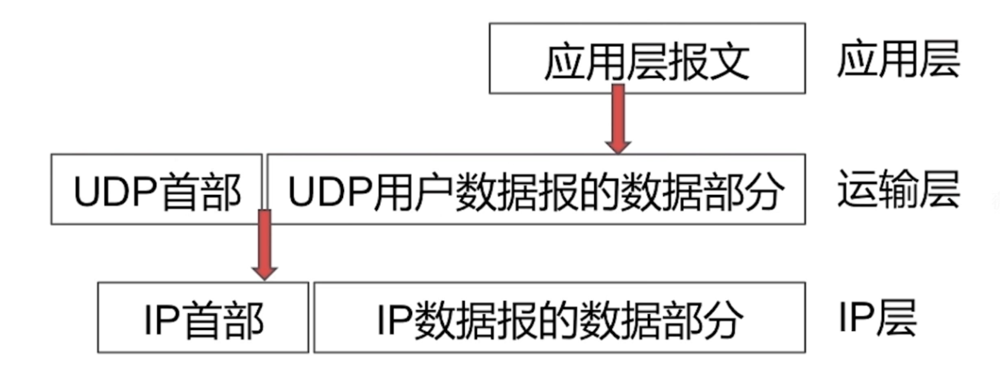

UDP 在发送消息时，在传输层直接就将一个消息打包成一个完整的包，组装好 UDP 头部，不进行切割，就转发给网络层。也就是每一个UDP 报文就是一个消息。服务端在接收到 UDP 报文时，会将它放到一个队列中，一个元素就是一个 UDP 报文。每次读取时，读取一个元素

### 4.不可靠性

- 首先不可靠性体现在无连接上，通信都不需要建立连接，想发就发，这样的情况肯定不可靠。
- 并且收到什么数据就传递什么数据，并且也不会备份数据，发送数据也不会关心对方是否已经正确接收到数据了。
- 再者网络环境时好时坏，但是 UDP 因为没有拥塞控制，一直会以恒定的速度发送数据。即使网络条件不好，也不会对发送速率进行调整。这样实现的弊端就是在网络条件不好的情况下可能会导致丢包，但是优点也很明显，在某些实时性要求高的场景（比如电话会议）就需要使用 UDP 而不是 TCP。

从上面的动态图可以得知，UDP只会把想发的数据报文一股脑的丢给对方，并不在意数据有无安全完整到达。

### 5.头部开销小，传输数据高效

- 两个十六位的端口号，分别为源端口（可选字段）和目标端口
- 整个数据报文的长度
- 整个数据报文的检验和（IPv4 可选 字段），该字段用于发现头部信息和数据中的错误

因此 UDP 的头部开销小，只有八字节，相比 TCP 的至少二十字节要少得多，在传输数据报文时是很高效的

### 功能

#### 复用、分用

复用：UDP 多端口复用指的是在 UDP 通信中，可以通过一个 UDP 端口同时处理多个不同的应用程序或服务的通信。这种技术允许多个应用程序共享同一个 UDP 端口进行通信，而不需要为每个应用程序分配独立的端口。通过在接收数据时区分不同的目标端口，可以实现对多个应用程序的数据传输和处理。这种方式可以提高网络资源的利用率和简化网络配置，但需要确保在接收端能够正确解析和处理来自不同端口的数据。

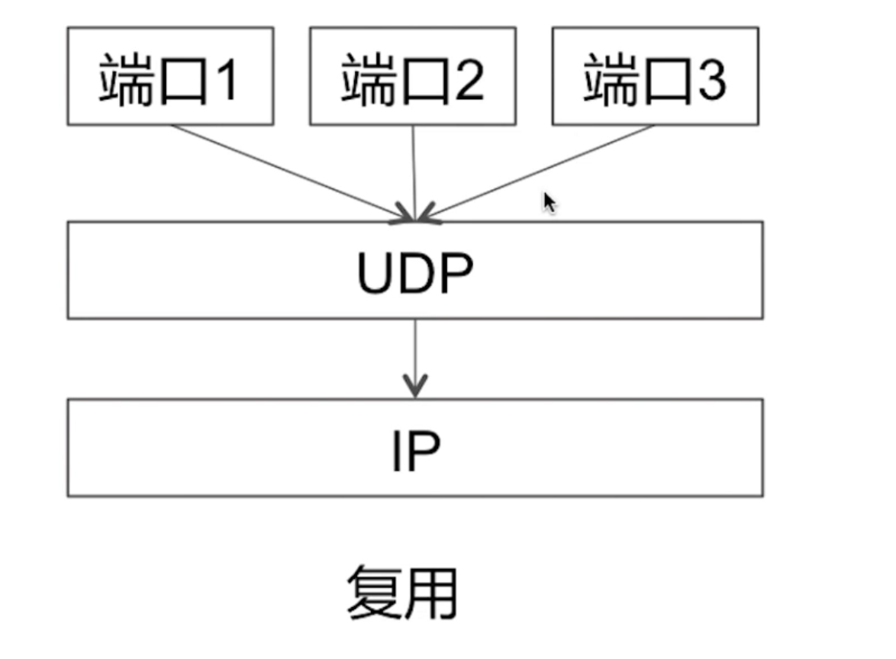

分用：UDP 多端口分用是指在 UDP  通信中，可以通过一个应用程序或服务同时监听和处理多个不同的 UDP 端口。这种技术允许一个应用程序在同一时间接收来自多个不同 UDP 端口的数据包，并根据端口信息来区分和处理这些数据。通过 UDP 多端口分用，一个应用程序可以灵活地处理多个 UDP 端口上的数据，实现更高效的网络通信和数据处理

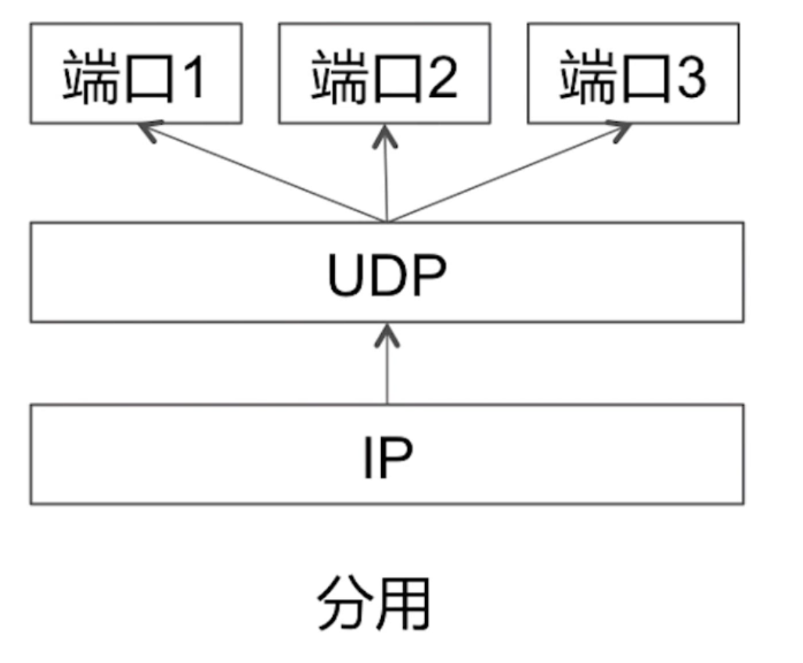

#### 差错检测

以16位字位一个单元，按二进制反码计算出这些16位字的和。将和的二进制反码写入到检验和位。

IM 参考 UDP 差错检测，判断消息有没有被篡改。

## 三、TCP

当一台计算机想要与另一台计算机通讯时，两台计算机之间的通信需要畅通且可靠，这样才能保证正确收发数据。例如，当你想查看网页或查看电子邮件时，希望完整且按顺序查看网页，而不丢失任何内容。当你下载文件时，希望获得的是完整的文件，而不仅仅是文件的一部分，因为如果数据丢失或乱序，都不是你希望得到的结果，于是就用到了TCP。

TCP协议全称是传输控制协议是一种面向连接的、可靠的、基于字节流的传输层通信协议，由 IETF 的RFC 793定义。TCP 是面向连接的、可靠的流协议。流就是指不间断的数据结构，你可以把它想象成排水管中的水流。

### 三次握手

HTTP 协议是建立在请求相应模型上的。首先客户端建立一条与服务器的 TCP 链接，并发送请求到服务器，包含请求方法、URI、协议版本以及相关的 MIME 信息。服务器响应一个状态行，包含协议版本、一个成功和失败码、以及相关的 MIME 信息。  

HTTP/1.0 为每次 HTTP 请求/相应都建立一条新的 TCP 链接。因此一个包含图片和多媒体的网页将建立多次的短期 TCP 链接。且一次 TCP 链接都需要三次握手、四次挥手。

- 第一次握手：客户端将 SYN 置为1，选择一个 **seq=x**（序号，起始发送位）。SYN 报文段不能携带数据，但要消耗掉一个序号。此时客户端进入 **SYN_SENT** （同步已发送）状态。SYN（Synchronize Sequence Number）：同步序列编号
- 第二次握手：服务端收到报文段后，若同意建立请求则向客户端发送确认。在确认报文中把 SYN 和 ACK 都置为1，确认号是 **ack=x+1**，同时也选择一个初始序号 **seq=y**。这个报文段也不能携带数据，但同样需消耗掉一个序号。此时服务器进入 **SYN_RECV**  状态；ACK（Ackonwledgement）：确认字符
- 第三次握手：客户端收到服务端 ACK+SYN 包，需要向服务端确认。确认报文段的 ACK 置为1（建立连接，2端的ACK都为1），确认号 **ack=y+1**，而自己的序号 **seq=x+1**。客户端和服务端进入 **ESTABLISHED** （TCP 连接成功）状态，完成三次握手。

#### 为什么需要3次握手？

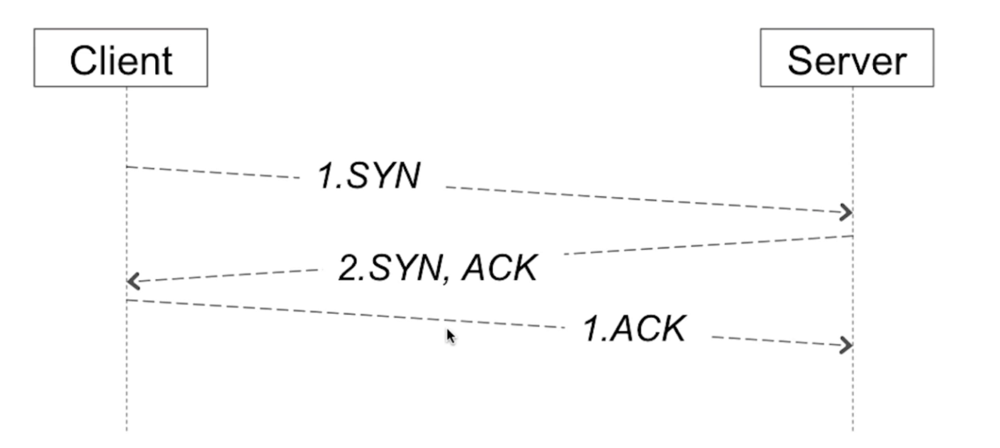

假设只有2次握手流程。客户端先给服务端发送了1个 SYN 报文，不巧的是，此时网络不稳定，该报文没有到达服务端，由于超过了超时时间，启用重传策略，重新发送一个 SYN 报文。

当服务端收到一个 SYN 报文后，回复给客户端一个 ACK 同步确认报文。如果只有2步握手，此时说明 TCP 连接已经建立了。假设前面超时的 SYN 报文，在服务端收到来自客户端的 SYN 报文后再发送了一个 ACK 确认报文时间之后到达服务端，对于服务端来说，会认为客户端又要建立一个 TCP 连接，也就是存在2个 TCP 连接。但实际上第一个 SYN 超时后，启动重传机制发送了第二个 SYN 报文，客户端实际上只希望建立1个 TCP 连接。

有了3次握手就可以解决该问题。

上面背景没有变。当客户端收到来自服务端的  ACK 之后，客户端再发送给服务端一个 ACK 确认报文。之后由于超时才到达服务端的 ACK 报文到达了服务端，服务端收到 SYN，会立马发送一个 ACK 、SYN 报文，一段时间过后，发现客户端并没有给服务端发送一个 ACK 报文。则服务端可以认为是后来的这个 SYN 是由于超时机制发送的报文，客户端并没真正想建立连接。

所以需要3次握手，用来规避同步请求报文超时而建立重复（无用）连接的场景。

可能导致客户端重复发起连接请求，从而浪费网络资源和服务器端的资源。同时，也可能造成服务器误认为客户端请求建立连接，而客户端并没有真正发起连接请求，从而造成服务器端资源浪费。因此，三次握手能够更好地确保TCP连接的可靠性。

### 四次挥手

- 第一次挥手：客户端应用进程先向其 TCP 发出连接释放报文段，并停止发送数据，主动关闭 TCP 连接（此时关闭的是自己与客户端的连接）。FIN 置为1，序号 seq=u，它等于前面已传送过的数据的最后一个字节的序号加1。这时客户端进入 **FIN_WAIT_1** （终止等待1）状态，等待服务端的确认。TCP 规定，FIN 报文段即使不携带数据段，它也会消耗掉一个序号。
- 第二次挥手：服务端收到连接释放请求后，会告诉应用层要释放 TCP 链接。发出确认，确认号 ack=u+1，序号为 seq=v，等于服务端前面已经传输过的数据的最后一个字节的序号加1。然后服务端就进入了 CLOSE_WAIT（关闭等待）状态。TCP 服务器进程通知高层应用数据，因而从客户端到服务端这个方向的连接就释放了。此时 TCP 处于**半关闭状态**。即客户端已经没数据要发送了，服务端还在发送数据，但是客户端仍需接收数据。也就是说从服务端到客户端的连接尚未关闭
- 第三次挥手：客户端收到来自服务端的消息后进入了 FIN_WAIT_2 (终止等待2)状态。等待服务端发出的连接释放报文段。若服务端已经没有要向客户端发送数据，其应用进程就通知 TCP 释放连接。这时候服务端发出的报文段必须 FIN=1。假设服务端序号为 W（在在关闭状态下服务端可能又发送了一些数据，因此与 V 有一定距离）。服务端还必须重复上次发送过的确认号 ack=u+1。这时服务端就进入 LAST_ACK（最后确认）状态，等待客户端的确认
- 第四次挥手：客户端收到服务端发送的连接释放报文段后，必须对此发出确认。在确认报文段中把 ACK 置1，确认号为 ack=w+1，而自己的序列号 seq=u+1（根据 TCP 标准，前面发送过的 FIN 报文段要消耗一个序号）。然后进入到 TIME_WAIT（时间等待）状态。现在 TCP 还没有释放掉。必须经过时间等待计时器设置的时间 2MSL 后，客户端才可以进入到 CLOSED 状态。时间 MSL 叫做最长报文段寿命。

#### 为什么需要4次挥手

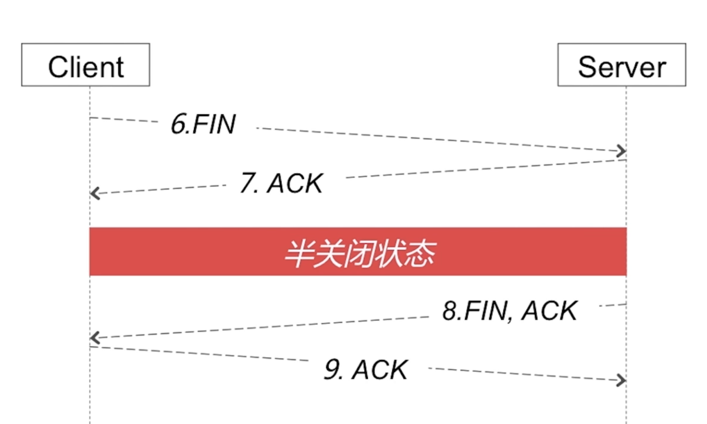

首先客户端给服务端发送一个终止 FIN 报文，服务端收到后，同时也发送一个 ACK 确认报文。此时处于半关闭状态。客户端已经不能给服务端发送数据了，但服务端可以给客户端发送数据。

过了一段时间（服务端数据发送完了），服务端主动发送一个只终止确认报文来断开服务端到客户端方向的连接。客户端收到后，发送一个 ACK 确认报文给服务端。

有2个方向的连接断开，是因为 TCP 是全双工的。同样一条通道，客户端可以给服务端发送，服务端也可以给客户端发送。

### TCP 协议的特点

#### 面向连接

面向连接，是指发送数据之前必须在两端建立连接。建立连接的方法是三次握手，这样能建立可靠的连接。建立连接是为数据的可靠传输打下了基础。

数据传输结束后，需要释放连接，需经过4次挥手。

#### 可靠传输

对于可靠传输，判断丢包，误码靠的是 TCP 的段编号以及确认号。TCP 为保证报文传输的可靠，给每个包一个序号，同时序号也保证了传输到接收端实体的包的按序接收。然后接收端实体对已成功收到的字节发回一个相应的确认 ACK；如果发送端实体在合理的往返时延（RTT）内未收到确认，那么对应的数据将被重传。

- 无差错
- 不丢失
- 不重复
- 按序到达

这些特点在 IM 系统上可以借鉴。

可靠传输在 TCP 层面是依靠“停止等待协议”实现的。

##### 停止等待协议

>  **停止等待协议**：**通信系统中，规定发送方每发送一帧后就要停下来等待接收方的确认返回,仅当接收方确认正确接收后再继续发送下一帧**。

下面分4个不同情况看看 TCP 是如何保证消息的可靠传输的。

- 无差错情况

  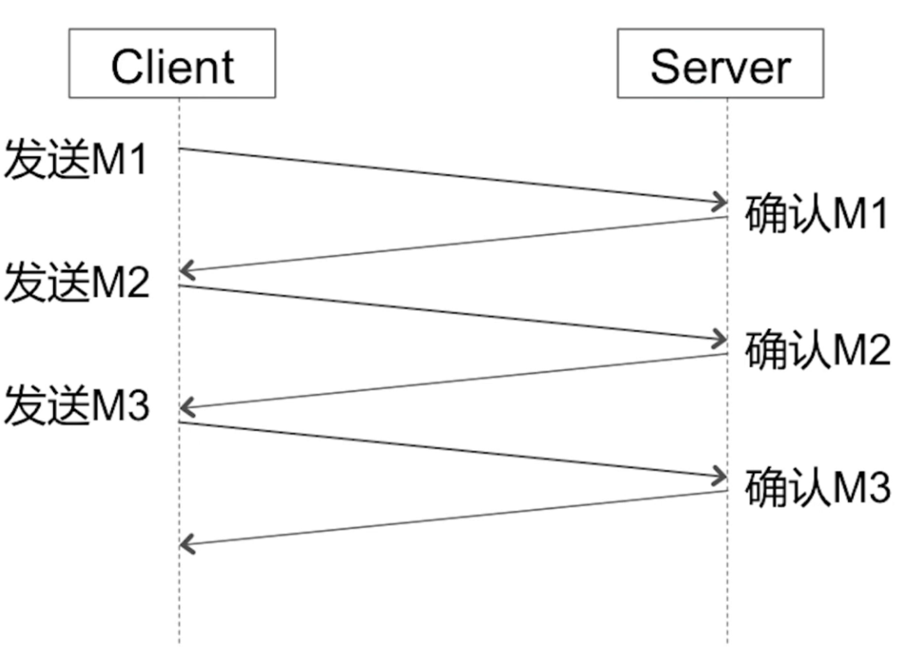

  这张图是正常传输的情况。没有发生任何错误

- 超时重传

  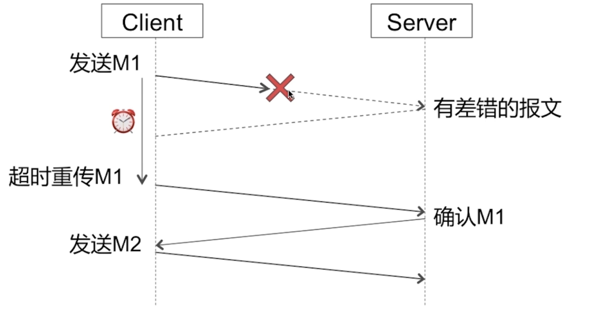

  这张图是一个超时重传的情况。客户端给服务端发送了 M1 分组报文，由于网络环境比较差，丢失或者滞留，或者被劫持了篡改了，当劫持篡改的情况下服务端接收到 M1 后，会判断篡改后丢弃该报文。在期许的时间内，客户端没有收到分组报文 M1 的确认，认为发生了超时。触发重传机制。然后启动一个分组报文 M1 的重传，此时网络正常，服务端收到 M1，并发送确认给客户端。客户端收到确认报文后，再发送 M2...

  针对超时的情况，可以在客户端设置一个超时定时器，如果没有在规定时间范围内收到 M1 分组报文的确认报文，则开启重传机制。该机制保证分组报文不丢失，服务端的差错检测，可以保证无差错。

  这套流程可以保证：**差错校验、不丢失**

- 确认丢失

  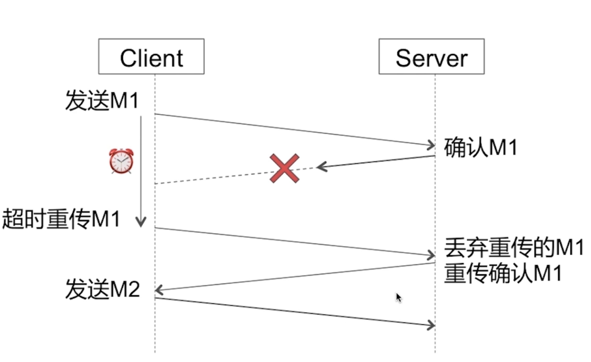

  客户端发送一个分组报文 M1，服务端收到后发送一个确认报文，但这个确认报文丢失了。此时客户端依旧通过超时定时器，判断在期许的时间内没有收到来自服务端的确认报文，触发超时重传策略。重新发送分组报文 M1，服务端收到 M1 后，由于服务端已经接收过分组报文 M1 了，此时服务端做2件事：丢失重传的 M1 报文；重传确认 M1 报文。客户端收到 M1 确认报文，然后继续发送 M2...

- 确认迟到

  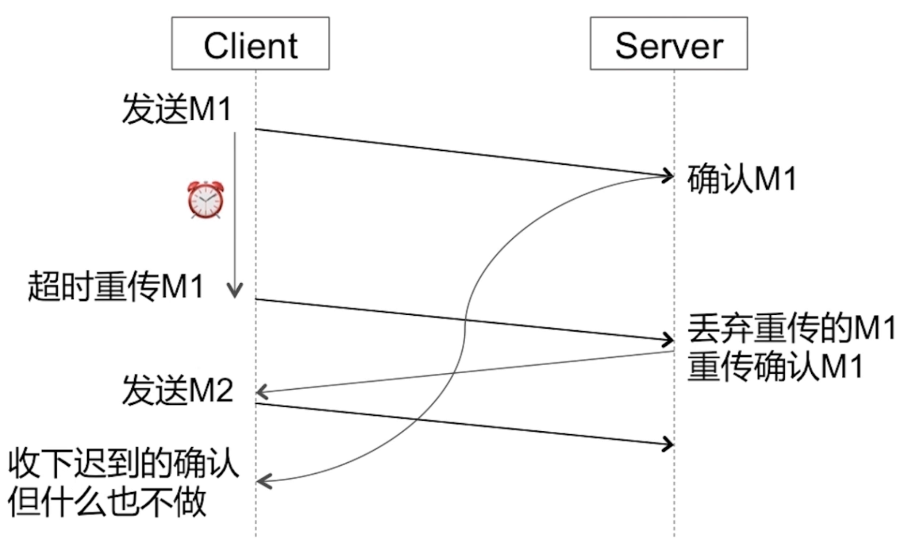

  客户端发送 M1 报文，服务端收到 M1 后发送确认报文，但是由于网络情况不好，传输较慢，客户端在期许时间范围内没有收到确认报文。客户端在超时定时器的作用下，判断超时，触发重传策略。重新发送报文 M1，服务端收到重传的 M1 后，由于服务端之前已经接受过 M1 报文，所以做2件事情：丢弃重传的 M1 报文；重传 M1 确认报文。

  客户端收到 M1 确认报文后，继续发送 M2...

  随后的某个时间，来自服务端的 M1 确认报文到达了客户端，客户端收下后不做任何处理。

#### 面向字节流
TCP 不像 UDP 那样一个个报文独立传输，而是在不保留报文边界的情况下以字节流方式进行传输。

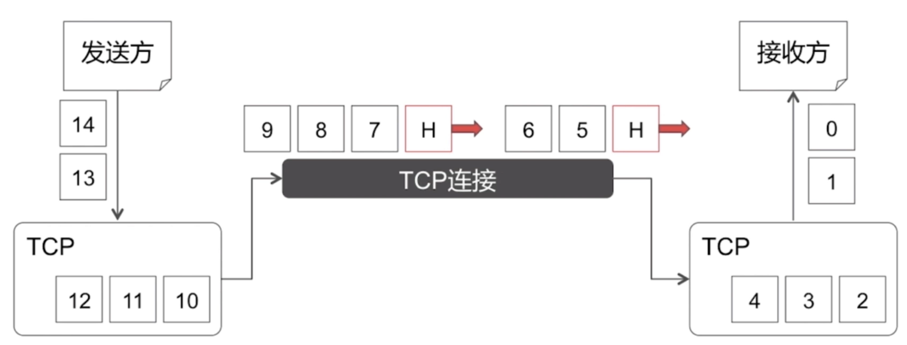

发送方在进行数据发送的时候，在 TCP 层面会有一个发送缓存。接收方也有一个接收缓存。

之后发送的每一个数据都会经过 TCP 连接的逻辑通道传输给接收方。假设发送方要发送13、14，在放到发送缓存之后，至于每次要发送多少个字节是由 TCP 自己控制的。

5、6可能是发送方2次要传送的数据，放到发送缓存区后，TCP 将5、6拼接成一个 TCP 报文一次性发送给接收方。

不管发送方一次性提交给 TCP 缓存多大的数据，TCP 都会根据实际情况来进行划分，比如一次性可以传输几个字节。可能会将发送方的一个数据拆分为多个包进行传输。

当 TCP 在传输层发送消息时，一个消息可能会被分割成多个 TCP 报文进行转发给网络层。我们不能认为一个 TCP 报文就是一个消息，所以说 TCP 是面向字节流协议。

由于一个消息对应的不是一个 TCP 报文，如果接收方不知道一个消息的长度或者分割的边界在哪里，就会无法组装成一个消息，这就引入了**粘包问题**

#### 流量控制（滑动窗口）

流量控制是通过滑动窗口协议来实现的。

将数据划分为4种状态：

- 发送并被确认
- 发送未被确认
- 需要尽快发送的
- 等待发送的

其中，发送未被确认的、需要尽快发送的，组成了 TCP 的窗口（因为这些部分的数据，需要核心管理和处理）。发送窗口要比发送缓存要小。

从左到右，字节编号，序号逐渐增大。

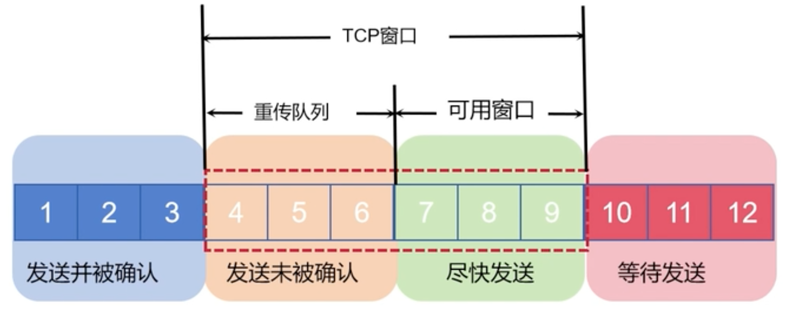

- 可用窗口，主要是尽快要发送的部分
- 重传队列，主要是发送但未被确认的部分

当发送但未被确认的部分，收到确认之后，窗口将进行合拢。假设 7、8、9 被发送后，变成下面的状态

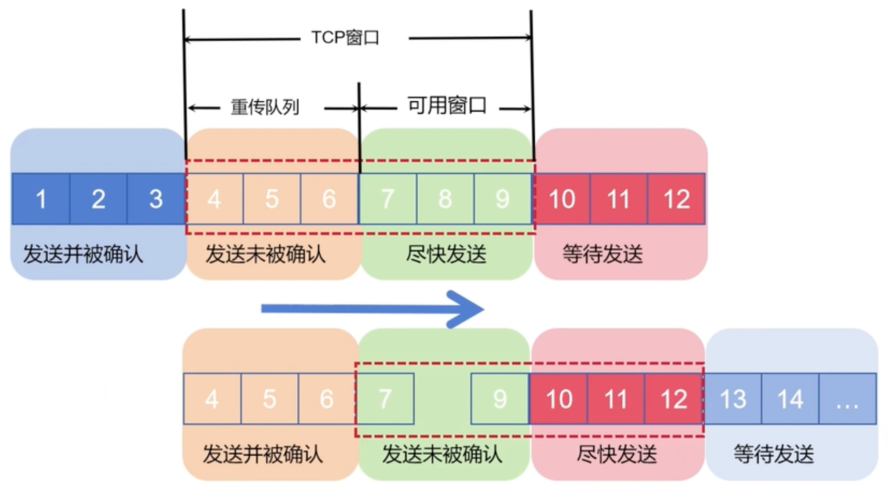

7、8、9变成了发送未被确认的状态，10、11、12变成了需要尽快发送的状态，窗口右移。

假设发送方处于 5G 网络，接收方处于 3G 网络，如果发送方发送太快会导致接收方接收缓存产生大量积累数据，所以需要接收方动态调整发送方发送窗口来决定发送速率。

在接收方侧：

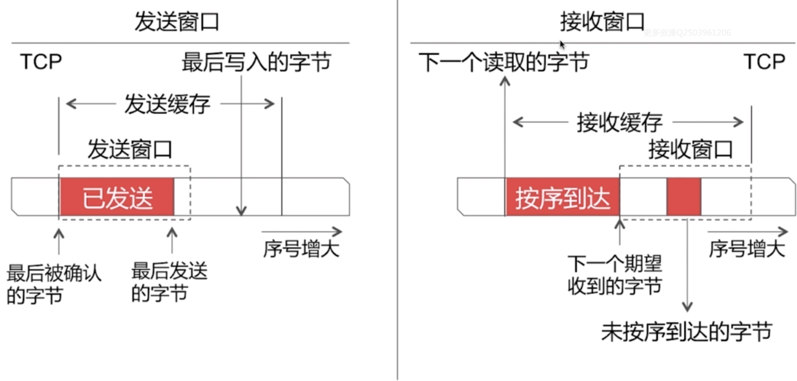

- 接受侧提交数据，必须是按序到达的部分。而未按序到达的字节，需要等全部按照顺序接收完毕，保证有序后才可以提交
- 按序到达可以通过字节序号进行控制

#### 提供拥塞控制

当网络出现拥塞时，TCP 能够减小向网络注入数据的速率和数量，缓解拥塞

- 慢启动：慢开始、拥塞避免。
- 快恢复、快重传

##### 慢开始、拥塞避免

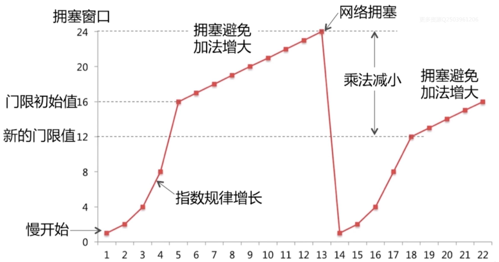

工作流程：

- 一开始先发送1个报文，发现没有拥塞，就发送2个报文，发现依旧没有拥塞，继续翻倍，1、2、4、8、16。这个过程就是指数规律增长的过程，称为慢开始算法。
- 当增长到窗口门限值16的时候，会采用拥塞避免策略，来进行发送报文数量的增长。比如发送17后发现没有拥塞、则增长为18，依次线性增长。
- 当增长到24的时候，可能会发生网络拥塞。界定网络拥塞比较负责，我们可以简单的视为当连续3个报文的 ACK 没有收到的时候则认为发生了拥塞。拥塞后采用“乘法减小”的策略，来恢复到只发送1个报文的情况，来减少网络层压力。然后重新慢开始。同时将网络拥塞窗口值减少为之前的一半（比如之前的24，现在为12）
- 调整后继续按照慢开始算法，比如：一开始先发送1个报文，发现没有拥塞，就发送2个报文，发现依旧没有拥塞，继续翻倍，1、2、4、8、16。这个过程就是指数规律增长的过程，称为慢开始算法。
- 当达到门限值16之后，采用拥塞避免，加法增大的机制。比如：16、17、18...

##### 快重传

TCP 实现可靠传输依赖的是 **超时重传** 机制。TCP 在发送完数据后，会启动一个定时器。如果在定时器超时前没收到接收方发来的 ACK 确认，就重传数据。

这个是默认的情况，但是传输效率还是有点低，所以 TCP 为了更高的效率，采取了快重传机制。什么是快重传？

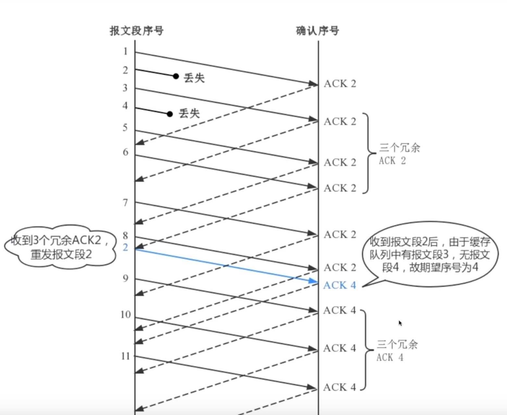

- 左边是发送方，右边是接收方
- 发送了序号为1的报文后，接收方收到，回复了一个 ACK2 的报文，ACK2 的意思就是“我收到报文1了，接下来我希望收到序号为2的报文”
- 发送方发送序号为2的报文后，可能网络不好，也可能丢包了，接收方还没收到
- 发送方发送序号为3的报文后，接收方收到了，但此时序号为2的报文还未收到，只能回复一个 ACK2，表示我接下来还是希望收到一个需要为2的报文
- 发送方发送序号为4的报文后，可能网络不好，也可能丢包了，接收方还没收到
- 发送方发送序号为5的报文后，接收方收到了，但此时序号为2的报文还未收到，只能回复一个 ACK2，表示我接下来还是希望收到一个需要为2的报文
- 发送方发送序号为6的报文后，接收方收到了，但此时序号为2的报文还未收到，只能回复一个 ACK2，表示我接下来还是希望收到一个需要为2的报文

目前为止，除了第一个正常接受的报文1收到后，接收方回复了一个 ACK2 外，发送方已经收到3个连续的 ACK2，发送方会立即快速重传报文2。请注意，如果没有收到3个连续的 ACK2，发送会等到超时重传触发后（发送报文2的时候，也会启动一个超时计时器，等到 RTO 到了，会超时重传报文2），也会发送报文2。

快速重传，着重在“**快速**” ，相较于超时重传，它更快，更迅速，更能提高 TCP 传输效率。因为发送方收到3次 ACK2 触发快速重传的时候，可能超时重传策略还没触发。

- 快重传是为了解决在没有触发超时重传的时候，就触发发送方传递了数据
- 快重传本质上是为了提高传输效率的
- 快速重传不是以时间驱动，而是以数据驱动。发送方收到三次同样的确认报文后，会立即重传丢失的报文

##### 快恢复

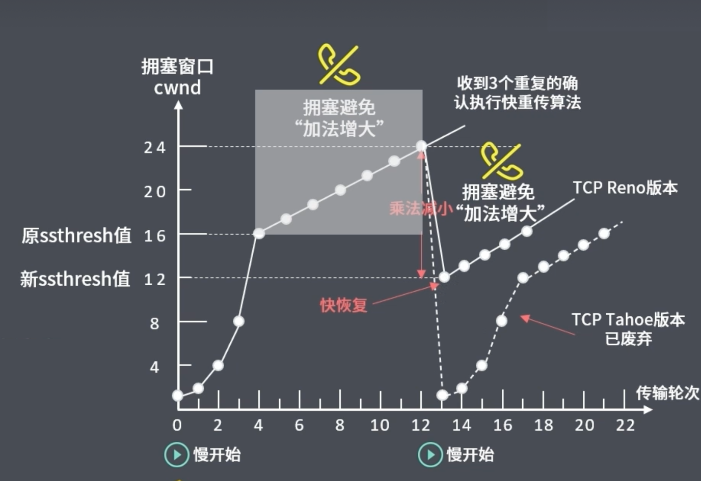

当发生网络拥塞的时候，如果直接变为1，后续会再次经过慢开始（1、2、4、8、16）的过程，大多数情况下，网络可能没那么糟糕，所以不直接变为1，采用一个快速恢复的策略。

把新的拥塞窗口大小设置为新的门限值，12。从12开始不走慢开始（指数增长），而直接走快恢复（加法增大、线性增大）的流程。跳过了从1走指数增长到新的门限值的过程。

QA：上面4种策略是互斥的吗？怎么样工作的

慢开始、拥塞避免、快恢复、快重传是同时工作的。

- 一开始传输的时候，走的是慢开始算法，此时还没有到达拥塞避免阶段。此时的网络状态很好。假设此时某个报文丢失了，此时的重传是依靠超时定时器的，也就是说慢开始阶段走的是超时重传逻辑。
- 等达到门限值之后，走的是拥塞避免算法，线性增大。

发送窗口大小 = Min(接收窗口  rwnd, 拥塞窗口 cwnd)

**收到重复的确认，说明发出去的数据发生丢包，意味着网络可能发生拥塞。TCP 同样会将门限阈值（ssthresh） 设为当前拥塞窗口 cwnd 的一半，并重新执行慢启动算法加以应对。**

#### 仅支持单向传输
每条 TCP 传输连接只能有2个端点，只能进行点对点的数据传输，不支持多播和广播传输方式

#### TCP 提供全双工通信

TCP 允许通信双方的应用程序在任何都能发送数据，因为 TCP 连接的两端都设有缓存，用来临时存放双向通信的数据。当然，TCP 可以发送一个数据段，也可以缓存一段时间一边一次发送更多的数据段（最大的数据段大小取决于 MSS）

## TCP、UDP 对比

1. 对比

|  |  UDP |  TCP |
| - | - | - |
|是否连接| 无连接 | 面向连接 |
|是否可靠| 不可靠传输（不存在流量控制、拥塞控制） | 可靠传输（使用流量控制、拥塞控制） |
|连接对象个数| 一对一、一对多、多对一、多对多互相通信 | 只可一对一通信 |
|传输方式| 面向报文 | 面向字节流 |
|首部开销| 开销小，仅8字节 | 开销大，20字节 |
|使用场景| 实时应用，比如IP电话、视频会议、直播 | 要求可靠传输的应用，比如文件传输 |

2. 使用场景

基于上面的优缺点，那么： 什么时候应该使用TCP： 当对网络通讯质量有要求的时候，比如：整个数据要准确无误的传递给对方，这往往用于一些要求可靠的应用，比如HTTP、HTTPS、FTP等传输文件的协议，POP、SMTP等邮件传输的协议。 在日常生活中，常见使用TCP协议的应用如下： 浏览器，用的HTTP FlashFXP，用的FTP Outlook，用的POP、SMTP Putty，用的Telnet、SSH QQ文件传输 ………… 什么时候应该使用UDP： 当对网络通讯质量要求不高的时候，要求网络通讯速度能尽量的快，这时就可以使用UDP。 比如，日常生活中，常见使用UDP协议的应用如下： QQ语音 QQ视频 TFTP ……

