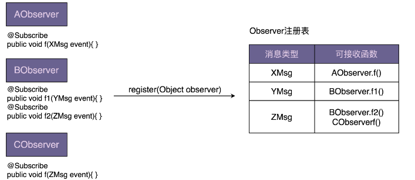
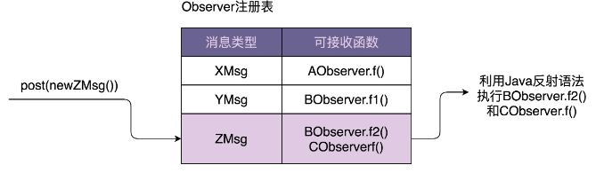

# 观察者模式

> 我们常把 23 种经典的设计模式分为三类：创建型、结构型、行为型。前面我们已经学习了创建型和结构型，从今天起，我们开始学习行为型设计模式。我们知道，创建型设计模式主要解决“对象的创建”问题，结构型设计模式主要解决“类或对象的组合或组装”问题，那行为型设计模式主要解决的就是“类或对象之间的交互”问题。

## 定义
观察者模式（Observer Design Pattern）也被称为发布订阅模式（Publish-Subscribe Design Pattern）。在 GoF 的《设计模式》一书中，它的定义是这样的
> Define a one-to-many dependency between objects so that when one object changes state, all its dependents are notified and updated automatically.
在对象之间定义一个一对多的依赖，当一个对象状态改变的时候，所有依赖的对象都会自动收到通知。

实际上，观察者模式是一个比较抽象的模式，根据不同的应用场景和需求，有完全不同的实现方式，待会我们会详细地讲到。现在，我们先来看其中最经典的一种实现方式。这也是在讲到这种模式的时候，很多书籍或资料给出的最常见的实现方式。具体的代码如下所示：

```
public interface Subject {
    void registerObserver(Observer observer);
    void removeObserver(Observer observer);
    void notifyObservers(Message message);
}

public interface Observer {
    void update(Message message);
}

public class ConcreteSubject implements Subject {
    private List<Observer> observers = new ArrayList<Observer>();
    @Override
    public void registerObserver(Observer observer) {
        observers.add(observer);
    }
    @Override
    public void removeObserver(Observer observer) {
        observers.remove(observer);
    }
    @Override
    public void notifyObservers(Message message) {
        for (Observer observer : observers) {
            observer.update(message);
        }
    }
}

public class ConcreteObserverOne implements Observer {
    @Override
    public void update(Message message) {
        //TODO: 获取消息通知，执行自己的逻辑...
        System.out.println("ConcreteObserverOne is notified.");
    }
}
public class ConcreteObserverTwo implements Observer {
    @Override
    public void update(Message message) {
        //TODO: 获取消息通知，执行自己的逻辑...
        System.out.println("ConcreteObserverTwo is notified.");
    }
}
public class Demo {
    public static void main(String[] args) {
        ConcreteSubject subject = new ConcreteSubject();
        subject.registerObserver(new ConcreteObserverOne());
        subject.registerObserver(new ConcreteObserverTwo());
        subject.notifyObservers(new Message());
    }
}
```
实际上，上面的代码算是观察者模式的“模板代码”，只能反映大体的设计思路。在真实的软件开发中，并不需要照搬上面的模板代码。观察者模式的实现方法各式各样，函数、类的命名等会根据业务场景的不同有很大的差别，比如 register 函数还可以叫作 attach， remove 函数还可以叫作 detach 等等。不过，万变不离其宗，设计思路都是差不多的。

## 场景

假设我们在开发一个 P2P 投资理财系统，用户注册成功之后，我们会给用户发放投资体验金。代码实现大致是下面这个样子的：
```
public class UserController {
    private UserService userService; // 依赖注入
    private PromotionService promotionService; // 依赖注入
    public Long register(String telephone, String password) {
        //省略输入参数的校验代码
        //省略userService.register()异常的try-catch代码
        long userId = userService.register(telephone, password);
        promotionService.issueNewUserExperienceCash(userId);
        return userId;
    }
}
```
虽然注册接口做了两件事情，注册和发放体验金，违反单一职责原则，但是，如果没有扩展和修改的需求，现在的代码实现是可以接受的。如果非得用观察者模式，就需要引入更多的类和更加复杂的代码结构，反倒是一种过度设计。

相反，如果需求频繁变动，比如，用户注册成功之后，不再发放体验金，而是改为发放优惠券，并且还要给用户发送一封“欢迎注册成功”的站内信。这种情况下，我们就需要频繁地修改 register() 函数中的代码，违反开闭原则。而且，如果注册成功之后需要执行的后续操作越来越多，那 register() 函数的逻辑会变得越来越复杂，也就影响到代码的可读性和可维护性

用观察者模式进行改造
```
public interface RegObserver {
    void handleRegSuccess(long userId);
}
public class RegPromotionObserver implements RegObserver {
    private PromotionService promotionService; // 依赖注入
    @Override
    public void handleRegSuccess(long userId) {
        promotionService.issueNewUserExperienceCash(userId);
    }
}
public class RegNotificationObserver implements RegObserver {
    private NotificationService notificationService;
    @Override
    public void handleRegSuccess(long userId) {
        notificationService.sendInboxMessage(userId, "Welcome...");
    }
}
public class UserController {
    private UserService userService; // 依赖注入
    private List<RegObserver> regObservers = new ArrayList<>();
    // 一次性设置好，之后也不可能动态的修改
    public void setRegObservers(List<RegObserver> observers) {
        regObservers.addAll(observers);
    }
    public Long register(String telephone, String password) {
        //省略输入参数的校验代码
        //省略userService.register()异常的try-catch代码
        long userId = userService.register(telephone, password);
        for (RegObserver observer : regObservers) {
            observer.handleRegSuccess(userId);
        }
        return userId;
    }
}
```
当我们需要添加新的观察者的时候，比如，用户注册成功之后，推送用户注册信息给大数据征信系统，基于观察者模式的代码实现，UserController 类的 register() 函数完全不需要修改，只需要再添加一个实现了 RegObserver 接口的类，并且通过 setRegObservers()函数将它注册到 UserController 类中即可

当我们把发送体验金替换为发送优惠券的时候，需要修改 RegPromotionObserver 类中 handleRegSuccess() 函数的代码，这还是违反开闭原则呀？你说得没错，不过，相对于 register() 函数来说，handleRegSuccess() 函数的逻辑要简单很多，修改更不容易出错，引入 bug 的风险更低。

**设计模式要干的事情就是解耦。创建型模式是将创建和使用代码解耦，结构型模式是将不同功能代码解耦，行为型模式是将不同的行为代码解耦，具体到观察者模式，它是将观察者和被观察者代码解耦。借助设计模式，我们利用更好的代码结构，将一大坨代码拆分成职责更单一的小类，让其满足开闭原则、高内聚松耦合等特性，以此来控制和应对代码的复杂性，提高代码的可扩展性**。


## 实现方式
观察者模式的应用场景非常广泛，小到代码层面的解耦，大到架构层面的系统解耦，再或者一些产品的设计思路，都有这种模式的影子，比如，邮件订阅、RSS Feeds，本质上都是观察者模式

不同的应用场景和需求下，这个模式也有截然不同的实现方式，开篇的时候我们也提到，有同步阻塞的实现方式，也有异步非阻塞的实现方式；有进程内的实现方式，也有跨进程的实现方式

之前讲到的实现方式，从刚刚的分类方式上来看，它是一种同步阻塞的实现方式。观察者和被观察者代码在同一个线程内执行，被观察者一直阻塞，直到所有的观察者代码都执行完成之后，才执行后续的代码。对照上面讲到的用户注册的例子，register() 函数依次调用执行每个观察者的 handleRegSuccess() 函数，等到都执行完成之后，才会返回结果给客户端。

如果注册接口是一个调用比较频繁的接口，对性能非常敏感，希望接口的响应时间尽可能短，那我们可以将同步阻塞的实现方式改为异步非阻塞的实现方式，以此来减少响应时间。具体来讲，当 userService.register() 函数执行完成之后，我们启动一个新的线程来执行观察者的 handleRegSuccess() 函数，这样userController.register() 函数就不需要等到所有的 handleRegSuccess() 函数都执行完成之后才返回结果给客户端。userController.register() 函数从执行 3 个 SQL 语句才返回，减少到只需要执行 1 个 SQL 语句就返回，响应时间粗略来讲减少为原来的 1/3。

如何实现一个异步非阻塞的观察者模式呢？简单做法有两种实现方式。其中一种是：在每个 handleRegSuccess() 函数中创建一个新的线程执行代码逻辑；另一种是：在 UserController 的 register() 函数中使用线程池来执行每个观察者的 handleRegSuccess() 函数。两种实现方式的具体代码如下所示
```
// 第一种实现方式，其他类代码不变，就没有再重复罗列
public class RegPromotionObserver implements RegObserver {
    private PromotionService promotionService; // 依赖注入
    @Override
    public void handleRegSuccess(long userId) {
        Thread thread = new Thread(new Runnable() {
            @Override
            public void run() {
             promotionService.issueNewUserExperienceCash(userId);
            }
        });
        thread.start();
    }
}

// 第二种实现方式，其他类代码不变，就没有再重复罗列
public class UserController {
    private UserService userService; // 依赖注入
    private List<RegObserver> regObservers = new ArrayList<>();
    private Executor executor;
    public UserController(Executor executor) {
        this.executor = executor;
    }
    public void setRegObservers(List<RegObserver> observers) {
        regObservers.addAll(observers);
    }
    public Long register(String telephone, String password) {
        //省略输入参数的校验代码
        //省略userService.register()异常的try-catch代码
        long userId = userService.register(telephone, password);
        for (RegObserver observer : regObservers) {
            executor.execute(new Runnable() {
                @Override
                public void run() {
                    observer.handleRegSuccess(userId);
                }
            });
        }
        return userId;
    }
}
```
对于第一种实现方式，频繁地创建和销毁线程比较耗时，并且并发线程数无法控制，创建过多的线程会导致堆栈溢出。第二种实现方式，尽管利用了线程池解决了第一种实现方式的问题，但线程池、异步执行逻辑都耦合在了 register() 函数中，增加了这部分业务代码的维护成本。

框架的作用有：隐藏实现细节，降低开发难度，做到代码复用，解耦业务与非业务代码，让程序员聚焦业务开发。针对异步非阻塞观察者模式，我们也可以将它抽象成框架来达到这样的效果，而这个框架就是接下来要研究的 EventBus（借鉴 Google Guava EventBus 框架的设计思想，手把手带你开发一个支持异步非阻塞的 EventBus 框架）。它可以复用在任何需要异步非阻塞观察者模式的应用场景中。

刚刚讲到的两个场景，不管是同步阻塞实现方式还是异步非阻塞实现方式，都是进程内的实现方式。如果用户注册成功之后，我们需要发送用户信息给大数据征信系统，而大数据征信系统是一个独立的系统，跟它之间的交互是跨不同进程的，那如何实现一个跨进程的观察者模式呢？

如果大数据征信系统提供了发送用户注册信息的 RPC 接口，我们仍然可以沿用之前的实现思路，在 handleRegSuccess() 函数中调用 RPC 接口来发送数据。但是，我们还有更加优雅、更加常用的一种实现方式，那就是基于消息队列（Message Queue，比如 ActiveMQ）来实现。

当然，这种实现方式也有弊端，那就是需要引入一个新的系统（消息队列），增加了维护成本。不过，它的好处也非常明显。在原来的实现方式中，观察者需要注册到被观察者中，被观察者需要依次遍历观察者来发送消息。而基于消息队列的实现方式，被观察者和观察者解耦更加彻底，两部分的耦合更小。被观察者完全不感知观察者，同理，观察者也完全不感知被观察者。被观察者只管发送消息到消息队列，观察者只管从消息队列中读取消息来执行相应的逻辑。

## EventBus 框架功能需求介
EventBus 翻译为“事件总线”，它提供了实现观察者模式的骨架代码。我们可以基于此框架，非常容易地在自己的业务场景中实现观察者模式，不需要从零开始开发。其中，Google Guava EventBus 就是一个比较著名的 EventBus 框架，它不仅仅支持异步非阻塞模式，同时也支持同步阻塞模式

```
public class UserController {
    private UserService userService; // 依赖注入
    private EventBus eventBus;
    private static final int DEFAULT_EVENTBUS_THREAD_POOL_SIZE = 20;
    public UserController() {
        //eventBus = new EventBus(); // 同步阻塞模式
        eventBus = new AsyncEventBus(Executors.newFixedThreadPool(DEFAULT_EVENTBUS_
    }
    public void setRegObservers(List<Object> observers) {
        for (Object observer : observers) {
            eventBus.register(observer);
        }
    }
    public Long register(String telephone, String password) {
        //省略输入参数的校验代码
        //省略userService.register()异常的try-catch代码
        long userId = userService.register(telephone, password);
        eventBus.post(userId);
        return userId;
    }
}

public class RegPromotionObserver {
    private PromotionService promotionService; // 依赖注入
    @Subscribe
    public void handleRegSuccess(long userId) {
        promotionService.issueNewUserExperienceCash(userId);
    }
}
public class RegNotificationObserver {
    private NotificationService notificationService;
    @Subscribe
    public void handleRegSuccess(long userId) {
        notificationService.sendInboxMessage(userId, "...");
    }
}
```
功能分析：
- register：利用 EventBus 框架实现的观察者模式，跟从零开始编写的观察者模式相比，从大的流程上来说，实现思路大致一样，都需要定义 Observer，并且通过 register() 函数注册 Observer
- post：需要通过调用某个函数（比如，EventBus 中的 post() 函数）来给 Observer 发送消息（在 EventBus 中消息被称作事件 event）

但在实现细节方面，它们又有些区别。基于 EventBus，我们不需要定义 Observer 接口，任意类型的对象都可以注册到 EventBus 中，通过 @Subscribe 注解来标明类中哪个函数可以接收被观察者发送的消息。

我们详细地讲一下，Guava EventBus 的几个主要的类和函数。
Guava EventBus 对外暴露的所有可调用接口，都封装在 EventBus 类中。其中，EventBus 实现了同步阻塞的观察者模式，AsyncEventBus 继承自 EventBus，提供了异步非阻塞的观察者模式。具体使用方式如下所示：
```
EventBus eventBus = new EventBus(); // 同步阻塞模式
EventBus eventBus = new AsyncEventBus(Executors.newFixedThreadPool(8)); // 异步非阻塞方式
```
EventBus 类提供了 register() 函数用来注册观察者。具体的函数定义如下所示。它可以接受任何类型（Object）的观察者。而在经典的观察者模式的实现中，register() 函数必须接受实现了同一 Observer 接口的类对象。
```
public void register(Object object);
```
相对于 register() 函数，unregister() 函数用来从 EventBus 中删除某个观察者。
```
public void unregister(Object object);
```
EventBus 类提供了 post() 函数，用来给观察者发送消息
```
public void post(Object event);
```
跟经典的观察者模式的不同之处在于，当我们调用 post() 函数发送消息的时候，并非把消息发送给所有的观察者，而是发送给可匹配的观察者。所谓可匹配指的是，能接收的消息类型是发送消息（post 函数定义中的 event）类型的父类。我举个例子来解释一下。

比如，AObserver 能接收的消息类型是 XMsg，BObserver 能接收的消息类型是 YMsg，CObserver 能接收的消息类型是 ZMsg。其中，XMsg 是 YMsg 的父类。当我们如下发送消息的时候，相应能接收到消息的可匹配观察者如下所示：
```
XMsg xMsg = new XMsg();
YMsg yMsg = new YMsg();
ZMsg zMsg = new ZMsg();
post(xMsg); => AObserver接收到消息
post(yMsg); => AObserver、BObserver接收到消息
post(zMsg); => CObserver接收到消息
```
EventBus 最特别的一个地方，那就是 @Subscribe 注解。来标记每个 Observer 能接收消息类型的能力
码如下所示。在 DObserver 类中，我们通过 @Subscribe 注解了两个函数 f1()、f2()。
```
public DObserver {
    //...省略其他属性和方法...
    @Subscribe
    public void f1(PMsg event) { //... }
    @Subscribe
    public void f2(QMsg event) { //... }
}
```
当通过 register() 函数将 DObserver 类对象注册到 EventBus 的时候，EventBus 会根据 @Subscribe 注解找到 f1() 和 f2()，并且将两个函数能接收的消息类型记录下来（PMsg->f1，QMsg->f2）。当我们通过 post() 函数发送消息（比如 QMsg 消息）的时候，EventBus 会通过之前的记录（QMsg->f2），调用相应的函数（f2）。

## 实现 EventBus 框架
EventBus 中两个核心函数 register() 和 post() 的实现原理。弄懂了它们，基本上就弄懂了整个 EventBus 框架。下面两张图是这两个函数的实现原理图。




最关键的一个数据结构是 Observer 注册表，记录了消息类型和可接收消息函数的对应关系。当调用 register() 函数注册观察者的时候，EventBus 通过解析
@Subscribe 注解，生成 Observer 注册表。

当调用 post() 函数发送消息的时候，EventBus 通过注册表找到相应的可接收消息的函数，然后通过 Java 的反射语法来动态地创建对象、执行函数。对于同步阻塞模式，EventBus 在一个线程内依次执行相应的函数。

对于异步非阻塞模式，EventBus 通过一个线程池来执行相应的函数。

整个小框架的代码实现包括 5 个类：EventBus、AsyncEventBus、Subscribe、ObserverAction、ObserverRegistry。

### Subscribe
Subscribe 是一个注解，用于标明观察者中的哪个函数可以接收消息。
```
@Retention(RetentionPolicy.RUNTIME)
@Target(ElementType.METHOD)
@Beta
public @interface Subscribe {}
```

### ObserverAction
ObserverAction 类用来表示 @Subscribe 注解的方法，其中，target 表示观察者类， method 表示方法。它主要用在 ObserverRegistry 观察者注册表
中。
```
public class ObserverAction {
    private Object target;
    private Method method;
    public ObserverAction(Object target, Method method) {
        this.target = Preconditions.checkNotNull(target);
        this.method = method;
        this.method.setAccessible(true);
    }
    public void execute(Object event) { // event是method方法的参数
        try {
            method.invoke(target, event);
        } catch (InvocationTargetException | IllegalAccessException e) {
            e.printStackTrace();
        }
    }
}
```
### ObserverRegistry
ObserverRegistry 类就是前面讲到的 Observer 注册表，是最复杂的一个类，框架中几乎所有的核心逻辑都在这个类中。这个类大量使用了 Java 的反射语法，不过代码整体来说都不难理解，其中，一个比较有技巧的地方是 CopyOnWriteArraySet 的使用。

CopyOnWriteArraySet，顾名思义，在写入数据的时候，会创建一个新的 set，并且将原始数据 clone 到新的 set 中，在新的 set 中写入数据完成之后，再用新的 set 替换老的 set。这样就能保证在写入数据的时候，不影响数据的读取操作，以此来解决读写并发问题。除此之外，CopyOnWriteSet 还通过加锁的方式，避免了并发写冲突。具体的作用你可以去查看一下 CopyOnWriteSet 类的源码，一目了然

```
作者：大志说编程
链接：https://www.zhihu.com/question/485740418/answer/2507532102
来源：知乎
著作权归作者所有。商业转载请联系作者获得授权，非商业转载请注明出处。

public class ObserverRegistry {
    /**
     * key：事件类型，value：观察者包装对象
     **/
    private ConcurrentHashMap<Class<?>, CopyOnWriteArraySet<ObserverAction>>
            registry = new ConcurrentHashMap<>();

    /**
     * 注册观察者
     *
     * @param observer 观察者
     */
    public void register(Object observer) {
        //获取观察者类所有的观察者方法信息
        Map<Class<?>, Collection<ObserverAction>> observerActions = findAllObserverActions(observer);

        for (Map.Entry<Class<?>, Collection<ObserverAction>> entry : observerActions.entrySet()) {
            Class<?> eventType = entry.getKey();

            Collection<ObserverAction> eventActions = entry.getValue();
            CopyOnWriteArraySet<ObserverAction> registeredEventActions = registry.get(eventType);

            if (registeredEventActions == null) {
                registry.putIfAbsent(eventType, new CopyOnWriteArraySet<>());
                registeredEventActions = registry.get(eventType);
            }
            //将观察者方法信息填充到map中
            registeredEventActions.addAll(eventActions);
        }
    }

    /**
     * 获取监听器中所有的标注了@Subscribe注解的方法，并进行包装
     */
    private Map<Class<?>, Collection<ObserverAction>> findAllObserverActions(Object observer) {
        Map<Class<?>, Collection<ObserverAction>> observerActions = new HashMap<>();

        Class<?> clazz = observer.getClass();

        for (Method method : getAnnotatedMethods(clazz)) {
            Class<?>[] parameterTypes = method.getParameterTypes();
            //取第一个参数作为监听事件的类型
            Class<?> eventType = parameterTypes[0];

            if (!observerActions.containsKey(eventType)) {
                observerActions.put(eventType, new ArrayList<>());
            }
            observerActions.get(eventType).add(new ObserverAction(observer, method));
        }

        return observerActions;
    }

    /**
     * 获取标注了@Subscribe注解的方法列表
     *
     * @param clazz 观察者类的class
     * @return 方法列表
     */
    private List<Method> getAnnotatedMethods(Class<?> clazz) {
        List<Method> annotatedMethods = new ArrayList<>();

        for (Method method : clazz.getDeclaredMethods()) {
            if (method.isAnnotationPresent(Subscribe.class)) {
                Class<?>[] parameterTypes = method.getParameterTypes();
                Preconditions.checkArgument(parameterTypes.length == 1,
                        "方法 %s, 有%s个参数，@Subscribe 注解标注的方法至少含有一个参数", method, parameterTypes.length);
                annotatedMethods.add(method);
            }
        }
        return annotatedMethods;
    }

    /**
     * 获取匹配的监听器列表
     *
     * @param event 事件类型
     * @return 监听器列表
     */
    public List<ObserverAction> getMatchObserverActions(Object event) {
        List<ObserverAction> matchedObservers = new ArrayList<>();

        Class<?> postedEventType = event.getClass();

        for (Map.Entry<Class<?>, CopyOnWriteArraySet<ObserverAction>> entry : registry.entrySet()) {
            Class<?> eventType = entry.getKey();
            Collection<ObserverAction> eventActions = entry.getValue();

            //类是否继承自这个事件类型
            if (postedEventType.isAssignableFrom(eventType)) {
                matchedObservers.addAll(eventActions);
            }
        }
        return matchedObservers;
    }

}
```
### EventBus
EventBus 实现的是阻塞同步的观察者模式。看代码你可能会有些疑问，这明明就用到了线程池 Executor 啊。实际上，MoreExecutors.directExecutor() 是 Google Guava 提供的工具类，看似是多线程，实际上是单线程。之所以要这么实现，主要还是为了跟 AsyncEventBus 统一代码逻辑，做到代码复用
```
public class EventBus {

    private ObserverRegistry registry = new ObserverRegistry();

    private Executor executor;

    public EventBus() {

    }

    public EventBus(Executor executor) {
        this.executor = executor;
    }

    /**
     * 注册观察者
     */
    public void register(Object observer) {
        registry.register(observer);
    }

    /**
     * 发布者-发送消息
     */
    public void post(Object event) {
        List<ObserverAction> observerActions = registry.getMatchedObserverActions(event);
        for (ObserverAction observerAction : observerActions) {
            if (executor == null) {
                observerAction.execute(event);
            } else {
                executor.execute(() -> {
                    observerAction.execute(event);
                });
            }
        }
    }
}
```

### AsyncEventBus
有了 EventBus，AsyncEventBus 的实现就非常简单了。为了实现异步非阻塞的观察者模式，它就不能再继续使用 MoreExecutors.directExecutor() 了，而是需要在构造函数中，由调用者注入线程池
```
public class AsyncEventBus extends EventBus {
    public AsyncEventBus(Executor executor) {
        super(executor);
    }
}
```
