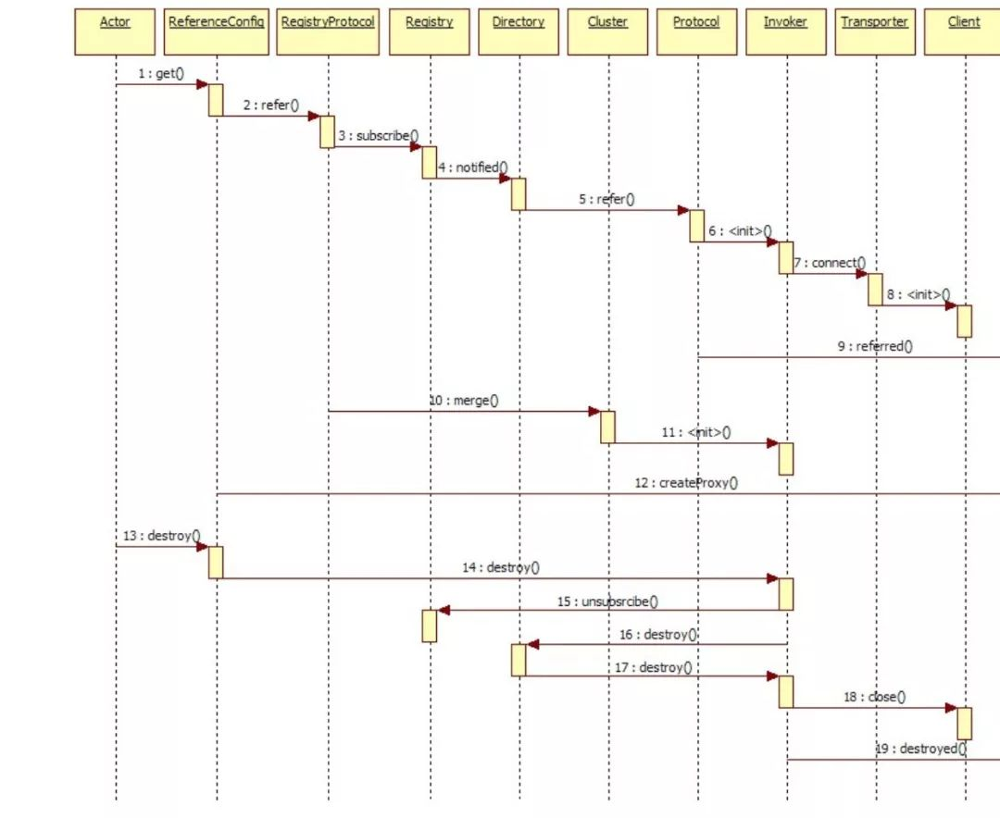
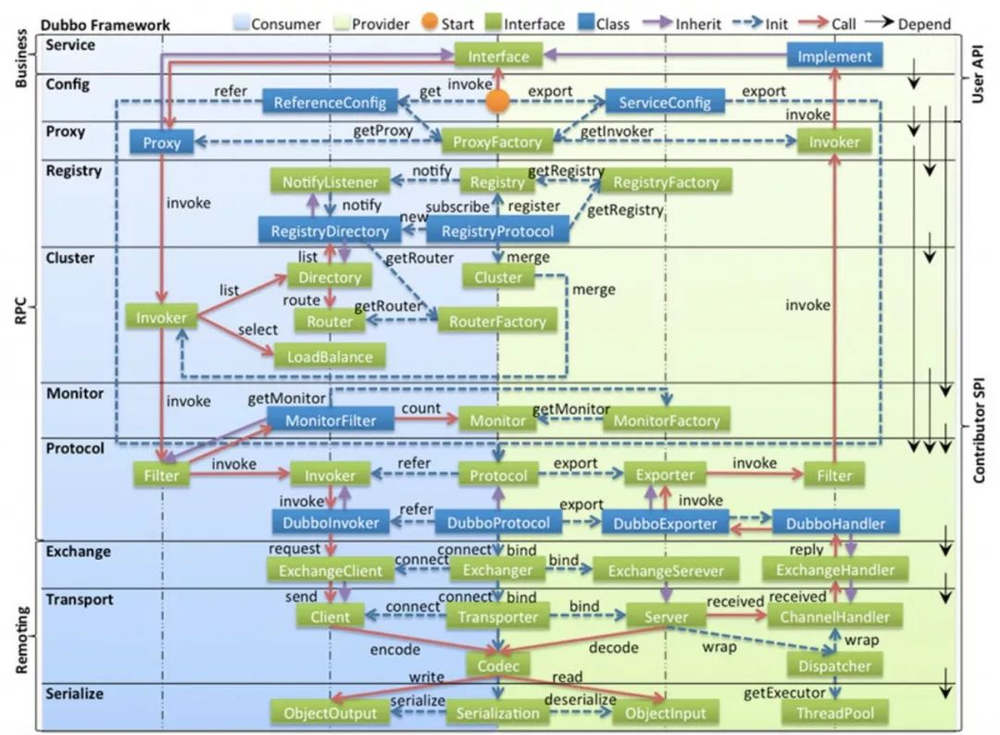
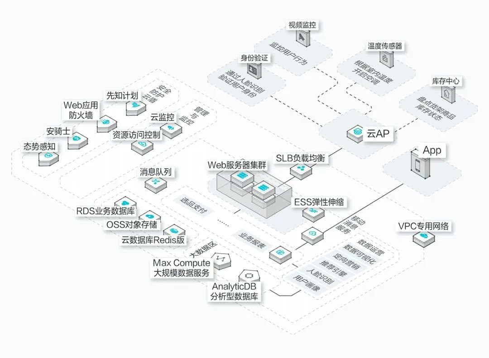
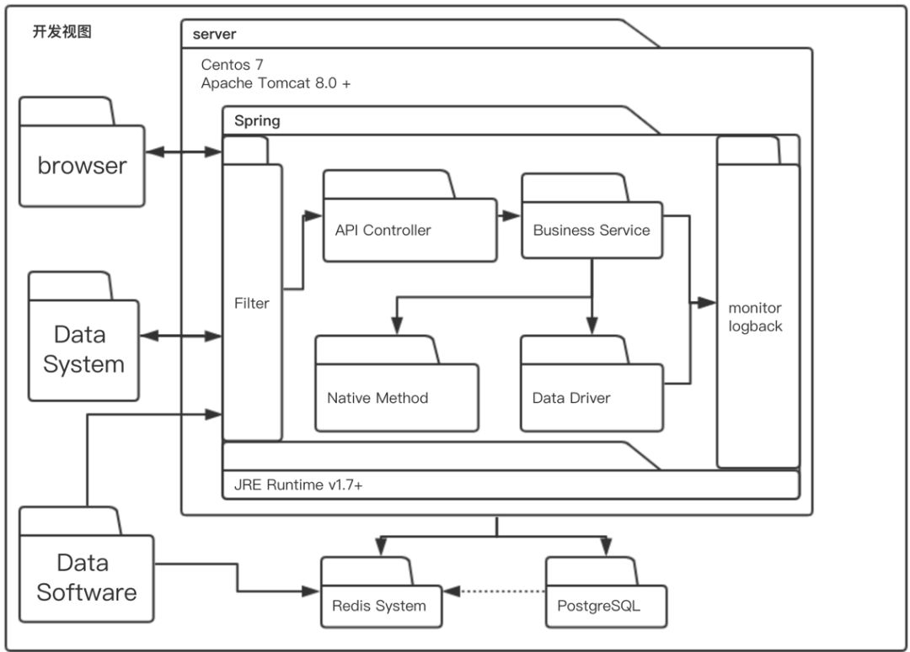
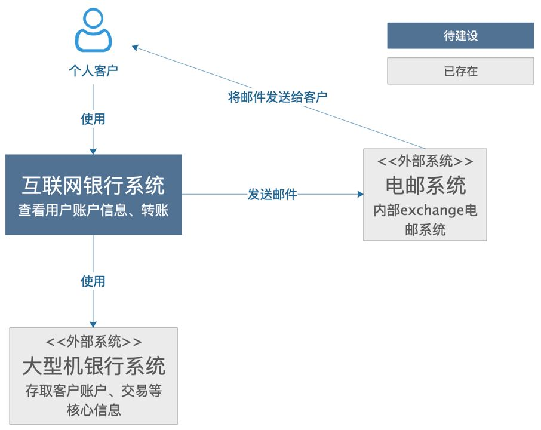
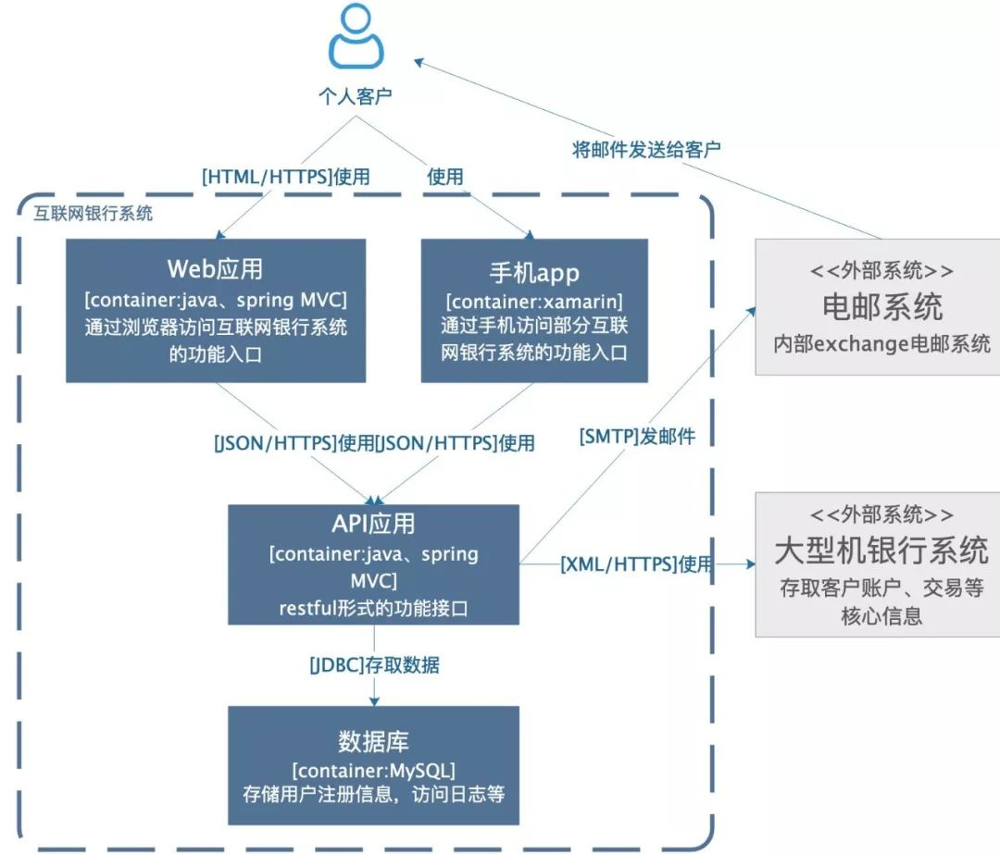
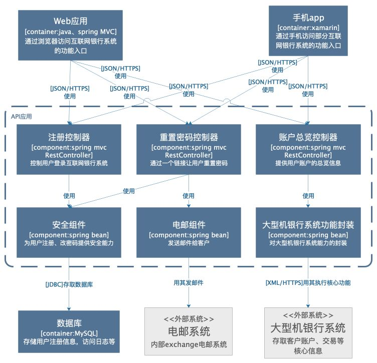
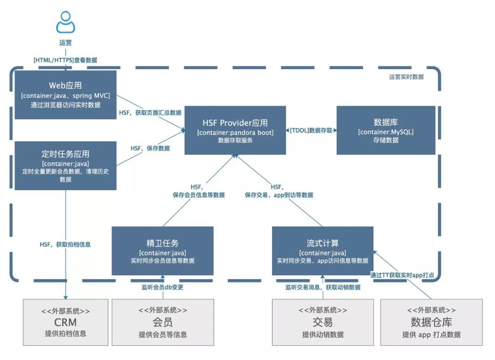

# 如何画架构图

> 在软件开发生涯中，我们经常需要写技术文档，或者参与技术方案评审。不管是项目文档、技术文档、实施文档、技术方案文档，都会有架构图。本文谈谈架构图相关的东西。

## 为什么关心架构图

很多工程师在日常写代码的时候也许只钻研技术的实现，几乎比较少关心宏观层面或者架构层面的东西。出于好学求知，可能看到了工程做的架构，但是不曾去用架构图的方式去总结梳理。

举个例子，当工程师进阶到一定阶段，参与到技术方案的设计与评审，你会发现在评审的时候，方案的设计者拿出 PPT，里面就是一些背景、现状、调研技术方案、结论等的关键词，很重要的一点是几乎每次评审都会看到几张架构图。看整个方案的成败都在这几张架构图上。

另一个例子是，当你去做管理，你给下属或者团队成员讲某个方案时，我所经历的架构师都是拿架构图讲的，没见过纯文字讲的。

举个极端的例子，你去面试，你的简历上描述了之前公司的工作内容。面试官对你的某个内容感兴趣时会和你细聊，如果说当时自己是该模块的 owner，他一般会让你画一个架构图，来判断你的设计是否合理、判断你是不是真的是该方案的设计者。

所以，不管是工作内容还是个人技能的提升，还是走向更高阶的工程师级别，学会画架构图是必经之路。

## 基础知识
### 1. 什么是架构

架构就是对系统中的实体，以及实体与实体之间的关系所进行的抽象描述，是一系列的决策。
架构是结构和愿景。

系统架构是概念的体现，是对物/信息的功能与形式元素之间的对应情况所做的分配，是对元素之间的关系以及元素同周边环境之间的关系所做的定义。

做好架构是个复杂的任务，也是个很大的话题，本篇就不做深入了。有了架构之后，就需要让干系人理解、遵循相关决策。

### 2. 什么是架构图

系统架构图是为了抽象的表示软件系统的整体轮廓和各个组件之间的相互关系和约束边界，以及软件系统的物理部署和软件系统的演进方向的整体视图。

### 3. 架构图的作用

一图胜千言。要让干系人理解、遵循架构决策，就需要把架构信息传递出去。架构图就是一个很好的载体。那么，画架构图是为了：

- 解决沟通障碍
- 达成共识
- 减少歧义

### 4. 架构图分类

搜集了很多资料，分类有很多，有一种比较流行的是「4+1视图：场景视图、逻辑视图、物理视图、处理流程视图、开发视图。

- 场景视图
    用于描述系统的参与者与功能用例间的关系，反映系统的最终需求和交互设计，通常由用例图表示。
    

- 逻辑视图
    用于描述系统软件功能拆解后的组件关系，组件约束和边界，反映系统整体组成与系统如何构建的过程，通常由UML的组件图和类图来表示。
    

- 物理视图
    用于描述系统软件到物理硬件的映射关系，反映出系统的组件是如何部署到一组可用的计算机节点上，用于指导软件系统的部署实施过程。
    

- 处理流程视图
    用于描述系统软件组件之间的通信时序，数据的输入输出，反映系统的功能流程与数据流程，通常由时序图和流程图表示。
    

- 开发视图
    用于描述系统的模块划分和组成，以及细化到内部包的组成设计，用于开发人员，反映系统的开发实施过程。
    

以上5种架构图，从不同角度表示一个软件系统的不同特征，组合搭配作为架构蓝图描述系统架构。

## 什么是好的架构图

上面已经知道架构图分为「4+1」种，需要全部画吗？答案是不一定，我们需要明确受众，再想清楚需要给他们传递什么信息。所以根据受众、传递信息的不同去选择何种架构图。将信息用图的形式清晰的表达出来。

好的架构图的标准是：合适的受众有没有准确的接收到需要传递的信息。

从受众角度看，一个好的架构图是不需要解释的，跟优秀的代码一样，它是自描述的，硬切具备一致性和准确性。

## 如何画架构图

很多人在画架构图的时候经常搞不清楚方框、虚线、实线、箭头、菱形等的使用场景，这其实是搞不清楚他们的真正含义。按照上面的示例图那样画图最好了，但是要求你经过大量的练习、记忆才可以。从网上看到一种简单画法。

下面的案例来自 C4 官网，然后加上了一些我们的理解，来看看如何更好的表达软件架构

### 1. 语境图(System Context Diagram)

这是一个想象的待建设的互联网银行系统，它使用外部的大型机银行系统存取客户账户、交易信息，通过外部电邮系统给客户发邮件。可以看到，非常简单、清晰，相信不需要解释，都看的明白，里面包含了需要建设的系统本身、系统的客户、和这个系统有交互的周边系统。

用途
这样一个简单的图，告诉我们：要构建的系统是什么、用户是谁、谁会用他它、它要如何融入已有的 IT 环境。这个图的受众可以说开发团队内的内部成员、外部的非技术人员。

怎么画
中间是自己的系统，周围是用户、其他与之相互作用的系统。这个图的关键是梳理清楚待建设的系统的用户和高层次的依赖，梳理清楚了画可能需要几分钟时间就好了。

### 2. 容器图(Container Diagram)
容器图是把语境图里待建设的系统做了一个展开。

上图中，除了用户和外围系统，要建设的系统包括一个基于 java\spring mvc 的 web 应用提供系统的功能入口，基于 xamarin 架构的手机app 提供手机端的功能入口，一个基于 java 的 api 应用提供服务，一个 mysql 数据库用于存储，各个应用之间的交互都在箭头线上写明了。

看这张图的时候，不会去关注到图中是直角方框还是圆角方框，不会关注是实线箭头还是虚线箭头，甚至箭头的指向也没有引起太多注意。

我们有许多的画图方式，都对框、线的含义做了定义，这就需要画图的人和看图的人都清晰的理解这些定义，才能读全图里的信息，而现实是，这往往是非常高的一个要求，所以，很多图只能看个大概的含义。

用途
这个图的受众可以是团队内部或外部的开发人员，也可以是运维人员。用途可以罗列为：
- 展现了软件系统的整体形态
- 体现了高层次的技术决策
- 系统中的职责是如何分布的，容器间的是如何交互的
- 告诉开发者在哪里写代码

怎么画
用一个框图来表示，内部可能包括名称、技术选择、职责，以及这些框图之间的交互，如果涉及外部系统，最好明确边界。

### 3. 组件图(Component Diagram)

组件图是把某个容器进行展开，描述其内部的模块。

用途
这个图主要是给内部开发人员看的，怎么去做代码的组织和构建。其用途有：
- 描述了系统由哪些组件/服务组成
- 厘清了组件之间的关系和依赖
- 为软件开发如何分解交付提供了框架

### 4. 类图(Code/Class Diagram)

类图主要是给开发人员看的。用于如何具体设计类以及类的接口。达到多端统一、规范的目的。

## 案例

下面是内部的一个实时数据工具的架构图。作为一个应该自描述的架构图，这里不多做解释了。如果有看不明白的，那肯定是还画的不够好。

画好架构图可能有许多方法论，本篇主要介绍了 C4 这种方法，C4 的理论也是不断进化的。但不论是哪种画图方法论，我们回到画图初衷，更好的交流，我们在画的过程中不必被条条框框所限制。简而言之，画之前想好：画图给谁看，看什么，怎么样不解释就看懂。

参考资料
[机器之心：如何画出一张合格的技术架构图？](https://www.jiqizhixin.com/articles/2019-04-11-22?from=synced&keyword=架构图)