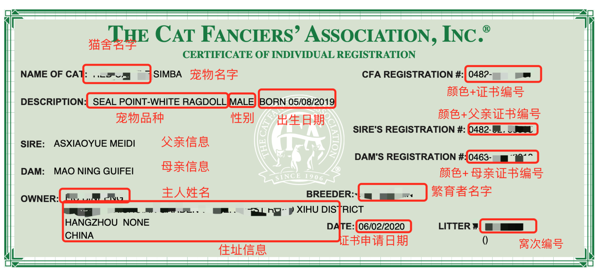
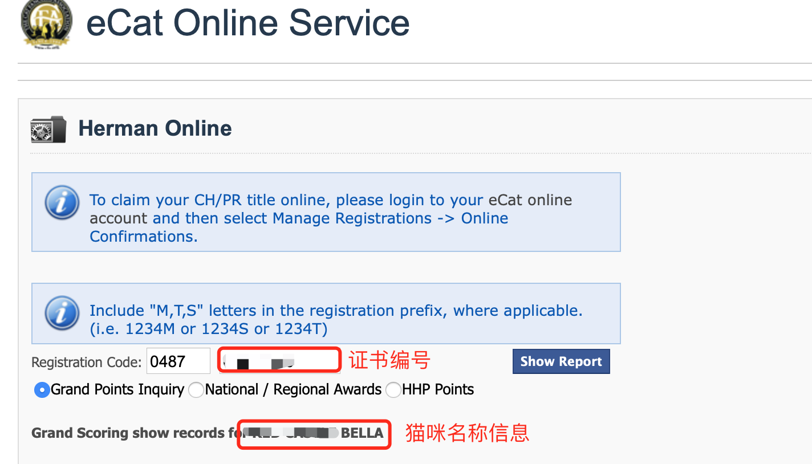

# "CFA 证书" 不再那么神秘

> CFA 证书作为证明猫咪血统纯正的一个材料，大多数人知其然，不知所以然。本文的目的就是教你看懂 CFA 证书和判断真伪。


## 一、 CFA 证书是什么

先看一张 CFA 证书的图片，是我家 Simba 的证书。



不难发现 CFA 证书就像我们日常的身份证一样，虽然没有猫的照片，但猫咪的其他信息一应俱全，花色精细到色号，父母和主人的信息也都在上面。具体每个字段的意思我已经在图上打好圈圈了，每个圆圈的信息都是一个独立的信息点。

所以图上每个圆圈的信息都应该和你的掌握的有效信息前后形成逻辑闭环，比如 `OWNER` 和 `DESCRIPTION` 等信息全都对得上之后，那么这个 CFA 证书很大程度上就是一个真实有效的证书。还不能百分百确定，具体的还需要下文中的方法去判断。

学会看和查一张证书上的信息，五代血谱已经基本可以过滤大部分后院和假证了。

它有什么作用呢？可以证明猫咪是纯种的。算是某种装逼意义上的象征吧，可以用来做繁育、打比赛的用途。


## 二、 CFA 证书真伪

上面看了 CFA 证书的例子，对比下面的文字解释再次查看上图。

1. 繁育此小猫的猫舍名（需与猫舍证书上所登记的一致）
 11
2. 本猫名字（可要求猫舍注册时填写自己取的名字，一般猫舍在小猫订出去之后才会为小猫注册证书）。这里需要说明的是我的猫是具有繁育权的，所以这里名字最后没有（NOT FOR BREEDING）

3. 猫咪花纹级颜色（需与购买的猫咪花纹颜色一致，具体英文所对应中文花色见附一）

4. 品种官方名称（布偶猫为ragdoll）

5. 性别（neuter绝育公猫，spay绝育母猫，male未绝育公猫，female未绝育母猫）

6. 猫咪出生日期（月／日／年）

7. 公猫全名（与公猫证书以及五代血普一致）

8. 母猫全名（与母猫证书以及五代血普一致）

9. 猫咪所有人的名字（可要求猫舍在此处登记购买者的名字，可登记多人）

10. 猫咪所有人的地址（可要求猫舍在此处登记购买者的地址）

11. 猫咪花纹对应的官方颜色编号（具体见附一）

12. 繁育者姓名（一般为猫舍主人，与猫舍证书上的人名一致）

13. 注册日期（此日期不应早于买家提供个人资料日期）

14. 窝次编号（在绿色证书出来之前，猫舍一般会先整窝注册，此处为注册窝次时的编号，可要求猫舍提供窝次注册时的蓝色证书，核对编号是否一致）


可能有些人会好奇，为什么我的猫咪的母亲的编号是 **0463**。

那就来继续科普下，下图是来自 [CFA 官网](https://cfa.org/breeds/color-prefix-chart/)对布偶猫的颜色划分。

```shell
RAGDOOL
 0080     RAGDOLL              FOR BREEDING ONLY
 0420     RAGDOLL             LYNX MITTED
 0422     RAGDOLL             LYNX POINT
 0424     RAGDOLL             LYNX POINT-WHITE
 0426     RAGDOLL             LYNX POINT-WHITE VAN
 0430     RAGDOLL             OTHER MITTED COLORS
 0432     RAGDOLL             OTHER POINT COLORS
 0434     RAGDOLL             OTHER POINT-WHITE
 0436     RAGDOLL             OTHER POINT-WHITE VAN
 0460     RAGDOLL             CHOCOLATE MITTED
 0462     RAGDOLL             SEAL MITTED
 0464     RAGDOLL             LILAC MITTED
 0466     RAGDOLL             BLUE MITTED
 0470     RAGDOLL             CHOCOLATE POINT
 0472     RAGDOLL             SEAL POINT
 0474     RAGDOLL             LILAC POINT
 0476     RAGDOLL             BLUE POINT
 0480     RAGDOLL             CHOCOLATE POINT-WHITE
 0482     RAGDOLL             SEAL POINT-WHITE
 0484     RAGDOLL             LILAC POINT-WHITE
 0486     RAGDOLL             BLUE POINT-WHITE
 0490     RAGDOLL             CHOC POINT-WHITE VAN
 0492     RAGDOLL             SEAL POINT-WHITE VAN
 0494     RAGDOLL             LILAC POINT-WHITE VAN
 0496     RAGDOLL             BLUE POINT-WHITE VAN
```


注意：**以上的编号为公猫编号，相同颜色的母猫编号则为对应公猫编号+1**。

所以 Simba 母亲是一只海豹手套母，则编号为 0462 +1.


那么到底如何辨别证书的真伪：

1. 看 CFA 证书的信息，如果所有的信息和你已知信息吻合，则进行下一步的验证（猫咪信息、猫舍信息、品种、拥有者、注册日期、猫咪父母亲信息等等）

2. 访问 [CFA 官网](https://ecat.cfa.org/public/hermanonline.aspx)，在 Registration Code 的地方输入证书编号

   

3. 点击 “Show Report” 按钮，查看 “**Grand Scoring show records for**" 右边的猫咪信息是否匹配。

4. **Cumulative Grand Points** 后显示的是猫咪比赛获得的分数。

5. 如果猫咪在 CFA 官方没找到信息，则显示 “sorry，the cat registration number you provided does not exists.”


