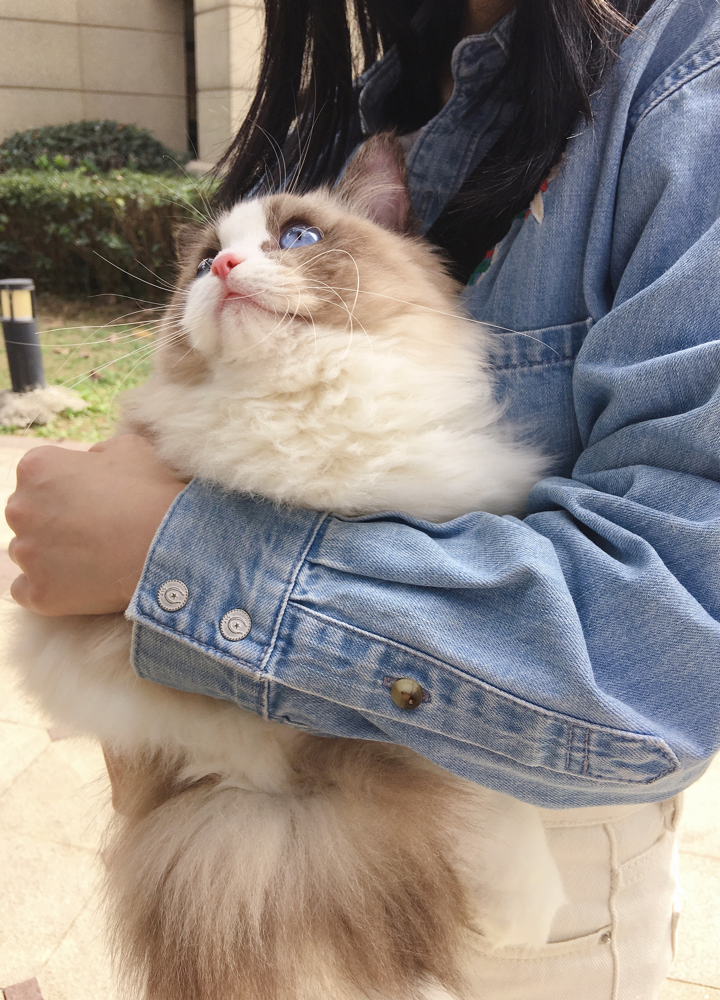
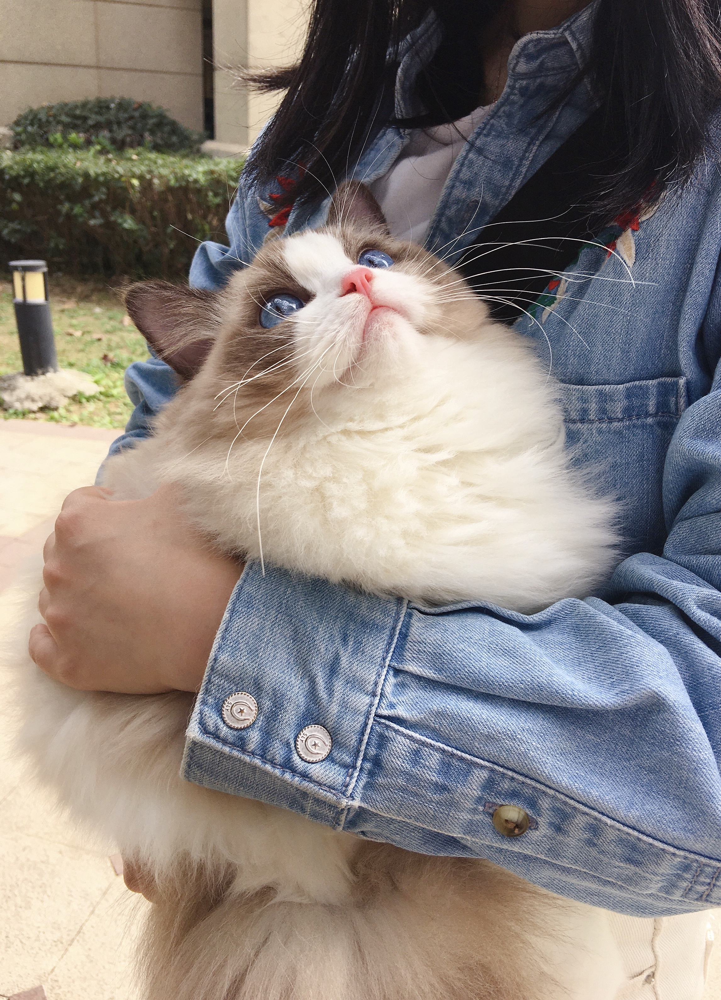
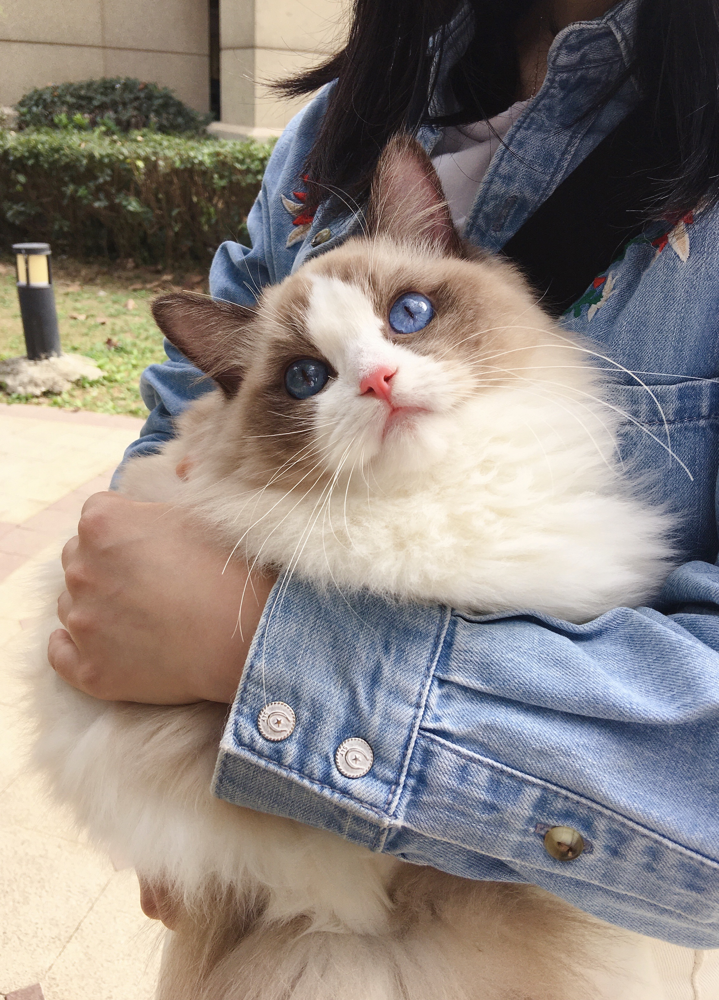
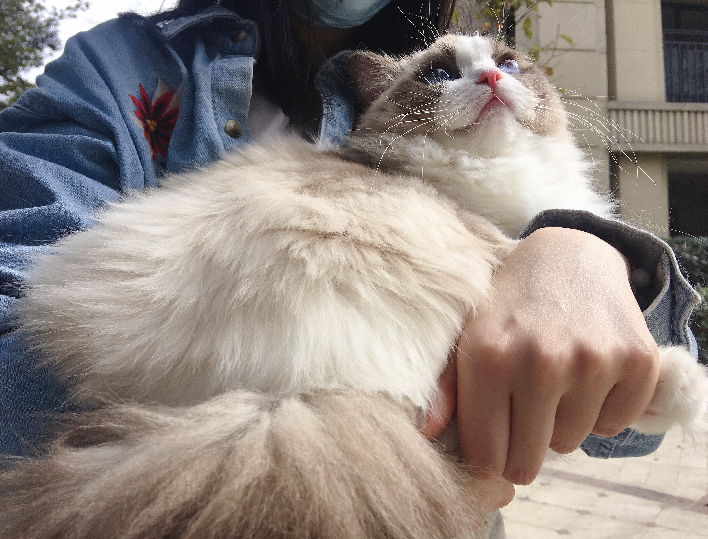

# 养猫心得与总结

> 我自己养了3个布偶猫，个人看来还是非常好看的，毕竟倾注了个人感情和时间。所以在这个过程中有些心得、经验等，现在梳理记录下来，方便自己总结和帮追到有需要的人。

### 一、猫咪起名

，说杜邦卫可、紫外灯定期消毒，这些是养猫必备，且小猫疫苗没打全的情况下，不要洗澡。然后问了宠物医生，说家里消毒很好的情况下可以接新猫，且猫咪最好是6个月以上的大猫。 
思想上做了个「转变」，之前想着浪费时间，现在思考了下，猫很可爱，可以解压，养猫可以培养爱心。且自己爱好很多，但是有了猫，可以花时间在其他爱好上少一些，多在家养猫、写代码或者写博客总结。 
买了2只8个月大的布偶猫

公猫叫 Simba，是一只海双布偶。母猫叫 Bella，是一只蓝双布偶。还有个最新来的母猫叫碎星，是一只海双布偶。

**Simba，中文名叫辛巴，大家应该看过狮子王希望像狮子王一样成为一个勇敢、坚强、健康的猫。**

**Bella，贝拉，小公主的名字，希望像公主一样，永远漂亮、可爱、仙气凌人。**

**碎星，眼眸中的光芒星星点点，好似撒下的一把星。正好和“遂心”同音，是对毛孩子的美好祈愿**

### 二、 吃饭

家里有人是修正的老总，和我聊猫的时候说，现在很多国内做猫粮的人，早期是做方便面零食的。思考了下有几分道理，早期国内好几家方便面企业，到最后行业聚合，行业龙头形成，小企业要么不做了，要么发展子业务，比如做猫粮、罐头、零食等。

很多猫咪食品里面添加了「诱食剂」。且营养成分参差不齐，没人真正去督查品质，偶尔会报道一些牌子的猫粮不合格。相比之下国外进口的猫粮质量靠谱多了，但是现在网络电商平台非常多，所以购买渠道非常多，豆瓣“猫”组，就有好多团购猫粮的，真假需要自辨。比如 Ziwi、go、Orijen、ACANA等。

猫粮推荐：

- 皇家奶糕：是一个比较有名的，比较多人知道的一种猫粮，这种猫粮呢，它是针对布偶幼猫的，适合哺乳期的小猫吃，一般来说布偶幼猫在3~5个月的时候，就可以喂皇家奶糕了，只是给布偶小猫喂皇家奶糕猫粮，需要注意：我们要用水，把奶膏泡软了，再给小猫吃。为什么呢？一方面呢是因为布偶小猫它本身的牙齿还不是很发达，还有就是天气冷的时候奶糕容易变硬，所以呢，泡软给小猫吃是比较好。除了给哺乳期的小猫吃之外，其实皇家奶糕还可以给刚分娩完的布偶母猫吃，喂布偶母猫就简单一些，直接喂就可以。

- 渴望六种鱼：这是一款国外的猫粮，原产于加拿大，是加拿大的一个猫粮品牌。这款猫粮富含这个布偶猫生长的高营养肉类成分需求，肉类成分达85%，可以帮助猫咪的快速生长，它适合各阶段的布偶猫。推荐这款猫粮，其中还有一个最大的原因就是它有美毛的作用，我们都知道，布偶猫是一个长毛猫的品种，国内很多长毛类的猫舍繁育人都在使用这款猫粮来帮助猫咪美毛。这款猫粮的口味，是海鱼味的，对布偶猫来说，比较有吸引力，一般的猫都接受这个味道。

- 生骨肉材料：鸡胸肉、鸡心、牛肝、牛肉、三文鱼、鱼油、维生素 B、牛磺酸、鸡蛋等。我认识的阿里朋友，养了50多只布偶猫，隔天生骨肉喂养，隔天猫粮。所以我也是这个策略。一天猫粮、一天生骨肉。也可以牛、鸡、猪肉、鱼肉等为主食，剁成肉末，经过低温蒸煮再给猫咪食用。记得煮透去骨再喂食，避免刺伤猫咪的胃。还可以添加烤胡萝卜、蒸芦笋或蒸花椰菜、青豆、笋瓜或其他切碎的蔬菜。不过在加工过程中要注意不要添加调味料。可以买个绞肉机，将这些材料打碎，然后蒸煮。

注意：

- 因为是生肉，所以需要在冰箱冷淡一周（杀菌）。用的时候拿到水里融化掉，各种肉切成小肉丁（85%）、动物内脏（5%），鸡蛋液（8%）、营养品（2%），混合均匀后给猫咪喂食即可。
- 需要一个月做一次驱虫。
- 猫粮和自制生骨肉不要太多，一顿一顿的准备，不然放在碗里太多会进入空气中的灰尘、细菌等。猫咪吃完后3分支后拿走。

### 三、喝水

**猫咪喝水很重要、猫咪喝水很重要、猫咪喝水很重要**。重要的事情说三遍。

猫咪缺水的情况下，尿路会得病。情况很严重。所以我们需要想办法让猫咪喝水。比如一些自动饮水器，因为水是流动的，猫咪会有兴趣去玩耍，有机会喝。

说了要喝水，接下来说怎么喝？喝什么样的？

不要喝酸奶、牛奶、饮料等乱七八糟的东西。就给猫咪烧开的白开水，待到常温，给猫咪饮用即可。幼猫或者有需要的猫咪可以喝**羊奶粉**。

## 四、猫咪健康

- 如果吃生骨肉，猫咪毛发好、吸收好、肠胃好，拉的 shit 也”健康“，不会软便。
- 幼猫不要洗澡。疫苗打全后三周可以洗澡。
- 洗完澡必须吹干毛发。如果是长毛猫，则需要给猫咪梳子梳理好，不然打结就很难过，因为无解。我之前剪掉了布偶的打结毛。
- 猫必须干燥，不然会得猫藓。
- 猫咪需要适当的运动。
- 猫咪需要晒太阳。
- 猫咪需要吃猫草，促进排毛球。
- 猫不能打，不然应激或者疏远主人就得不偿失了。

## 五、小疾病

### 1. 猫咪黑下巴

黑下巴治疗，先用剃须刀把黑下巴周围的毛全剃掉，然后用碘伏消毒，在涂抹红霉素软膏，坚持一周。更换猫碗最好瓷碗和不锈钢的，保持干净，每隔几天用宠物专用的消毒液消毒，在搽洗干净✔看猫粮油脂含量有多高再考虑是否更换猫粮

红霉素软膏、凡士林，混合在黑下巴的地方揉搓，搓一会小黑点就下来了，然后用硼酸洗液擦一下，反复几次就干净了

### 2. 驱虫

外驱虫：大宠爱/福来恩，内驱虫海乐妙。（大猫和小猫购买驱虫药需要区分开，驱虫药都是有大猫和小猫的版本）

